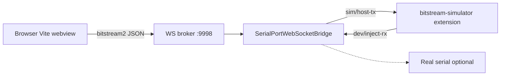

# How to run — Bitstream vNext and firmware simulator

Reference for **host-only** development (no MCU) and optional real UART. All commands assume you are in the extension package:

```bash
cd t3d-extension
```

Related docs:

| Document | Purpose |
|----------|---------|
| `docs/BITSTREAM_BS_FRAMED_PROTOCOL_SPEC.md` | Wire format (BS framing, sensors, commands) |
| `src/bitstream2/README.md` | Module layout and design |
| `src/bitstream2/docs/SENSOR_CFG_V2.md` | `SENSOR_CFG` v2/v2.1, simulator sine synth, UI mapping |
| `src/webview/bitstream2-simulator/README.md` | Simulator UI structure |
| `tests/fixtures/bitstream2-golden/README.md` | Golden capture fixtures |

---

## What you are running



| Piece | Default | Role |
|--------|---------|------|
| WebSocket broker | `ws://127.0.0.1:9998` | Pub/sub between webview, bridge, and external sim |
| Vite webview | `http://localhost:5173` | Sensor Telemetry / Studio UI |
| Bridge | `npm run start:bridge` | UART I/O, BS decode, routes to external sim when detected |
| **Bitstream Simulator** | VS Code extension in **`bitstream-simulator/`** | Software MCU (HELLO, REQ/RES, sensor streams) via WS |

The webview **never** parses raw UART bytes; it only consumes JSON on `bitstream2/*` (and serial status topics).

---

## Prerequisites

1. **Node.js** and dependencies:

   ```bash
   cd t3d-extension
   npm install
   ```

2. **T3D library** (for `@ternion/t3d` in the webview): from repo root, link and build if needed:

   ```bash
   cd T3D
   npm run build:lib
   npm run link:lib:extension   # from T3D, then npm link @ternion/t3d in t3d-extension
   ```

   `predev:webview` tries to keep the link fresh; if Vite fails on `@ternion/t3d`, rebuild `T3D/dist`.

3. **Ports free**: broker **9998**, Vite **5173**. If something is stuck:

   ```bash
   npm run dev:clean
   ```

---

## Sensor Studio / Telemetry — simulator in webview (UART via CLI)

As of **2026-05-27**, the main Bitstream shell webview is **simulator-only** for broker transport. See **`src/webview/bitstream-app/docs/BITSTREAM_WEBVIEW_TRANSPORT_SIMULATOR_ONLY.md`**.

**Recommended dev command (one terminal):**

```bash
npm start
```

`npm start` runs the full dev stack. For **Simulator** telemetry, also run the **Bitstream Simulator** extension from repo **`bitstream-simulator/`** (install VSIX or F5). The bridge **no longer** embeds `BsFirmwareSimulator` — do **not** set `BITSTREAM2_DEV_LOOPBACK=1`.

| URL | Workspace |
|-----|-----------|
| `http://localhost:5173/?app=bitstream` | Sensor Telemetry |
| `http://localhost:5173/?app=sensor-studio` | Flow editor |
| `http://localhost:5173/?app=bitstream2-sim` | Legacy BS2 webview dashboard |

In the toolbar, use **Telemetry data source**:

- **Simulator** — WebSocket + external **Bitstream Simulator** extension streaming.
- **Bitstream** — firmware on serial; COM bring-up via bridge; see UART probes below.

Dev stack (bridge + Vite, no in-bridge mock):

```bash
npm run dev:bitstream2-loopback
```

Then start **Bitstream Simulator** (sidebar **Start** / **Streaming**). Browser opens **Sensor Telemetry** (`/?app=bitstream`).

In the toolbar: set source to **Simulator**, click **Link** (Connect).

**Missing-data notice:** If Simulator is selected and no `EVT_SENSOR` within **3 s**, an amber floating notice appears for **10 s** (hover pauses the dismiss timer; progress bar stays visible). See **`src/webview/bitstream-shell/docs/FLOATING_ALERT_NOTICES.md`**.

### Production checklist

| Step | Simulator (webview) | Bitstream |
|------|---------------------|-----------|
| Terminal | `npm run start:bridge` + Bitstream Simulator ext | `npm run start:bridge` |
| **Source** | Simulator | Bitstream |
| **Link** | WebSocket connected | WebSocket + USB COM |
| Live telemetry | `bitstream2/evt/sensor` | Same when handshake OK |
| Sensor cfg apply | Local store draft | BS2 on wire via CLI; webview TBD |

### Real MCU — CLI and `?app=bitstream` (no webview COM session)

| URL | Use when |
|-----|----------|
| **`http://localhost:5173/?app=bitstream`** | Simulator loopback UI; **not** webview COM open for UART yet |
| **`http://localhost:5173/?app=bitstream2-sim`** | Dev BS2 dashboard (loopback mock) |
| **CLI** | **Yes** for real PSoC on COM — see below |

**MCU stack (no loopback):**

```bash
# Terminal A
npm run start:bridge
```

Hardware checklist: **`TESAIoT_Firmware/AGENT_HANDOFF.md` §9.2** and:

```bash
npm run bitstream2:uart-probe -- --path COM3 --baud 921600
# If another client already opened COM3:
npm run bitstream2:uart-probe -- --skip-open --soak-ms 300000
```

**Rate + EVT payload audit (run after probe passes):**

```bash
npm run bitstream2:uart-sensor-rate-check -- --path COM3 --hz=50 --bmi270-mode=hybrid
npm run bitstream2:uart-sensor-rate-check -- --help
```

**Matrix sweep (standard tier):**

```bash
npm run bitstream2:uart-matrix:standard -- --path COM3 --continue-on-fail
npm run bitstream2:uart-matrix -- --list-cases --tier=standard
```

**Full reference:** [`src/bitstream2/dev/UART_TEST_COMMANDS.md`](src/bitstream2/dev/UART_TEST_COMMANDS.md).

---

## Quick start (recommended)

**Terminal A** — bridge + Vite:

```bash
npm run dev:bitstream2-loopback
```

**Terminal B** (or VS Code) — **Bitstream Simulator** extension from **`../bitstream-simulator`** (`npm run compile` + F5, or install packaged VSIX).

1. Wait for bridge log on `:9998`.
2. Start **Streaming** in Bitstream Simulator.
3. Open in the browser:

   ```
   http://localhost:5173/?app=bitstream
   ```

4. Set source **Simulator**, click **Link**. You should see:

   - **WS connected**
   - **Samples** increasing (sine synth on masked channels)
   - **Firmware identity** (`fwTag` e.g. `bs2-sim-psoc`)

**Hard refresh** (Cmd/Ctrl+Shift+R) after code changes.

---

## Manual two-terminal setup

**Terminal A — bridge only**

```bash
npm run start:bridge
```

**Terminal B — webview**

```bash
npm run dev:webview
```

**Terminal C / VS Code — Bitstream Simulator extension** (required for Simulator source).

Same URL: `http://localhost:5173/?app=bitstream`

Optional env:

| Variable | Default | Meaning |
|----------|---------|---------|
| `T3D_WS_CLIENT_URL` | `ws://127.0.0.1:9998` | Broker URL for webview and CLI tools |

**Removed:** `BITSTREAM2_DEV_LOOPBACK` — in-bridge mock was removed; use external **`bitstream-simulator`**.

---

## VS Code extension (installed / F5)

1. Run **TERNION → Start Serial Bridge** (or your extension command that starts `combined-bridge-entry`).
2. For **host-only sim**: install/run the **Bitstream Simulator** extension from **`bitstream-simulator/`** (not `BITSTREAM2_DEV_LOOPBACK`).
3. Open the **Sensor Telemetry** / Sensor Studio webview entry.

**Telemetry source:** **Simulator** requires external Bitstream Simulator streaming. **Bitstream** uses COM + BS2 handshake. Amber floating notices: Simulator after **3 s** without data, Bitstream after **10 s** without handshake; **10 s** visible with hover-pause (`FLOATING_ALERT_NOTICES.md`).

Packaged **VSIX** uses npm `@ternion/t3d`, not necessarily your linked `T3D/` tree — rebuild and publish after library changes.

---

## CLI tools (no browser)

Run from `t3d-extension/`. Bridge must be up with loopback for `--ws` / inject commands.

| Command | Description |
|---------|-------------|
| `npm run test:bitstream2` | Unit tests (framing, simulator, golden parity) |
| `npm run bitstream2:mock-probe` | In-process simulator smoke |
| `npm run bitstream2:dev-inject -- --hello` | Inject HELLO via WS |
| `npm run bitstream2:dev-inject -- --sample` | Inject one BMI270 sample |
| `npm run bitstream2:dev-inject -- --ping-req` | PING via `bitstream2/req` (same as UI **Send PING**) |
| `npm run bitstream2:sim-scenario -- --offline boot` | Scenario without bridge |
| `npm run bitstream2:sim-scenario -- --offline full_board` | All four sensors streaming (in-process) |
| `npm run bitstream2:sim-scenario -- --ws full_board` | Same via broker (loopback on) |
| `npm run bitstream2:golden:gen` | Regenerate `tests/fixtures/bitstream2-golden/` |

Example — WS inject (bridge already running with loopback):

```bash
npm run bitstream2:dev-inject -- --hello --sample
npm run bitstream2:dev-inject -- --ping-req
```

---

## Simulator UI controls

| Area | Action |
|------|--------|
| **Send PING** | `bitstream2/req` → mock firmware → `bitstream2/res` |
| **Sensor configuration** | Per sensor: channels (mask), publish mode, **Sampling frequency** (Hz → `samplingIntervalMs`, `publishIntervalMs = 0`), delta / min publish; **Apply** via BS2 `SENSOR_CFG_SET` |
| **Dedicated BS2 dashboard** (`?app=bitstream2-sim`) | Same sensors plus optional **separate** telemetry Hz (`publishIntervalMs` ≠ 0) for decimation tests |
| **Live sensors** | Decoded BMI270, BMM350, SHT40, DPS368 fields (inactive cards keep last sample) |
| **Dev inject** (Vite dev only) | One-shot HELLO or sample on `bitstream2/dev/inject-rx` |

If buttons do not respond, ensure the app root uses `pointer-events-auto` (`t3d-shell-overlay` on the simulator shell). The host `#root` uses `pointer-events: none` for the 3D engine elsewhere.

### Quick validation (host loopback only)

1. `npm run dev:bitstream2-loopback` → browser opens Sensor Telemetry (`/?app=bitstream`). For Sensor Studio UI: open `/?app=sensor-studio`.
2. **Sine motion:** BMI270 acc/gyro/euler/quat and other sensors should sweep smoothly (~0.2 Hz); charts must not sit flat.
3. **Sampling frequency:** change Hz preset → **Apply** → stream rate follows (`publishIntervalMs` stays 0 = same as sampling).
4. **UART vs sim:** with loopback on, switch toolbar to **UART** (no COM open) → UI should **not** show mock samples; mock stream idles. Back to **Simulator** → samples resume.
5. **Decimation / on-change / coerce:** use `?app=bitstream2-sim` or `SENSOR_CFG_V2.md` §4–§7.1 for `publishIntervalMs`, delta, and invalid telemetry>sampling coercion tests.

Firmware / UART not required for the above.

---

## Real hardware (UART)

1. Start bridge **without** loopback (or loopback off):

   ```bash
   npm run start:bridge
   ```

2. Open serial from the UI or broker (`serialport/open`) with correct **path** and **baud rate**.

3. Device must speak **BS-framed** vNext (see protocol spec). The bridge decodes RX and publishes the same `bitstream2/*` topics.

4. Use golden captures from real firmware to extend parity tests (`tests/fixtures/bitstream2-golden/README.md`).

---

## Troubleshooting

| Symptom | Check |
|---------|--------|
| **Simulator not sending data** notice | After **3 s** without EVT_SENSOR; hover pauses **10 s** dismiss |
| **Board not responding** notice (UART) | USB, COM open, BS2 firmware; wait **10 s** grace |
| **WS disconnected** | Broker on 9998; `npm run dev:clean`; firewall |
| **Samples stay 0** | External sim streaming; hard refresh; bridge log for decode errors |
| **Send PING does nothing** | Sim streaming or UART COM open; compare with `bitstream2:dev-inject -- --ping-req` |
| **ENOENT on npm scripts** | Run commands from **`t3d-extension/`**, not monorepo root |
| **Vite / `@ternion/t3d` errors** | `cd T3D && npm run build:lib` and npm link |
| **Port 5173 vs `[::1]`** | Try `http://localhost:5173/` if `127.0.0.1` fails |
| **Clicks blocked** | Simulator root must include `t3d-shell-overlay pointer-events-auto` |

Bridge logs external sim detection via `bitstream2/sim/status` heartbeat.

---

## CI

```bash
npm run bitstream:ci:check
```

Runs `test:bitstream2` and bitstream sync checks.

---

## Key source locations

| Path | Role |
|------|------|
| `src/bitstream2/device/firmware-simulator.ts` | Simulator firmware |
| `src/bitstream2/device/sensor-synth.ts` | Sine synthetic `valuesBytes` |
| `src/bitstream2/device/board-profile.ts` | Default sensors and HELLO |
| `src/webview/bitstream-app/utils/bitstreamTelemetryTransport.ts` | UART vs Simulator ingest |
| `src/serialport-bridge/SerialPortWebSocketBridge.ts` | Bridge + loopback wiring |
| `src/webview/bitstream2-simulator/` | Simulator dashboard UI |
| `src/bitstream2/dev/scenarios.ts` | Scenario definitions |
| `src/bitstream2/bridge/protocol.ts` | Topic names and payload types |
