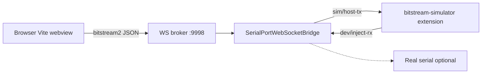

# How to run — Bitstream vNext and firmware simulator

Reference for **host-only** development (no MCU) and optional real UART. All commands assume you are in the extension package:

```bash
cd extension
```

Related docs:

| Document | Purpose |
|----------|---------|
| **`../AGENT_HANDOFF.md`** | Start here on a new machine (clone, milestone, session log) |
| **`docs/TELEMETRY_MODE_LIFECYCLE.md`** | Bitstream vs Simulator exclusivity (route topic, bridge gates) |
| `docs/DEVELOPMENT_TRACKER.md` | Backlog and VSIX readiness checklist |
| `docs/BITSTREAM_BS_FRAMED_PROTOCOL_SPEC.md` | Wire format (BS framing, sensors, commands) |
| `src/bitstream2/README.md` | Module layout and design |
| `src/bitstream2/docs/SENSOR_CFG_V2.md` | `SENSOR_CFG` v2/v2.1, simulator sine synth, UI mapping |
| `src/webview/bitstream2-simulator/README.md` | Simulator UI structure |
| `tests/fixtures/bitstream2-golden/README.md` | Golden capture fixtures |

---

## What you are running



| Piece | Default | Role |
|--------|---------|------|
| WebSocket broker | `ws://127.0.0.1:9998` | Pub/sub between webview, bridge, and external sim |
| Vite webview | `http://localhost:5173` | Sensor Telemetry / Studio UI |
| Bridge | `npm run start:bridge` | UART I/O, BS decode, routes to external sim when detected |
| **Bitstream Simulator** | VS Code extension in **`bitstream-simulator/`** | Software MCU (HELLO, REQ/RES, sensor streams) via WS |

The webview **never** parses raw UART bytes; it only consumes JSON on `bitstream2/*` (and serial status topics).

### Telemetry source (Bitstream vs Simulator)

Only **one** backend is active at a time. The toolbar sets `backend` to **`uart`** (label **Bitstream**) or **`simulator`** (**Simulator**).

| Mode | Data path | COM |
|------|-----------|-----|
| **Bitstream** | Real MCU → bridge decode → `bitstream2/evt/sensor` (`origin: uart`) | Must be open for UI ingest |
| **Simulator** | External **bitstream-simulator** → `inject-rx` → bridge → `evt/sensor` (`origin: sim`) | Must be **closed** |

On switch, the webview runs **`telemetryModeLifecycle`** (clear live data, release COM when entering Simulator, publish **`bitstream2/telemetry/route`**, sim **`idle`/`run`**). The bridge enforces the same route and tags samples with **`origin`**.

**Simulator orchestration (VS Code panel):** With **Source = Simulator**, **Connect** (and the toolbar **Start simulator** button when the external VSIX is offline) calls the host command **`bitstreamSimulator.start`** on the separate **bitstream-simulator** extension and ensures backend services are up. **Disconnect** does **not** stop the simulator VSIX. Palette: **Start / Stop Bitstream Simulator** (`bitstream-studio.startBitstreamSimulator` / `.stopBitstreamSimulator`).

Full design: **`docs/TELEMETRY_MODE_LIFECYCLE.md`**. After edits to **`SerialPortWebSocketBridge.ts`**, restart **`npm run start:bridge`**.

---

## Prerequisites

1. **Node.js** and dependencies:

   ```bash
   cd extension
   npm install
   ```

2. **Ports free**: broker **9998**, Vite **5173**. If something is stuck:

   ```bash
   npm run dev:clean
   ```

---

## Sensor Studio / Telemetry — simulator in webview (UART via CLI)

As of **2026-05-27**, the main Bitstream shell webview is **simulator-only** for broker transport. See **`src/webview/bitstream-app/docs/BITSTREAM_WEBVIEW_TRANSPORT_SIMULATOR_ONLY.md`**.

**Recommended dev command (one terminal):**

```bash
npm start
```

`npm start` runs the full dev stack. For **Simulator** telemetry, also run the **Bitstream Simulator** extension from repo **`bitstream-simulator/`** (install VSIX or F5). The bridge **no longer** embeds `BsFirmwareSimulator` — do **not** set `BITSTREAM2_DEV_LOOPBACK=1`.

Dev URL: **http://localhost:5173/** — browser dev shows a **landing page** first (2D nebula/flow + optional **3D cube floor**, workspace cards, **Digital Twin simulation** cards). Pick a workspace or simulation to enter. Skip landing: **`?app=bitstream`** or **`?landing=0`**. Force landing: **`?landing=1`**. Sim deep link: **`?sim=e84-rotation`** (etc.). VSIX panel skips landing (opens the app directly).

**Backdrop gestures** (empty area, not on buttons): **double-click** cycles **2D only → 3D only → blend**; **Shift+double-click** cycles overlay (**nebula+flow → nebula → flow → none**). Badge bottom-right shows current mode. See **`src/webview/landing/README.md`**.

**Stale COI service worker:** If the page fails to load with `t3d-coi-serviceworker.js` / `Failed to fetch`, unregister service workers for `localhost:5173` in DevTools → **Application** → **Service Workers** (leftover from vehicle physics / T3D on the same port), then hard-reload.

Implementation: **`src/webview/landing/`**, **`src/webview/simulations/`**, **`src/webview/ui/flow-canvas-background/`**.

After entering the app, switch tabs with the toolbar (last tab persisted in `localStorage`). Browser shortcuts: **Ctrl+Shift+1** / **Ctrl+Shift+2**, **Ctrl+/** quick commands.

| VS Code command | Tab |
|-----------------|-----|
| `Bitstream Studio: Open Bitstream Studio` | Last tab (status bar default) |
| `… (Sensor Telemetry tab)` | Sensor Telemetry |
| `… (Sensor Studio tab)` | Sensor Studio |

In the toolbar, use **Telemetry data source**:

- **Simulator** — WebSocket + external **Bitstream Simulator** extension streaming.
- **Bitstream** — firmware on serial; COM bring-up via bridge; see UART probes below.

Dev stack (bridge + Vite, two terminals):

```bash
# Terminal 1
npm run start:bridge

# Terminal 2
npm run dev:webview
```

Then start **Bitstream Simulator** (sidebar **Start** / **Streaming**). Vite opens **`http://localhost:5173/`** by default (use toolbar tabs to switch workspace).

In the toolbar: set source to **Simulator**, click **Link** (Connect).

**Missing-data notice:** If Simulator is selected and no `EVT_SENSOR` within **3 s**, an amber floating notice appears for **10 s** (hover pauses the dismiss timer; progress bar stays visible). See **`src/webview/bitstream-shell/docs/FLOATING_ALERT_NOTICES.md`**.

### Production checklist

| Step | Simulator (webview) | Bitstream |
|------|---------------------|-----------|
| Terminal | `npm run start:bridge` + Bitstream Simulator ext | `npm run start:bridge` |
| **Source** | Simulator | Bitstream |
| **Link** | WebSocket connected | WebSocket + USB COM |
| Live telemetry | `bitstream2/evt/sensor` | Same when handshake OK |
| Sensor cfg apply | Local store draft | BS2 on wire via CLI; webview TBD |

### Real MCU — browser dev + CLI (no webview COM session)

| URL | Use when |
|-----|----------|
| **`http://localhost:5173/`** | Bitstream Studio UI; UART bring-up via CLI, not webview COM session yet |
| **CLI** | **Yes** for real PSoC on COM — see below |

**MCU stack:**

```bash
# Terminal A
npm run start:bridge
```

Hardware checklist: **`TESAIoT_Firmware/AGENT_HANDOFF.md` §9.2** and:

```bash
npm run bitstream2:uart-probe -- --path COM3 --baud 921600
# If another client already opened COM3:
npm run bitstream2:uart-probe -- --skip-open --soak-ms 300000
```

**Rate + EVT payload audit (run after probe passes):**

```bash
npm run bitstream2:uart-sensor-rate-check -- --path COM3 --hz=50 --bmi270-mode=hybrid
npm run bitstream2:uart-sensor-rate-check -- --help
```

**Matrix sweep (standard tier):**

```bash
npm run bitstream2:uart-matrix:standard -- --path COM3 --continue-on-fail
npm run bitstream2:uart-matrix -- --list-cases --tier=standard
```

**Full reference:** [`src/bitstream2/dev/UART_TEST_COMMANDS.md`](src/bitstream2/dev/UART_TEST_COMMANDS.md).

---

## Quick start (recommended)

**Terminal A** — broker:

```bash
npm run start:bridge
```

**Terminal B** — Vite webview:

```bash
npm run dev:webview
```

**Terminal C** (or VS Code) — **Bitstream Simulator** extension from **`../bitstream-simulator`** (`npm run compile` + F5, or install packaged VSIX).

1. Wait for bridge log on `:9998`.
2. Start **Streaming** in Bitstream Simulator.
3. Open in the browser:

   ```
   http://localhost:5173/
   ```

4. Set source **Simulator**, click **Link**. You should see:

   - **WS connected**
   - **Samples** increasing (sine synth on masked channels)
   - **Firmware identity** (`fwTag` e.g. `bs2-sim-psoc`)

**Hard refresh** (Cmd/Ctrl+Shift+R) after code changes.

---

## Manual two-terminal setup

**Terminal A — bridge only**

```bash
npm run start:bridge
```

**Terminal B — webview**

```bash
npm run dev:webview
```

**Terminal C / VS Code — Bitstream Simulator extension** (required for Simulator source).

Same URL: `http://localhost:5173/`

Optional env:

| Variable | Default | Meaning |
|----------|---------|---------|
| `T3D_WS_CLIENT_URL` | `ws://127.0.0.1:9998` | Broker URL for webview and CLI tools |

**Removed:** `BITSTREAM2_DEV_LOOPBACK` — in-bridge mock was removed; use external **`bitstream-simulator`**.

---

## VS Code extension (installed / F5)

On activation, the extension **auto-starts** backend services (serial bridge on **9998**, model broker path, local MQTT **1883/8883**). You usually do not need a manual start.

| Command | Action |
|---------|--------|
| **Start All Backend Services** | Same stack as activation (after you stopped them) |
| **Stop All Backend Services** | Stops bridge + model broker client + MQTT (not Vite browser dev server) |
| **Start / Stop Bitstream Simulator** | Runs **`bitstreamSimulator.start`** / **`.stop`** on the external VSIX (also used by Connect auto-start) |
| **Start / Stop Serial Bridge** | Bridge only (debug) |
| **Start / Stop MQTT Broker** | MQTT only (debug) |

1. For **Simulator** telemetry: install the external **bitstream-simulator** VSIX from **`bitstream-simulator/`** (not in-bridge mock). Studio can start it for you when you **Connect** with **Source = Simulator**.
2. Status bar **Bitstream** or Command Palette → **Open Bitstream Studio** (or tab-specific open commands).

**Telemetry source:** **Simulator** requires external Bitstream Simulator streaming. **Bitstream** uses COM + BS2 handshake (CLI bring-up today). Amber floating notices: Simulator after **3 s** without data, Bitstream after **10 s** without handshake; **10 s** visible with hover-pause (`FLOATING_ALERT_NOTICES.md`).

Packaged **VSIX** bundles the prebuilt webview from `npm run compile` — no external `@ternion/t3d` package.

---

## VSIX smoke checklist (before release)

**Status:** User-verified **2026-05-30** on **`bitstream-studio-0.1.0.vsix`** (panels A–B, mode switch). Re-run after material changes.

Run after **`npm run compile`** and **`npm run package`**. Use a **clean VS Code window** (or profile) so an old Digital Twin / linked T3D install does not mask issues.

### Build and install

```bash
cd extension
npm run compile
npm run package
code --install-extension bitstream-studio-*.vsix
```

Reload the window (**Developer: Reload Window**).

### A — Panels open (bridge **off**)

Do **not** start the serial bridge for this pass.

| Step | Action | Pass if |
|------|--------|---------|
| A1 | **Bitstream Studio: Open Sensor Telemetry** | 4-pane workbench loads (Sensor Config · 3D Orientation · Telemetry Deck · Activity Log) |
| A2 | **Bitstream Studio: Open Sensor Studio** | Flow canvas + node library load |
| A3 | Toolbar / status | No spurious **Bridge: disconnected** dev badge; no `(fetching path…)` repo asset paths |
| A4 | Model Catalog / 3D preview (if used) | Preview mesh loads from **globalStorage** or bundled assets — not blank 404 |

### B — Simulator path (bridge **on**)

```bash
# Terminal 1
npm run start:bridge
```

Start **Bitstream Simulator** (external extension) → **Streaming**.

| Step | Action | Pass if |
|------|--------|---------|
| B1 | Open Sensor Telemetry panel | Toolbar **Simulator** + **Link** |
| B2 | Connect | WS connected; **Samples** increase (~sine on masked channels) |
| B3 | Sensor config deck | Unlocks after HELLO / readiness (not stuck greyed) |

### C — UART path (optional, hardware)

Bridge running; MCU on COM @ **921600**:

```bash
npm run bitstream2:uart-probe -- --path COM3 --baud 921600
```

| Step | Action | Pass if |
|------|--------|---------|
| C1 | Probe CLI | **PROBE PASSED** |
| C2 | Sensor Telemetry, source **Bitstream** | Live EVT after CLI/COM bring-up (webview COM session TBD) |

### D — Automated gate

```bash
npm run test:bitstream2
```

All tests green.

**Sensor cfg apply (v0.1):** Webview **Apply** updates the **local draft store** only; wire **`SENSOR_CFG_SET`** to firmware is via **CLI / MCP** until restored in UI. Document this in release notes.

Tracker mirror: **`docs/DEVELOPMENT_TRACKER.md`** § VSIX and marketplace readiness.

---

## CLI tools (no browser)

Run from **`extension/`**. Bridge must be up for `--ws` / inject commands.

| Command | Description |
|---------|-------------|
| `npm run test:bitstream2` | Unit tests (framing, simulator, golden parity) |
| `npm run bitstream2:mock-probe` | In-process simulator smoke |
| `npm run bitstream2:dev-inject -- --hello` | Inject HELLO via WS |
| `npm run bitstream2:dev-inject -- --sample` | Inject one BMI270 sample |
| `npm run bitstream2:dev-inject -- --ping-req` | PING via `bitstream2/req` (same as UI **Send PING**) |
| `npm run bitstream2:sim-scenario -- --offline boot` | Scenario without bridge |
| `npm run bitstream2:sim-scenario -- --offline full_board` | All four sensors streaming (in-process) |
| `npm run bitstream2:sim-scenario -- --ws full_board` | Same via broker (bridge running) |
| `npm run bitstream2:golden:gen` | Regenerate `tests/fixtures/bitstream2-golden/` |

Example — WS inject (bridge already running):

```bash
npm run bitstream2:dev-inject -- --hello --sample
npm run bitstream2:dev-inject -- --ping-req
```

---

## Simulator UI controls

| Area | Action |
|------|--------|
| **Send PING** | `bitstream2/req` → mock firmware → `bitstream2/res` |
| **Sensor configuration** | Per sensor: channels (mask), publish mode, **Sampling frequency** (Hz → `samplingIntervalMs`, `publishIntervalMs = 0`), delta / min publish; **Apply** via BS2 `SENSOR_CFG_SET` |
| **Dedicated BS2 dashboard** (`?app=bitstream2-sim`) | Same sensors plus optional **separate** telemetry Hz (`publishIntervalMs` ≠ 0) for decimation tests |
| **Live sensors** | Decoded BMI270, BMM350, SHT40, DPS368 fields (inactive cards keep last sample) |
| **Dev inject** (Vite dev only) | One-shot HELLO or sample on `bitstream2/dev/inject-rx` |

If buttons do not respond, ensure the app root uses `pointer-events-auto` (`t3d-shell-overlay` on the simulator shell). The host `#root` uses `pointer-events: none` for the 3D engine elsewhere.

### Quick validation (Simulator + external sim)

1. `npm run start:bridge` + `npm run dev:webview` → open **`http://localhost:5173/`**; use toolbar tabs for Sensor Telemetry vs Sensor Studio.
2. **Sine motion:** BMI270 acc/gyro/euler/quat and other sensors should sweep smoothly (~0.2 Hz); charts must not sit flat.
3. **Sampling frequency:** change Hz preset → **Apply** → stream rate follows (`publishIntervalMs` stays 0 = same as sampling).
4. **Bitstream vs Simulator:** with external sim streaming and COM open on **Bitstream**, UI shows **hardware only**. Switch to **Simulator** → COM released, **sine sim only**. Toggle back → single source, no mixed samples (see **`TELEMETRY_MODE_LIFECYCLE.md`**).
5. **Decimation / on-change / coerce:** use `?app=bitstream2-sim` or `SENSOR_CFG_V2.md` §4–§7.1 for `publishIntervalMs`, delta, and invalid telemetry>sampling coercion tests.

Firmware / UART not required for the above.

---

## Real hardware (UART)

1. Start bridge:

   ```bash
   npm run start:bridge
   ```

2. Open serial from the UI or broker (`serialport/open`) with correct **path** and **baud rate**.

3. Device must speak **BS-framed** vNext (see protocol spec). The bridge decodes RX and publishes the same `bitstream2/*` topics.

4. Use golden captures from real firmware to extend parity tests (`tests/fixtures/bitstream2-golden/README.md`).

---

## Troubleshooting

| Symptom | Check |
|---------|--------|
| **Simulator not sending data** notice | After **3 s** without EVT_SENSOR; hover pauses **10 s** dismiss |
| **Board not responding** notice (UART) | USB, COM open, BS2 firmware; wait **10 s** grace |
| **WS disconnected** | Broker on 9998; `npm run dev:clean`; firewall |
| **Samples stay 0** | External sim streaming; hard refresh; bridge log for decode errors |
| **Send PING does nothing** | Sim streaming or UART COM open; compare with `bitstream2:dev-inject -- --ping-req` |
| **ENOENT on npm scripts** | Run commands from **`extension/`**, not repo root |
| **Vite build errors** | `npm run compile`; check `out/webview/index.js` exists |
| **Port 5173 vs `[::1]`** | Try `http://localhost:5173/` if `127.0.0.1` fails |
| **Clicks blocked** | Simulator root must include `t3d-shell-overlay pointer-events-auto` |

Bridge logs external sim detection via `bitstream2/sim/status` heartbeat.

---

## CI

```bash
npm run bitstream:ci:check
```

Runs `test:bitstream2` and bitstream sync checks.

---

## Key source locations

| Path | Role |
|------|------|
| `src/bitstream2/device/firmware-simulator.ts` | Simulator firmware |
| `src/bitstream2/device/sensor-synth.ts` | Sine synthetic `valuesBytes` |
| `src/bitstream2/device/board-profile.ts` | Default sensors and HELLO |
| `src/webview/bitstream-app/utils/bitstreamTelemetryTransport.ts` | UART vs Simulator ingest |
| `src/serialport-bridge/SerialPortWebSocketBridge.ts` | Bridge + loopback wiring |
| `src/webview/bitstream2-simulator/` | Simulator dashboard UI |
| `src/bitstream2/dev/scenarios.ts` | Scenario definitions |
| `src/bitstream2/bridge/protocol.ts` | Topic names and payload types |
