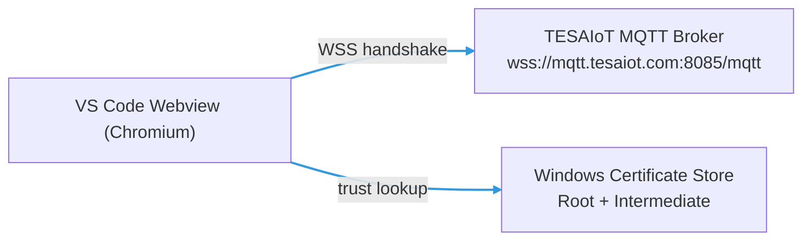

# MQTT `mqtt.tesaiot.com` Connection Fix (WSS `8085`)

This doc explains how to fix the repeated **“Disconnected” ↔ “Connecting…”** loop when connecting to the TESAIoT MQTT broker from the VS Code/Cursor **webview**.

## Symptoms

- In **Settings → Credentials → Validate Connection**, the status flips between **Disconnected** and **Connecting…**
- The broker host/port/credentials are correct, but it never stays connected

## Root cause (most common)

Port **`8085`** is **MQTT over WebSocket Secure** (WSS), and the webview runs on Chromium.

- Chromium validates TLS using the **Windows certificate trust store**
- If the TESAIoT certificate chain is not fully trusted (Root **and** Intermediate), the WSS handshake fails
- The MQTT client retries automatically → “Connecting…” / “Disconnected” loop

## Correct endpoint

Use:

- **Broker URL**: `wss://mqtt.tesaiot.com:8085/mqtt`
- **Username**: Device ID
- **Client ID**: must match Device ID (the UI/store auto-syncs this)
- **Password**: device password

## Fix checklist (Windows)

### Step A — Install the TESAIoT CA chain into Windows trust store

You need the CA chain file:

- `t3d-extension/docs/ca-chain.pem`

Install **both**:

- **Root store** (Trusted Root Certification Authorities)
- **Intermediate store** (Intermediate Certification Authorities)

Run these commands in an **Administrator** terminal:

```powershell
certutil -addstore -f Root "D:\CODE\2026\ternion-t3d\t3d-extension\docs\ca-chain.pem"
certutil -addstore -f CA   "D:\CODE\2026\ternion-t3d\t3d-extension\docs\ca-chain.pem"
```

Then **restart Cursor/VS Code** (important).

### Step B — Verify the certificates are present

Run:

```powershell
Get-ChildItem Cert:\LocalMachine\Root | Where-Object { $_.Subject -match "TESAIoT" -or $_.Issuer -match "TESAIoT" } |
  Select-Object Subject,Thumbprint,NotAfter | Format-Table -AutoSize

Get-ChildItem Cert:\LocalMachine\CA | Where-Object { $_.Subject -match "TESAIoT" -or $_.Issuer -match "TESAIoT" } |
  Select-Object Subject,Thumbprint,NotAfter | Format-Table -AutoSize
```

Expected:

- Root store includes **`CN=TESAIoT Root CA`**
- Intermediate store includes **`CN=TESAIoT Intermediate CA`** (or similar)

### Step C — Validate from the Settings UI

In **Settings → Credentials**:

- Host: `mqtt.tesaiot.com`
- Port: `8085`
- Username: your device ID
- Password: your device password
- Click **Validate Connection**

If CA trust is correct, it should connect and remain stable.

## If it still loops

### Check the WebSocket failure reason

Open Developer Tools for the webview and inspect:

- **Network → WS** → `wss://mqtt.tesaiot.com:8085/mqtt`
- Look for:
  - TLS / certificate errors
  - HTTP status (e.g. 401/403)
  - WebSocket close code (common: **1006**)

### Common meanings

- **Close code 1006**: almost always TLS trust chain problems (Root/Intermediate missing) or a network policy (proxy/firewall).
- **Not authorized**: username/password wrong or clientId does not match username (device ID).
- **Disconnect reasonCode 142 (Session taken over)**: another client connected using the same **Client ID**. This broker expects **Client ID = Device ID**, so only **one** client can be connected at a time (MQTTX, webview, browser, device, etc.).
- **Host not found**: DNS/network issue.

## What we changed in code (so it stays connected)

### Webview keep-alive subscription (prevents idle disconnect)

The TESAIoT broker drops idle sessions quickly (~4–5 seconds). For the E84 panel, we subscribe to:

- `device/<deviceId>/commands/#`

Right after the connection becomes `connected` and the client instance is available. This avoids a React lifecycle race where subscribing inside an `onConnect` callback can run before the client ref/state is ready.

### Linked-library development (npm link) + Vite resolver fix

To ensure the running webview uses your local `T3D` edits:

- Link `@ternion/t3d` into `t3d-extension` via `npm link`
- Rebuild `T3D` so `dist/` updates
- Fix `t3d-extension/vite.config.ts` to resolve `@ternion/t3d` from the **correct** `node_modules` path when linked

Command used:

```bash
cd "D:/CODE/2026/ternion-t3d/T3D" && npm run link:lib:extension
```

This builds the library and links it into `t3d-extension`.

## Verification checklist (known-good)

- **Node smoke test** (isolates broker/creds from browser TLS quirks):

```bash
cd "D:/CODE/2026/ternion-t3d/t3d-extension" && npm run test:mqtt:wss
```

- **Webview/browser**:
  - DevTools → Network → WS → confirm `wss://mqtt.tesaiot.com:8085/mqtt` stays open
  - If it closes, record close code/reason and any TLS errors

## Notes about “rejectUnauthorized”

The MQTT client code includes `rejectUnauthorized: false` for parity with Node tests.

In a **browser/webview** this does **not** bypass TLS validation. Chromium still uses the Windows trust store.

## Architecture overview



