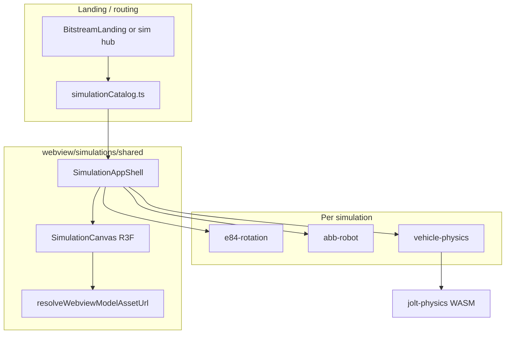
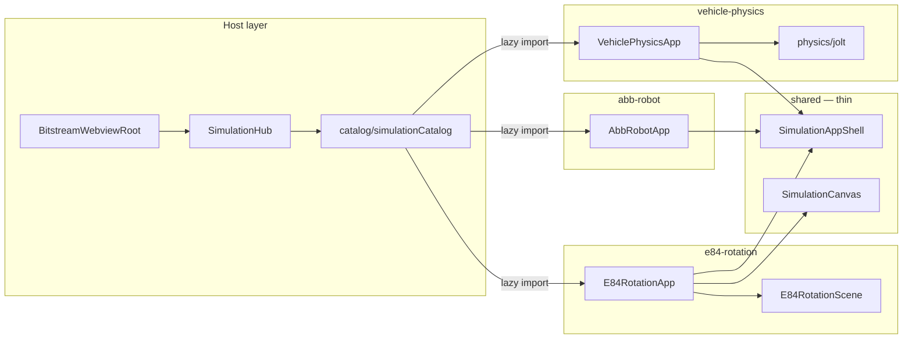

# Digital Twin simulation applications — migration plan

**Status:** Planning (no implementation shipped yet)  
**Last updated:** 2026-05-30  
**Target repo:** Bitstream Studio (`extension/`)  
**Source repo:** `ternion-t3d` / `T3D` (TERNION Digital Twin welcome — migration source only; do not merge back)

This document tracks porting three **quick-scene** simulations from the old TERNION Digital Twin welcome into Bitstream Studio **without** `@ternion/t3d`. Use **`DEVELOPMENT_TRACKER.md`** for day-to-day backlog; update **checklists here** when phases complete.

---

## Goals

- Restore the three welcome cards as first-class Bitstream Studio experiences:
  - **E84 rotation simulation**
  - **ABB Robot**
  - **Robot Physics** (legacy name; T3D title: **Vehicle Camera Physics Simulation**)
- Render with **Three.js** + **React Three Fiber** (`@react-three/fiber`, `@react-three/drei`).
- Keep **BS2 / Sensor Telemetry / Sensor Studio** separate unless explicitly integrated later.
- Reuse existing asset resolution (`resolveWebviewModelAssetUrl`, free pack GLBs) per **`ASSETS_LOCATION_SYSTEM.md`**.
- **Isolation:** Each simulation is a **copyable module** — no imports from `bitstream-app/`, `sensor-studio/`, or sibling sim folders except through **`simulations/shared`** public APIs and **`catalog`** registration.

---

## Isolation and self-containment (required)

Treat each app like a mini-package inside `webview/simulations/`. These rules apply to all three sims and to future ones.

### Dependency rules

| Allowed import from | Purpose |
|---------------------|---------|
| `simulations/shared/*` | Shell, canvas wrapper, thin MQTT helper, types |
| `simulations/catalog/types.ts` | Sim id / metadata only (no app logic) |
| `../ui/TRN`, `../ui/flow-canvas-background`, `lucide-react`, `zustand`, `three`, R3F, `mqtt`, `gsap` | Global UI and npm libs |
| `../bitstream-app/.../resolveWebviewModelAssetUrl` | **One** asset URL helper (or move a copy into `shared/assets/`) |
| `../bitstream-app/.../previewMeshMissingUi.store` | Missing-GLB modal (optional; prefer `shared` wrapper) |

| **Forbidden** | Why |
|---------------|-----|
| `import … from '../e84-rotation/…'` (sibling sim) | Couples apps; breaks copy-out |
| `import … from '../../sensor-studio/…'` | BS2/studio must not depend on sims either |
| `import … from '../../bitstream-app/state/…'` | Telemetry stores, BS2 bridge, workspace mode |
| Shared Zustand store across two sims | Each sim owns `store/` under its folder |
| Putting vehicle Jolt code under `shared/` | Jolt stays inside `vehicle-physics/` only |

### Public surface per app

Each sim folder exposes **one** entry for the router:

- `e84-rotation/index.ts` → `export { E84RotationApp } from './E84RotationApp.js'`
- Internal folders (`scene/`, `mqtt/`, `store/`) are **not** imported from outside that folder except by the app root and its own children.

### Lifecycle

- Mounting a sim **creates** its providers, MQTT client, and physics world; unmount **must** dispose all (no module-level singletons like old `armControllerInstance`).
- Lazy `React.lazy(() => import('./e84-rotation'))` in `catalog` so unused sims do not bloat the Sensor Telemetry bundle.

### Copy-out goal

To use **only** E84 in another project: copy `simulations/e84-rotation/` + `simulations/shared/` + asset paths; adjust `catalog` registration. No edits under `abb-robot/` or `vehicle-physics/`.

---

## Source mapping (ternion-t3d)

| User-facing name | Quick scene id | T3D folder | GLB path (asset roots) |
|------------------|----------------|------------|-------------------------|
| E84 rotation simulation | `psoc-e84-ai` | `T3D/src/T3D/applications/simulation/app01-e84-motion/` | `models/psoc-e84-ai/psoc-e84-ai.glb` |
| ABB Robot | `2` | `app02-robot-arm/` | `models/abb-robot-arm/abb-robot-arm.glb` |
| Robot Physics | `3` | `app03-cube-bot/` | `models/car-cam-physics/car-cam-physics.glb` |

**Old UX entry:** `AppWelcome` + `WelcomeCardsGrid` → `loadScene()` from `T3D/src/T3D/quick-scene/T3DQuickSceneList.ts` (auto-load `landing-page` on extension start).

**Not in scope for this plan:** T3D full engine init, quick-scene COI reload, HDRI environment store, T3D `LeftPanel` / `RightPanel` chrome.

---

## Bitstream Studio stack (already available)

| Package | Role |
|---------|------|
| `three`, `@types/three` | Core 3D |
| `@react-three/fiber`, `@react-three/drei` | React scene graph, helpers |
| `@react-three/rapier` | Installed; **unused** in webview today |
| `gsap`, `mqtt` | Robot arm animation + MQTT (same as old apps) |

**Reference implementation:** `src/webview/bitstream-app/components/3d-rotation/shared/RotationPreviewViewport.tsx` (fullscreen `Canvas`, GLB load, cubemap env).

**Not in extension today:** `jolt-physics` npm, Jolt WASM under `src/assets` (required for vehicle sim parity).

---

## Target architecture



### File structure (target)

Root: **`extension/src/webview/simulations/`** — sibling to `landing/`, `bitstream-app/`, `sensor-studio/` (not inside them).

```text
webview/
├── landing/                          # existing; adds sim cards only via catalog metadata
├── simulations/
│   ├── README.md                     # isolation rules + how to add a 4th sim
│   │
│   ├── catalog/                      # wiring only — no sim business logic
│   │   ├── simulationCatalog.ts      # id, title, description, modelPath, lazy import()
│   │   ├── simulationIds.ts          # 'e84-rotation' | 'abb-robot' | 'vehicle-physics'
│   │   ├── simulationRoutes.ts       # ?sim= / landing → active id
│   │   └── types.ts                  # SimulationMeta, SimulationId
│   │
│   ├── shared/                       # minimal cross-sim kit (keep small)
│   │   ├── index.ts                  # barrel: only documented exports
│   │   ├── shell/
│   │   │   ├── SimulationAppShell.tsx    # full-viewport: canvas + optional side slots
│   │   │   ├── SimulationSidePanel.tsx   # TRN-styled left/right chrome (not T3D panels)
│   │   │   └── SimulationToolbar.tsx     # back to landing, title
│   │   ├── canvas/
│   │   │   ├── SimulationCanvas.tsx      # R3F Canvas + lights + Suspense
│   │   │   ├── SimulationSceneRoot.tsx   # empty group; children = per-app scene
│   │   │   └── useSimulationGltf.ts      # load GLB by catalog modelPath
│   │   ├── assets/
│   │   │   └── resolveSimulationModelUrl.ts  # thin wrap resolveWebviewModelAssetUrl
│   │   └── mqtt/
│   │       ├── useSimulationMqtt.ts      # connect/disconnect; broker from settings
│   │       └── simulationMqtt.types.ts
│   │
│   ├── e84-rotation/                 # self-contained — no imports from abb-* / vehicle-*
│   │   ├── index.ts                  # export { E84RotationApp }
│   │   ├── E84RotationApp.tsx        # composes shell + panels + scene
│   │   ├── config/
│   │   │   └── e84SceneNodes.ts      # E84_1 name constants
│   │   ├── store/
│   │   │   └── e84Movement.store.ts
│   │   ├── scene/
│   │   │   ├── E84RotationScene.tsx    # R3F: model + useFrame rotation
│   │   │   └── useE84TargetMesh.ts
│   │   ├── simulation/
│   │   │   └── e84RotationDriver.ts    # pure math: sine + noise (unit-testable)
│   │   ├── ui/
│   │   │   ├── E84LeftPanel.tsx
│   │   │   ├── E84RightPanel.tsx
│   │   │   ├── E84MovementPanel.tsx
│   │   │   ├── E84MqttPanel.tsx
│   │   │   └── E84ModeTabs.tsx
│   │   ├── mqtt/
│   │   │   ├── e84MqttTopics.ts
│   │   │   └── useE84MqttPublish.ts
│   │   └── docs/
│   │       └── ARCHITECTURE.md       # port from T3D; payload format
│   │
│   ├── abb-robot/
│   │   ├── index.ts                  # export { AbbRobotApp }
│   │   ├── AbbRobotApp.tsx
│   │   ├── config/
│   │   │   └── abbLinkDefinitions.ts # Link1..6 + rotation axes
│   │   ├── store/
│   │   │   └── abbRobotPanel.store.ts
│   │   ├── scene/
│   │   │   ├── AbbRobotScene.tsx
│   │   │   └── useAbbArmLinks.ts
│   │   ├── controller/               # no React — port of ArmLink / ArmController
│   │   │   ├── ArmLink.ts
│   │   │   ├── ArmController.ts
│   │   │   └── abbArmLinksBuilder.ts
│   │   ├── ui/
│   │   │   ├── AbbLeftPanel.tsx
│   │   │   ├── AbbRightPanel.tsx
│   │   │   ├── AbbControlPanel.tsx
│   │   │   └── AbbMqttPanel.tsx
│   │   ├── mqtt/
│   │   │   ├── abbMqttTopics.ts
│   │   │   └── useAbbMqtt.ts
│   │   └── context/
│   │       └── AbbRobotProvider.tsx    # owns controller lifecycle (no global singleton)
│   │
│   └── vehicle-physics/              # Jolt + streaming stay inside this tree only
│       ├── index.ts                  # export { VehiclePhysicsApp }
│       ├── VehiclePhysicsApp.tsx
│       ├── config/
│       │   ├── vehicleConfig.ts
│       │   └── modelConfig.ts
│       ├── store/
│       │   ├── vehicleConfig.store.ts
│       │   ├── cameraSettings.store.ts
│       │   └── debugSettings.store.ts
│       ├── scene/
│       │   └── VehiclePhysicsScene.tsx
│       ├── physics/                  # jolt-physics only here — not in shared/
│       │   ├── jolt/
│       │   │   ├── loadJolt.ts
│       │   │   └── PhysicsWorld.ts
│       │   ├── vehicle/
│       │   │   ├── FourWheelVehicle.ts
│       │   │   ├── VehicleController.ts
│       │   │   └── VehicleCamera.ts
│       │   └── utils/                # floor, colliders, ball spawner, debug meshes
│       ├── hooks/
│       │   ├── useVehicleSetup.ts
│       │   ├── useVehicleInput.ts
│       │   └── useCameraTextureExtraction.ts
│       ├── ui/
│       │   ├── VehicleLeftPanel.tsx
│       │   ├── VehicleRightPanel.tsx
│       │   ├── CameraFeedPanel.tsx
│       │   └── VehicleConfigPanel.tsx
│       ├── streaming/                # optional phase 3d
│       │   └── …
│       └── docs/
│           └── README.md
│
├── SimulationHub.tsx                 # optional: router host (lazy active sim)
└── main.tsx / BitstreamWebviewRoot   # imports catalog + SimulationHub only
```

### How pieces connect (still isolated)



- **`catalog/`** knows **metadata + lazy loader** only; it does not import `ArmController` or `FourWheelVehicle`.
- Each **`*App.tsx`** is the only file that wires shell + panels + scene for that sim.
- **`shared/`** must stay generic (no `E84_1`, no `Link1`, no wheel indices).

### `catalog/simulationCatalog.ts` (shape)

```typescript
// Example — metadata + lazy boundary (no cross-sim imports)
export const SIMULATION_CATALOG = [
  {
    id: 'e84-rotation',
    title: 'PSoC E84 Rotation Simulation',
    modelPath: 'models/psoc-e84-ai/psoc-e84-ai.glb',
    loadApp: () => import('../e84-rotation/index.js'),
  },
  // abb-robot, vehicle-physics …
] as const;
```

### Routing options (decide before Phase 0 coding)

| Option | Description | Pros | Cons |
|--------|-------------|------|------|
| **A. Extended landing** | Add a **Digital Twin simulations** section with three cards on `BitstreamLanding` | Matches old welcome UX | Busier landing page |
| **B. `?sim=` hub** | `?sim=e84\|abb\|vehicle` + lazy bundles | Clean URLs, code-splitting | Extra router work in `BitstreamWebviewRoot` |

**Recommendation:** Option **A** for discoverability in dev; Option **B** for deep links. Can combine (cards set `?sim=`).

---

## Per-app analysis

### 1 — E84 rotation simulation (easiest)

**Behavior:** Find mesh `E84_1` (fallback: name contains `e84`); oscillate `rotation` on X/Y/Z with configurable limits, speeds, noise; optional MQTT publish of Euler degrees.

| T3D dependency | Replacement |
|----------------|---------------|
| `engine.onFrame` | R3F `useFrame` |
| `useSceneObjects(engine)` | `scene.getObjectByName` / traverse after GLTF load |
| T3D panels, plotters, sliders | **TRN** components |
| `T3DWebSocketMqttClient` | `mqtt` package + small hook |

**Does not need:** physics, Jolt, `useEngineInitializer`.

**Source docs:** `app01-e84-motion/docs/ARCHITECTURE.md` (MQTT payload format).

**Rough effort:** 3–7 days (MVP).

---

### 2 — ABB robot arm (medium)

**Behavior:** Six bones `Link1`…`Link6` with fixed rotation axes; **GSAP** joint animation; UI sliders + MQTT topic `robot/actuators` (JSON: `linkId`, `angle`, `duration`, `ease`).

| T3D dependency | Replacement |
|----------------|---------------|
| `engine.getScene()` + `getObjectByName` | R3F `useGLTF` + refs |
| `ArmLink`, `ArmController` | Port as plain TS (minimal T3D in logic) |
| `T3DWebSocketMqttClient` | `mqtt.connect` (local broker: `npm run mqtt:broker:start`) |
| T3D UI | TRN side panels |

**Does not need:** physics.

**Lifecycle note:** Old code uses module singleton `armControllerInstance` — replace with React context / `useRef` + strict cleanup (webview StrictMode).

**Rough effort:** 1–2 weeks.

---

### 3 — Vehicle / Robot Physics (hardest)

**Behavior:** Jolt **vehicle constraint** (4 wheels, suspension, torque, steering), keyboard input, secondary **vehicle camera** → texture, config panels, optional WebRTC/canvas streaming.

**T3D coupling:** `FourWheelVehicle.ts` (~1.3k lines), `useVehicleSetup`, `T3DPhysics`, colliders from GLB sub-meshes, floor/ball spawners, debug meshes.

**Physics migration options:**

| Option | Pros | Cons |
|--------|------|------|
| **A. `jolt-physics` npm + port vehicle code** | Closest parity to today | Large port; Vite WASM copy (see T3D `scripts/copy-jolt.mjs`) |
| **B. `@react-three/rapier` rewrite** | Fits R3F; no Jolt wasm | **Not a port** — deferred (Rapier later, not vehicle v1) |
| **C. Copy `T3D/physics-jolt` tree** | Maximum parity | Adapted under `vehicle-physics/physics/` only |

**Decision (2026-05-30):** **Option A** — `jolt-physics` npm, **single-thread WASM only** in VS Code webview (no COI / Service Worker). Lazy-load Jolt when the user opens **Vehicle Physics**. Physics code stays **only** under `vehicle-physics/` (E84/ABB remain physics-free). **Rapier** is a **later** pass (Sensor Studio or alternate stack), not vehicle v1.

**VS Code webview threading:** Jolt multithread needs `crossOriginIsolated` + `SharedArrayBuffer` (usually via Service Worker). Webviews skip that path; **single-thread Jolt matches T3D webview behavior** and is sufficient for one vehicle + environment.

**Load-time optimizations:** Ship only `jolt-physics.wasm.js` + `.wasm` (not multithread binaries); init on sim entry + optional “Start physics” gate; no COI bootstrap in Bitstream webview HTML.

**Rough effort:** 3–6+ weeks (full parity); sub-phased below.

---

## Migration order and phases

### Phase 0 — Foundation

- [x] Create `simulations/README.md` with isolation rules (summary of this section)
- [x] Scaffold folder tree: `catalog/`, `shared/{shell,canvas,assets}`, `e84-rotation/`, `abb-robot/`, `vehicle-physics/`
- [x] `simulations/shared/SimulationCanvas.tsx` (pattern from `RotationPreviewViewport`)
- [x] `catalog/simulationCatalog.ts` + `SimulationHub.tsx` + landing cards (lazy per sim)
- [ ] Confirm GLBs resolve in dev + VSIX (`notifyMissingAsset` on failure) — manual smoke
- [x] Scene node names documented below:
  - E84: `E84_1` (see `e84-rotation/config/e84SceneNodes.ts`)
  - ABB: `Link1` … `Link6` (Phase 2)
  - Vehicle: sub-mesh names from `vehicleConfigUtils.ts` (T3D source, Phase 3)

**Effort:** ~2–3 days. **Shipped in repo:** 2026-05-30 (scaffold + routing).

**Dev URLs:** `http://localhost:5173/?sim=e84-rotation` (or pick a card on `/` landing).

---

### Phase 1 — E84 rotation (first ship)

- [x] `useGLTF` → find `E84_1`; `useFrame` rotation loop (`e84RotationDriver.ts`)
- [x] `e84Movement.store.ts` + basic control panel (limits/speeds, start/stop)
- [x] MQTT publish (`device/{deviceId}/telemetry`, `{ x, y, z, timestamp }` degrees) via `shared/mqtt/` + `E84MqttPanel`
- [x] Manual transform mode (`TransformControls`, simulation/manual tabs)
- [x] TRN polish (`TRNParameterSlider`, `TRNTabs`, `RotationDegPlotter`, accordions)

**Acceptance:** Start/stop sim, per-axis limits/speeds/noise, MQTT at configured rate; **zero** `@ternion/t3d` imports.

- [x] Phase 1 complete (date: 2026-05-30)

---

### Phase 2 — ABB robot (second ship)

- [x] Load `abb-robot-arm.glb`; build `ArmLink[]` (`buildAbbArmLinks.ts`, axes from T3D)
- [x] Port `ArmLink`, `ArmController`, GSAP tweens
- [x] Control + MQTT panels (`AbbControlPanel`, `AbbMqttPanel`; TRN accordions + metrics)
- [x] No singleton — `AbbRobotContext` + dispose on unmount; `AbbMqttProvider` attaches/detaches client

**Acceptance:** Six joints from UI and MQTT; clean teardown on leave sim.

- [x] Phase 2 complete (date: 2026-05-30)

---

### Phase 3 — Vehicle physics (third; sub-phases)

**Scope:** Parity with T3D `app03-cube-bot` (FourWheelVehicle, driving, config, balls/prank, debug meshes). **Not** in v1 unless explicitly pulled in: full WebRTC panel parity (3d can follow).

**3a — Scene shell (can overlap with 3b)**

- [ ] R3F GLB load (`car-cam-physics.glb`), orbit camera, keyboard hooks (window events)
- [ ] “Start physics” / status UI (lazy Jolt load)

**3b — Jolt vehicle (single-thread, webview-safe)**

- [ ] `jolt-physics` dependency + copy **single-thread** WASM to `src/assets/jolt/` + Vite static copy
- [ ] Port `physics/` from T3D `physics-jolt` + `loadVehicleJolt.ts` (`preferThreads: false` in webview)
- [ ] `VehiclePhysicsWorld` (from `T3DPhysics`) with scene host adapter (no `T3D` engine)
- [ ] Port `FourWheelVehicle`, `VehicleController`; `useFrame` step + sync

**3c — Panels + parity**

- [ ] `vehicle-config-store`, rebuild vehicle, debug settings, floor/balls/prank
- [ ] TRN control panels (port from T3D panels)

**3d — Camera feed / streaming (optional phase)**

- [ ] `VehicleCamera`, texture extraction, feed panel — **same release or follow-on** (user decision: flexible)

- [x] Phase 3a complete (date: 2026-05-30) — R3F shell, GLB, keyboard, Start physics UI
- [x] Phase 3b complete (date: 2026-05-30) — `jolt-physics`, single-thread WASM, ported `physics-jolt` + `FourWheelVehicle` / `useVehicleSetup`
- [x] Phase 3c complete (date: 2026-05-30) — TRN `VehicleConfigPanel` (right), rebuild tracker, runtime tuning, debug meshes
- [x] Phase 3d complete (date: 2026-05-30) — camera feed canvas + settings (WebRTC deferred)

---

## What not to migrate

- `useEngineInitializer`, T3D quick-scene loader, COI reload dance
- Full T3D graphics / environment store (use drei `Environment` / rotation-preview cubemap helpers)
- Entire `T3D/physics-jolt` unless explicitly choosing option C above
- T3D `LeftPanel` / `RightPanel` — use **TRN** + bitstream-shell patterns

---

## Open decisions

Record choices here when triaged:

| # | Question | Options | Decision |
|---|----------|---------|----------|
| 1 | Landing UX | Extended `BitstreamLanding` vs `?sim=` hub | _TBD_ |
| 2 | Vehicle v1 scope | Full Jolt vs kinematic MVP first | **Jolt single-thread** (T3D parity); 3a shell can ship first |
| 3 | MQTT brokers | Local `mqtt:broker:start` only vs TESAIoT WSS for all three | _TBD_ (vehicle has no MQTT in T3D) |
| 4 | WebRTC / stream preview | Required in first vehicle ship vs phase 3d | **Flexible** — 3d same or later phase |
| 5 | Physics engine (future) | Rapier vs Jolt for other apps | **Rapier later**; Jolt only in `vehicle-physics/` |
| 6 | Jolt threading | Multithread vs single in webview | **Single-thread only** in Bitstream webview |

---

## Summary table

| App | T3D coupling | Bitstream stack | Order | Est. effort |
|-----|---------------|-----------------|-------|-------------|
| E84 rotation | Low | R3F + three + mqtt | **1st** | 3–7 days |
| ABB Robot | Low–medium | R3F + gsap + mqtt | **2nd** | 1–2 weeks |
| Vehicle physics | **High** (Jolt vehicle) | R3F + **jolt-physics** | **3rd** | 3–6+ weeks |

---

## Related docs

| Document | Purpose |
|----------|---------|
| [`DEVELOPMENT_TRACKER.md`](./DEVELOPMENT_TRACKER.md) | Backlog and shipped work |
| [`ASSETS_LOCATION_SYSTEM.md`](./ASSETS_LOCATION_SYSTEM.md) | GLB paths and URL resolution |
| [`../src/webview/landing/`](../../src/webview/landing/) | Bitstream landing (workspaces + Digital Twin sim cards, 2D/3D backdrop) |
| `ternion-t3d/T3D/src/T3D/quick-scene/T3DQuickSceneList.ts` | Source scene registry |
| `ternion-t3d/T3D/src/T3D/applications/simulation/app01-e84-motion/docs/ARCHITECTURE.md` | E84 MQTT payload |

---

## Progress log

| Date | Change |
|------|--------|
| 2026-05-30 | Initial plan document created from migration analysis (E84 → ABB → Vehicle; R3F stack; Jolt option A for vehicle). |
| 2026-05-30 | Added **isolation rules** and full **file structure** (`simulations/` tree, import boundaries, per-app `index.ts` exports). |
| 2026-05-30 | **Phase 0 implemented:** `webview/simulations/**`, landing cards, `SimulationHub`, E84 rotation MVP; ABB/vehicle GLB preview stubs. |
| 2026-05-30 | **Phase 3d:** Vehicle camera feed panel, texture extraction wiring, TRN camera settings (no WebRTC). |
| 2026-05-30 | **Landing backdrop:** R3F welcome cube floor (2D / 3D / blend + overlay cycle); `landing/` module; nav circular-import fix (`isViteDevMode`, `bitstreamLandingActions`). |
| 2026-05-30 | **Phase 2 CSS3D cards:** started — `landing/css3d/` camera sync + CSS3DRenderer overlay (see landing README). |
