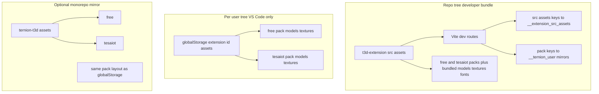
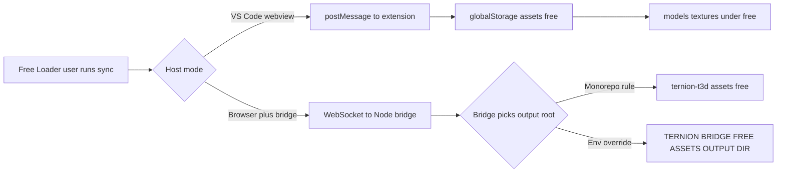
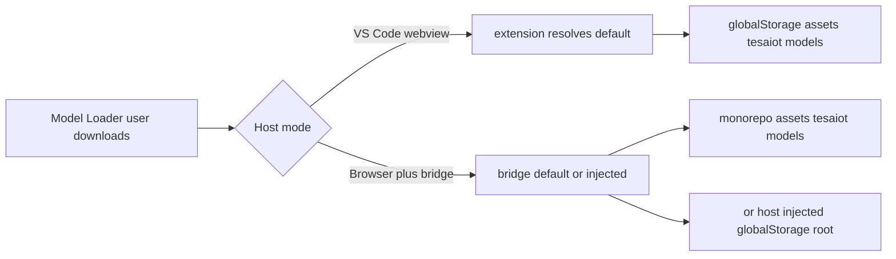
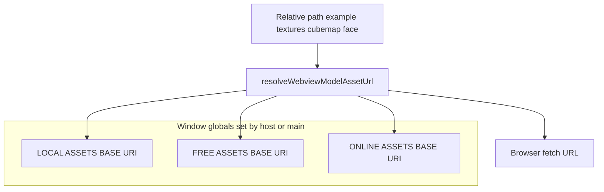

# Asset storage — visual overview

Diagrams complement the canonical tables in **[Global asset directories](./GLOBAL_ASSET_DIRECTORIES.md)** and the operator notes in **[Managing downloaded assets](./MANAGING_DOWNLOADED_ASSETS.md)**. **Disk paths** and **webview base URIs** are related but not the same thing.

---

## Physical trees (where bytes live on disk)

Two primary buckets, plus an optional monorepo mirror. Both packs use the same shape: **`free/<category>/`** and **`tesaiot/<category>/`** (for example **`models`**, **`textures`**).

---

## Free Loader — where sync writes

GitHub source layout for the pack: [`ternion-3d-assets-free` / `assets`](https://github.com/drsanti/ternion-3d-assets-free/tree/main/assets). The sync strips the leading `assets/` segment and writes the remainder under the chosen **output root** (see `syncTernionFreeAssets` in `src/asset-sync/syncTernionFreeAssets.ts`).

---

## Model Loader — where catalog downloads write

---

## Runtime in the webview (URLs, not disk paths)

The panel resolves relative keys using **injected bases** (`LOCAL`, `FREE`, `TESAIOT_TEXTURES`, `ONLINE`, …). That layer is **orthogonal** to the folders above: the host maps `globalStorage` and bundled `out/webview/assets` to **fetchable URIs**. In **Vite dev on `localhost:5173`**, pack paths may resolve via **`/__ternion_user_*`** instead of only **`/__extension_src_assets`** — see [Assets location system](./ASSETS_LOCATION_SYSTEM.md).

Use **Asset Manager → Global directories → Runtime** in the product UI to inspect current base URIs and refresh from the host when wired.

---

## Quick reference table

| Surface | Free pack | Tesaiot pack |
| ------- | ---------- | ------------- |
| VS Code webview | `<globalStorage>/assets/free/` (`free/models/`, `free/textures/`, …) | `<globalStorage>/assets/tesaiot/` (`tesaiot/models/`, `tesaiot/textures/`, …) |
| Browser + bridge (typical) | Monorepo **`ternion-t3d/assets/free/`** or **`TERNION_BRIDGE_FREE_ASSETS_OUTPUT_DIR`** | Monorepo **`ternion-t3d/assets/tesaiot/`** or **`TERNION_BRIDGE_MODEL_DOWNLOADS_OUTPUT_DIR`** (models under **`tesaiot/models/`**) |

For segment constants, use **[Global asset directories](./GLOBAL_ASSET_DIRECTORIES.md)** as the checklist.
