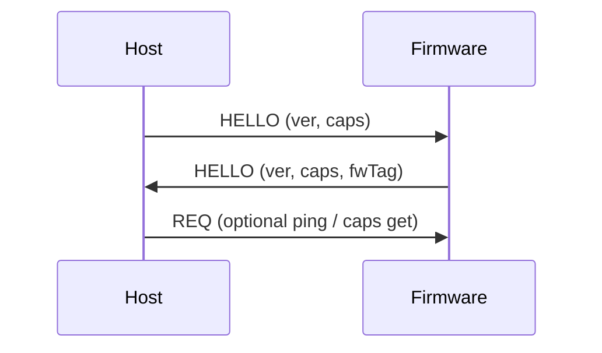
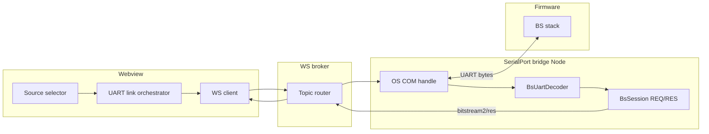
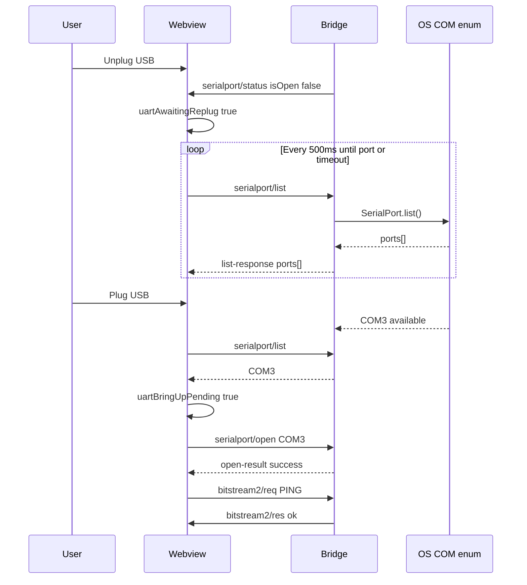

# Bitstream (vNext) — `BS` framed UART protocol specification

**Status:** Draft (greenfield)  
**Scope:** UART wire protocol between Host and Firmware, carried transparently through the T3D Serial bridge / WS broker. Includes **§13 host UART link lifecycle** (browser refresh, Simulator↔UART routing, USB hotplug).  
**Design goals:** robust resync under mixed UART bytes, high-rate sensor streaming, reliable control/config, low overhead.

---

## 1. Transport assumptions

- UART: **8N1** (1 start + 8 data + 1 stop) is assumed for throughput calculations.
- Byte stream is **not** clean: it may contain non-Bitstream bytes (logs/noise).
- Bitstream framing must resynchronize without multi-second stalls.
- Frames are terminated by **CRLF**: `\r\n`.

---

## 2. Frame envelope (wire format)

Each Bitstream frame is:

```text
------+-----+---------+------+--------------+---------+------+
| PFX  | LEN | TYPE    | PAYL | CRC16        | CRLF    | NEXT |
------+-----+---------+------+--------------+---------+------+
| 3B   | 2B  | 1B      | LENB | 2B (LE)      | 2B      | ...  |
------+-----+---------+------+--------------+---------+------+
```

### 2.1 Prefix

- Prefix bytes are ASCII: **`BS` + space**
- Hex: `0x42 0x53 0x20`

### 2.2 `LEN` (u16 little-endian)

- Payload length in bytes
- Valid range:
  - **0…256** for `EVT_SENSOR` (recommended)
  - **0…512** for `REQ/RES` (recommended)
- Receivers **must** treat `LEN` above a configured cap as invalid and resync.

### 2.3 `TYPE` (u8)

Message type (see §4).

### 2.4 `PAYLOAD` (`LEN` bytes)

Binary payload whose structure depends on `TYPE`.

### 2.5 CRC16 (u16 little-endian)

CRC is computed over this byte sequence (in this order):

```text
LEN[0] LEN[1] TYPE PAYLOAD...
```

CRC variant:

- **CRC-16/CCITT-FALSE**
  - poly: `0x1021`
  - init: `0xFFFF`
  - xorout: `0x0000`
  - refin/refout: false

### 2.6 CRLF terminator

- `\r\n` must follow CRC
- Receivers may optionally accept `\n` during bring-up, but **firmware must transmit CRLF**.

---

## 3. Resynchronization rules (mixed UART safe)

Receiver state machine:

1. Scan the byte stream for the prefix `0x42 0x53 0x20` (`"BS "`).
2. Read `LEN` and `TYPE`.
3. If `LEN > MAX_LEN_FOR_TYPE`, drop **one byte** and continue scanning for prefix.
4. Wait until the full frame bytes are available:
   - `PFX(3) + LEN(2) + TYPE(1) + PAYLOAD(LEN) + CRC(2) + CRLF(2)`
5. Validate:
   - CRLF matches
   - CRC matches
6. If any validation fails, drop **one byte** and continue scanning.

**Rationale:** A false-positive prefix inside logs cannot wedge parsing because `LEN` is capped and CRC rejects almost all accidents.

---

## 4. Message types

| TYPE (hex) | Name | Direction | Purpose |
|---:|---|---|---|
| `0x01` | `HELLO` | both | session + version + capabilities |
| `0x02` | `REQ` | host → fw | request (control/config) |
| `0x03` | `RES` | fw → host | response to `REQ` |
| `0x04` | `EVT_SENSOR` | fw → host | sensor streaming sample(s) |
| `0x05` | `EVT_STATUS` | fw → host | async status (Wi‑Fi/link/errors) |
| `0x06` | `EVT_DIAG` | fw → host | diagnostics stream |

Unknown `TYPE`:

- Receiver should ignore the frame (after CRC validation) and keep running.

---

## 5. Common integers and endianness

- Endianness for multi-byte integers: **little-endian**
- Signed values use two’s complement.

Types:

- `u8`, `u16`, `u32`
- `i16`, `i32`

---

## 6. Sensor identifiers

Sensor IDs are stable and never reused:

| sensorId (u8) | Name |
|---:|---|
| `0` | `BMI270` |
| `1` | `BMM350` |
| `2` | `SHT40` |
| `3` | `DPS368` |

---

## 7. `HELLO` (`TYPE=0x01`)

Purpose:

- agree protocol version
- announce supported message types / features
- optional firmware identity

Payload layout:

```text
--------+---------+-----------+----------+-------------------+
| ver   | caps    | mtuSensor | mtuCtrl  | fwTagLen + fwTag  |
--------+---------+-----------+----------+-------------------+
| u8    | u16     | u16       | u16      | u8 + bytes        |
--------+---------+-----------+----------+-------------------+
```

- `ver`: protocol version (start at `1`)
- `caps` (bitset):
  - bit0: sensor streaming (`EVT_SENSOR`)
  - bit1: control (`REQ/RES`)
  - bit2: Wi‑Fi (`EVT_STATUS` + Wi‑Fi commands)
  - bit3: diagnostics (`EVT_DIAG` + diag commands)
  - bit4: extended `SENSOR_CFG` body (10 bytes, v2 — see §8.4)
  - bit5: `SENSOR_CFG` v2.1 body (12 bytes, adds `publishIntervalMs`)
- `mtuSensor`: maximum `LEN` host should assume for `EVT_SENSOR`
- `mtuCtrl`: maximum `LEN` host should assume for `REQ/RES`
- `fwTag`: UTF-8 string, no trailing NUL, length-prefixed (e.g. `1.2.3-psoc`)

Handshake:



---

## 8. Control plane: `REQ` / `RES` (`TYPE=0x02` / `0x03`)

### 8.1 `REQ` payload layout

```text
--------+-------+-------+------+
| reqId | cmdId | flags | body |
--------+-------+-------+------+
| u16   | u8    | u8    | ...  |
--------+-------+-------+------+
```

- `reqId`: host-chosen correlation id (1…65535)
- `cmdId`: command identifier
- `flags`: reserved (must be 0 in v1)

### 8.2 `RES` payload layout

```text
--------+-------+--------+------+
| reqId | cmdId | status | body |
--------+-------+--------+------+
| u16   | u8    | u8     | ...  |
--------+-------+--------+------+
```

- `status=0` means OK
- nonzero status means error (cmd-specific)

### 8.3 Command set (v1 baseline)

| cmdId (hex) | Name | Purpose |
|---:|---|---|
| `0x01` | `PING` | liveness |
| `0x02` | `CAPS_GET` | query capabilities |
| `0x10` | `SENSOR_CFG_GET` | read sensor config |
| `0x11` | `SENSOR_CFG_SET` | write sensor config |
| `0x12` | `STREAM_MASK_SET` | set sensor stream mask |
| `0x13` | `STREAM_RATE_SET` | set sensor publish interval |
| `0x20` | `WIFI_CONNECT` | connect (`security u32` + `ssid[33]` + `password[65]`) |
| `0x21` | `WIFI_DISCONNECT` | disconnect |
| `0x22` | `WIFI_SCAN_ALL` | start full scan (async EVTs) |
| `0x23` | `WIFI_SCAN_SSID` | filtered scan (`ssidLen` + bytes) |
| `0x24` | `WIFI_STATUS_GET` | link snapshot in `RES` body (38 B) |
| `0x25` | `WIFI_POLICY_GET` | policy `flags` in `RES` body |
| `0x26` | `WIFI_POLICY_SET` | `flags u8` in `REQ` body |
| `0x30` | `DIAG_TASKS_GET` | one-shot task table |
| `0x40` | `LOG_LEVEL_SET` | set firmware log level |

Command payloads must stay within `mtuCtrl`.

### 8.4 `SENSOR_CFG_GET` / `SENSOR_CFG_SET` (sensor config)

**Normative detail:** `src/bitstream2/docs/SENSOR_CFG_V2.md`

When `HELLO.caps` bit5 (`BS_CAPS_SENSOR_CFG_V21`) is set, `SENSOR_CFG_GET` / `SET` use a **12-byte** body (host simulator default).

When only bit4 is set, **10-byte** v2 body (no `publishIntervalMs`).

**12-byte v2.1 layout:**

```text
--------+---------+-------------+------+---------------------+-------------+------------------------+---------------------+
| sensorId | enabled | publishMode | mask | samplingIntervalMs | deltaX100 | minPublishIntervalMs | publishIntervalMs |
--------+---------+-------------+------+---------------------+-------------+------------------------+---------------------+
| u8       | u8      | u8          | u8   | u16 LE              | u16 LE      | u16 LE                 | u16 LE              |
--------+---------+-------------+------+---------------------+-------------+------------------------+---------------------+
```

`publishIntervalMs = 0` means same as `samplingIntervalMs`.

**Validation (v2.1, normative):** if `publishIntervalMs > 0` and `publishIntervalMs < samplingIntervalMs`, firmware and hosts **must coerce** `publishIntervalMs := samplingIntervalMs` on SET (telemetry cannot be faster than internal sampling). See `src/bitstream2/docs/SENSOR_CFG_V2.md` §7.1.

**Configuration under load (normative for hosts):** when sensors stream at high EVT rates, `SENSOR_CFG_GET/SET` may time out or lag. Hosts must quiet the bus or extend REQ timeout before cfg RPCs. See `SENSOR_CFG_V2.md` §10.1 and `sensor-cfg-access-policy.ts`.

**Host simulator (`BITSTREAM2_DEV_LOOPBACK=1`):** `BsFirmwareSimulator` emits `EVT_SENSOR` with synthetic **sine-wave** i16 payloads (`src/bitstream2/device/sensor-synth.ts`, ~0.2 Hz). Webview **Sampling frequency** sets `samplingIntervalMs` and `publishIntervalMs = 0`. See `SENSOR_CFG_V2.md` §9–§10 and `HOW_TO_RUN.md`.

**10-byte v2 layout:**

```text
--------+---------+-------------+------+---------------------+-------------+------------------------+
| sensorId | enabled | publishMode | mask | samplingIntervalMs | deltaX100 | minPublishIntervalMs |
--------+---------+-------------+------+---------------------+-------------+------------------------+
| u8       | u8      | u8          | u8   | u16 LE              | u16 LE      | u16 LE                 |
--------+---------+-------------+------+---------------------+-------------+------------------------+
```

- `SENSOR_CFG_GET` **request** body: `sensorId` u8 only.
- `publishMode`: `0` = periodic, `1` = on_change, `2` = hybrid (same as legacy Bitstream v1).
- `deltaX100`: change threshold × 0.01 (used when mode is on_change or hybrid).

**Legacy 7-byte body** (no bit4): `sensorId`, `enabled`, `mask`, `intervalMs`, `minIntervalMs` — see migration table in `SENSOR_CFG_V2.md` §6.

**Partial updates:**

| cmdId | Body |
|------:|------|
| `0x12` `STREAM_MASK_SET` | `sensorId` u8, `mask` u8 |
| `0x13` `STREAM_RATE_SET` | `sensorId` u8, `intervalMs` u16 → maps to `samplingIntervalMs` in v2 |

---

## 9. Sensor streaming: `EVT_SENSOR` (`TYPE=0x04`)

### 9.1 Payload header (common)

```text
----------+------+---------+---------+--------+
| sensorId | mask | counter | tMs     | values |
----------+------+---------+---------+--------+
| u8       | u8   | u32     | u32     | ...    |
----------+------+---------+---------+--------+
```

- `sensorId`: see §6
- `mask`: per-sensor bitmask (interpretation depends on sensorId)
- `counter`: monotonic sample counter (wrap allowed)
- `tMs`: device timestamp in milliseconds (wrap allowed)

### 9.2 BMI270 (`sensorId=0`) mask bits

| Bit | Mask | Field group | Count | Type | Order |
|---:|---:|---|---:|---|---|
| 0 | `0x01` | ACC | 3 | `i16 i16 i16` | ax ay az |
| 1 | `0x02` | GYR | 3 | `i16 i16 i16` | gx gy gz |
| 2 | `0x04` | TMP | 1 | `i16` | temp |
| 3 | `0x08` | EULER | 3 | `i16 i16 i16` | heading pitch roll |
| 4 | `0x10` | QUAT | 4 | `i16 i16 i16 i16` | qw qx qy qz |

**Canonical value order when multiple bits are set:**

```text
ACC → GYR → TMP → EULER → QUAT
```

**Scaling (v1 defaults, can be revised later with explicit negotiation):**

- ACC: mg
- GYR: mdps
- TMP: °C × 100
- EULER: degrees × 100
- QUAT: unit quaternion × 10000

### 9.3 Example (BMI270, all bits set)

Mask `0x1F` (all 5 groups):

```text
sensorId=0
mask=0x1F
counter=u32
tMs=u32
ax ay az (i16)
gx gy gz (i16)
temp (i16)
heading pitch roll (i16)
qw qx qy qz (i16)
```

---

## 10. Status events: `EVT_STATUS` (`TYPE=0x05`)

Used for:

- **Wi‑Fi** async link, scan AP rows, scan complete, policy (normative detail: `TESAIoT_Library/CM55/modules/bitstream/docs/WIFI_BS2_ASYNC_PROTOCOL.md`)
- bridge/firmware warnings (optional, reserved kinds ≥ `0x80`)

### 10.1 Wi‑Fi `EVT_STATUS` common prefix

Every Wi‑Fi status frame inner payload starts with:

```text
--------+------+
| reqId  | kind |
--------+------+
| u16    | u8   |
--------+------+
```

- **`reqId`:** echoes the host `REQ` that started the transaction. **`0` = unsolicited** (e.g. periodic RSSI while idle).
- **`kind`:** discriminates layout below.

### 10.2 Wi‑Fi `kind` values

| `kind` | Name | Inner payload size | Purpose |
|------:|------|-------------------:|---------|
| `0x01` | `WIFI_LINK` | 41 | Link state, RSSI, reason, SSID |
| `0x02` | `WIFI_SCAN_ROW` | 53 | **One scanned AP** (`index`, `total`, rssi, channel, security, ssid, bssid) |
| `0x03` | `WIFI_SCAN_DONE` | 7 | End of scan (`total_count`, `status`) |
| `0x04` | `WIFI_POLICY` | 4 | Policy flags snapshot |

Firmware constants: `bitstream_bs_wifi.h`.

### 10.3 Scan result delivery (host)

After `REQ` `WIFI_SCAN_*` returns `RES status=0`:

1. Zero or more **`WIFI_SCAN_ROW`** frames (same `reqId`, `index` 0…`total-1`).
2. Exactly one **`WIFI_SCAN_DONE`** (same `reqId`).

Host accumulates rows into a list; do not treat `RES` alone as scan complete.

### 10.4 `WIFI_LINK` fields (after `reqId` + `kind`)

| Field | Type | Notes |
|-------|------|-------|
| `state` | u8 | 0=DISCONNECTED, 1=CONNECTING, 2=CONNECTED, 3=SCANNING, 4=ERROR |
| `rssi` | i16 | dBm |
| `reason` | u16 | IPC reason code |
| `ssid` | char[33] | NUL-padded |

### 10.5 `WIFI_SCAN_ROW` fields (after `reqId` + `kind`)

| Field | Type |
|-------|------|
| `index` | u16 |
| `total` | u16 |
| `rssi` | i16 |
| `channel` | u8 |
| `security` | u32 |
| `ssid` | char[33] |
| `bssid` | u8[6] |

### 10.6 `WIFI_SCAN_DONE` fields (after `reqId` + `kind`)

| Field | Type |
|-------|------|
| `total_count` | u16 |
| `status` | u16 | IPC scan complete status |

### 10.7 Synchronous Wi‑Fi reads (`RES` only)

| `cmdId` | `RES` body |
|--------:|------------|
| `0x24` `WIFI_STATUS_GET` | 38 B: `state` + `rssi` + `reason` + `ssid[33]` (no `reqId`/`kind`) |
| `0x25` `WIFI_POLICY_GET` | `flags u8` |

---

## 11. Diagnostics events: `EVT_DIAG` (`TYPE=0x06`)

Diagnostics is intentionally separate from sensor streaming so it can be throttled independently.

Payload layout is TBD; should follow the same “header + chunk” pattern:

- `diagType u8`
- `chunkSeq u16`
- `chunkLen u16`
- `chunkBytes...`

---

## 12. Implementation checklist (host + firmware)

- **Length cap** enforced before buffering large payloads
- **CRC16** checked before accepting a frame
- `counter` and `tMs` always populated for `EVT_SENSOR`
- Control `RES` must be serviced even under telemetry load
- Streaming throttles must never block control response emission
- Unknown types/commands ignored safely

---

## 13. Host UART link lifecycle (normative for T3D host)

This section specifies **host-side** behavior for carrying BS frames over UART through the **SerialPort WebSocket bridge**. It does not change on-wire `BS` framing (§2–§11). Firmware implements §7 `HELLO` and §8 `REQ/RES` only; the host implements session routing, COM ownership, and recovery described here.

**Reference implementation (T3D extension):**

| Layer | Path |
|---|---|
| Webview link orchestration | `t3d-extension/src/webview/bitstream-app/bridge/openUartPortAndHandshake.ts` |
| Hotplug / replug poll | `t3d-extension/src/webview/bitstream-app/hooks/useUartFirmwareHotplugRecovery.ts` |
| Telemetry source routing | `t3d-extension/src/webview/bitstream-app/state/bitstreamTelemetrySource.store.ts` |
| Bridge (Node) | `t3d-extension/src/serialport-bridge/SerialPortWebSocketBridge.ts` |
| Broker topics | `t3d-extension/src/serialport-bridge/protocol.ts`, `t3d-extension/src/bitstream2/bridge/protocol.ts` |

### 13.1 Terminology

| Term | Meaning |
|---|---|
| **Source** | User-selected telemetry backend: **`Bitstream`** (store value `uart` — BS-framed firmware on serial) or **`Simulator`** (store value `simulator` — external bitstream-simulator extension). |
| **Link** | WebSocket client connection to the broker (default `ws://127.0.0.1:9998`). Required for both UART and Simulator paths. |
| **COM session** | OS serial handle held by the bridge process (`serialport/open` … `serialport/close`). Independent of webview page lifetime. |
| **BS2 handshake** | Host considers the BS control plane ready when `HELLO` is decoded and/or `PING` (`cmdId=0x01`) returns `status=0`. |
| **Full bring-up** | Host pipeline: `list` → `open` (if needed) → post-open settle → `HELLO` wait or `PING` → mark link ready. |

### 13.2 Architecture



- **Link** controls broker connectivity only; it does **not** open or close COM by itself.
- **Source = Bitstream** (`uart`) enables COM bring-up and BS2 ingest on `bitstream2/*`.
- **Source = Simulator** uses dev loopback on the bridge (`BITSTREAM2_DEV_LOOPBACK=1`); the host **must** release COM when the effective route enters simulator mode.

### 13.3 COM ownership: browser refresh vs bridge process

| Event | COM on bridge | Webview serial store |
|---|---|---|
| User refreshes browser (F5) | **Stays open** if already open | Reset (`status: null`) |
| User closes webview tab | Same as refresh | Reset on unload |
| Bridge process restart | Closed | N/A |
| `serialport/close` from host | Closed after `close-result` | `isOpen: false` |

**Normative host behavior on webview (re)connect while COM is still open on the bridge:**

1. Subscribe to `serialport/status` and wait up to **1500 ms** for `isOpen: true`.
2. If status matches persisted path and baud (default **921600**), **reuse** the backend COM — do **not** call `serialport/open` again.
3. Bridge **must** treat `serialport/open` for the same `path` + `baudRate` as **idempotent success** when the handle is already open.
4. On bridge WebSocket reconnect while COM is still open but the host UART session flag was cleared, bridge **must re-adopt** the open port (`hostUartSessionActive := true`), publish `serialport/status`, and send a BS `HELLO` probe (§13.6).

**Rationale:** Refreshing the webview must not race `close` + `open` on an OS handle the bridge still owns.

### 13.4 Telemetry source routing and COM policy

When the user switches **Bitstream → Simulator**, the host **must** publish `serialport/close` and wait for `close-result` before relying on simulator telemetry.

When the effective route crosses **Simulator → UART**, the host **must** run **full bring-up** even if a stale webview store shows COM open.

| Transition | COM action | Handshake |
|---|---|---|
| UART → Simulator | Close COM | Simulator uses `bitstream2/dev/*` loopback |
| Simulator → UART | Full bring-up when COM available | Reset BS2 handshake to `unknown` until §13.6 completes |
| Auto + loopback on | Same as Simulator | Same |
| Auto + loopback off | Same as UART | Same |

State flags (webview reference):

- `uartBringUpPending` — queue full bring-up after route change or hotplug detection.
- `uartAwaitingReplug` — COM absent; poll `serialport/list` until a port appears; **do not** spam failed `open` while unplugged.

While `uartAwaitingReplug` is true and no COM is listed, the auto-connect loop **must not** retry full bring-up on every render; only the replug poller may promote `uartBringUpPending` when `list` returns one or more ports.

### 13.5 Hotplug and replug (USB unplug / plug)

**Unplug while Source = Bitstream:**

1. Bridge emits `serialport/status` with `isOpen: false` (serial `close` or error path).
2. Host sets handshake to `unknown`, clears cached `HELLO`, sets `uartAwaitingReplug`.
3. Host **must not** immediately run full bring-up (empty `list` is expected).
4. Host starts **COM watch**: poll `serialport/list` every **500 ms** (first poll after **400 ms** debounce), timeout **120 s** unless user changes source.

**Plug-in / COM re-enumeration:**

1. When `list` returns at least one port, host sets `uartBringUpPending` and clears `uartAwaitingReplug`.
2. Host runs full bring-up (§13.6).
3. Activity / logs should show: COM detected → open (if needed) → handshake → link ready.

**Simulator → UART while board unplugged:**

Same as hotplug: initial bring-up may fail with empty `list`; host sets `uartAwaitingReplug` and **must** keep polling until the user plugs the device. Plug-in after a failed attempt **must** auto-connect without manual Link click.



### 13.6 Post-open handshake (HELLO and PING)

After COM is open (new open or reused backend session), before marking the UI link ready:

| Step | Duration / retries | Action |
|---|---|---|
| Post-open settle | **500 ms** | Allow USB stack and bridge HELLO probe to run |
| HELLO wait | up to **6000 ms**, poll every **100 ms** | Accept link if `bitstream2/hello` received or handshake state `passed` |
| PING fallback | up to **3** attempts, **4000 ms** REQ timeout each, **700 ms** between attempts | `bitstream2/req` with `cmdId=0x01` (`PING`) |
| Failure | — | Log error; if no COM, set `uartAwaitingReplug` and resume §13.5 poll |

Bridge **after** `serialport/open` success:

- Set `hostUartSessionActive := true`.
- Reset `BsUartDecoder` on serial `close`; call `BsSession.cancelAllPending()` when UART session becomes inactive (avoid stale REQ correlators after unplug).
- Write a BS `HELLO` probe on the wire so firmware may respond before host `PING`.

**Firmware note:** After USB reset, `HELLO` / `PING` `RES` may be delayed beyond 2.5 s; hosts **must** prefer HELLO wait + PING retry over a single short timeout.

### 13.7 Broker topics (UART path)

| Topic | Direction | Purpose |
|---|---|---|
| `serialport/list` | webview → bridge | Enumerate COM ports |
| `serialport/list-response` | bridge → webview | Port list |
| `serialport/open` | webview → bridge | Open COM |
| `serialport/open-result` | bridge → webview | Open outcome |
| `serialport/close` | webview → bridge | Close COM |
| `serialport/close-result` | bridge → webview | Close acknowledged; bridge closes OS handle asynchronously |
| `serialport/status` | bridge → webview | Structural open/close/path/baud |
| `bitstream2/req` | webview → bridge | Host BS `REQ` (e.g. `PING`) |
| `bitstream2/res` | bridge → webview | Host BS `RES` |
| `bitstream2/hello` | bridge → webview | Decoded firmware `HELLO` |
| `bitstream2/evt/sensor` | bridge → webview | Decoded `EVT_SENSOR` |

Webview **must** subscribe to `bitstream2/res` before issuing `bitstream2/req`.

### 13.8 Bridge normative requirements (summary)

- **Idempotent open:** same `path` + `baudRate` while already open → `open-result success` without error.
- **WS reconnect reuse:** if COM open and session was inactive, reactivate RX gate and publish status — do not force-close solely because a new webview client connected.
- **Inactive session:** when `hostUartSessionActive` is false, do not publish `serialport/status` with `isOpen: true` (avoids confusing a reset webview store).
- **Close ordering:** on `serialport/close`, acknowledge with `close-result`, then close OS handle (`finishHostPortCloseAfterAck`).
- **List during replug:** `SerialPort.list()` **must** reflect OS enumeration (empty list while unplugged is valid).

### 13.9 UI indicators (reference)

| Icon | Reflects |
|---|---|
| Server / broker | WebSocket `connectionState === connected` |
| USB | `serialport/status.isOpen` |
| CPU / chip | BS2 handshake `passed` (after §13.6) |
| Link toolbar | Broker WS connected (not COM) |

---

## 14. Appendix: rationale vs current Bitstream v2 binary framing

The current v2 deframer trusts `payloadLength` from the stream header. Without a CRC boundary, a false-positive header (caused by mixed UART bytes or corruption) can produce a large `payloadLength`, causing the parser to **buffer and wait** before it can emit any subsequent frames. This can manifest as multi-second “no sensor data” stalls.

This vNext spec prevents that by:

- requiring an ASCII prefix (`BS `) for fast scanning,
- enforcing hard `LEN` caps,
- validating CRC16 for every frame,
- allowing immediate resync after one bad frame instead of buffering indefinitely.

