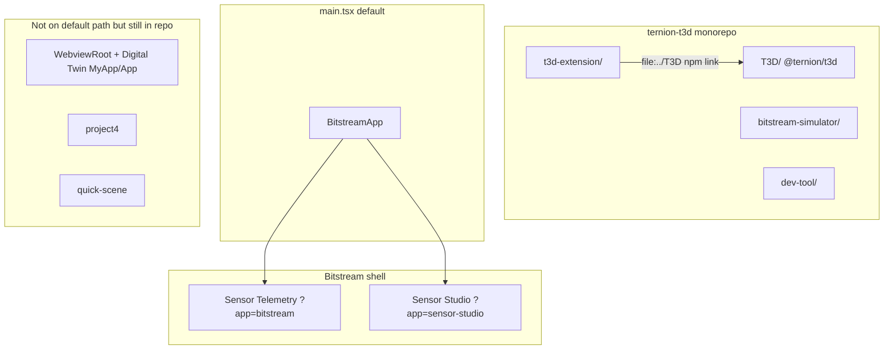
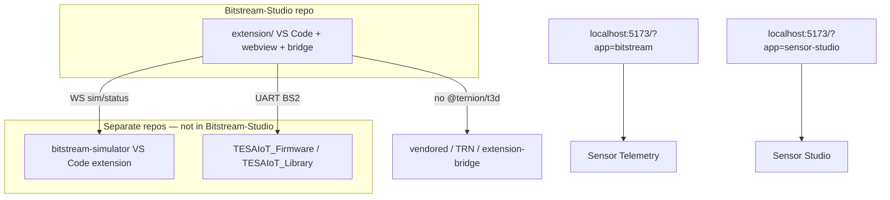

# Bitstream isolation plan — remove `T3D/` dependency

**Date:** 2026-05-29  
**Status:** Phase 0 in progress  
**Target repo:** [Bitstream-Studio](https://github.com/drsanti/Bitstream-Studio) (`https://github.com/drsanti/Bitstream-Studio`) — empty; bootstrap from `ternion-t3d` branch **`BS2`**.  
**Source (migration):** `D:/CODE/2026/ternion-t3d` — copy **`t3d-extension/`** only; **do not** copy `T3D/` or `bitstream-simulator/`.  
**External sim:** `bitstream-simulator` stays in its **own repo** (today under `ternion-t3d/bitstream-simulator/` until moved); install separately for Simulator telemetry mode.  
**Goal:** Ship **Sensor Telemetry** (`?app=bitstream`) and **Sensor Studio** (`?app=sensor-studio`) with **no** `@ternion/t3d` dependency.

---

## Current state



### What is already isolated

- `bitstream-app/` and `sensor-studio/` have **no** direct `@ternion/t3d` imports.
- Default webview entry mounts `<BitstreamApp />` (not Digital Twin).
- Bitstream protocol core lives in `t3d-extension/src/bitstream2/` and extension webview trees.

### What still pulls `@ternion/t3d`

| Shared module | Used by Bitstream/Studio? | T3D dependency |
|---------------|---------------------------|----------------|
| `assets-manager/` | Yes (header menu, Alt+M) | `T3DAssetManager`, `T3DVSCodeUtils.getVsCodeApi()` |
| `model-catalog/` | Yes (floating window) | `@ternion/t3d/ui` (CollapsibleCard, LabeledSlider, …) |
| `model-loader/` | Yes | `@ternion/t3d/ui`, `T3DVSCodeUtils` |
| `free-assets-loader/` | Via asset flows | `T3DVSCodeUtils` |
| `engine-environment/` | Model preview cubemaps | `T3DEngineConfig` |
| `ui/quick-action/` | Ctrl+/ palette | re-exports `@ternion/t3d/ui` |
| `ai-bridge/` | Optional settings window | `T3DVSCodeUtils` |

**Heavy T3D** (engine, Jolt, quick scenes, simulations) is only used by **Digital Twin** (`MyApp`, `App`, `WebviewRoot`).

**Import scope:** ~32 webview files import `@ternion/t3d`; ~595 files under `T3D/src/T3D` — most is unused dead weight for Bitstream-only.

### Wiring today

| Mechanism | Location |
|-----------|----------|
| npm dependency | `t3d-extension/package.json` → `"@ternion/t3d": "file:../T3D"` |
| Vite aliases | `@ternion/t3d`, `/ui`, `/vscode-webview` → `T3D/dist/*.es.js` |
| Build script | `scripts/ensure-t3d-linked-build-fresh.js` |
| Tailwind scan | `node_modules/@ternion/t3d/src/**` |
| COI / Jolt assets | Copied from `T3D/dist/` (Digital Twin path; not Bitstream 3D preview) |

---

## Target state



- No `T3D/` folder, no `file:../T3D`, no `npm link` to `@ternion/t3d`.
- No `bitstream-simulator/` folder in this repo — external VS Code extension only.
- Digital Twin, Project4, quick-scene, legacy launcher **not copied** to Bitstream-Studio.
- VSIX + dev browser unchanged for Bitstream + Sensor Studio workflows.

---

## Open decisions

| # | Question | Options | Choice |
|---|----------|---------|--------|
| 1 | Repo strategy | **A)** Trim `ternion-t3d` in place · **B)** New repo | **B — [Bitstream-Studio](https://github.com/drsanti/Bitstream-Studio)** |
| 2 | Feature scope v1 | Keep Asset Manager + Model Catalog + Model Loader? AI Bridge? `?standalone=bs2-monitor`? | **v1:** Telemetry + Studio + **Asset Manager** + **Model Catalog**; **defer** Model Loader dashboard, AI Bridge, bs2-monitor |
| 3 | Model-catalog UI | **A)** Migrate to TRN · **B)** Vendor minimal `T3D/ui` slice | **A — TRN migration** |
| 4 | VSIX identity | Keep `ternion-digital-twin` or rebrand (e.g. `bitstream-studio`) | **Rebrand:** `bitstream-studio`, display **Bitstream Studio** |
| 5 | Digital Twin code | Delete outright vs archive on `digital-twin` branch in `ternion-t3d` | **Archive on `ternion-t3d`** — do not copy or delete |
| 6 | `bitstream-simulator` | In Bitstream-Studio vs separate repo | **Separate repo** — not copied into Bitstream-Studio |

---

## Phase 0 — Bootstrap [Bitstream-Studio](https://github.com/drsanti/Bitstream-Studio)

**Goal:** Clone empty repo, copy only Bitstream product trees, first commit builds (may still use `@ternion/t3d` temporarily until Phase 4).

### Recommended repo layout

```text
Bitstream-Studio/
  extension/                 # contents of ternion-t3d/t3d-extension/ (rename optional later)
  AGENT_HANDOFF.md           # Bitstream-Studio handoff (trimmed from monorepo)
  README.md                  # install, dev URLs, firmware + sim extension pointers
  .cursor/
    rules/                   # Bitstream-relevant rules (see § Rules and skills migration)
    skills/                  # optional: slim skills; sim skill points to external repo
```

**Not in this repo:** `T3D/`, `bitstream-simulator/`, `dev-tool/`, Digital Twin trees.

**Alternative:** Keep folder name `t3d-extension/` at repo root to reduce path churn during migration; rename to `extension/` in a follow-up commit.

### Bootstrap checklist

| Step | Action |
|------|--------|
| 0.1 | `git clone https://github.com/drsanti/Bitstream-Studio.git` |
| 0.2 | Copy from `ternion-t3d` @ **`BS2`**: **`t3d-extension/` only** |
| 0.3 | Copy docs: `docs/BITSTREAM_T3D_DECOUPLING_PLAN.md`, trimmed `AGENT_HANDOFF.md`, `HOW_TO_RUN.md` (trim sim clone steps → “install external sim extension”) |
| 0.4 | Bootstrap **`.cursor/`** per § Rules and skills migration below |
| 0.5 | **Do not copy:** `T3D/`, `bitstream-simulator/`, `dev-tool/`, `App.tsx`/`MyApp`/`WebviewRoot`/`project4`/`quick-scene` (or delete immediately after copy in Phase 1) |
| 0.6 | `cd extension && npm install` — until Phase 4, may use npm registry `@ternion/t3d@0.0.3` or vendored stub; **not** `file:../T3D` |
| 0.7 | Update `package.json` `repository.url` → `https://github.com/drsanti/Bitstream-Studio` |
| 0.8 | Initial commit + push; open Cursor workspace on **Bitstream-Studio** root |
| 0.9 | Document **external** paths: TESAIoT firmware/library, bitstream-simulator repo URL/path |

### Rules and skills migration (Phase 0)

**Do not** bulk-edit `ternion-t3d` rules before bootstrap. **Do** create a curated `.cursor/` in Bitstream-Studio during Phase 0; **Phase 4** removes remaining `@ternion/t3d` / npm-link references.

#### When to update

| When | Action |
|------|--------|
| **Now (`ternion-t3d`)** | No rule changes required — still migration source |
| **Phase 0** | Copy + trim + fix paths (this checklist) |
| **Phase 1** | Drop rules for Project4, quick-scene, Digital Twin shell |
| **Phase 4** | Remove `@ternion/t3d` / npm link / COI-Jolt sections; add slim `bitstream-studio-rules.mdc` |

#### Copy to `Bitstream-Studio/.cursor/rules/` (trim paths)

| Rule | Action |
|------|--------|
| `communication-language.mdc` | Copy as-is |
| `bitstream-dual-runtime.mdc` | Copy; remove `T3D/src` rebuild + npm link bullets; keep VSIX + `isVsCodeExtensionWebview` |
| `bitstream-app-conventions.mdc` | Copy from `t3d-extension/.cursor/rules/` |
| `trn-component-first.mdc` | Copy; remove “UI inside `../T3D`” bullet |
| `trn-glass-dropdown-scrollbars.mdc` | Copy if present |
| `webview-dev-hot-reload.mdc` | Copy |
| `markdown-documentation.mdc` | Copy |
| `tesaiot-firmware-bitstream-paths.mdc` | Copy; keep TESAIoT absolute paths; sim path → **external repo** (not under Bitstream-Studio) |
| `bitstream-studio-handoff.mdc` | **New** — replace monorepo `agent-handoff.mdc` (root = Bitstream-Studio, read `AGENT_HANDOFF.md`) |

#### Do not copy to Bitstream-Studio

| Rule / artifact | Reason |
|-----------------|--------|
| `rules.mdc` (monorepo T3D + npm link) | Replace with slim Bitstream-only rules in Phase 4 |
| `save-load-init-pattern.mdc` | References `T3D/applications/` (Digital Twin) |
| `project4-architecture-separation.mdc` | Project4 not shipped |
| `bitstream-simulator-app-path.mdc` | Sim lives in **separate repo** — document in README + optional external skill |
| `.cursor/plans/unified-dev-sh.plan.md` | Obsolete monorepo dev script |
| `tesaiot-mqtt-link-t3d/` skill | Defer or rewrite MQTT-only (drop npm link section) |

#### Skills (optional in Bitstream-Studio)

| Skill | Action |
|-------|--------|
| `bitstream-simulator-app` | **Do not vendor** inside Bitstream-Studio; keep in sim repo or user-level skill with **external repo URL/path** |
| Firmware build skills | Stay in TESAIoT workspace or user skills — reference absolute paths |

#### Workspace layout

- **Single-root Cursor workspace:** open `Bitstream-Studio/` — use **repo-root** `.cursor/rules/` only.
- **Multi-root (extension + TESAIoT):** add TESAIoT folders separately; do not duplicate conflicting rules.

#### Phase 4 rules cleanup (after `@ternion/t3d` removed)

- [ ] Delete or rewrite `extension/.cursor/rules/rules.mdc` (T3D relationship section)
- [ ] Remove `ensure-t3d-linked-build-fresh` mentions from any rule
- [ ] Update `bitstream-dual-runtime.mdc` VSIX section (no `@ternion/t3d` from npm)
- [ ] Confirm `rg '@ternion/t3d|npm link|../T3D' .cursor/` returns zero in Bitstream-Studio

### Temporary `@ternion/t3d` during migration

Until Phase 4 completes in **Bitstream-Studio**:

| Approach | When to use |
|----------|-------------|
| npm registry `@ternion/t3d@0.0.3` | Quick bootstrap; no sibling `T3D/` folder |
| Vendored minimal slice in `extension/src/vendor/` | Preferred before first public push |
| `file:../T3D` | **Avoid** — defeats isolation goal |

**Exit criteria:** Bitstream-Studio repo builds; `git remote -v` points to GitHub; no `T3D/` directory in repo tree.

---

## Phase 1 — Product isolation (no T3D changes yet)

**Goal:** Bitstream-only product surface; stop shipping Digital Twin in the bundle.

| Task | Detail |
|------|--------|
| Lock entry | `main.tsx` → always `BitstreamApp`; remove `USE_WEBVIEW_SHELL`, `WebviewRoot`, `MyApp` path |
| URL routing | Keep `?app=bitstream`, `?app=sensor-studio`, `?app=sensor-telemetry`; drop unrelated launcher apps |
| Remove / archive | `App.tsx`, `MyApp.tsx`, `WebviewRoot.tsx`, `webview-launcher/`, `quick-scene/`, `project4/` |
| Extension host | Remove Digital Twin / Project4 commands; keep Bitstream + Sensor Studio |
| VS Code panel | Preload only Bitstream globals (`TernionDigitalTwin.ts` — rename later) |
| Verify | `npm run dev:webview`, `npm run compile`, VSIX smoke for both URLs |
| Bundle analyze | Confirm Bitstream build does not pull `dist/index.es.js` engine chunk |

**Exit criteria:** Bitstream + Studio work in dev and VSIX; Digital Twin not reachable from default entry.

---

## Phase 2 — Replace thin T3D bridge (small local copies)

**Goal:** Remove `@ternion/t3d/vscode-webview` and main-package thin symbols without copying the engine.

| T3D symbol | Replacement in `t3d-extension/src/webview/` |
|------------|---------------------------------------------|
| `T3DVSCodeUtils.getVsCodeApi()` | `extension-bridge/getVsCodeApi.ts` (prefer `window.__VSCODE_API__`) |
| `T3DAssetManager.setAssetsBaseUrlToOnline` | Inline in `useInjectedAssetBases` or remove (non-dev only) |
| `T3DEngineConfig` cubemap presets | Static `engine-environment/cubemapPresets.ts` |
| `useQuickActionStore` / `useQuickAction` | Local copy under `ui/quick-action/` (from T3D quick-action slice only) |

**Do not copy** full `T3DVSCodeUtils` (it imports `T3D`, `T3DEngine`, Jolt setup).

**Exit criteria:** No imports of `@ternion/t3d/vscode-webview` or `@ternion/t3d` for bridge/config in Bitstream path files.

---

## Phase 3 — UI: TRN first, vendor only what TRN lacks

Model-catalog / model-loader widgets from `@ternion/t3d/ui`:

- `CollapsibleCard`, `LabeledSlider`, `LabeledSwitch`, `SortableCardList`, `NumericInputRow`, `Button`, `ButtonGroup`

| Option | Approach | Trade-off |
|--------|----------|-----------|
| **A (recommended)** | Migrate to existing **TRN** components | More edits; one design system |
| **B (faster)** | Vendor minimal `vendor/t3d-ui/` slice | Faster; carries legacy styling |

**Exit criteria:** `model-catalog/` and `model-loader/` have zero `@ternion/t3d/ui` imports.

---

## Phase 4 — Remove `@ternion/t3d` completely

| Task | Files / areas |
|------|----------------|
| Remove dependency | `t3d-extension/package.json` |
| Remove scripts | `dev:with-t3d-watch`, `unlink:lib`, `ensure-t3d-linked-build-fresh.js` |
| Clean Vite | All `@ternion/t3d/*` aliases, COI worker copy, Jolt externals, `../T3D` fs.allow |
| Clean Tailwind | Remove `@ternion/t3d` content paths |
| Delete folder | Remove any vendored T3D copy; confirm `@ternion/t3d` absent from lockfile |
| Update docs | `AGENT_HANDOFF.md`, `HOW_TO_RUN.md`, `.cursor/rules` (remove npm link / monorepo T3D sections) |
| Source repo | **`ternion-t3d`** keeps `T3D/` for Digital Twin; **Bitstream-Studio** never adds it |

**Pre-delete gate:**

```bash
cd t3d-extension && rg '@ternion/t3d' src/   # must return 0
npm run compile
npm run dev:webview
# VSIX: ?app=bitstream + ?app=sensor-studio + UART/sim matrix
```

**Exit criteria:** Repo builds and runs with no `T3D/` folder and no `@ternion/t3d` in lockfile.

---

## Repo strategy (decided)

**Use [Bitstream-Studio](https://github.com/drsanti/Bitstream-Studio)** — new product repo. **`ternion-t3d`** remains the archive for Digital Twin + full monorepo history; active Bitstream work moves to Bitstream-Studio after Phase 0 bootstrap.

| | Bitstream-Studio | ternion-t3d (legacy) | bitstream-simulator (external) |
|--|------------------|----------------------|--------------------------------|
| **Purpose** | Sensor Telemetry + Sensor Studio + BS2 host/bridge | Digital Twin, T3D engine, historical BS2 | Virtual MCU VS Code extension |
| **Contains `T3D/`** | Never | Yes | No |
| **In Bitstream-Studio tree** | Yes (extension) | No (source only) | **No — separate repo** |
| **Default branch** | `main` (suggest) | `BS2` | TBD |

---

## Keep vs remove

### Remove (not copied to Bitstream-Studio)

- `T3D/` entire folder
- `bitstream-simulator/` — **separate repo**; document install in README / HOW_TO_RUN
- `App.tsx`, `MyApp.tsx`, `WebviewRoot.tsx`
- `webview-launcher/`, `quick-scene/`, `project4/`
- `bitstream2-simulator/` webview (`?app=bitstream2-sim`) — unless still required
- Vite COI / Jolt wiring (Bitstream 3D preview uses R3F/Three in extension)

### Keep (core product)

- `t3d-extension/src/bitstream2/`
- `t3d-extension/src/webview/bitstream-app/`
- `t3d-extension/src/webview/sensor-telemetry/`
- `t3d-extension/src/webview/sensor-studio/`
- `t3d-extension/src/webview/bitstream-shell/`
- `extension/src/serialport-bridge/` (or `t3d-extension/src/serialport-bridge/` if name kept)
- `assets-manager`, `model-catalog`, `model-loader` (after decoupling)
- `ui/TRN/`

**External (install separately, not vendored in repo):**

- **bitstream-simulator** VS Code extension — own Git repo
- **TESAIoT_Firmware** / **TESAIoT_Library** — firmware truth (multi-root workspace or documented paths)

---

## Progress tracker

Update this table as phases complete. Mirror major milestones in `docs/DEVELOPMENT_TRACKER.md` and `AGENT_HANDOFF.md` §8.

| Phase | Status | Completed | Notes |
|-------|--------|-----------|-------|
| Decisions (§ Open decisions) | Done | 2026-05-29 | All items locked |
| Phase 0 — Bootstrap Bitstream-Studio | Done | 2026-05-29 | Initial push; npm install OK |
| Phase 1 — Product isolation | Done | 2026-05-30 | BitstreamApp-only entry; removed Digital Twin / Project4 / launcher |
| Phase 2 — Thin bridge replacement | Done | 2026-05-30 | Local extension-bridge, quick-action store, cubemap presets |
| Phase 3 — UI decoupling | Pending | — | TRN vs vendor TBD |
| Phase 4 — Delete @ternion/t3d dep | Pending | — | No T3D/ in Bitstream-Studio |
| VSIX + dual-runtime verify | Pending | — | UART + Simulator |

---

## Estimated effort

| Phase | Effort |
|-------|--------|
| Phase 0 (bootstrap) | 0.5–1 day |
| Phase 1 | 1–2 days |
| Phase 2 | 0.5–1 day |
| Phase 3 | 1–4 days (TRN vs vendor) |
| Phase 4 | 0.5 day |
| Verify + docs | 0.5 day |
| **Total** | **~4–8 days** |

---

## Related docs

- `HOW_TO_RUN.md` — dev scripts (update after Phase 4)
- `AGENT_HANDOFF.md` — session log
- `docs/DEVELOPMENT_TRACKER.md` — backlog
- `.cursor/rules/` — see **`BITSTREAM_T3D_DECOUPLING_PLAN.md`** § Phase 0 (Rules and skills migration)
- External **bitstream-simulator** repo — not part of Bitstream-Studio tree
