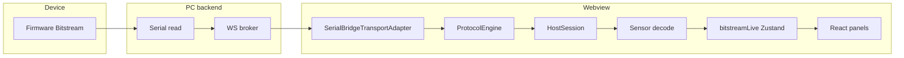

# Bitstream telemetry: stale UI pipeline — analysis and fix plan

**Status:** living engineering note  
**Last updated:** 2026-05-27

> **2026-05-27:** Webview **auto-reconnect on wedge** and **`BitstreamTelemetryWedgeRuntime`** were **removed** with the serial-bridge transport strip. Sections below that reference wedge automation are **historical** until UART transport is redesigned.

**See also:** [Telemetry link operations](./BITSTREAM_TELEMETRY_OPERATIONS.md) — persisted settings and manual recovery.

## 1. Purpose

Operators see **telemetry cards and diagnostics turn red** (large **Δ**, “stale” tiers) while **host serial RX (BRx)** sometimes **remains non-zero**. A **full browser or webview refresh** often restores normal updates. This document:

- separates **symptoms** from **causes** by layer,
- records **confirmed** findings (firmware + host UI),
- proposes a **phased fix plan** (no single root cause for all cases).

## 2. Symptoms (what users observe)

| Observation | Typical interpretation |
|-------------|------------------------|
| **Sensor decode Δ** grows to many seconds; per-sensor lines show **stale** | No recent **`SENSOR_SAMPLE_V2`** path into **`bitstreamLive`** (`lastAtByHint` not advancing). |
| **BRx** (bytes read on bridge) **still positive** | UART bytes reach the **PC**; they are not necessarily **valid, decodable sensor frames** on channel `0x01`. |
| **WS RX** line shows broker traffic | WebSocket path is alive; not the same as “sensor decoded”. |
| **Decode rejects (0x01)** counter **climbing** with BRx | Sensor **channel** frames arrive but **`decodeBitstreamSensorSample`** returns **`null`** (layout / corruption / version skew). |
| **Decode rejects flat**, BRx moving, Δ huge | Often **no aligned `0x01` sensor frames**, **deframer desync**, **non-sensor UART traffic**, **firmware publish gating**, or **host session wedged**. |
| **Refresh / reload webview fixes everything** | Strong hint of **client-side lifecycle** issue (session, transport subscription, or stuck JS state) **or** clean **reconnect** side effect—not proof the MCU was broken. |
| **Several browsers or tabs stall together at the same wall time** | **Shared upstream** (MCU → one COM reader → bridge → broker fan-out): every subscriber sees the **same** byte stream, so a **global** firmware pause, **no valid `0x01` frames**, **deframer desync**, or **non-sensor UART** hits **all** clients together. This **does not** fit “only one tab’s `HostSession` wedged” as the sole cause. |

## 3. Data path (reference)

Canonical host-side references:

- `src/webview/bitstream-app/docs/BITSTREAM_SENSOR_DATA_FLOW_AND_STATE.md`
- `src/webview/bitstream-app/docs/BITSTREAM_SERIAL_AND_BROKER_DATA_FLOW.md` (transport)

Firmware truth (protocol, publish, pause) lives under **TESAIoT** (not vendored in this repo):

- `D:\CODE\2026\TESAIoT_PSoC_Edge_Workspace\TESAIoT_Firmware\proj_cm55\src\bitstream`

## 4. Decode and Zustand (what is *not* the bottleneck)

- **`onSensorSample`** updates a **`metricsRef`** and calls **`scheduleMetricsFlush`** (`useBitstreamSession.ts`). Default **`uiFlushIntervalMs`** is **16 ms** — it **coalesces** UI updates; it does **not** explain **multi-second** total silence of decoded samples.
- **`LastUpdateBadge`** uses **wall-clock age** since `lastAtMs` (ticks while idle) so card **Δ** matches long stalls (not only last inter-arrival gap).

If **`lastAtByHint` freezes** for tens of seconds, the primary issue is **upstream of `applyMetricsSnapshot`**, not Zustand batching.

## 5. Root cause categories

### A. Firmware — publish and scheduling

**Finding (2026-05-14):** In `bitstream_protocol.c`, **`bitstream_protocol_process`** used to **return immediately** while **`s_ctrl_stream_pause_ticks > 0`**, which **froze `s_sensor_tick`** and the entire sensor scheduling loop. **Every** CONTROL RX arm set the pause counter to **`BITSTREAM_CTRL_STREAM_PAUSE_TICKS`**, so **rapid CONTROL traffic** could **starve sensor UART** for extended wall time while other bytes (ACKs, other channels) still moved.

**Mitigation shipped in firmware:**

- Do **not** early-return the whole process; **defer streaming TX** only for those ticks.
- Arm the pause counter **only when it is already zero** so bursts cannot perpetually refresh the window.
- Move **BMI270 hybrid** phase toggling to **after** a successful sensor **`send_frame`** so deferral does not advance state without emitting.

**Other firmware knobs (existing behavior):**

- **`STREAM_PAUSE_REQ`** gates **sensor UART publish** (not local sampling); max duration clamped in firmware.
- **`bitstream_protocol_transport_is_ready`**: if **`ready`** is false, sensor **`send_frame`** is skipped (see firmware source around sensor publish).

### B. Host — session / transport wedged

**Observation:** **Refresh clears the failure** without reflashing MCU.

**Hypothesis:** **`HostSession`**, WebSocket client, or listener wiring enters a state where **bytes still increment counters** but **decoded samples no longer reach** `onSensorSample` (or handlers are duplicated / detached in dev). Needs **instrumentation** and a **soft reconnect** path to confirm.

### C. Wire — deframe / non-sensor bytes

Garbage, logging, or **loss of sync** on the deframer yields **BRx** without **`0x01`** decodes → **decode rejects** may stay **flat** if mis-framed bytes never surface as channel **`0x01`** **`UNKNOWN`** events.

### D. Operator interpretation

Large **Δ** with **500 ms** sampling is **expected** when the pipeline is actually stalled: freshness tiers use **2× / 4×** `samplingIntervalMs`; **multi-second** age is always **rose** until samples resume.

### E. Multi-client correlation (same stall time in every browser)

If **two or more independent browser tabs** show **decode Δ climbing** from the **same wall-clock moment**, the failure is **before** per-tab **`HostSession`** divergence:

- The **Node bridge** owns **one** serial handle and **publishes** each RX chunk to **all** WebSocket subscribers on **`serialport/data`** (see **`BITSTREAM_SERIAL_AND_BROKER_DATA_FLOW.md`**).
- **Synchronized** stale telemetry across clients therefore points at the **shared** segment: **MCU / firmware publish path**, **UART bytes that are not valid decodable `0x01` sensor frames**, **bridge** behavior, or **global** transport / pause policy — not “only one tab wedged.”

**Reconnect telemetry** / **Auto-reconnect on wedge** still help **per-client deframer or session desync**; they do **not** substitute for fixing **firmware or wire** when **every** subscriber stops decoding together.

## 6. UI diagnostics shipped (extension)

These reduce guesswork without a refresh:

| Surface | Role |
|---------|------|
| **Telemetry diagnostics** window | Sectioned layout: **Transport snapshot**, **Sensor decode** panel, **0x01 decode rejects**, **Host serial RX**, expandable help. |
| **`sensorChannelDecodeRejectCount`** | Increments when **`channel === 0x01`** and event is **`UNKNOWN`** (decode returned null). |
| **`BitstreamSensorSampleRxBadge`** | Worst **enabled** sensor age vs **per-device** `samplingIntervalMs` (2× / 4×). |

Menu: **Telemetry diagnostics** (Bitstream hamburger).

## 7. Fix plan (phased)

### Phase P0 — Operator playbook (no code)

1. Open **Telemetry diagnostics**; compare **BRx**, **WS RX**, **Δ**, **rejects**.  
2. Try **serial disconnect / reconnect** before full refresh.  
3. Reduce **CONTROL / MCP** spam during high-rate sensor tests.  
4. Ensure **firmware build** includes the **`bitstream_protocol_process`** pause fix if rapid commands are expected.

### Phase P1 — Product UX (extension, small)

- **Shipped 2026-05-14:** **Telemetry diagnostics** — **`Reconnect telemetry`** runs the same teardown as **disconnect + connect** for the webview **`HostSession`** via **`connectSession(..., { userInitiated: true })`** (no full page reload). Same action is available as Quick Command **`Reconnect telemetry`** (`bitstream-reconnect-telemetry`). **Wedge hint banner** (amber): when **handshake passed**, **`sampleCount` > 0**, worst enabled-sensor decode age **≥ 4 s**, smoothed **BRx ≥ 32 B/s** or **`bytesRead` increased within 3.5 s**, and that pattern holds **≥ 4 s** — suggests trying **Reconnect telemetry** (debounced to reduce flapping).

### Phase P2 — Watchdog (extension, guarded)

- **Shipped 2026-05-14:** **Telemetry performance** — opt-in **`Auto-reconnect on wedge`** (`autoReconnectTelemetryWhenWedgedEnabled` in **`bitstreamConfig.store`**, persisted under **`bitstream-dashboard-config-v2`**). When enabled, **`useAutoReconnectTelemetryWhenWedged`** (wired from **`BitstreamAppWrapper`**) uses the same **`computeTelemetryWedgeLikely`** predicate as the banner; after **~28 s** sustained wedge it runs **`runAction("Auto-reconnect telemetry (wedged)", …)`** → **`connectSession(..., { userInitiated: true })`**. **Guards:** skips while **`busyAction`** or **`connecting`**; **90 s** cooldown between auto attempts; **max 3** auto attempts per rolling hour; logs to **System logs** (`pushLog`) including hourly-cap skip.

### Phase P3 — Engineering hardening

- **Partially shipped 2026-05-12 (extension):** **Telemetry decode debug** — persisted **`telemetryDecodeDebugEnabled`** (Telemetry performance). When on, **`useBitstreamSession`** counts inbound **`HostSession.onFrame`** by **wire channel** and records the **last transport disconnect reason**; **Telemetry diagnostics** shows a **Inbound frames by channel** section. Toggle off for normal use (small per-frame cost).  
- **Shipped 2026-05-12 (extension):** **StrictMode / `wsUrl` reconnect guard** — **`sessionConnectAbortEpochRef`** increments when the **status-broker** effect cleans up; **`connectSession`** captures the epoch and **bails** ( **`disconnectSession`** + clears **`connecting`**) after **`await`** points if the hook has torn down or **`wsUrl`** changed, so an in-flight connect cannot finish wiring a stale **`HostSession`**. Status cleanup also calls **`disconnectSession`** so UART sessions do not outlive the broker client they depended on for discovery.

### Phase P4 — Verification

- **Manual:** reproduce with MCP flood, Wi‑Fi diag on, long soak.  
- **Automated (partial):** **`tests/bitstream/telemetry-sensor-decode-rejects-inmemory.test.ts`** — in-memory transport feeds **invalid** sensor **`0x01`** payloads; **`HostSession.onEvent`** must emit **`UNKNOWN`** (same predicate as webview **`sensorChannelDecodeRejectCount`**). Further transport / UI integration tests optional.

## 8. Related tracker entries

- **`docs/DEVELOPMENT_TRACKER.md`** — **Planned / next** and **Future / ideas → Known issues — Bitstream telemetry MCU → UI** (deferred inbox row).  
- This document is the **canonical analysis** for that theme; update the tracker row to link here when triaging.

## 9. Revision history

| Date | Change |
|------|--------|
| 2026-05-12 | P4 (partial): **`telemetry-sensor-decode-rejects-inmemory.test.ts`** — UNKNOWN **`0x01`** events over in-memory transport. |
| 2026-05-12 | P3: **`sessionConnectAbortEpochRef`** + **`bailConnectIfStale`** in **`connectSession`**; status-broker effect cleanup bumps epoch and **`disconnectSession`** (StrictMode / **`wsUrl`** change). |
| 2026-05-12 | P3 (partial): **Telemetry decode debug** — per-channel inbound frame counts + last transport disconnect reason in **Telemetry diagnostics** (opt-in persisted setting). |
| 2026-05-14 | P2: Opt-in **Auto-reconnect on wedge** (`useAutoReconnectTelemetryWhenWedged`, Telemetry performance). |
| 2026-05-14 | P1: **Session may be wedged** debounced banner in **Telemetry diagnostics** (`useTelemetrySessionWedgeBanner`). |
| 2026-05-14 | P1: **Reconnect telemetry** button in **Telemetry diagnostics** (soft session reset). |
| 2026-05-14 | Initial document: symptoms, layers, firmware pause finding, UI diagnostics, phased plan. |
