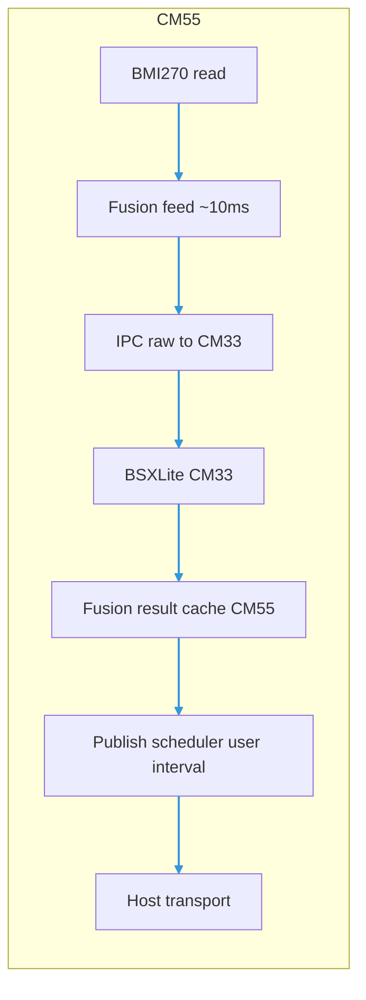

# BMI270: Decouple CM33 fusion cadence from host publish interval

## Problem

When **Sampling Interval** is large (e.g. 50–100 ms), BSXLite on CM33 was fed IMU samples only at that same cadence (tied to bitstream publish scheduling). Fusion orientation then appears to “ease” slowly on the host even though the physical motion is sharp.

Correct **elapsed time** from the IMU driver helps but does not remove the fundamental limit: **fewer fusion updates per second** when IMU read is tied to publish due ticks.

## Goal

- **Fusion path (CM33 / BSXLite):** Run IMU read + IPC push at a **fixed high rate** (~every **10 ms**, matching `BITSTREAM_PROTOCOL_PROCESS_TICK_MS`), whenever BMI270 is **enabled** and stream mode is **Fusion** or **Hybrid**.
- **Wire / host:** Continue to publish sensor frames at the **user-selected** sampling interval (50 ms, 100 ms, etc.), packing the **latest** fusion result from the CM55 bridge cache when emitting a fusion payload.
- **Raw stream mode:** No high-rate fusion feed; behaviour stays read-on-publish.
- **BMI270 disabled:** No high-rate fusion feed.

## Architecture

## Firmware touchpoints (TESAIoT)

| Location | Role |
|----------|------|
| `CM55/modules/bitstream/protocol/src/bitstream_protocol.c` | **Legacy** (`BITSTREAM_BS_WIRE=0`): `bitstream_protocol_bmi270_fusion_high_rate_feed()` — physical read each fusion tick |
| `CM55/modules/bitstream/protocol/src/bitstream_bmi270_runtime.c` | **BS2** (`BITSTREAM_BS_WIRE=1`): `bitstream_bmi270_runtime_fusion_tick()` — physical `read_sample` each fusion tick (2026-05-29; was cached axes only) |
| `CM55/modules/bitstream/protocol/src/bitstream_bs_sensor.c` | BS2 EVT publish at `samplingIntervalMs` / `publishIntervalMs` |
| `proj_cm55/src/bitstream/bitstream.c` | Entry: `bitstream_bs_process()` vs `bitstream_protocol_process()` per `BITSTREAM_BS_WIRE` |
| `TESAIoT_Library/.../cm55_imu_fusion_bridge` | Unchanged API |
| `TESAIoT_Library/.../cm33_imu_fusion/cm33_imu_fusion.c` | Unchanged BSX step logic |

## Counter and diagnostics

- **Sensor counter** (`s_counter` in BMI270 port) advances at **IMU read rate** (~100 Hz when fusion feed is active), not only at publish rate.
- Host-side Hz / gap metrics measure **received frames**; counter gaps between published packets may be larger than 1.

## Phases

1. **Phase A (implemented in firmware):** High-rate fusion feed runs on the ~10 ms process tick when stream mode is Fusion or Hybrid and BMI270 is enabled. **Legacy** uses `bitstream_protocol_bmi270_fusion_high_rate_feed()`; **BS2** uses `bitstream_bmi270_runtime_fusion_tick()` with a physical IMU read before each CM33 push. Publish uses the latest fusion result at the user **sampling** interval (see `BS_WIRE.md` § BMI270 fusion feed vs UART telemetry).
2. **Phase B (optional):** Document or expose fusion-feed period if `BITSTREAM_PROTOCOL_PROCESS_TICK_MS` is ever changed.
3. **Phase C (optional):** Host UI copy in `BMI270SamplingIntervalCard` notes trade-offs for long sampling intervals.

## References

- `BITSTREAM_PROTOCOL_PROCESS_TICK_MS` / `BITSTREAM_BS_PROCESS_TICK_MS` — fusion feed scheduling (10 ms ticks).
- Stream modes: `BITSTREAM_BMI270_STREAM_MODE_*` in `bitstream_bmi270_runtime.h`.
- Host 3D GLB alignment: `bitstream-app/docs/ROTATION_3D_PREVIEW.md` (**`pcb-glb`** mapping).
- `TESAIoT_Library/CM55/modules/bitstream/docs/BS_WIRE.md` — fusion feed vs UART rates.

## Follow-up: configurable fusion-feed interval

See **`docs/BMI270_FUSION_FEED_INTERVAL_PLAN.md`** for protocol, firmware time-based gating, GUI/MCP, and rollout phases.

**Implemented (CM55 + host):** `BMI270_FUSION_FEED_SET_REQ` / `GET_REQ` with ACK **`0x8A`**. The firmware clamps the requested interval to **`BITSTREAM_PROTOCOL_PROCESS_TICK_MS` … `BITSTREAM_BMI270_FUSION_FEED_INTERVAL_MAX_MS`** (typically **10–100 ms**). The webview **Fusion Feed (BSX)** slider and Zustand **`clampBmi270FusionFeedIntervalMs`** use the same **10–100 ms** range.
