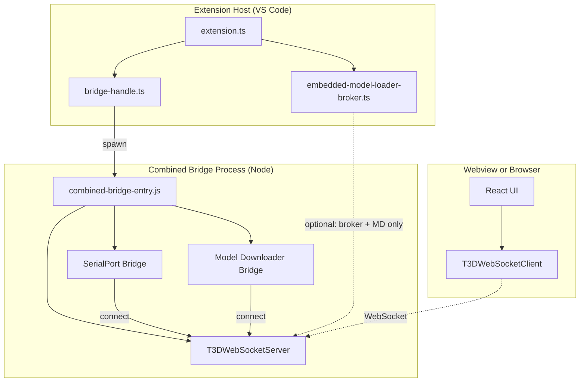
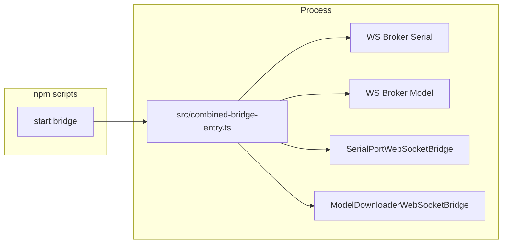

# How the TERNION Bridge Works

This document explains how the **bridge** in the T3D extension allows the webview (and browser) to use Node-only capabilities—**SerialPort**, **Model Loader / Tesaiot API**, **local catalog scans**, and **Free GitHub asset sync**—via a WebSocket **broker** and bridge processes.

For where downloaded files land on disk, see [Managing downloaded assets](./MANAGING_DOWNLOADED_ASSETS.md). For the broader asset path / URL mapping, see [Assets location system](./ASSETS_LOCATION_SYSTEM.md).

## Table of Contents

- [Why a Bridge?](#why-a-bridge)
- [High-Level Architecture](#high-level-architecture)
- [Extension activation (VS Code)](#extension-activation-vs-code)
- [Components in `src/`](#components-in-src)
- [Flow: Extension → Process → Broker](#flow-extension--process--broker)
- [Running the Bridge](#running-the-bridge)
- [Architecture: Dev `npm run start:bridge`](#architecture-dev-npm-run-startbridge)
- [What Happens When You Run `npm run start:bridge`](#what-happens-when-you-run-npm-run-startbridge)
- [WebSocket defaults (`T3DWebSocketConfig`)](#websocket-defaults-t3dwebsocketconfig)
- [SerialPort Bridge](#serialport-bridge-serialport-bridge)
- [Model Downloader Bridge](#model-downloader-bridge-model-downloader)
- [Embedded Model Loader broker (browser mode)](#embedded-model-loader-broker-browser-mode)
- [Webview ↔ Extension](#webview--extension-bridge-status-and-roots)
- [Summary](#summary)

---

## Why a Bridge?

The extension UI runs in a **webview** (or in a **browser**). That environment cannot use Node APIs such as `serialport`, the file system for scans, or HTTPS with a custom CA. The **bridge** runs in a **Node.js** context. It connects to a **WebSocket broker** as a client. The UI also connects to the same broker as a client. The broker routes messages by **topic** between the UI and the bridge, so the UI can issue commands and receive data without touching Node APIs directly.

## High-Level Architecture



- **Production (full bridge):** **bridge-handle** spawns `out/combined-bridge-entry.js`. That process starts the **broker**, then **SerialPort** and **Model Downloader** bridge clients (both connect to the broker).
- **Browser helper:** **embedded-model-loader-broker** may start a broker on `127.0.0.1` if the **model broker port** is free and attach **Model Downloader** in-process (SerialPort is **not** started here). If that model port is already in use (for example by the combined bridge), it only connects the Model Downloader client to the existing broker.
- **Webview/Browser** uses **T3DWebSocketClient** with the same broker URL and topic-based routing.

## Extension activation (VS Code)

On `activate` (`extension.ts`):

1. **Bridge filesystem roots** — `setBridgeModelDownloadsRoot` and `setBridgeUserAssetsRoot` point the Model Downloader bridge at the same globalStorage trees as the extension (see [ASSETS_LOCATION_SYSTEM.md](./ASSETS_LOCATION_SYSTEM.md)).
2. **Local browser HTTP** — `setLocalWebappUserModelsRoot`, `setLocalWebappFreePackRoot`, and `setLocalWebappTesaiotTexturesRoot` for static routes used when opening the app in a browser (see [ASSETS_LOCATION_SYSTEM.md](./ASSETS_LOCATION_SYSTEM.md)).
3. **Serial bridge process** — `startAllBackendServices()` (via `initializeSerialBridge`) spawns the **combined** bridge (`out/combined-bridge-entry.js`) so both brokers and both bridge clients are available without a manual command.
4. **Embedded Model Loader broker** — same helper starts the model broker client path for browser / Model Loader (default `ws://127.0.0.1:9999`).
5. **MQTT broker** — local Aedes instance (1883 / 8883) starts with the same helper.

**Manual control:** Command Palette → **Start All Backend Services** / **Stop All Backend Services** (stops serial bridge, embedded model broker, and MQTT; does not stop the Vite browser dev server). Individual **Start/Stop Serial Bridge** and **Start/Stop MQTT Broker** commands remain for debugging.

On `deactivate`, the extension clears bridge roots, stops the embedded broker, and stops the spawned Serial Bridge process.

## Components in `src/`

| Module / File | Role |
| ------------- | ---- |
| **bridge-handle.ts** | Spawns `out/combined-bridge-entry.js`, handles start/stop, forwards bridge status to the webview via `postMessage`. Handles webview messages: `serial-bridge-start`, `serial-bridge-stop`, `serial-bridge-get-status`. |
| **combined-bridge-entry.ts** | **Production entry** for the spawned process: starts a serial/bitstream broker and a model broker (same process), then `startBridge()` (SerialPort) and `startModelDownloaderBridge()` (Model Downloader). Shutdown on SIGINT/SIGTERM. |
| **embedded-model-loader-broker.ts** | Optional **in-extension** broker on `127.0.0.1:<modelPort>` + Model Downloader bridge only; used for browser mode when nothing else owns the model port. |
| **websocket/** | `T3DWebSocketServer` (broker), `T3DWebSocketClient` (UI and bridges), `T3DWebSocketConfig.ts` (shared defaults). |
| **websocket/run.ws.server.ts** | **Broker only** — run standalone (e.g. next to a dev bridge) with optional `--port=` / `--host=` or `T3D_WS_PORT` / `T3D_WS_HOST`. |
| **serialport-bridge/** | `SerialPortWebSocketBridge`, `serialport-bridge/run.bridge.ts` (**SerialPort bridge only**; requires an already-running broker). |
| **run.bridge.ts** | **Legacy/dev utility:** both bridge clients in one process, expecting an already-running broker. |
| **model-downloader/** | `ModelDownloaderWebSocketBridge`, `run.model-downloader.bridge.ts` (**Model Downloader only**; retries until the broker is up). |

## Flow: Extension → Process → Broker

1. On activation, `extension.ts` calls `initializeSerialBridge(context.extensionPath)` from **bridge-handle**.
2. **bridge-handle** resolves a runtime for the child process (prefer standalone `node` from PATH; fallback to `process.execPath` with `ELECTRON_RUN_AS_NODE`), then spawns `out/combined-bridge-entry.js` and passes configured broker ports via env.
3. **combined-bridge-entry**:
   - Creates a serial/bitstream broker (default `ws://0.0.0.0:9998`) and a model broker (default `ws://0.0.0.0:9999`; configurable).
   - `startBridge({ wsUrl })` → **SerialPortWebSocketBridge** connects to the serial broker.
   - `startModelDownloaderBridge({ wsUrl })` → **ModelDownloaderWebSocketBridge** connects to the model broker and subscribes to command topics (see below).
   - **TelemetryProviderGateway** on `ws://127.0.0.1:9997` (public `bitstream:*` API for standalone HTML/SDK). Disable with `BITSTREAM_TELEMETRY_PROVIDER_DISABLE=1`.
4. When stdout contains the broker listening markers (`[t3d-ws-serial]` or legacy `[t3d-ws]`), bridge-handle notifies the webview (`serial-bridge-status-changed`).
5. The UI uses **T3DWebSocketClient** to publish requests with `requestId` and subscribe to `*-response` / progress topics.

The **manual** command **Start Serial Bridge** calls `startSerialBridge()` → `initializeSerialBridge()` **without** `extensionPath`; prefer relying on activation or ensure the spawn path can resolve `out/combined-bridge-entry.js` (workspace/`cwd` must allow finding the extension output).

## Running the Bridge

For a broader **dev workflow** map (`npm start`, `dev`, Model Loader, AI bridge, default ports), see [Development commands](./DEVELOPMENT_COMMANDS.md).

| Mode | Command / entry | Use case |
| ---- | ---------------- | -------- |
| **Production (VS Code)** | Automatic on activate + **Start Serial Bridge** command | Broker + SerialPort + Model Downloader in one spawned process. |
| **Dev: broker + both bridges** | `npm run start:bridge` | Runs `src/combined-bridge-entry.ts` (serial broker + model broker + both clients in one process). |
| **Dev: broker + Model Downloader only** | `npm run start:model-downloader-bridge` | Same as above but `model-downloader/run.model-downloader.bridge.ts` instead of `run.bridge.ts`. |
| **Dev: Model Downloader client only** | `npm run run:model-downloader-bridge` | Connects to an **already running** broker; retries if the server is not up yet. |
| **Dev: broker only** | `npx tsx src/websocket/run.ws.server.ts` | Run the WebSocket server alone; start `run.bridge.ts` or `run:model-downloader-bridge` in another terminal. |
| **Dev: full stack** | `npm start` | Runs the full dev stack (Dev Supervisor → `start:inner`). Defaults `BITSTREAM2_DEV_LOOPBACK=1` in full mode. |
| **Dev: Vite + Model Loader browser** | `npm run dev:with-model-loader` | Model-downloader stack + extension dev build. |

**Environment variables (optional):** `T3D_WS_PORT`, `T3D_MODEL_BROKER_WS_PORT`, `T3D_WS_HOST`, `T3D_WS_CLIENT_URL`, `T3D_MODEL_BROKER_WS_CLIENT_URL` — see `websocket/T3DWebSocketConfig.ts`.

## Architecture: Dev `npm run start:bridge`

When you run `npm run start:bridge`, the script launches **one process**:

```text
npx tsx src/combined-bridge-entry.ts
```

That single process starts:

1. Serial/bitstream broker (default port `9998`)
2. Model broker (default port `9999`, or single-server mode if configured equal)
3. SerialPort bridge client
4. Model Downloader bridge client



## What Happens When You Run `npm run start:bridge`

### Process: `combined-bridge-entry.ts`

- Starts serial/bitstream broker (`[t3d-ws-serial] listening ...`).
- Starts model broker (`[t3d-ws-model] listening ...`) unless both ports are configured equal.
- Starts SerialPort bridge client (`[serialport-bridge] connected ...`).
- Starts Model Downloader bridge client (`[model-downloader-bridge] connected ...`).

### Count summary

| Level | What | Count |
| ----- | ---- | ----- |
| **Processes** | combined bridge | **1** |
| **Brokers** | serial + model (or single-server mode) | **2** (or **1**) |
| **Bridge clients** | SerialPort + Model Downloader | **2** |

## WebSocket defaults (`T3DWebSocketConfig`)

- **Serial/bitstream broker port:** `9998` (`T3D_DEFAULT_WS_PORT`).
- **Model/free-loader broker port:** `9999` (`T3D_DEFAULT_MODEL_BROKER_WS_PORT`).
- **Server bind:** `0.0.0.0` (`T3D_DEFAULT_WS_HOST`) for the standalone server; embedded browser broker uses `127.0.0.1`.
- **Client URL (serial):** `ws://127.0.0.1:9998` (`T3D_DEFAULT_WS_CLIENT_URL`).
- **Client URL (model):** `ws://127.0.0.1:9999` (`T3D_MODEL_LOADER_WS_CLIENT_URL`).

## SerialPort Bridge (`serialport-bridge/`)

- **UI → Bridge:** `serialport/list`, `serialport/open`, `serialport/close`, `serialport/write` (`serialport-bridge/protocol.ts`).
- **Bridge → UI:** `serialport/list-response`, `serialport/open-result`, `serialport/close-result`, `serialport/write-result`, `serialport/data`, `serialport/status`.

Request/response pairing uses `requestId`. See `serialport-bridge/ARCHITECTURE.md` and `serialport-bridge/GUIDE.md`.

**BS2 UART link lifecycle** (refresh COM reuse, Simulator↔UART, USB hotplug, HELLO/PING bring-up): [`BITSTREAM_BS_FRAMED_PROTOCOL_SPEC.md`](./BITSTREAM_BS_FRAMED_PROTOCOL_SPEC.md) §13 and [`src/bitstream2/docs/HOST_UART_LINK.md`](../src/bitstream2/docs/HOST_UART_LINK.md).

## Model Downloader Bridge (`model-downloader/`)

The bridge uses **ModelDownloaderService** (Node HTTPS, optional custom CA) and **T3DWebSocketClient**. Topics are defined in **`model-downloader/protocol.ts`** (`MODEL_DOWNLOADER_TOPICS`, `FREE_ASSETS_SYNC_TOPICS`). The bridge **subscribes** to at least:

**Tesaiot / API**

- Commands: `model-downloader/list`, `info`, `download`, `download-browser`, `download-job-start`, `download-job-status`, `download-job-cancel`, `catalog-list-downloaded`, `catalog-model-properties`, `default-output`.
- Responses / streams: matching `*-response` topics, `download-progress`, `download-browser-file`, `download-browser-complete`, `download-job-event`, `error`.

**Free GitHub assets sync**

- `free-assets-sync/list`, `local-list`, `default-path`, `request` (with `*-response`, `progress`, and sync `response` as implemented in the bridge).

Each request typically carries `requestId`, `baseUrl`, `apiKey`, and optional `caCertPath` where applicable.

**On-disk output:** globalStorage vs dev tree and bridge-injected roots are covered in [Managing downloaded assets](./MANAGING_DOWNLOADED_ASSETS.md) and [ASSETS_LOCATION_SYSTEM.md](./ASSETS_LOCATION_SYSTEM.md).

## Embedded Model Loader broker (browser mode)

`embedded-model-loader-broker.ts` supports **Open in Browser** and browser-based Model Loader / Free Loader / catalog flows:

- Tries to start a **local** `T3DWebSocketServer` on **`127.0.0.1:<modelPort>`** (default `9999`) if the port is free.
- Always calls **`startModelDownloaderBridge`** toward the configured model broker URL.
- Does **not** start the SerialPort bridge; serial workflows still expect the **combined** spawned process or a dev setup that includes `run.bridge.ts`.

If `npm run start` (or anything else) already listens on the model broker port, the embedded path skips owning the broker and only attaches the Model Downloader client.

## Webview ↔ Extension (bridge status and roots)

- **Data path:** UI ↔ WebSocket broker ↔ bridge (not through the extension host for normal traffic).
- **Extension responsibilities:** spawn/stop the combined process; inject **bridge filesystem roots** on activate; optional **embedded** broker for browser; **`postMessage`** for `serial-bridge-get-status`, `serial-bridge-start`, `serial-bridge-stop`, and status updates.

## Summary

- The **bridge** exposes SerialPort, Tesaiot Model Store, local catalog listing, and Free asset sync over the **T3D WebSocket broker**.
- **Production:** one spawned **combined** process runs the broker plus SerialPort and Model Downloader clients; activation also configures bridge paths and starts an **embedded** Model Loader path for browser use.
- **Development:** `start:bridge` runs the combined bridge entry in **one** process; `start:model-downloader-bridge` runs model-broker + Model Downloader only.
- **Clients** use separate default brokers: serial `ws://127.0.0.1:9998` and model `ws://127.0.0.1:9999`; topic lists live in **`serialport-bridge/protocol.ts`** and **`model-downloader/protocol.ts`**.

For SerialPort protocol details and React hooks, see `serialport-bridge/ARCHITECTURE.md` and `serialport-bridge/GUIDE.md`.
