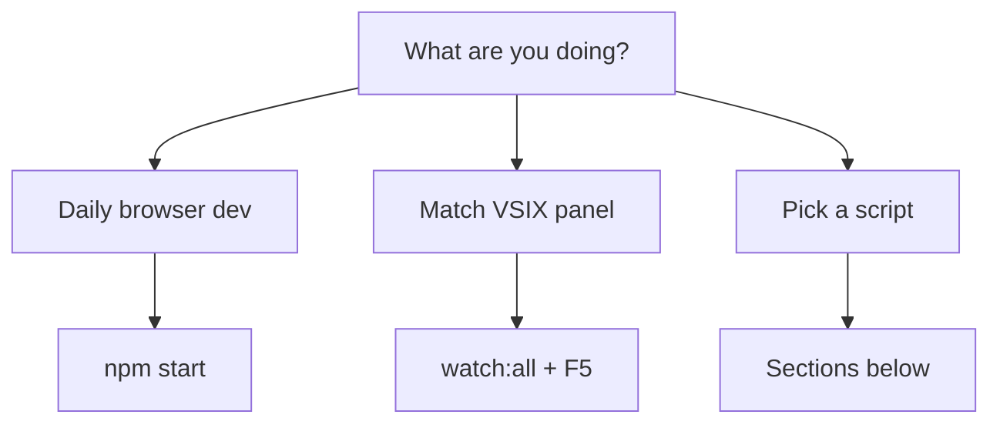
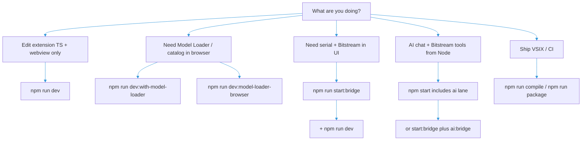

# Development commands — when to use what

This guide maps **`npm` scripts in `extension/`** (Bitstream Studio) to typical workflows: what runs, when it fits, and when to avoid it.

> **New here?** Use the visual cheat sheet first: **[`DEV_MODE_QUICKSTART.md`](./DEV_MODE_QUICKSTART.md)** (`npm start`, F5 panel, split terminals, bookmark URLs).

> **Slow refresh / blank dev page?** See **[`WEBVIEW_DEV_PERFORMANCE.md`](./WEBVIEW_DEV_PERFORMANCE.md)** (lazy Sensor Studio chunks, Vite warmup, HMR vs hard reload).

For bridge internals, see [How the Bridge Works](./BRIDGE.md). For **Bitstream Assistant** (AI bridge) details and serial attach options, see [`src/ai/README.md`](../src/ai/README.md).

## Dev mode at a glance

| You want | Command |
| -------- | ------- |
| **Everything for daily UI** | `npm start` → browser `http://localhost:5173/` |
| **VSIX-like panel** | `npm run watch:all` + F5 (no `npm start`) |
| **Rebuild only** | `npm run watch:all` (does not launch servers) |
| **Vite only** | `npm run dev:webview` (needs `start:bridge` separately) |
| **Free stuck ports** | `npm run dev:clean` |



## Quick port reference

| TCP port (defaults) | Role |
|---------------------|------|
| **9998** | Serial / Bitstream WebSocket broker (combined bridge “serial side”; VS Code setting `ternion.ws.brokerPort`). The **AI bridge client** attaches **to** this broker for `HostSession`. |
| **9987** | **AI bridge WebSocket server** (`run.ai.bridge.ts`; VS Code `ternion.ws.aiBrokerPort`) — webview **Ai Dev Trace** connects here as a client. |
| **9999** | Model Loader / catalog broker (`ternion.ws.modelBrokerPort`) — unrelated to the AI bridge unless you change URLs. |

Treat **9998 = Bitstream serial broker**, **9987 = assistant WS server**, **9999 = model-loader broker** unless you override env/settings.

---

## Pick a scenario



---

## 1. Extension + webview hot reload (most daily coding)

| Command | What it runs | Use when |
|---------|----------------|----------|
| **`npm run dev`** | **T3D `watch:lib`** + extension watch + Vite webview (`dev:with-t3d-watch`). | You link **`../T3D`** and want **`@ternion/t3d` dist** to rebuild while you edit T3D **and** the extension. |
| **`npm run dev:all`** | Extension watch + Vite only (**no** T3D watch). | You are **not** changing `T3D/src` this session, or T3D is already built. |

**Avoid** expecting Model Loader WebSocket features in the **browser** from `dev` / `dev:all` alone — nothing listens on **9999** unless you add the model-loader bridge (next section).

---

## 2. Model Loader / catalog / browser flows that need WebSocket **9999**

| Command | What it runs | Use when |
|---------|----------------|----------|
| **`npm run dev:with-model-loader`** | **`start:model-downloader-bridge`** + **`npm run dev`** (same as `dev:with-t3d-watch` stack). | Full extension watch **and** Model Loader / related WS in **browser** or webview. |
| **`npm run dev:model-loader-browser`** | **`start:model-downloader-bridge`** + **`dev:webview`** (Vite only). | Fast **browser-only** UI iteration; **no** extension TypeScript watch. |

**Do not** use these if you only need the **serial** side — they emphasize the **9999** stack. For serial/Bitstream UI, run **`start:bridge`** (combined bridge, includes serial broker on **9998**).

---

## 3. Serial port, Bitstream UI, combined broker (`start:bridge`)

| Command | What it runs | Use when |
|---------|----------------|----------|
| **`npm run start:bridge`** | [`combined-bridge-entry`](../src/combined-bridge-entry.ts): broker + serial bridge + model-downloader path as implemented there. | Webview or browser needs **SerialPort** / Bitstream / Model Loader through the **combined** local setup. |
| **`npm run start:bridge:attach`** | [`run.bridge.ts`](../src/run.bridge.ts) — clients attach to an **already listening** broker (avoids starting a second listener on the same port). | Broker is already up; you only need attach-side clients. |

**Typical split terminals:** terminal A **`npm run start:bridge`**, terminal B **`npm run dev`** — clearer logs and independent restarts.

---

## 4. One command: full dev stack (`npm start`)

**`npm start`** is the recommended “run everything for dev” command. It runs the Dev Supervisor and spawns **`start:inner`**, which starts:

- **`start:bridge`** (brokers **9998** + **9999**, serial/bitstream bridge, **and** model-downloader bridge — see `combined-bridge-entry.ts`)
- **`dev:all`** (extension watch + Vite webview)
- **`ai:bridge:no-serial`** (AI bridge WS on **9987**, no `HostSession` attach)

Do **not** also run **`start:model-downloader-bridge`** in the same stack — it starts a **second** WS server on **9999** and fails with **`EADDRINUSE`**. Use **`start:model-downloader-bridge`** only when you are **not** running **`start:bridge`** (e.g. **`dev:model-loader-browser`**).

**Loopback default:** when `T3D_START_MODE=full`, `npm start` also defaults `BITSTREAM2_DEV_LOOPBACK=1` so Simulator mode “just works” without hardware. Set `BITSTREAM2_DEV_LOOPBACK=0` to force real UART workflows.

For **`npm run ai:bridge`** with firmware `HostSession` attach (or extra CLI flags), use [§6](#6-ai-websocket-bridge-aibridge).

### One command **with** Bitstream MCP attach (Sensor Studio device tools)

Default **`npm start`** cannot attach **`HostSession`** for MCP (third lane is **`ai:bridge:no-serial`**). To run **broker + dev + full `ai:bridge`** in **one** terminal without opening extra shells:

```bash
npm run start:with-bitstream-mcp
```

That runs **`prestart`** (**`dev:clean`**) then **`start:inner:bitstream-ai`** — same **`concurrently`** layout as **`start:inner`**, but the AI lane is **`npm run ai:bridge`** (Bitstream attach), not **`ai:bridge:no-serial`**.

**Before you run it**

- Set **`ANTHROPIC_API_KEY`** in the environment (or rely on the webview key).
- Set **`BITSTREAM_SERIAL_PATH=COMx`** (Windows) / **`export BITSTREAM_SERIAL_PATH=/dev/tty...`** (Unix) so attach targets the correct port, **or** rely on auto-detect (may pick the wrong device).

**vs `npm start`**

| Command | Supervisor / restart UI | AI lane | Bitstream MCP sensor tools |
|---------|-------------------------|---------|----------------------------|
| **`npm start`** | Yes (`127.0.0.1:9910`) | **`ai:bridge:no-serial`** | No |
| **`npm run start:with-bitstream-mcp`** | No | **`ai:bridge`** | Yes (when broker + COM attach succeed) |

Use **`npm run start:inner:bitstream-ai`** if you already ran **`dev:clean`** manually or ports are free.

| Command | What it runs | Use when |
|---------|----------------|----------|
| **`npm start`** | Runs **`prestart`** → **`dev:clean`**, then starts a **local Dev Supervisor** (**`127.0.0.1:9910`**) which spawns **`start:inner`** (**`start:bridge`** + **`dev:all`** + **`ai:bridge:no-serial`**). Defaults `BITSTREAM2_DEV_LOOPBACK=1` in full mode. | You want **one** command for the full dev stack (UI + brokers + assistant WS + model catalog on **9999** via combined bridge). |
| **`npm run start:with-bitstream-mcp`** | **`prestart`** + **`start:inner:bitstream-ai`** (**`start:bridge`** + **`dev:all`** + **`ai:bridge`**). | One terminal — **broker + dev + MCP-capable AI bridge** (same layout as **`start:inner`**, attach-capable third lane). |
| **`npm run start:inner`** | **`start:bridge`** + **`dev:all`** + **`ai:bridge:no-serial`** via **`concurrently`** (no supervisor). | Same stack as **`npm start`** without supervisor or **`start:with-bitstream-mcp`** without attach. |
| **`npm run start:inner:bitstream-ai`** | **`start:bridge`** + **`dev:all`** + **`ai:bridge`**. | Inner stack only; use **`start:with-bitstream-mcp`** if you want **`prestart`** too. |
| **`npm run start:inner:no-ai`** | **`start:bridge`** + **`dev:all`** (no AI process). | You run **`ai:bridge`** manually with custom flags or another port. |
| **`npm run start:no-clean`** | Alias of **`start:inner`** (skips the supervised wrapper). | Ports are already free, or you do not want `dev:clean`/supervisor. |

**Cautions**

- **`prestart`** tries to free default dev ports (**9998**, **9999**, **9987** by default; see `scripts/dev-clean.mjs`). If another tool must keep **9998**, prefer **`start:no-clean`** or run **`start:bridge`** + **`dev`** manually.
- **`npm start`** uses **`dev:all`**, **not** the T3D watch variant — if you need **`npm run dev`** (T3D watch), run **`start:bridge`** + **`npm run dev`** instead of **`npm start`**.

---

## 4.1 Browser-triggered restarts (Dev Supervisor)

When you run **`npm start`**, a local-only HTTP supervisor listens on:

- **Supervisor base URL**: `http://127.0.0.1:9910`

The Bitstream header toolbar exposes a **dev-only** button (**Restart dev server**) which calls:

- **Restart**: `POST /restart`
- **Status**: `GET /status`

The supervisor is **dev tooling**:

- It binds to **localhost only**.
- It is guarded by **Vite dev mode** in UI (`import.meta.env.DEV`) so packaged builds do not show the restart UI.
- Optional hard gate: set `DEV_SUPERVISOR_TOKEN` and send it as `X-Dev-Token` (not required by default).

Environment knobs:

- **`T3D_START_MODE=full`** (default) → supervisor spawns **`npm run start:inner`**
- **`T3D_START_MODE=browser`** → supervisor spawns **`npm run dev:webview`** (fast iteration)
- **`DEV_SUPERVISOR_PORT`** → change supervisor port (default: **9910**)
- **`DEV_SUPERVISOR_CMD`** → override the spawned command (advanced)

## 5. Standalone webview in the browser

| Command | Use when |
|---------|----------|
| **`npm run dev:webview`** | Vite dev server (opens `/?app=bitstream` by default). No extension compile watch unless paired with `watch:all` via `dev:all`. |

Pair with **`start:bridge`** or **`dev:with-model-loader`** depending on whether you need serial (**9998**) or model-loader (**9999**) WS.

---

## 6. AI WebSocket bridge (`ai:bridge`)

The bridge listens on **`AI_BRIDGE_PORT`** (default **9987**) for the webview **AI Dev Trace** / **Sensor Studio Assistant** client. **`npm start`** already runs **`ai:bridge:no-serial`** (LLM + WS; **no** `HostSession` attach). **Only one process can bind 9987** — if you need **`npm run ai:bridge`** with **Bitstream `HostSession` attach**, use **`npm run start:inner:no-ai`** (or stop the default AI lane) and run **`ai:bridge`** yourself, or change **`AI_BRIDGE_PORT`** for one of the processes and point the webview at the same URL.

| Command | Use when |
|---------|----------|
| **`npm run ai:bridge`** | Run **`run.ai.bridge.ts`**; attempts **`HostSession`** attach through **`ws://127.0.0.1:9998`** when broker + bridge are up. |
| **`npm run bitstream:assistant`** | **Alias** of **`ai:bridge`** — same script, clearer name for docs. |
| **`npm run ai:bridge:no-serial`** | **`--no-bitstream`** baked in — skips serial attach (LLM/UI smoke without COM). |

**Passing extra flags:** **`npm run ai:bridge -- --path=COM9`** (forward CLI after `--`). Prefer **`--serialPath=`** if your npm version treats **`--path`** as an npm config flag (see **`src/bitstream/mcp-server/bitstream-host-session-attach.ts`**). For **`--no-bitstream`** you can also use **`npm run ai:bridge:no-serial`**.

**Prerequisite for firmware tools:** **`npm run start:bridge`** (or attach bridge) so **9998** is listening **before** the bridge tries to open a session.

### Sensor Studio Assistant + Bitstream MCP tools (`bitstream_*`)

**Where the AI assistant UI lives (terminology):** The WebSocket client on **9987** is the same everywhere; the **chat panel** used in the Sensor Studio workflow is still implemented as **`SensorStudioAssistantPanel`**, but it is **mounted from the Bitstream shell**, not from the Sensor Studio row toolbar. When you open **`?app=sensor-studio`** under **`BitstreamAppMain`**, use **Assistant** on the **Digital Twin** header (**TESAIoT Digital Twin** toolbar, next to Connect / Disconnect) or **Sensor Studio Assistant** in the **hamburger (☰)** menu — **Alt+A** toggles the same panel. **Sensor Studio** remains the flow-editor workspace underneath **`BitstreamAppWrapper`**; device telemetry and MCP context still come from the shared Bitstream session.

| Situation | What happens |
|-----------|----------------|
| **`npm start`** (default) | Runs **`ai:bridge:no-serial`** → bridge sets **`bitstreamMcpAttachAvailable: false`** in **`ai/hello_ack`**. Chat works; **Bitstream MCP tools cannot attach** a **`HostSession`** — tools report no session / no transport. |
| **Firmware-backed MCP** | Use **`npm run start:inner:no-ai`** (or stop the built-in AI lane on **9987**), keep the broker up, then **`npm run ai:bridge -- --path=COMx`** (or **`BITSTREAM_SERIAL_PATH`**). Only **one** process should bind **`AI_BRIDGE_PORT`** (**9987** by default); override **`AI_BRIDGE_PORT`** if two bridges must run. |
| **Webview** | **`useAiBridgeClient`** exposes **`bitstreamMcpAttachAvailable`** (**`null`** until hello ack, **`false`** when no-serial). The assistant panel shows an on-panel alert when **Bitstream MCP tools** is enabled but attach is unavailable. |

Details and troubleshooting: **[`src/ai/README.md`](../src/ai/README.md)**.

**Sensor Studio:** Open **`?app=sensor-studio`** or use the **Digital Twin** header (**Telemetry** / **Sensor Studio** segment) or **☰ → Workspace** — same Bitstream shell; URL stays in sync (**browser Back** returns to the previous workspace when you switch with **`pushState`**). With **`npm start`**, the assistant panel shows **WS connected** when **`ai:bridge:no-serial`** is up — that does **not** imply Bitstream MCP can reach the device until you run an **`ai:bridge`** instance **with** attach (see table above).

---

## 7. Build, test, package

| Command | Use when |
|---------|----------|
| **`npm run compile`** | Full **extension + webview** build for VS Code (`out/`). Before **`npm run package`** / CI. |
| **`npm run build:webview`** | Webview bundle only. |
| **`npm run watch`** | Extension compile watch only (no Vite). |
| **`npm run package`** | **`compile`** + **`vsce package`** → `.vsix`. |
| **`npm run lint`** | ESLint on `src`. |
| **`npm test`** | Extension tests (expects **`pretest`** compile + lint). |
| **`npm run ai:gate`** | AI debug smoke + AI unit tests. |
| **`npm run ai:gate:hw`** | **`ai:gate`** + **`ai:bridge:e2e`** (hardware smoke unless skipped). |
| **`npm run bitstream:mcp:gate`** | Validate descriptors + bitstream tests + MCP smoke. |

---

## 8. MQTT

| Command | Use when |
|---------|----------|
| **`npm run mqtt:broker:start`** | Local Aedes broker (dev MQTT). |
| **`npm run mqtt:broker:stop`** / **`restart`** / **`status`** | Control the broker started via the control CLI. |

---

## 9. Bitstream MCP (stdio — Claude Desktop style)

| Command | Use when |
|---------|----------|
| **`npm run bitstream:mcp:stdio`** | Run MCP server over stdio for external MCP hosts. |
| **`npm run bitstream:mcp:validate`** / **`smoke`** | Check descriptors and smoke tests. |
| **`npm run verify:ai-mcp-tools`** | Sanity-load Bitstream MCP tools via **`collectBitstreamMcpTools`** (`src/ai/bridge/verify-ai-mcp-tools.ts`) — matches tools registered when **`enableMcpTools: true`** on the AI bridge WebSocket. |

Not the same process as **`ai:bridge`** (WebSocket + fenced tools in the extension stack).

---

## 10. Aliases

| Script | Note |
|--------|------|
| **`dev`** | Same as **`dev:all`**. |
| **`test:bitstream`** | Same as **`test:bitstream2`**. |
| **`bitstream:assistant`** | Same as **`ai:bridge`**. |

---

## Summary: common mistakes

1. **`npm start`** vs **`npm run start:bridge`** — **`npm start`** runs **bridge + `dev:all`**. **`npm run start:bridge`** is **bridge only**. There is no **`npm start:bridge`** (use **`npm run start:bridge`**).
2. **Browser Model Loader** — **`npm run dev`** alone does not start the **9999** bridge; use **`dev:with-model-loader`** or separate **`start:model-downloader-bridge`**.
3. **AI bridge args** — always **`npm run <script> -- --flag`** for script flags.
4. **VSIX vs linked T3D** — packaged extension uses **`node_modules/@ternion/t3d`** from the pack flow; behavior can differ from **`npm link`** + local **`../T3D`**. See repo **`rules.mdc`** / [Publishing](./PUBLISHING.md).

---

## Related docs

- [How the Bridge Works](./BRIDGE.md)
- [AI module (`src/ai/README.md`)](../src/ai/README.md)
- [Bitstream webview app](../src/webview/bitstream-app/README.md)
- [Extension root README](../README.md) — Quick Start and Development
