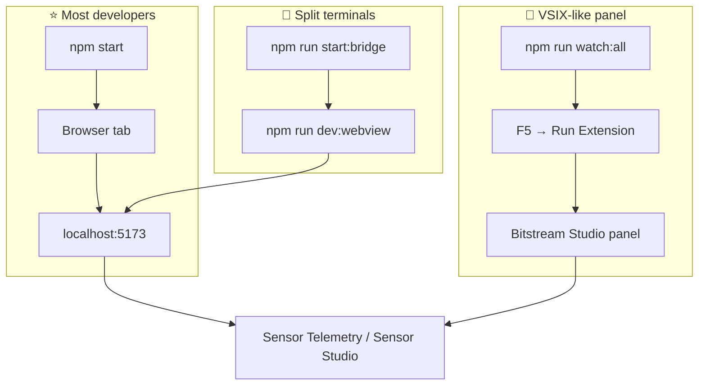
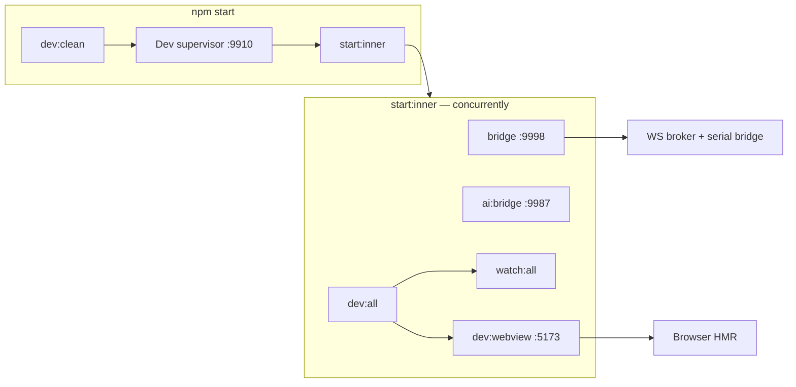
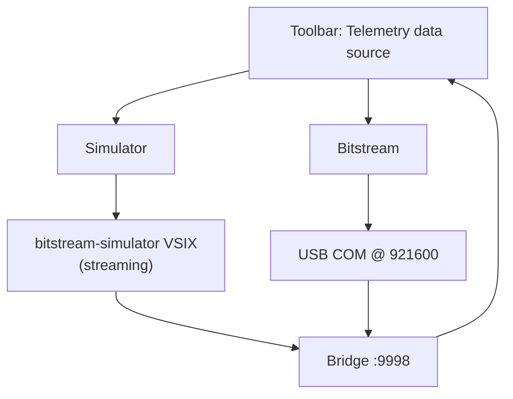

# Dev mode quick start

**One place to see how to run Bitstream Studio locally.** All commands run from the extension package:

```bash
cd extension
npm install
```

---

## Pick your path



| Path | When to use it | What you run | Where you work |
| ---- | -------------- | ------------ | -------------- |
| **⭐ Daily (recommended)** | UI work, setup checklist, Simulator / UART via bridge | **One terminal:** `npm start` | Browser — [Sensor Studio](http://localhost:5173/?app=bitstream&workspace=sensor-studio) · [Telemetry](http://localhost:5173/?app=bitstream&workspace=sensor-telemetry) · [Landing](http://localhost:5173/) |
| **🧩 VSIX-like** | Match installed extension: panel, auto bridge, blocking asset gate | **Terminal:** `npm run watch:all` · **VS Code:** F5 → **Run Extension** → **Open Bitstream Studio** | Extension Development Host window (**do not** also run `npm start`) |
| **🔧 Split** | Clear logs; restart bridge without touching Vite | **T1:** `npm run start:bridge` · **T2:** `npm run dev:webview` | Same browser URLs as above |

---

## What `npm start` starts



| Lane (terminal prefix) | Script | Port | Purpose |
| ---------------------- | ------ | ---- | ------- |
| **bridge** | `start:bridge` | **9998** (+ **9999** model broker) | Telemetry, serial, external **bitstream-simulator** |
| **watch** | `watch:all` | — | Rebuild extension + bundled `out/webview` (for F5 panel) |
| **webview** | `dev:webview` | **5173** | Vite dev server — **open this in the browser** |
| **ai** | `ai:bridge:no-serial` | **9987** | Sensor Studio Assistant WS (no UART attach) |

**Setup checklist:** With `npm start` running, **Connection service** probes `ws://127.0.0.1:9998` in the browser too (same as the VSIX panel). See [STARTUP_CHECKLIST_DESIGN.md](./STARTUP_CHECKLIST_DESIGN.md).

---

## Bookmark these URLs

| Workspace | URL |
| --------- | --- |
| **Sensor Studio** | `http://localhost:5173/?app=bitstream&workspace=sensor-studio` |
| **Sensor Telemetry** | `http://localhost:5173/?app=bitstream&workspace=sensor-telemetry` |
| **Skip landing** | add `&landing=0` or use `?app=bitstream` only |
| **Landing picker** | `http://localhost:5173/` |

---

## Simulator vs real board



| Mode | You also need | Toolbar |
| ---- | ------------- | ------- |
| **Simulator** | **Bitstream Simulator** extension running (separate repo / VSIX) | Source **Simulator** → **Link** |
| **Bitstream (MCU)** | Firmware on COM, bridge up | Source **Bitstream** → **Link** |

Details: [TELEMETRY_MODE_LIFECYCLE.md](./TELEMETRY_MODE_LIFECYCLE.md).

---

## Common mistakes

| Do not | Why |
| ------ | --- |
| Run **`npm run watch:all` alone** and expect the app | It only **rebuilds** code — no bridge, no Vite server |
| Run **`npm run dev:webview` alone** | No broker on **9998** → no telemetry, checklist link steps fail |
| Run **`npm start` and F5** together | Two bridges fight for **9998** |
| Expect browser = VSIX **panel** | Same React app, different host — see [DUAL_HOST_RUNTIME.md](./DUAL_HOST_RUNTIME.md) |

---

## Stuck ports or stale dev

```bash
npm run dev:clean
npm start
```

Default ports cleared: **9998**, **5173**, **9987** (see `scripts/dev-clean.mjs`).

---

## Ship / smoke like production

```bash
npm run compile
npm run package
```

Install the `.vsix` and open **Bitstream Studio** from the command palette — no `localhost:5173`.

---

## More detail

| Doc | Contents |
| --- | -------- |
| [HOW_TO_RUN.md](../HOW_TO_RUN.md) | Full runbook, UART CLI, troubleshooting ladder |
| [DEVELOPMENT_COMMANDS.md](./DEVELOPMENT_COMMANDS.md) | Every `npm` script explained |
| [DUAL_HOST_RUNTIME.md](./DUAL_HOST_RUNTIME.md) | Browser vs VS Code webview |
| [STARTUP_CHECKLIST_DESIGN.md](./STARTUP_CHECKLIST_DESIGN.md) | First-run setup overlay (sequential step reveal) |
