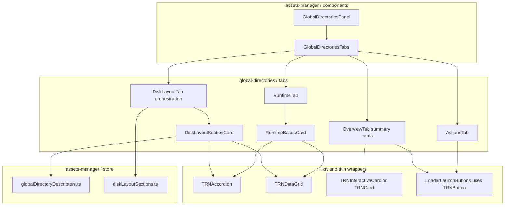

# Global Directories panel — UI design (implementation later)

**Status:** design only.  
**Depends on:** [Global asset directories](./GLOBAL_ASSET_DIRECTORIES.md) (directory truth), [Assets location system](./ASSETS_LOCATION_SYSTEM.md) (URL bases), [Asset Manager architecture](../src/webview/assets-manager/docs/ASSET_MANAGER_ARCHITECTURE.md) (module home).

## Purpose

Give operators a **read-first** surface that answers:

- Where do **Model Loader** downloads go vs the **free pack** mirror vs **repo** assets?
- What **logical web prefixes** and **injected bases** does the webview use right now?
- How do I **refresh** injected bases or **reveal** a known-safe folder in the OS?
- How do I **open Model Loader** or **open Free assets loader** from the same place without hunting menus?

The panel **does not redefine** directory layout; it **reflects** [Global asset directories](./GLOBAL_ASSET_DIRECTORIES.md) and live **`window.*`** / **`asset-config`** data. It **does not embed** the full loader UIs — it **invokes** them via typed callbacks (see **Launchers**).

## Non-goals (v1)

- **Re-implementing** Model Loader or Free assets loader screens inside this panel (no duplicate download/sync UI).
- Computing fetch URLs for arbitrary assets (use **`resolveWebviewModelAssetUrl`** elsewhere).
- Showing **raw** `globalStorage` absolute paths unless the host already exposes them safely (see **Host contract**).

**In scope:** **Opening / focusing** the existing **`ModelLoaderDashboard`** and **`FreeAssetsLoaderDashboard`** (or equivalent host wiring) via **callbacks** passed into **`GlobalDirectoriesPanel`**.

## User stories (v1)

| ID | As a … | I want to … | So that … |
| -- | ------ | ----------- | --------- |
| U1 | Developer | See the two trees (repo `src/assets` vs `globalStorage/assets`) side by side | I stop confusing dev files with per-user downloads. |
| U2 | Operator | See **TESAIOT**, **FREE**, **LEGACY** rows with segment path + web prefix | I can grep logs and catalog keys. |
| U3 | Operator | See **LOCAL / FREE / ONLINE** base URIs the webview uses | I can paste them into support tickets. |
| U4 | Operator | **Refresh** bases from the host | I recover after sync without reloading the whole window. |
| U5 | Operator | **Reveal** the free-pack or tesaiot root in the OS **when the host allows** | I open the folder without hunting AppData paths manually. |
| U6 | Operator | **Open Model Loader** and **open Free assets loader** from this panel | I jump straight to sync/download tools after reading paths. |

## Information architecture (redesign: tabs + collapsible cards + tables)

The panel uses **horizontal tabs** for top-level separation, **collapsible cards** (disclosure) for each subsection so the default view stays compact, and **tables** for dense reference data (role / path / prefix / actions). **Implementation uses `TRN*` components** from **`src/webview/ui/TRN/`** for the same theme as Bitstream / Sensor Studio (see **TRN-first UI** below). Tailwind is for **layout and local spacing** only — avoid one-off colors that bypass TRN tokens.

### Tab: **Overview**

- Short **summary cards** (non-collapsible): “Two trees”, “Where downloads go”, link to [Global asset directories](./GLOBAL_ASSET_DIRECTORIES.md).
- **Quick launch row** (optional but recommended): compact **Open Model Loader** / **Open Free loader** buttons (same callbacks as **Actions** tab) for users who land on Overview first.
- Optional **environment strip**: `WEBVIEW_READY` vs Vite browser (one line + icon).

### Tab: **Disk layout**

Collapsible **cards** (default: first expanded, others collapsed):

| Card | Expanded by default | Table columns |
| ---- | --------------------| --------------|
| **Per-user storage** (`globalStorage/.../assets/`) | Yes | Role \| Segment \| Web prefix \| Actions (Reveal / Copy when allowed) |
| **Repo (`src/assets/`)** | No | Area \| Path pattern \| Notes |
| **Bridge dev (`downloads/`)** | No | Role \| Path \| Notes |

Each card header: **title** + **chevron** + optional **`?`** doc anchor.

### Tab: **Runtime**

- One collapsible card **Injected bases** (expanded): **table** — Label (`LOCAL` / `FREE` / `ONLINE`) \| Value (mono URI) \| Copy.
- Row **Strategy** (read-only or inline select if reusing existing control).
- Toolbar on card: **Refresh bases** (posts **`asset-config`**).

### Tab: **Actions**

- **Primary row (required in v1):** large / clear buttons **Open Model Loader** and **Open Free assets loader**, implemented by **`LoaderLaunchButtons`** (or equivalent) calling **`onOpenModelLoader`** / **`onOpenFreeAssetsLoader`** from panel props.
- **Secondary:** **Open Model catalog** (optional callback `onOpenModelCatalog` — today Bitstream uses **`usePreviewMeshMissingUiStore`** for catalog visibility).
- **Tertiary (P2):** **Copy diagnostics JSON**.

When a callback is **undefined**, render the control **disabled** with tooltip **“Not available in this host”** (e.g. minimal `App` shell not yet wired).

## Launchers: Model Loader and Free assets loader

| Requirement | Detail |
| ----------- | ------ |
| **Contract** | **`GlobalDirectoriesPanelProps`** includes **`onOpenModelLoader?: () => void`** and **`onOpenFreeAssetsLoader?: () => void`**. No `postMessage` from the dumb button row — parent/host implements (typically same handlers as **`BitstreamAppMain`** → **`setModelLoaderOpen(true)`** / **`setFreeAssetsLoaderOpen(true)`** via **`usePreviewMeshMissingUiStore`**). |
| **Bitstream wiring** | Pass through from **`BitstreamAppMain`** (or Asset Manager shell) so behavior matches existing ☰ / mesh-missing flows. |
| **Browser dev** | If loaders require the **Model Downloader bridge** WebSocket, show the same **disconnected** hint pattern already used in **`FreeAssetsLoaderDashboard`** / **`ModelLoaderDashboard`** (reuse copy or a shared small **`BridgeHintInline`** later). |
| **Accessibility** | Buttons have explicit labels; optional `aria-describedby` pointing to bridge hint when disabled. |
| **Composition** | Implement as **`LoaderLaunchButtons.tsx`** (presentational: receives callbacks + `modelLoaderDisabledReason?` / `freeLoaderDisabledReason?`) so **`ActionsTab`** and **`OverviewTab`** can reuse the same row without copy-paste. |

## TRN-first UI (theme and styling)

Build the panel from **`src/webview/ui/TRN/`** so typography, borders, states, and density match the rest of the Digital Twin webview. **Prefer composition** (`TRNTabs` + `TRNAccordion` + `TRNDataGrid` + `TRNButton`) over bespoke markup.

### Component mapping (default choice)

| Design concept | TRN building block | Notes |
| -------------- | ------------------- | ----- |
| **Top-level tabs** | **`TRNTabs`** (+ list / trigger / content parts as exported by the module) | Supports controlled `value` / `onValueChange` for `localStorage` persistence. |
| **Collapsible disk sections** | **`TRNAccordion`** (`type="single"` or `"multiple"` as needed) | One accordion item per storage tree (per-user, repo, bridge). Replaces a custom **`CollapsibleCard`** unless a tiny wrapper is needed for repeated header chrome. |
| **Directory + runtime tables** | **`TRNDataGrid`** | Column defs in TS; `stickyHeader` for long lists; use `cell` renderers for **Copy** / **Reveal** icon buttons (`TRNIconButton`). |
| **Primary / secondary actions** | **`TRNButton`**, **`TRNGlassButton`** | Loader launchers and **Refresh**; match Bitstream toolbars. |
| **Icon-only table actions** | **`TRNIconButton`** | Copy, reveal, help. |
| **Hints + disabled tooltips** | **`TRNTooltip`** (+ **`TRNHintText`** for inline muted copy) | Bridge disconnected, callback undefined. |
| **Overview summary blocks** | **`TRNInteractiveCard`** or **`TRNCard`** + **`TRNCardHeader`** | Same card rhythm as diagnostics / settings. |
| **Section chrome / grouping** | **`TRNSectionContainer`** where it reduces clutter | Optional; do not nest redundant borders. |

See examples under **`src/webview/ui/TRN/examples/`** (e.g. accordion, data grid, tabs) when wiring unfamiliar APIs.

### When to **modify** a TRN component

| Situation | Action |
| --------- | ------ |
| **Missing optional prop** (e.g. extra `className`, `size`, `tone`) | Add it to the **`TRN*`** source in **`src/webview/ui/TRN/`** in a **backward-compatible** way; keep defaults unchanged. |
| **Behavior needed only for Global Directories** | Prefer **wrapper** in `assets-manager/components/global-directories/` that composes TRN — do not fork a second `TRNTabs`. |
| **TRN bug or a11y fix** | Fix in **`src/webview/ui/TRN/`** so all consumers benefit; mention in PR description. |

### Anti-patterns (styling)

- Raw **`<table>`** or ad-hoc grid when **`TRNDataGrid`** meets the need (sortable optional, sticky header built in).
- **`<button className="…">`** with custom zinc palette instead of **`TRNButton`** / **`TRNGlassButton`** for primary actions.
- New **semantic colors** (`bg-blue-600`, etc.) outside the TRN / design tokens used elsewhere in Bitstream.

## ASCII wireframe (modern layout)

```
┌──────────────────────────────────────────────────────────────────────────────────────┐
│  Global directories                                                    [ Refresh all ] │
├──────────────────────────────────────────────────────────────────────────────────────┤
│   ┌─────────────┐ ┌──────────────┐ ┌──────────┐ ┌──────────┐                          │
│   │  Overview   │ │ Disk layout  │ │ Runtime  │ │ Actions  │   ← segmented tabs      │
│   └─────────────┘ └──────────────┘ └──────────┘ └──────────┘                          │
├──────────────────────────────────────────────────────────────────────────────────────┤
│  TAB: Disk layout (example)                                                          │
│                                                                                       │
│  ┌─ ▼ Per-user storage — globalStorage/.../assets/ ─────────────────────────────┐   │
│  │                                                                                │   │
│  │   Role              Path segment           Web prefix (logical)    Actions    │   │
│  │  ───────────────────────────────────────────────────────────────────────────  │   │
│  │   Model Loader      tesaiot/models/        tesaiot/models/           [Reveal][C]│   │
│  │   Free pack         free/                 free/models/ …           [Reveal][C]│   │
│  │   Assets bucket     assets/              —                         [Reveal][C]│   │
│  │                                                                                │   │
│  └────────────────────────────────────────────────────────────────────────────────┘   │
│                                                                                       │
│  ┌─ ▶ In the repo — src/assets/ ───────────────────────────────────────────────┐   │
│  │   (collapsed: chevron right; click expands table)                               │   │
│  └────────────────────────────────────────────────────────────────────────────────┘   │
│                                                                                       │
│  ┌─ ▶ Bridge dev — monorepo assets/tesaiot/models/ ────────────────────────────────┐   │
│  │   (collapsed)                                                                   │   │
│  └────────────────────────────────────────────────────────────────────────────────┘   │
│                                                                                       │
├──────────────────────────────────────────────────────────────────────────────────────┤
│  TAB: Runtime (example)                                                              │
│                                                                                       │
│  ┌─ ▼ Injected bases — live from host / window ────────────────────── [ Refresh ] ┐  │
│  │                                                                                   │  │
│  │   Label        Value (truncated in UI, full in tooltip)              [ Copy ]   │  │
│  │  ─────────────────────────────────────────────────────────────────────────────   │  │
│  │   Strategy     local-first                                                        │  │
│  │   LOCAL        vscode-webview://…/out/webview/assets/                 [ Copy ]    │  │
│  │   FREE         vscode-webview://…/…/globalStorage/…/free/            [ Copy ]    │  │
│  │   ONLINE       https://raw.githubusercontent.com/…/assets/          [ Copy ]    │  │
│  │                                                                                   │  │
│  │   Note: Vite dev may show /__extension_src_assets/ for repo keys and /__ternion_user_* for pack paths (see Assets location system) │  │
│  │                                                                                   │  │
│  └───────────────────────────────────────────────────────────────────────────────────┘  │
│                                                                                       │
├──────────────────────────────────────────────────────────────────────────────────────┤
│  TAB: Overview (example)                                                              │
│                                                                                       │
│  ┌─────────────────────────────┐  ┌─────────────────────────────┐                   │
│  │ Two physical trees          │  │ Quick mental model          │                   │
│  │ Repo: src/assets            │  │ Downloads → tesaiot/models  │                   │
│  │ User: globalStorage/assets  │  │ Free mirror → free/         │                   │
│  └─────────────────────────────┘  └─────────────────────────────┘                   │
│                                                                                       │
│  [ Open Model Loader ] [ Open Free assets loader ]   ← quick launch (same as Actions)      │
│  [ Open canonical doc: Global asset directories ]                                        │
│                                                                                       │
├──────────────────────────────────────────────────────────────────────────────────────┤
│  TAB: Actions                                                                        │
│                                                                                       │
│   [ Open Model Loader ]  [ Open Free assets loader ]  [ Open Model catalog ]  [ Copy diagnostics ] │
│                                                                                       │
└──────────────────────────────────────────────────────────────────────────────────────┘
```

Legend: **`▼` / `▶`** = **`TRNAccordion`** item state. **`[C]`** = Copy (typically **`TRNIconButton`** inside **`TRNDataGrid`** cells). Prefer **`TRNDataGrid`** over raw `<table>`.

## Component hierarchy (proposed)



**Note:** **`GlobalDirectoriesTabs`** composes **`TRNTabs`** from **`src/webview/ui/TRN/TRNTabs.tsx`** (not shown as a separate mermaid node).

| Component | Responsibility |
| --------- | ---------------- |
| **`GlobalDirectoriesPanel`** | Shell: optional **`GlobalDirectoriesPanelHeader`**, hosts **`GlobalDirectoriesTabs`**, wires **`useAssetRuntimeConfig`**. |
| **`GlobalDirectoriesTabs`** | Renders **`TRNTabs`** (controlled) + routes active tab to panel components. |
| **`DiskLayoutTab`** | Maps **`disk-layout-sections`** → **`DiskLayoutSectionCard`** list only (no giant JSX). |
| **`DiskLayoutSectionCard`** | One **`TRNAccordion`** item (or item content) wrapping **`TRNDataGrid`** for that storage tree. |
| **`RuntimeTab`** | Hosts **`RuntimeBasesCard`** + environment note strip. |
| **`RuntimeBasesCard`** | **`TRNAccordion`** (or **`TRNCard`** + header actions) containing **`TRNDataGrid`** for bases + header **Refresh** (**`TRNButton`**). |
| **`OverviewTab`** | **`TRNInteractiveCard`** / **`TRNCard`** summaries + doc link + optional **`LoaderLaunchButtons`**. |
| **`LoaderLaunchButtons.tsx`** | **Model Loader** / **Free loader** — **`TRNButton`** / **`TRNGlassButton`**; props-only; optional **`TRNTooltip`** when disabled. |
| **`ActionsTab`** | **`LoaderLaunchButtons`** + optional catalog (**`TRNButton`**) + diagnostics (P2). |
| **`directoryGridColumns.ts`** (optional) | Shared **`TRNDataGridColumn`** builders for disk vs runtime tables to avoid drift. |
| **`globalDirectoryDescriptors.ts`** | Descriptor rows; keep in sync with [Global asset directories](./GLOBAL_ASSET_DIRECTORIES.md). |
| **`disk-layout-sections.ts`** | Pure grouping of descriptors for each disk card. |

## Component composition (readability and maintainability)

Implement the panel as **many small components** with **narrow props** and **one clear responsibility** each. Avoid a single 800-line “god panel” file.

### Rules

| Rule | Rationale |
| ---- | --------- |
| **One primary component per file** | Easier code review, grep, and lazy loading. Tab panels (`*Tab.tsx`) only orchestrate; they do not embed huge JSX trees inline. |
| **Primitives wrap TRN** | **`LoaderLaunchButtons`** uses **`TRNButton`** / **`TRNGlassButton`**; optional thin **`DiskLayoutAccordionSection`** wraps **`TRNAccordion`** item + **`TRNDataGrid`** — no raw disclosure unless TRN cannot model it. |
| **Primitives are reusable and dumb** | Prefer **`TRNAccordion`** + **`TRNDataGrid`** directly; add a thin adapter only if two tables need identical chrome. No `postMessage` inside TRN wrappers (**`LoaderLaunchButtons`** only calls `onOpen*` props). |
| **Smart / connected logic in hooks** | **`useAssetRuntimeConfig`** (and later `useRevealPathInOs`) owns subscriptions and imperative calls; UI components only call `onRefresh`, `onReveal`, etc. |
| **Typed props at boundaries** | Shared types in **`global-directories.types.ts`**: descriptor row types, runtime base row type, **`GlobalDirectoriesPanelProps`**. |
| **Compose `TRNDataGrid` columns in one place** | Use **`directoryGridColumns.ts`** (or similar) for shared column defs; use **`cell`** renderers for Reveal/Copy (**`TRNIconButton`**). |
| **Split “section” vs “tab”** | **`DiskLayoutSectionCard`** = one **`TRNAccordion`** item + **`TRNDataGrid`** per tree; **`DiskLayoutTab`** maps config → sections. |
| **Barrel exports per folder** | `primitives/index.ts`, `tabs/index.ts` export the public surface; **`global-directories/index.ts`** re-exports what Bitstream imports. |
| **No business rules in presentational components** | Filtering descriptors by tree (`per-user` vs `repo`) happens in a small **`diskLayoutSections.ts`** helper or inside `DiskLayoutTab` with a pure function, not scattered in JSX. |

### Suggested split (beyond the file plan)

| File | Role |
| ---- | ---- |
| **`DiskLayoutSectionCard.tsx`** | **`TRNAccordion`** item body: title, doc anchor, **`TRNDataGrid`**. |
| **`RuntimeBasesCard.tsx`** | **`TRNAccordion`** or **`TRNCard`** + **`TRNDataGrid`** + **`TRNButton`** Refresh. |
| **`SummaryStatCard.tsx`** | **Optional** — prefer **`TRNInteractiveCard`** / **`TRNCard`** + **`TRNCardHeader`** inline in **`OverviewTab`** first. |
| **`LoaderLaunchButtons.tsx`** | **`TRNButton`** / **`TRNGlassButton`** row. |
| **`GlobalDirectoriesPanelHeader.tsx`** | Title + **Refresh all** (optional split from shell). |
| **`global-directories.types.ts`** | **`GlobalDirectoriesPanelProps`** (`onOpenModelLoader`, `onOpenFreeAssetsLoader`, `onOpenModelCatalog?`, …), row types. |
| **`directoryGridColumns.ts`** | Shared **`TRNDataGridColumn`** factories (optional if columns stay tiny). |

### Anti-patterns (do not do)

- Inlining the full disk + runtime + actions UI inside **`GlobalDirectoriesPanel.tsx`**.
- Importing **`vscode`** or posting messages from **`TRNDataGrid`** cell renderers / **`LoaderLaunchButtons`** (callbacks only).
- Raw **`<table>`** when **`TRNDataGrid`** is sufficient; duplicate **`TRNTabs`**-like markup for navigation.
- Duplicating table column definitions across tabs — use a shared **`buildDirectoryColumns()`** or column config objects for **`TRNDataGrid`**.

## Host contract (reveal / absolute path)

- **Reveal:** Reuse the existing **`reveal-path-in-os`** message path used by **`useFreeAssetsLoaderRuntime.revealFolder`** (`src/webview/free-assets-loader/useFreeAssetsLoaderRuntime.ts`). Only send paths the host already classified as safe (`isRevealPathAllowed` on host — already used for user assets).
- **Absolute path for display:** Prefer a dedicated **`asset-paths-response`** (design-only name) if today the webview does not receive absolute `globalStorage` paths in **`asset-config-response`**. If **`asset-config`** already carries enough, bind the panel to that — **do not** guess AppData paths in the webview.

*Implementation note:* spike `asset-config-response` payload in `TernionDigitalTwin.ts` before adding **Copy** for absolute FS paths on the **Runtime** tab.

## Styling and UX

- **Lead with TRN** — follow **TRN-first UI**; use Tailwind only for flex/grid gaps and max-width where TRN does not prescribe layout.
- **Tabs:** **`TRNTabs`** with controlled value + `localStorage` (`ternion.globalDirectories.activeTab.v1`).
- **Collapsible disk sections:** **`TRNAccordion`** (theme, motion, and a11y from TRN).
- **Tables:** **`TRNDataGrid`** with `stickyHeader`; mono path/URI columns via `cellClassName` or cell renderers; **`TRNIconButton`** for row actions.
- **Density:** Match Bitstream diagnostics; **44px** minimum hit targets on tab triggers, accordion headers, and icon buttons.
- **i18n:** UI strings English for v1.

## Placement in the product

| Host app | Placement |
| -------- | --------- |
| **Bitstream** | New entry: **☰ → Global directories** or a tab inside the future **Asset Manager** shell (preferred once `AssetManagerShell` exists). |
| **Standalone `App`** | Optional route or modal from settings / dev menu. |
| **Sensor Studio** | Same as Bitstream when running under combined webview; or workbench pane later. |

Initial delivery can be **Bitstream-only** behind a menu flag to limit QA surface.

## Phased implementation

| Phase | Scope |
| ----- | ----- |
| **P0** | **Tabs** shell + **Disk layout** + **Runtime** as today; **Actions** tab with **Model Loader** + **Free loader** launchers (wired props); optional **Overview** quick-launch row reusing **`LoaderLaunchButtons`**. |
| **P1** | **Reveal** column on disk table; **Overview** summary cards + doc link if not in P0. |
| **P2** | **Model catalog** launcher + **Copy diagnostics** JSON; optional absolute path column when host payload allows. |
| **P3** | Embed under **`AssetManagerShell`**; persist tab + card expanded state. |

## Testing strategy (high level)

- **Unit:** `globalDirectoryDescriptors` snapshot (ids, segments, prefixes) matches tables in [Global asset directories](./GLOBAL_ASSET_DIRECTORIES.md); **`disk-layout-sections`** grouping pure function.
- **Component:** shallow render **`TRNDataGrid`** with mock columns/rows (include a **`cell`** with **`TRNIconButton`**).
- **Smoke:** Open panel in VS Code webview → Refresh → bases non-empty strings; no throw in browser dev with `WEBVIEW_READY` undefined (show “browser dev” strip).

## File plan (when coding)

```text
src/webview/assets-manager/
  store/
    global-directory-descriptors.ts
    disk-layout-sections.ts
    directory-grid-columns.ts            # Optional: shared TRNDataGridColumn factories
  hooks/
    useAssetRuntimeConfig.ts
  components/
    global-directories/
      global-directories.types.ts
      index.ts
      GlobalDirectoriesPanel.tsx
      GlobalDirectoriesPanelHeader.tsx
      GlobalDirectoriesTabs.tsx          # TRNTabs + panel switch
      tabs/
        index.ts
        OverviewTab.tsx
        DiskLayoutTab.tsx
        DiskLayoutSectionCard.tsx          # TRNAccordion item + TRNDataGrid
        RuntimeTab.tsx
        RuntimeBasesCard.tsx               # TRNAccordion or TRNCard + TRNDataGrid + Refresh
        ActionsTab.tsx
      primitives/
        index.ts
        LoaderLaunchButtons.tsx            # TRNButton / TRNGlassButton (shared)
  index.ts
```

## Checklist before merge (any phase)

- [ ] Descriptor table updated if **`GLOBAL_STORAGE_ASSET_DIRS`** or doc tables change.
- [ ] No new `join(freeBase, relativePath)` outside **`resolveWebviewModelAssetUrl`**.
- [ ] Reveal uses **existing** host message; no arbitrary path input from webview.
- [ ] No tab file exceeds **~200 lines** without a follow-up split (move section cards / tables out).
- [ ] **TRN-first:** **`TRNTabs`**, **`TRNAccordion`**, **`TRNDataGrid`**, **`TRNButton`** / **`TRNIconButton`** from **`src/webview/ui/TRN/`** — no parallel bespoke control styles.
- [ ] **Bitstream (and any host)** passes **`onOpenModelLoader`** and **`onOpenFreeAssetsLoader`** into **`GlobalDirectoriesPanel`** so launchers are not dead controls.
- [ ] Browser-only builds: loader buttons either disabled with **bridge** hint or wired to the same dev commands UX as existing dashboards.
