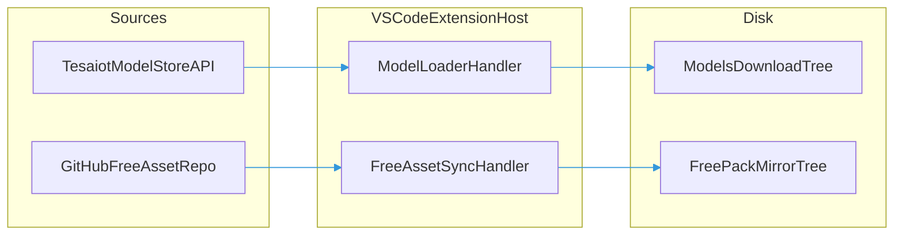

# Managing downloaded assets

This document explains **where the T3D extension stores files** when you use the **Model Loader** (Tesaiot API / PDM-style downloads) or the **Free GitHub assets** flow (sync from `ternion-3d-assets-free`). It also covers **how to back up, move, or clean up** those files.

**Scope:** **3D models** (e.g. GLB), **textures**, and related **content** downloaded or synced by those features. It does **not** cover **bundled dependencies** under `src/assets` or `out/webview/assets` (physics engines, WASM, etc.)—those ship with the extension and are not user download directories.

For how the **browser + WebSocket bridge** reaches Node for downloads, see [BRIDGE.md](./BRIDGE.md). For how **disk layout, logical web paths, and URLs** fit together, see [ASSETS_LOCATION_SYSTEM.md](./ASSETS_LOCATION_SYSTEM.md). For a **compact directory checklist** (all roots in one place), see [Global asset directories](./GLOBAL_ASSET_DIRECTORIES.md).

## Table of contents

- [Two download pipelines](#two-download-pipelines)
- [VS Code extension: default paths](#vs-code-extension-default-paths)
- [UI: path and Open folder](#ui-path-and-open-folder)
- [Finding folders on your machine](#finding-folders-on-your-machine)
- [Overrides and custom folders](#overrides-and-custom-folders)
- [Browser and bridge (development)](#browser-and-bridge-development)
- [First run and empty state](#first-run-and-empty-state)
- [Managing disk space and backups](#managing-disk-space-and-backups)
- [After uninstall or reinstall](#after-uninstall-or-reinstall)
- [GitHub API and rate limits](#github-api-and-rate-limits)
- [Release builds and publish](#release-builds-and-publish)

## Two download pipelines

| Pipeline | UI entry (typical) | What gets written |
| -------- | ------------------ | ----------------- |
| **Model Loader** | Model Loader dashboard | Per-product folder under the default downloads root (see below), unless you pick another folder |
| **Free GitHub pack** | **Free GitHub assets** dashboard (Quick Action), or Assets Manager (“entire pack” shortcut) | Mirror of repo paths under `assets/` into **`assets/free/`** (see below) |

Both can run in **VS Code** (extension host) or, for development, via the **bridge** when the UI runs in a **browser**.

## VS Code extension: default paths

Default writes use **`ExtensionContext.globalStorageUri`** (per user, per extension)—**not** `<extensionPath>/src/assets`. Layout:

| Content | Default directory (filesystem) |
| ------- | ------------------------------ |
| **API / PDM models** | `<globalStorageUri>/assets/tesaiot/models/<productId>/` |
| **Tesaiot pack textures** (optional) | `<globalStorageUri>/assets/tesaiot/textures/` (parallel to `free/textures/`) |
| **Free GitHub mirror** | `<globalStorageUri>/assets/free/` (`free/models/`, `free/textures/`, … — same shape as the public repo under `assets/`) |

The webview **`localResourceRoots`** include `<globalStorageUri>/assets` so **loaded models** can use `asWebviewUri` for files under that tree.

**Local development:** The extension lists GLB/GLTF under **`src/assets/tesaiot/models/`**, monorepo **`ternion-t3d/assets/tesaiot/models/`** when present, and **`src/assets/models/**`** for mirrored catalog assets. Optional **`src/assets/tesaiot/textures/`** follows the same **pack** layout as **`src/assets/free/textures/`**.

**Windows vs macOS:** Paths look like normal OS paths (backslashes on Windows, forward slashes on macOS in some UIs). Use the in-app **Download location** line or **Open folder** for the exact string on your machine.

## UI: path and Open folder

- **Free GitHub assets** shows the **resolved directory** where the free pack is written (same root the next sync will use).
- **VS Code webview**
  - On open, the webview posts `asset-get-default-download-paths`; the host replies with `asset-default-download-paths-response` and paths derived from `extensionAssetPaths` (for example `freeGithubRootFs`, `modelDownloadsRootFs`, `tesaiotTexturesRootFs`).
  - **Open folder** reveals that directory in the OS file manager when the path is under **globalStorage** or the extension tree (see `isRevealPathAllowed` in `extensionAssetPaths.ts`).
- **Browser + bridge** (`npm run dev:with-model-loader`, etc.)
  - The UI connects to the model-downloader WebSocket bridge, then requests the default folder via **`free-assets-sync/default-path`** / **`default-path-response`** (see `FREE_ASSETS_SYNC_TOPICS` in `protocol.ts`). The bridge returns the same absolute path as `resolveDefaultBridgeFreeAssetsOutputDir()` in `syncTernionFreeAssets.ts`.
  - **Refresh list** also receives **`defaultOutputRootDir`** on **`free-assets-sync/list-response`**; the dashboard updates the displayed path if needed.
  - Use **Copy path**—browsers cannot open arbitrary local folders from the page.
- Treat the **Download location** line in the UI as authoritative once it has updated (after host reply or bridge connect).

## Finding folders on your machine

1. Prefer the path shown in the **webview** or **toast** after a download or sync.
2. **VS Code global storage** lives under the editor’s user data (path varies). Search for `globalStorage` and your extension id, then open the `assets` subfolder if present.
3. **Developer:** **Developer: Open Extension Folder** shows the VSIX install tree; user downloads are **not** required to live there anymore.

## Overrides and custom folders

**Model Loader** supports a **user-chosen output directory** (folder picker or configured path). When set, files go there instead of the default under `globalStorage` (`getModelDownloadsRootUri`).

**Free GitHub pack (VS Code):** sync always writes under **`getFreeGithubMirrorRootUri`** — that is `<globalStorageUri>/assets/free/`. Older installs may still have **`assets/free-github/`**; you can move that folder’s contents into `free/` or leave them (new syncs use `free/`). There is **no** separate folder picker for this pipeline in the extension host today.

**Free GitHub pack (bridge):** the default directory is **`resolveDefaultBridgeFreeAssetsOutputDir()`** (depends on `process.cwd()` and whether `package.json` has `"name": "ternion-digital-twin"`). The WebSocket **`free-assets-sync/request`** payload may include **`outputDir`** to override the destination for that sync.

## Browser and bridge (development)

For `npm run dev:with-model-loader`, the **model-downloader WebSocket bridge** handles free-pack **list**, **default path**, and **sync** over MQTT-style topics (see `FREE_ASSETS_SYNC_TOPICS` in `model-downloader/protocol.ts` and `ModelDownloaderWebSocketBridge.ts`):

| Topic (concept) | Role |
| ---------------- | ---- |
| `free-assets-sync/list` / `list-response` | GitHub tree under `assets/`; response may include **`defaultOutputRootDir`** |
| `free-assets-sync/default-path` / `default-path-response` | Fast query for the bridge default folder (no GitHub call) |
| `free-assets-sync/request` / `progress` / `response` | Run sync; result includes **`outputRootDir`** |

The **Free GitHub assets** webview (`useFreeAssetsLoaderRuntime` + `useFreeAssetsSyncOverWs`) connects when the modal is active in browser mode, fetches the default path, and shows the **absolute** path returned by the bridge.

This is **development-only**; packaged behavior remains VS Code + `globalStorage` as in [VS Code extension: default paths](#vs-code-extension-default-paths).

See [BRIDGE.md](./BRIDGE.md) for broker wiring and security notes.

## First run and empty state

- **User content** (downloaded models / synced GitHub files): folders start **empty** until you download or sync.
- **Bundled** engine assets still exist from first launch; they are not the same as these directories.
- **VS Code (first install):** opening a preview that depends on large GLB files can show a **Preview model not found** prompt. Use **Open Free Loader** and sync the free pack first. By default, files are written under `<globalStorageUri>/assets/free/`.
- **Browser dev:** start the **bridge** (e.g. `dev:with-model-loader`); the location line fills after the WebSocket connects and **`default-path`** succeeds. If the bridge is down, list/sync will fail and the path may stay empty—fix the connection first.
- Use **Free GitHub assets** → **Fetch list** / **Refresh list** to load the remote index; then download all or selected rows.
- After free-pack sync completes, restart / reload the app if needed. The webview should then load `models/psoc-e84-ai/psoc-e84-ai.glb` from the free mirror without requiring `src/assets/models/**` in the VSIX.
- **Sensor Studio workspace:** the rotation preview uses the **same URL resolution** as the Bitstream workspace (`resolveDefaultPreviewMeshGlbUrl` / `resolveWebviewModelAssetUrl`). If the default PCB model fails to load in a **VSIX** install, sync the free pack (or configure online assets) the same way as for Digital Twin previews — the model is not bundled inside the extension package.

## Browser mode behavior (Open Digital Twin in Browser)

The browser mode URL (for example `http://127.0.0.1:<port>/?assetSourceStrategy=local-first`) uses the local HTTP server mappings:

- `__ternion_user_free/` → `<globalStorageUri>/assets/free`
- `__ternion_user_models/` → `<globalStorageUri>/assets/tesaiot/models`
- `__ternion_user_tesaiot_textures/` → `<globalStorageUri>/assets/tesaiot/textures`

The same **`/__ternion_user_*`** pathnames are served on the **Vite dev origin** (for example `http://localhost:5173`) by **`serveExtensionLocalAssetsPlugin`** so **Model Catalog** and HTML preflight can load pack files that exist only under **`globalStorage`**, not in **`src/assets`**. See [Assets location system](./ASSETS_LOCATION_SYSTEM.md) (*Vite dev server*).

Important:

- Free-pack preview GLBs (for example `models/psoc-e84-ai/psoc-e84-ai.glb`) are expected under the **free mirror** path.
- If browser mode loads correctly after free sync and a refresh/restart, that is the expected behavior.
- A stale browser tab can keep old asset base URLs; reopen from VS Code command palette after reinstall/update.

A **full welcome page on every launch** is optional; empty states inside each feature are the primary guidance.

## Managing disk space and backups

- **Re-downloads** usually **overwrite** or refresh files in the same product or sync root.
- **Backups:** copy the **product folder** or the whole **`assets`** tree under global storage, or zip it.
- **Large PDM folders** may include **source zips**; archive or remove if you only need `.glb` and metadata.

## After uninstall or reinstall

- **`globalStorage`** for the extension is usually **removed on uninstall** (depends on VS Code / fork behavior).
- **Custom** output folders are untouched until you delete them.
- **Git clone** `src/assets` remains in your repo if you downloaded there via the bridge; use `.gitignore` as needed.

## GitHub API and rate limits

The free pack uses the **GitHub API** (tree + raw). For heavy use, set **`GITHUB_TOKEN`** in the environment of the extension host or bridge process.

## Release builds and publish

Ship with **`IS_DEV_MODE: false`** in [`GlobalConfig.ts`](../src/GlobalConfig.ts) so the webview does not assume a developer machine; published users store files under **globalStorage**, not under a git clone path such as `t3d-extension/src/assets` (that path is for the **browser + bridge** workflow only).

---

**Maintainers:** When changing storage or free-pack wiring, keep this file aligned with:

- `extensionAssetPaths.ts` — globalStorage roots, reveal allowlist
- `model-downloader-handle.ts` — Model Loader default paths and scans
- `panels/TernionDigitalTwin.ts` — webview messages (`asset-get-default-download-paths`, `asset-sync-free-pack-start`, …)
- `asset-sync/syncTernionFreeAssets.ts` — GitHub sync and `resolveDefaultBridgeFreeAssetsOutputDir`
- `model-downloader/ModelDownloaderWebSocketBridge.ts` and `model-downloader/protocol.ts` — bridge topics and payloads
- `webview/free-assets-loader/useFreeAssetsLoaderRuntime.ts` and `webview/asset-sync/useFreeAssetsSyncOverWs.ts` — browser UI and WS client
- `GlobalConfig.ts` — `IS_DEV_MODE` for publish vs dev-only UI; does not switch extension-host vs bridge (that is webview vs browser runtime)
