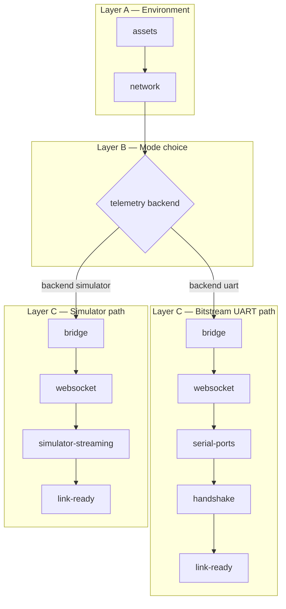
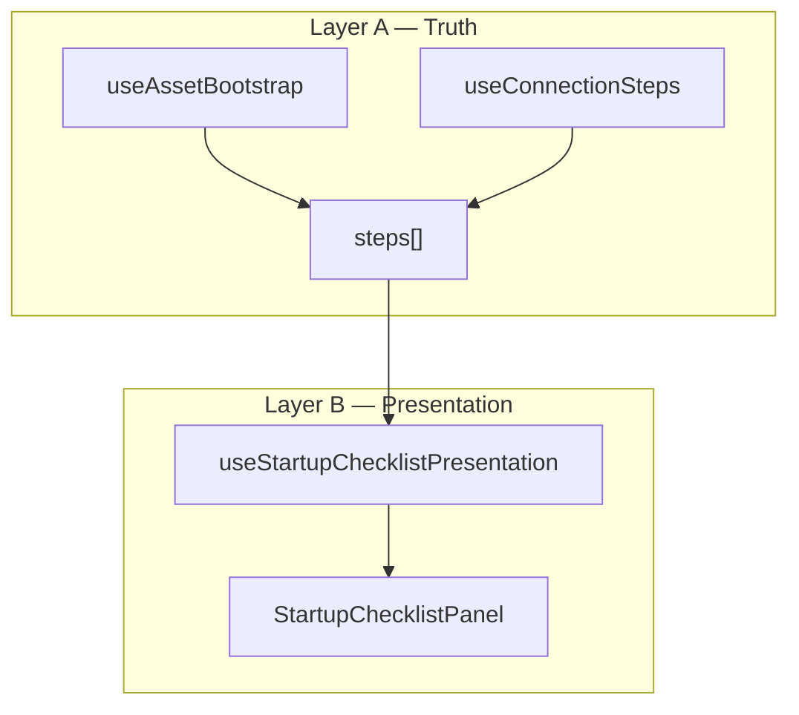

# Startup checklist — design and development plan

**Status:** design + phased implementation plan (not fully shipped).  
**Date:** 2026-06-02  
**Audience:** product, operators, and contributors implementing Bitstream Studio first-run / link setup.

## Purpose

Give operators a **single guided startup sequence** that answers:

- Are **required 3D assets** present (or reachable under the configured strategy)?
- Is **network access** available when downloads are needed?
- Which **serial ports** exist, which is **selected**, and which is **open**?
- Is **BS2 firmware handshake** complete on UART, or should the user switch to **Simulator-only**?

Today these concerns are split across **`AssetBootstrapGate`**, the **Connection** panel, **boot lifecycle** pills, and floating **UART / Simulator** notices. This document defines how to **unify** them without duplicating backend logic.

## Related documentation

| Topic | Document |
| ----- | -------- |
| Asset disk layout / first install | [Managing downloaded assets](./MANAGING_DOWNLOADED_ASSETS.md) |
| Bitstream vs Simulator exclusivity | [Telemetry mode lifecycle](./TELEMETRY_MODE_LIFECYCLE.md) |
| Connection step ladder (existing) | `src/webview/bitstream-app/connection/` — `useConnectionSteps.ts`, `ConnectionPanel.tsx` |
| Asset bootstrap (shipped slice) | `src/asset-bootstrap/`, `src/webview/asset-bootstrap/` |
| VSIX smoke | [`../HOW_TO_RUN.md`](../HOW_TO_RUN.md) |
| Dual-runtime parity | `.cursor/rules/bitstream-dual-runtime.mdc` |

## Problem statement

| Symptom | Root cause |
| ------- | ---------- |
| `Webview.loadLocalResource` 404 on GLB / cubemap | Large assets omitted from VSIX; resolver points at empty `globalStorage/.../assets/free/` |
| User does not know setup progress | No single checklist; Connection panel is opt-in |
| Handshake fails silently until 3D loads | Reactive overlays after workspace mount |
| Offline vs online unclear | Network probe only surfaced inside asset gate copy |

## Design goals

1. **One mental model** — Environment setup → choose telemetry mode → link setup → workspace ready.
2. **Visible progress** — Per-step status (`pending` / `running` / `ok` / `warn` / `fail`) and overall “Step N of M”.
3. **Actionable failures** — Each failed step offers **primary** recovery (download, pick COM, switch to Simulator).
4. **Reuse existing orchestration** — Same handlers as **Connect all** / **Connection Continue** / `telemetryModeLifecycle`.
5. **Do not annoy experts** — Full wizard on first/incomplete setup; compact lifecycle strip on return visits.

## Non-goals (v1)

- Replacing **Expert** Connection panel fields (broker URL, port admin) — link into existing panel.
- Bundling large GLBs inside the VSIX.
- Auto-connecting COM without user consent or whitelist rules.
- Merging UART and Simulator telemetry streams.

---

## Architecture: two layers



### Layer A — Environment (mode-independent)

Runs in every workspace (Bitstream, Sensor Studio, Sensor Telemetry) when the host is a VS Code webview.

| Step ID | Title | Pass condition | Blocking? |
| ------- | ----- | -------------- | --------- |
| `assets` | Asset library | Required pack paths on disk **or** `online-only` + preflight OK | **Yes** (VSIX) if 3D defaults missing |
| `network` | Network | GitHub raw HEAD probe OK | **No** if `assets` passed on disk |

**Required pack paths** (canonical list): `src/asset-bootstrap/bootstrapRequiredAssets.ts`

- `models/psoc-e84-ai/psoc-e84-ai.glb`
- `textures/cubemap/bridge/{posx,negx,posy,negy,posz,negz}.jpg`

**Shipped today (partial):** `AssetBootstrapGate` implements `assets` + embedded network probe; not yet a multi-step checklist UI.

### Layer B — Telemetry mode choice

User selects **Bitstream (UART)** or **Simulator** before UART-specific steps run.

| Requirement | Detail |
| ----------- | ------ |
| UI control | Reuse toolbar **`BitstreamTelemetrySourceField`** / store `useBitstreamTelemetrySourceStore` |
| Persistence | Remember last backend in existing store / `localStorage` |
| Lifecycle | On change, call **`telemetryModeLifecycle.ts`** (clear data, route, COM vs sim) |

**Rule:** Do not open COM or run handshake until backend is **`uart`**.

### Layer C — Link setup (mode-specific)

#### Bitstream (UART) branch

| Step ID | Maps to existing `ConnectionStepId` | Summary |
| ------- | ----------------------------------- | ------- |
| `bridge` | `bridge` | Broker reachable / extension-managed bridge |
| `websocket` | `websocket` | WS client connected |
| `serial-ports` | `transport` (enhanced UI) | List ports; show **selected** vs **open** COM @ 921600 |
| `handshake` | `handshake` | HELLO / PING passed |
| `link-ready` | `link` | `isLinkHandshakeSatisfied` |

#### Simulator branch

| Step ID | Maps to existing | Summary |
| ------- | ---------------- | ------- |
| `bridge` | `bridge` | Same |
| `websocket` | `websocket` | Same |
| `simulator` | `transport` | External **bitstream-simulator** streaming; COM closed |
| `link-ready` | `link` | Sim samples ingested per route |

**Implementation source of truth:** extend **`useConnectionSteps`** — do not fork a parallel status machine.

---

## Strict vs advisory blocking

| Step | Block main shell? | Notes |
| ---- | ------------------- | ----- |
| `assets` | Yes (VSIX webview) | Prevents R3F 404 / WebGL context loss |
| `network` | No if assets local | Show **offline** clearly; enable download when online returns |
| `bridge` / `websocket` | Soft | Workspace may allow offline graph edit in Sensor Studio |
| `handshake` (UART) | Soft / workspace-specific | Offer **Continue in Simulator only** |
| `link-ready` | Informational | Unlocks live telemetry-dependent decks |

Sensor Studio may treat **`handshake`** as advisory (edit flow graph) while Bitstream sensor deck stays gated via **`useSensorSettingsPanelReady`**.

---

## Dual-host runtime (VS Code + browser)

The same checklist and TERNION pack commands run in **both** hosts when the bridge is available. See **[`DUAL_HOST_RUNTIME.md`](./DUAL_HOST_RUNTIME.md)** and **[`DEV_MODE_QUICKSTART.md`](./DEV_MODE_QUICKSTART.md)** (how to run `npm start` / F5).

| Behavior | VS Code webview | Browser (`localhost:5173` or **Open in browser**) |
| -------- | --------------- | --------------------------------------------------- |
| Shell blocked until assets | Yes | No — workspace stays visible |
| Setup overlay when pack incomplete | Yes | Yes (`assetsNeedSetup`) |
| Check / Download / Open checklist (Ctrl+/) | Yes | Yes (bridge required) |
| Link steps (Connection service, …) | `useConnectionSteps(panelActive)` — extension host status + WS probe | Same WS probe to `:9998` when `panelActive` (no extension-only gate) |
| Manual open (Ctrl+/) | Stays open until **Later** | Same |
| Auto-close when all steps green | First-run overlay only — **after** sequential walkthrough completes (`walkthroughComplete`), not when truth is 8/8 early | Same rule |
| **Open in browser** | Command palette + Ctrl+/ | N/A (already in browser) |

**Branding:** User-facing copy uses **TERNION free asset pack** (not GitHub).

---

## UI specification

Three surfaces work together: **full checklist** (blocking setup), **compact strip** (after setup), and **Ctrl+/** quick commands (on-demand). Visual language matches the **Connection** panel and existing **`TRNAlertOverlay`** asset gate (amber warning, zinc cards, emerald OK badges).

### Visual language (shared tokens)

| Token | Use |
| ----- | --- |
| Page backdrop | Dimmed shell (`TRNAlertOverlay` scrim) or centered card on `zinc-950` |
| Cards | `rounded-md border border-zinc-700/70 bg-zinc-950/40` (same as `ConnectionStepCard`) |
| Status badges | **OK** emerald, **Active** sky, **Pending** zinc, **Fail** rose, **Warn** amber |
| Primary CTA | Amber accent (download / continue) — same as today’s `AssetBootstrapGate` |
| Secondary CTA | `border-white/15 bg-white/10` ghost buttons |
| Mono paths | `font-mono text-[10px] text-zinc-400` for missing file list |
| Progress | Global bar in panel header; **per-card** micro-progress when `running` |
| Motion | Subtle GSAP enter/exit (see **`TRNTransientStatusBadge`**); respect `prefers-reduced-motion` |

---

## Progressive presentation (sequential reveal)

**Status:** Implemented (2026-06-02)

### Problem

When backend checks finish in under a second, all checklist rows flip to green at once. Operators do not see **which** step ran or in what order.

### Two layers



| Layer | Rule |
| ----- | ---- |
| **Truth** | Never delay I/O (download, bridge, WS, COM). Footer **Continue** uses real status. |
| **Presentation** | Controls reveal order, header label, staged progress bar, card motion. |

### Modes

| Mode | When |
| ---- | ---- |
| **sequential** | Auto overlay; not opened via Ctrl+/ chip; motion allowed |
| **instant** | User opened panel (`panelOpen`); `prefers-reduced-motion: reduce`; orchestration cap (**12 s**) exceeded |

### Timing (defaults)

| Constant | ms | Role |
| -------- | -- | ---- |
| `STARTUP_STEP_MIN_VISIBLE_MS` | 250 | Minimum focus time per card (UI floor) |
| `STARTUP_STEP_PADDING_AFTER_MS` | 250 | Pause after check settles, before next card |
| `STARTUP_STEP_POLL_MS` | 50 | Poll while waiting for real check status |
| `STARTUP_STEP_MAX_OPERATION_MS` | 30000 | Safety cap if step stays `active`/`pending` |

Per-step duration is **`max(250 ms, actual check time) + 250 ms`** padding. The tour waits while status is `active` or `pending`; `ok` / `warn` / `fail` / `locked` count as done waiting.

### Auto-close guard

Two guards prevent the overlay disappearing on step 1:

1. **`shouldAutoShowOverlay`** — on first run (`!markedComplete && !sessionDismissed`), keep the overlay **mounted** even when `linkReady` is already true. Previously `linkReady === true` fell through to `return false` and unmounted the dialog before the walkthrough ran.
2. **`markComplete()`** — only after `walkthroughComplete` in sequential mode, not when truth is 8/8 early.

Orchestrator timers depend on `focusTruthStatus`, not the whole `steps` array reference (avoids cancelling timeouts on every WS probe tick).

**Operation-paced steps:** the walkthrough stays on a card until the real check leaves `active`/`pending` (or the safety cap), and never less than `STARTUP_STEP_MIN_VISIBLE_MS`. Truth drives the result line on each card.

Constants: `startupChecklistPresentation.constants.ts`.

### UI behavior

| Element | Sequential |
| ------- | ---------- |
| Header | `Step 4 of 8 — Connection service` (focus title) |
| Progress bar | Staged width from revealed index, not instant truth count |
| Rows | **hidden** (dim, “Waiting…”) → **current** (sky ring, pulse) → **completed** (truth) |
| Scroll | Active card `scrollIntoView` (smooth unless reduced motion) |
| Auto-expand | Focus step expands during sequential walk |

### Code map

| File | Role |
| ---- | ---- |
| `useStartupChecklistPresentation.ts` | Orchestrator |
| `StartupChecklistGate.tsx` | `resolveStartupPresentationMode` + auto-expand |
| `StartupChecklistPanel.tsx` | Header + `presentedSteps` |
| `StartupStepCard.tsx` | `presentation` / `isFocus` styling |

---

### Modern step card UI (product requirements)

**Requirement:** Every setup step is a **card**. Each card contains **animated status icons**, **progress**, and a **result** line. Style: **modern, professional** (operator tooling — calm, precise, not playful).

**Do not** extend plain `ConnectionStepCard` as-is; add **`StartupStepCard`** (can share status enum with `ConnectionStepStatus`).

#### Card anatomy (one row = one step)

```text
┌──────────────────────────────────────────────────────────────────┐
│ ┌────┐  Asset library                              Step 1 of 8   │
│ │ ◉  │  Required GLB + cubemap for 3D previews                  │
│ │icon│  ████████████░░░░░░  72%          (only while running)    │
│ └────┘  Result: 5/7 files on disk · GitHub reachable             │
│         [ Download ]  [ Details ▾ ]                             │
└──────────────────────────────────────────────────────────────────┘
```

| Zone | Role | Content |
| ---- | ---- | ------- |
| **Icon rail** (48×48) | Animated state | Lucide icon inside soft circular plate; plate color = status |
| **Header row** | Title + optional step index | `text-sm font-medium text-zinc-100` |
| **Subtitle** | What is being verified | One line, `text-xs text-zinc-400` |
| **Progress** | In-card activity | Indeterminate shimmer or determinate bar **only** when `running` |
| **Result** | Outcome copy | Success / fail / waiting one-liner; optional `font-mono` detail |
| **Actions** | Recovery | TRN buttons in card footer when expanded or `fail` |

**Card chrome (professional):**

- `rounded-lg border border-white/[0.08] bg-zinc-900/60 backdrop-blur-sm`
- Active card: `ring-1 ring-sky-500/35 border-sky-500/25`
- OK card: left accent `border-l-2 border-l-emerald-500/70` (no heavy green fill)
- Fail card: `border-l-2 border-l-rose-500/70` + result text `text-rose-100/90`

#### Animated icons per status

Reuse patterns from **`TRNTransientStatusBadge`** (`Loader2` spin) and optional light GSAP on state change.

| Status | Icon (lucide) | Animation | Plate color |
| ------ | ------------- | --------- | ----------- |
| `locked` | `Lock` | None (dim) | `zinc-800/80` |
| `pending` | Step-specific (e.g. `Package`, `Wifi`) | None | `zinc-800/80` |
| `running` | `Loader2` | `animate-spin` 1s linear | `sky-500/15` ring pulse (CSS) |
| `ok` | `CircleCheck` | Scale-in 0.2s (`power2.out`) once | `emerald-500/15` |
| `fail` | `CircleX` or `AlertCircle` | Brief shake 0.3s once | `rose-500/15` |
| `warn` | `AlertTriangle` | None | `amber-500/15` |

**Step-specific icons** (professional recognition, not emoji):

| Step | Idle icon |
| ---- | --------- |
| `assets` | `Box` / `Package` |
| `network` | `Globe` |
| `mode` | `Radio` or `GitBranch` |
| `bridge` | `Server` |
| `websocket` | `Cable` |
| `serial-ports` | `Usb` |
| `handshake` | `Handshake` |
| `simulator` | `Cpu` |
| `link-ready` | `Link2` |

#### Progress inside the card

| When | UI |
| ---- | -- |
| `running` + known % (sync) | Determinate bar `h-1 rounded-full bg-zinc-800` + fill `bg-sky-400/80`, label `72%` |
| `running` + unknown (probe, handshake) | Indeterminate bar + label **Checking…** |
| `ok` / `fail` / `locked` | Hide bar; show **result** only |

Global header still shows **Step N of M** and overall bar (`doneCount / totalSteps`).

#### Result line (always visible when not `locked`)

| Status | Result pattern | Example |
| ------ | -------------- | ------- |
| `ok` | Short success | `Result: COM5 open @ 921600` |
| `fail` | Actionable failure | `Result: Handshake failed — no HELLO` |
| `running` | Live status | `Result: Downloading posx.jpg…` |
| `pending` | Waiting on prior step | `Result: Waiting for bridge` |
| `locked` | Muted | `Result: —` or hidden |

Optional **detail** row (collapsed): mono paths, probe URL, error stack (Connection panel parity). Expand via **Details** or chevron — use **`TRNHintTooltip`** on icon rail, not native `title`.

#### Motion and accessibility

- Card list: stagger enter `0.04s` per card on first open (GSAP `fromTo` y: 6 → 0, `autoAlpha`)
- State flip `pending` → `running` → `ok`: icon cross-fade 150ms
- **`prefers-reduced-motion`:** static icons, no spin (use pulsing opacity on plate instead)
- **`aria-live="polite"`** on result line; icon rail `aria-label="Asset library: complete"`

#### Panel shell (modern professional)

```text
┌─────────────────────────────────────────────────────────────────┐
│  Setup                                               [Later ▾]  │
│  Prepare assets, link, and telemetry               3 / 8 ready  │
│  ════════════════════════════════░░░░░░░░░░░░░░░░░░  (global)    │
├─────────────────────────────────────────────────────────────────┤
│  [ StartupStepCard × N — vertical stack gap-2 ]                   │
├─────────────────────────────────────────────────────────────────┤
│  Primary: Continue — Open WebSocket          Secondary: Details   │
└─────────────────────────────────────────────────────────────────┘
```

- Max width **36rem**; padding **20–24px**; title **Setup** (not shouty “REQUIRED”)
- Scrim: `bg-black/70 backdrop-blur-md` (match shell chrome)
- Typography: Inter/system stack already in app; no new fonts

**Reference mood:** VS Code / GitHub Actions checks / Vercel deployment logs — dark, restrained color, motion only where state changes.

#### Component split (implementation)

| Component | Responsibility |
| --------- | -------------- |
| `StartupChecklistPanel.tsx` | Layout, global progress, footer CTA |
| `StartupStepCard.tsx` | Icon rail, progress, result, expand/actions |
| `StartupStepIcon.tsx` | Status → icon + animation |
| `startup-step-meta.ts` | Title, subtitle, icon per `StartupStepId` |

Evolve from **`ConnectionStepCard`** logic (expand/collapse, badges) but **do not** share one component — Connection stays denser/expert; Setup cards are taller and more legible.

---

### Full checklist (first run / incomplete setup)

**Component (planned):** `StartupChecklistPanel` / `StartupChecklistGate`  
**Location:** Wrap `BitstreamShellRoot` in `BitstreamShellMain` (replaces or absorbs standalone `AssetBootstrapGate`).

Uses **Modern step card UI** above (not the legacy chevron-only list).

| Element | TRN / pattern |
| ------- | ------------- |
| Shell | Centered panel inside `TRNAlertOverlay` scrim |
| Step list | Vertical **`StartupStepCard`** stack (`gap-2`) |
| Status | Shared `ConnectionStepStatus` → card visual state |
| Progress | Global header bar + per-card bar when `running` |
| Active step | `ring-sky` + expanded actions |
| Completed steps | Collapsed height (~56px): icon + title + result only |
| Footer primary | Mirrors Connection **Continue: …** / **Connect all** for the active step |

**Per-step actions (examples):**

| Step | Primary | Secondary |
| ---- | ------- | --------- |
| `assets` | Download required assets (subset sync) | Free Loader, Asset Manager, Retry |
| `network` | (informational) | Retry probe |
| `mode` | Bitstream / Simulator toggle | — |
| `serial-ports` | Refresh list, pick port, Open COM | Port allow / Next Link (existing strip) |
| `handshake` | Retry handshake | Change port, **Switch to Simulator only** |
| `simulator` | Start simulator (host command) | Open sim docs |

### Compact strip (return visits)

Keep existing:

- **`BitstreamBootLifecycleBar`** / **`LinkLifecycleStrip`** (Bitstream workspace)
- **`ShellLinkStatusFooter`** (Sensor Studio until link ready)
- **`ShellControlDeck`** telemetry source + Connect

**Entry to full checklist:** ☰ System → Connection…, boot bar **Connection…**, chip **Setup incomplete**, or Ctrl+/** **Open setup checklist** (planned).

### Interim UI today (`AssetBootstrapGate`)

Until the unified checklist ships, VSIX users see a **single-step** amber overlay (not the multi-step panel above):

```text
┌─────────────────────────────────────────────────────────────┐
│  ⚠ Asset library required                                   │
│                                                             │
│  Required assets are not in extension storage yet.          │
│  Download the free pack…                                      │
│                                                             │
│  • models/psoc-e84-ai/psoc-e84-ai.glb                       │
│  • textures/cubemap/bridge/posx.jpg                           │
│  • …                                                        │
│                                                             │
│  Network: reachable | offline or blocked                      │
│                                                             │
│  [ Download required assets ]  [ Free Loader ]              │
│  [ Asset Manager ]  [ Retry check ]                         │
└─────────────────────────────────────────────────────────────┘
```

Shell content behind the scrim is **not rendered** until `phase === "ready"`.

### Ctrl+/** quick commands (planned)

Palette UI is unchanged: glass **`QuickActionDialog`**, search box, categories, recent commands — same as **Connect telemetry session** and **Open Free Assets Loader**.

**Register in:** `useBitstreamShellQuickCommands.ts` (workspace shell only). Actions call **`assetBootstrapActions.store`** (planned) or `useStartupChecklist()` so the palette works even when the full checklist is closed.

| Command ID | Label | Category | Icon (lucide) | Action |
| ---------- | ----- | -------- | ------------- | ------ |
| `bitstream-check-required-assets` | Check required assets | Assets | `ClipboardCheck` or `PackageCheck` | Run host `asset-bootstrap-check` + readiness; open checklist if blocked |
| `bitstream-download-required-assets` | Download required assets | Assets | `CloudDownload` | Subset `onlyRepoPaths` sync; disabled when offline |
| `bitstream-open-setup-checklist` | Open setup checklist | Workspace | `ListChecks` | Set `startupChecklist.store` → show full panel (P0+); P1 interim: re-run check + show asset overlay if fail |

**Keywords (search):** `setup`, `bootstrap`, `assets`, `glb`, `cubemap`, `first run`, `vsix`, `network`, `checklist`.

**Behavior notes:**

| Case | Palette behavior |
| ---- | ---------------- |
| Shell not mounted (landing / sim hub) | Commands **disabled** with hint “Enter a workspace first” |
| Check passes | **Check** runs silently; toast “Required assets OK” (optional) |
| Check fails | Open checklist overlay (or asset gate until P0 ships) |
| Download while checklist closed | Same sync as overlay button; show progress in store → optional footer chip “Downloading assets…” |

**Ship order:**

| Phase | Quick commands |
| ----- | -------------- |
| **P0.5 (early)** | **Check required assets** + **Download required assets** (wire to existing `useAssetBootstrap`) |
| **P1** | **Open setup checklist** when unified panel exists |
| **P2** | **Setup incomplete** chip in toolbar links to same command |

### Serial ports row (enhanced transport step)

Display three levels of truth:

```text
Serial ports (N found)
  ● COM5  — open @ 921600     ← serialBridgeStatus.path
  ○ COM3  — selected (allow)  ← user pick / whitelist
  ○ COM7  — available
```

**Data:** `useSerialPortStore.listPorts()`, `serialBridgeStatus`, port allow list from Connection panel.

### Handshake failure branch

When `handshake` is `fail`:

1. Show **`userFacingHandshakeFailureCopy`** (existing).
2. Buttons:
   - **Retry handshake** — re-run bring-up on current COM.
   - **Choose port** — focus `serial-ports` step.
   - **Continue in Simulator only** — `setBackend('simulator')` + `telemetryModeLifecycle` (not overlay dismiss only).
3. Optional **Dismiss** — enter workspace with existing **`UartFirmwareNotConnectedNotice`** (expert).

---

## State and persistence

### Runtime store (planned)

`startupChecklist.store.ts` (or extend `connectionPanel.store.ts`):

| Field | Purpose |
| ----- | ------- |
| `phase` | `environment` \| `mode` \| `link` \| `ready` \| `dismissed` |
| `lastCompletedVersion` | Integer; bump when required steps change |
| `dismissedAtMs` | Expert override timestamp |

### Persistence

| Key | Storage | Content |
| --- | ------- | ------- |
| `ternion.startupChecklist.completedVersion` | `localStorage` | Skip full wizard when ≥ current version and link healthy |
| Telemetry backend | existing store | `uart` \| `simulator` |

Do **not** persist “handshake OK” across sessions — re-validate at runtime.

### Host messages (existing + planned)

| Message | Role |
| ------- | ---- |
| `asset-bootstrap-check` | Disk rows + internet probe (**shipped**) |
| `asset-sync-free-pack-start` + `onlyRepoPaths` | Subset download (**shipped**) |
| `asset-config` | Inject `FREE` / `LOCAL` / `ONLINE` bases |
| Serial bridge / WS | Via existing connection actions |

---

## Orchestration hook (planned)

**`useStartupChecklist()`** composes:

| Input | Source |
| ----- | ------ |
| Asset readiness | `useAssetBootstrap` / `runAssetBootstrapReadiness` |
| Link steps | `useConnectionSteps(panelActive)` |
| Backend | `useBitstreamTelemetrySourceStore` |
| Actions | `runConnectAllSession`, `runConnectionStep`, `startRequiredSync` |

**Single progress model:**

```ts
type StartupStepId =
  | "assets"
  | "network"
  | "mode"
  | "bridge"
  | "websocket"
  | "serial-ports"
  | "simulator"
  | "handshake"
  | "link-ready";
```

Map `ConnectionStepId` ↔ `StartupStepId` in one module to avoid drift.

---

## Dev vs VSIX behavior

| Environment | Assets step | Bridge step |
| ------------- | ------------- | ----------- |
| VSIX webview | Required disk check + gate | Extension may spawn bridge |
| Vite browser dev | Skip or relax gate; mirror `__ternion_user_free/` | Copy: run `npm run start:bridge` |

Document operator paths in **`HOW_TO_RUN.md`** when checklist ships.

---

## Implementation phases

### P0 — Unified checklist shell (MVP)

**Goal:** One panel; operator sees all steps and progress.

- [ ] Add `useStartupChecklist` composing asset bootstrap + `useConnectionSteps`
- [ ] `StartupStepCard` + `StartupStepIcon` (animated icon, in-card progress, result line)
- [ ] `StartupChecklistGate` replaces standalone `AssetBootstrapGate` wrapper
- [ ] Steps 1–2: `assets`, `network` (explicit network row)
- [ ] Step 3: `mode` (telemetry backend)
- [ ] Steps 4–7: link branch via existing connection step statuses
- [ ] Wire **Connect all** / **Continue** to same `runConnectAllSession` / `runConnectionStep`
- [ ] Unit tests: step ordering, mode branch skips UART steps

**Exit criteria:** Fresh VSIX install shows checklist before shell; download subset clears `assets`; no GLB 404 on first 3D mount.

### P0.5 — Asset bootstrap quick commands (before full checklist)

**Goal:** Operators can re-run checks without reloading the webview.

- [ ] `assetBootstrapActions.store.ts` — `recheck()`, `startRequiredSync()`, optional `openGate()`
- [ ] Register **`bitstream-check-required-assets`** and **`bitstream-download-required-assets`** in `useBitstreamShellQuickCommands.ts`
- [ ] Disable download command when `internetReachable === false`
- [ ] Document commands in **`HOW_TO_RUN.md`** (Ctrl+/ → Assets)

**Exit criteria:** Ctrl+/ **Check required assets** reproduces overlay / blocked state when files missing.

### P1 — Serial ports + handshake branches

- [x] Enhanced `serial-ports` UI (click to select, open selected, double-click open, Allow-list hint)
- [x] Handshake fail actions: Retry, Choose port, **Simulator only** (`setBackend` → lifecycle)
- [ ] i18n strings module (EN first; TH parity with Animation Lab pattern)
- [x] Quick command **`bitstream-open-setup-checklist`** (Ctrl+/ → Workspace)

**Exit criteria:** UART fail offers Simulator path; COM row matches open port.

### P2 — Return visit UX

- [x] Persist `completedVersion`; hide full wizard when complete (`startupChecklistPersistence`)
- [x] **Setup incomplete** chip when link drops (`StartupSetupIncompleteChip`)
- [ ] Workspace-specific strictness (Sensor Studio vs Bitstream)

### P3 — Polish

- [ ] Auto-run environment steps on open; defer link until mode chosen
- [ ] Optional remembered COM auto-open (whitelist-gated)
- [ ] `HOW_TO_RUN.md` + VSIX smoke checklist rows
- [ ] Deprecate redundant floating notices when checklist covers same case

---

## Testing matrix

| Case | Steps expected |
| ---- | -------------- |
| Fresh VSIX, online | `assets` fail → download → pass → mode → link |
| Fresh VSIX, offline | `assets` fail; no download button; manual copy + Retry |
| Assets synced, UART MCU | Skip `assets`; UART path → handshake ok |
| Simulator only | Skip `serial-ports` / `handshake`; sim streaming step |
| Handshake fail | Branch UI; Simulator only clears UART route |
| Dev + `start:bridge` | Bridge step ok; assets from mirror |

Run with **`bitstream-dual-runtime.mdc`** matrix (UART + Simulator, dev + VSIX).

---

## File map (planned / existing)

| Path | Role |
| ---- | ---- |
| `docs/STARTUP_CHECKLIST_DESIGN.md` | This document |
| `src/asset-bootstrap/bootstrapRequiredAssets.ts` | Required path manifest |
| `src/asset-bootstrap/checkBootstrapAssetsOnDisk.ts` | Host disk + probe |
| `src/webview/asset-bootstrap/AssetBootstrapGate.tsx` | **Interim** asset-only gate |
| `src/webview/asset-bootstrap/useAssetBootstrap.ts` | Asset hook |
| `src/webview/startup-checklist/` (new) | Gate UI + `useStartupChecklist` |
| `src/webview/asset-bootstrap/assetBootstrapActions.store.ts` (planned) | Quick command + gate shared actions |
| `src/webview/bitstream-shell/hooks/useBitstreamShellQuickCommands.ts` | Ctrl+/ registration |
| `src/webview/bitstream-app/connection/useConnectionSteps.ts` | Link step statuses |
| `src/webview/bitstream-app/connection/ConnectionPanel.tsx` | Expert / Guided detail |
| `src/webview/bitstream-shell/BitstreamShellMain.tsx` | Mount gate |
| `src/panels/TernionDigitalTwin.ts` | `asset-bootstrap-check` handler |

---

## Open decisions

| ID | Question | Recommendation |
| -- | -------- | -------------- |
| D1 | Full-screen overlay vs docked side panel? | Full-screen first run; side panel on retry |
| D2 | Block Sensor Studio canvas before `assets`? | Yes in VSIX (3D preview nodes) |
| D3 | Auto-start subset sync without button? | No — explicit **Download** (rate limits, consent) |
| D4 | Merge Connection panel into checklist? | Checklist = summary; Connection = detail (Expert) |

---

## Changelog

| Date | Change |
| ---- | ------ |
| 2026-06-02 | Modern step card UI: animated icons, per-card progress + result, professional spec |
| 2026-06-02 | Added Ctrl+/ quick commands (P0.5/P1), UI wireframes, visual tokens |
| 2026-06-02 | Initial design + development plan (post `AssetBootstrapGate` slice) |
