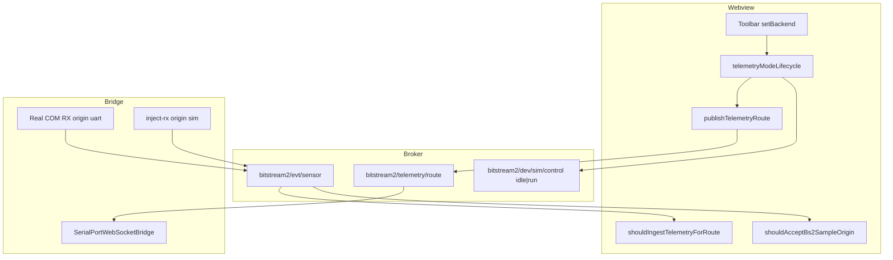

# Telemetry mode lifecycle — Bitstream vs Simulator

**Date:** 2026-05-30  
**Status:** Implemented and user-verified (VSIX + dev)  
**Audience:** contributors and AI agents continuing work on Bitstream Studio

Only **one** telemetry backend may be active at a time:

| Toolbar label | Store `backend` | Data source |
|---------------|-----------------|-------------|
| **Bitstream** | `uart` | Real MCU on COM (BS-framed UART) |
| **Simulator** | `simulator` | External **bitstream-simulator** via `inject-rx` |

Mixing both streams in the UI is **not** allowed.

---

## Architecture (A + B)



### Option A — Webview orchestration

**Module:** `src/webview/bitstream-app/bridge/telemetryModeLifecycle.ts`

On toolbar change (`bitstreamTelemetrySource.store` → `setBackend`):

1. **Teardown:** `resetLiveData()`, handshake → `unknown`, clear `bs2Hello`
2. **→ Simulator:** `await releaseOpenSerialPort()`, publish route + `dev/sim/control run`
3. **→ Bitstream:** publish route + `dev/sim/control idle`, queue UART bring-up when coming from Simulator

Route is **re-published** on WebSocket connect (`useBitstream2TelemetryBridge`).

### Option B — Bridge enforcement

**Topic:** `bitstream2/telemetry/route` — `{ mode: "uart" | "simulator", atMs }` (last writer wins)

**Bridge:** `src/serialport-bridge/SerialPortWebSocketBridge.ts`

| Route | COM RX → `evt/sensor` | `inject-rx` | `serialport/open` |
|-------|----------------------|-------------|-------------------|
| `uart` | Yes (`origin: "uart"`) | Blocked | Allowed |
| `simulator` | Blocked | Yes if COM closed (`origin: "sim"`) | Rejected |

Switching route to **simulator** while COM is open → bridge **closes COM** and resets BS2 decoder.

Host TX (`applyDevSerialWrite`): **COM wins** when open; never mirrors to external sim while COM is active.

---

## Webview ingest gates

**File:** `src/webview/bitstream-app/utils/bitstreamTelemetryTransport.ts`

- `shouldIngestTelemetryForRoute(backend, conn)` — Simulator only when COM closed; Bitstream only when COM open
- `shouldAcceptBs2SampleOrigin(sample)` — drops `evt/sensor` when `origin` disagrees with toolbar mode

Legacy payloads **without** `origin` still pass through route + COM rules.

---

## Related broker topics

| Topic | Role |
|-------|------|
| `bitstream2/telemetry/route` | Webview → bridge authoritative mode |
| `bitstream2/dev/sim/control` | Webview → external sim `idle` / `run` |
| `bitstream2/dev/inject-rx` | Sim → bridge virtual UART bytes |
| `bitstream2/evt/sensor` | Bridge → webview decoded samples (optional `origin`) |

Protocol types: `src/bitstream2/bridge/protocol.ts`

---

## Dev and test

```bash
cd extension
npm run start:bridge    # Terminal 1 — restart after bridge changes
npm run dev:webview     # Terminal 2
npm run test:bitstream2 # 50 tests; uses --test-force-exit (simulator timers)
npm run package         # VSIX ~40 MB post-Jolt
```

**Verify mode switch:**

1. Bitstream + COM open + sim streaming → **hardware samples only**
2. Simulator → COM released, **sine sim only**
3. Toggle toolbar → deck clears, single source resumes

---

## Known limits

- **External sim** is a separate VSIX; user can still press **Streaming** in that extension. Bridge/webview **ignore** sim traffic in Bitstream mode.
- **Multi-tab:** each webview publishes route (last writer wins). Prefer one active telemetry panel when debugging.
- **Sensor cfg Apply (v0.1):** webview draft only; wire `SENSOR_CFG_SET` restore is backlog.

---

## Files changed (2026-05-30)

| File | Role |
|------|------|
| `bridge/telemetryModeLifecycle.ts` | A — switch orchestration |
| `bridge/publishTelemetryRoute.ts` | B — route publish + retry |
| `bridge/publishDevSimStreamingControl.ts` | sim idle/run + retry |
| `state/bitstreamTelemetrySource.store.ts` | `setBackend` → lifecycle |
| `hooks/useBitstream2TelemetryBridge.ts` | route on connect; origin filter |
| `utils/bitstreamTelemetryTransport.ts` | ingest + origin gates |
| `serialport-bridge/SerialPortWebSocketBridge.ts` | B — route subscribe + gating |
| `bitstream2/dev/dev-write.ts` | COM precedence for host TX |
| `bitstream2/bridge/protocol.ts` | `TELEMETRY_ROUTE`, `origin` on samples |
| `tests/bitstream2/bitstream-telemetry-ingest.test.ts` | unit tests |
