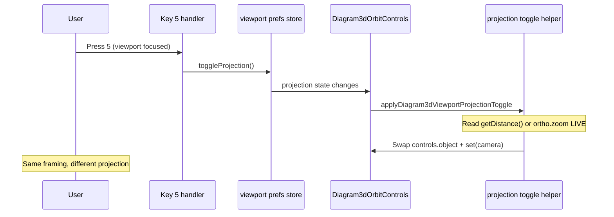

# Viewport projection toggle (perspective ↔ orthographic)

Agent reference for **Blender-style Numpad 5** (or top-row **5**) projection switching in Three.js + OrbitControls viewports — without losing wheel zoom / orbit framing.

**Canonical math:** `extension/src/webview/sensor-studio/core/viewport/studio-viewport-projection.ts`  
**Course Studio wiring:** `extension/src/webview/course-studio/runtime/diagram/diagram3dProjectionToggle.ts`, `Diagram3dOrbitControls.tsx`  
**Tests:** `extension/tests/course-studio/courseScene3dAddMenu.test.ts` (round-trip zoom math)

---

## Problem statement

OrbitControls uses **different zoom mechanisms** per camera type:

| Projection | Wheel zoom changes | Stored in |
|------------|-------------------|-----------|
| **Perspective** | Dolly distance (camera ↔ target) | `controls.getDistance()` |
| **Orthographic** | `OrthographicCamera.zoom` | `orthoCamera.zoom` |

Toggling projection by only copying `position` + `quaternion` **drops** the user’s zoom. Common failure modes:

1. **Reset effect on camera swap** — a `useEffect` that depends on `camera` and resets position to document defaults runs when `set({ camera })` swaps objects.
2. **Stale cached ortho zoom** — reusing a previous session’s `ortho.zoom` instead of deriving from the **current** perspective distance after wheel zoom.
3. **Missing inverse conversion** — persp → ortho works once, but ortho → persp never maps `zoom` back to an equivalent perspective distance.
4. **Tight `minDistance` / `maxDistance`** — `controls.update()` clamps perspective distance after restore (e.g. user zoomed in → computed distance &lt; `minDistance` → view jumps outward).

---

## Framing parity model

Both projections should show the same **visible world height** at the orbit target.

```text
visibleHeight_persp = 2 × distance × tan(fov / 2)
visibleHeight_ortho = orthoFrustumHeight / orthoZoom
```

Default `orthoFrustumHeight` = **2** world units (`STUDIO_VIEWPORT_ORTHO_FRUSTUM_HEIGHT`) at `zoom = 1`.

### Perspective → orthographic

```typescript
const distance = controls.getDistance(); // while still on perspective camera
copyStudioViewportCameraPose(perspective, orthographic);
orthographic.zoom = computeOrthoZoomFromPerspectiveView({
  distance,
  fovDeg: perspective.fov,
  orthoFrustumHeight: orthographic.top - orthographic.bottom,
});
orthographic.updateProjectionMatrix();
controls.object = orthographic;
```

**Do not** pass a cached zoom on toggle — always read live `getDistance()`.

### Orthographic → perspective

```typescript
const orthoZoom = orthographic.zoom; // before leaving ortho
copyStudioViewportCameraPose(orthographic, perspective);
const distance = computePerspectiveDistanceFromOrthographicView({
  orthoZoom,
  fovDeg: perspective.fov,
  orthoFrustumHeight: orthographic.top - orthographic.bottom,
});
placePerspectiveCameraAtOrbitDistance({
  camera: perspective,
  target: controls.target,
  distance,
});
controls.object = perspective;
controls.update();
```

`placePerspectiveCameraAtOrbitDistance` keeps **target** and **view direction**, only adjusts distance along the view ray.

---

## Implementation checklist (new app)

### 1. Shared math (copy or import)

| Function | Role |
|----------|------|
| `createStudioViewportOrthographicCamera(aspect)` | Secondary ortho camera; update aspect on resize |
| `computeOrthoZoomFromPerspectiveView` | Persp → ortho zoom |
| `computePerspectiveDistanceFromOrthographicView` | Ortho zoom → persp distance (inverse) |
| `copyStudioViewportCameraPose` | Copy position, quaternion, near/far |
| `placePerspectiveCameraAtOrbitDistance` | Move persp camera along view ray |

Add a single orchestrator, e.g. `applyDiagram3dViewportProjectionToggle({ mode, previousMode, controls, perspective, orthographic })`.

### 2. Two cameras, one OrbitControls

- R3F `Canvas` creates the default **PerspectiveCamera** (`camera={{ position, fov }}`).
- Create **one** `OrthographicCamera` ref; keep **both** refs for the lifetime of the viewport.
- On toggle: `set({ camera: ortho | persp })` and `controls.object = same camera`.
- Track `appliedProjectionRef` so the effect does not re-run when `camera` identity changes for the same mode.

### 3. Effects that must **not** run on projection toggle

```typescript
// GOOD — reset only on document default or explicit Reset button
useEffect(() => {
  // set position from saved JSON, target from scene default
}, [cameraPosition, resetNonce]);

// BAD — do not include `camera` from useThree() here
useEffect(() => { ... }, [cameraPosition, resetNonce, camera]); // ← causes jump on toggle
```

### 4. OrbitControls limits

Use wide enough bounds so restored distance is not clamped on `controls.update()`:

```tsx
<OrbitControls
  minDistance={0.05}
  maxDistance={500}
  minZoom={0.02}
  maxZoom={200}
/>
```

Perspective uses distance; orthographic uses zoom — both need headroom.

### 5. Keyboard shortcut

- **Numpad5** and **Digit5** (laptop number row), no modifiers.
- Ignore when focus is in `input` / `textarea` / `contenteditable`.
- Require viewport focus (same pattern as view snaps **1/3/7/9**).

### 6. Session persistence (optional)

Store `projection: "perspective" | "orthographic"` in `localStorage` — **view preference only**, not scene JSON. On load with orthographic selected, run the same persp → ortho conversion once controls + both cameras are ready.

### 7. Tests (minimum)

```typescript
// Round-trip: distance → ortho zoom → distance
const zoom = computeOrthoZoomFromPerspectiveView({ distance: 8, fovDeg: 45 });
const restored = computePerspectiveDistanceFromOrthographicView({ orthoZoom: zoom, fovDeg: 45 });
assert.ok(Math.abs(restored - 8) < 1e-6);
```

---

## Anti-patterns

| Anti-pattern | Why it breaks |
|--------------|----------------|
| `storedZoom: orthoZoomRef` on every persp → ortho toggle | Ignores wheel zoom since last ortho visit |
| Copy pose only on ortho → persp | Ortho wheel changed `zoom`, not distance |
| `applyOrthoZoomFromPerspectiveView` with default `storedZoom: 1` | Zoom 1 ≠ computed framing at typical orbit distances |
| `setState` inside OrbitControls `ref` callback | Infinite re-render loop |
| `minDistance={1.2}` with close zoom | Clamps restored distance → visible zoom jump |

---

## Reference flow (Course Studio)



---

## Related docs

- Course Studio 3D editor: `extension/src/webview/course-studio/docs/SCENE_3D_EDITOR.md`
- Sensor Studio Stage navigation (partial parity; Stage uses raw THREE loop): `extension/src/webview/sensor-studio/docs/SCENE_EDITOR_MODE.md`
- View snaps (1/3/7/9): `extension/src/webview/sensor-studio/core/viewport/studio-viewport-view-snaps.ts`

---

## Porting to another application

1. Vendor or import **`studio-viewport-projection.ts`** (no React dependency in math).
2. Implement **`apply*ProjectionToggle`** against your OrbitControls instance.
3. Wire **key 5** to a view-prefs store; never persist zoom into scene documents unless product requires it.
4. Add the **round-trip unit test** before UI polish.
5. Manual QA: zoom in/out in persp → **5** → zoom in/out in ortho → **5** → repeat; framing should match within one wheel notch.

**Last verified:** 2026-06-09 — Course Studio 3D Scene + diagram 3D layer; **286** course-studio tests.
