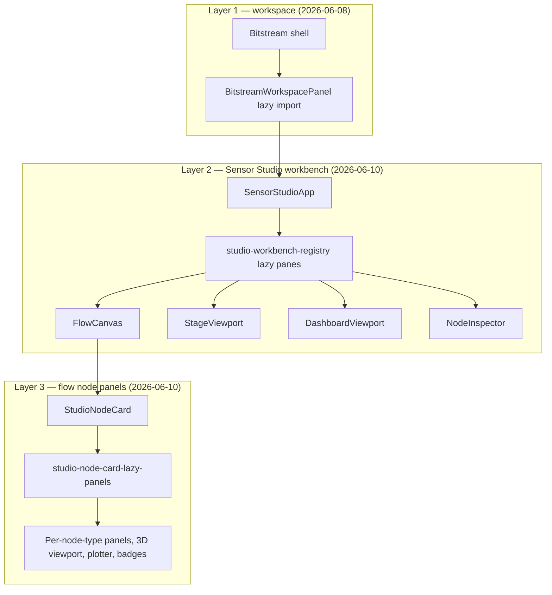

# Webview dev performance and hot reload

Canonical reference for **Vite dev** load time, **HMR**, and the **“Loading workspace…”** spinner in Bitstream Studio browser dev (`npm run dev:webview`).

**Audience:** maintainers and Cursor agents continuing UI work under `extension/src/webview/`.

**Related:** [`HOW_TO_RUN.md`](../HOW_TO_RUN.md), [`DEV_MODE_QUICKSTART.md`](./DEV_MODE_QUICKSTART.md), rule **`.cursor/rules/webview-dev-hot-reload.mdc`**.

---

## Symptoms (before fixes, 2026-06-10)

| Symptom | Typical cause |
| -------- | ------------- |
| **Blank page** after save or reload | React mount blocked on async COI service-worker cleanup; `createRoot()` called again on HMR without reusing the root; stale `t3d-coi` service worker intercepting Vite module fetches |
| **“Loading workspace…” for 20+ seconds** on F5 | Full page reload re-transforms a large static import graph (~1,000+ modules for Sensor Studio); React Compiler on every file in dev; workspace lazy boundary only defers the shell, not Sensor Studio internals |
| **Plain text on empty `#root`** before React | Static boot shell in `index.html`; branded React fallback via `BitstreamStudioLoadingScreen` (workspace Suspense + WebGL route gap) |
| **Slow first load after `npm start`** | `prestart` → `dev:clean` kills port **5173** → cold Vite + cold `optimizeDeps` |

**Save (HMR)** is usually fast. **Hard refresh (F5)** is the expensive path in dev.

---

## Fix summary (2026-06-10)

Three layers of lazy loading plus faster dev transforms:



| Change | Purpose |
| ------ | ------- |
| **Immediate React mount** in `main.tsx` | Do not block `#root` on COI service-worker cleanup |
| **HMR-safe root** in `main.tsx` | Reuse one `createRoot()` across Vite hot updates |
| **Boot placeholder** in `index.html` | Dark “Loading Bitstream Studio…” until React paints |
| **React Compiler dev-off** in `vite.config.ts` | `babel-plugin-react-compiler` only when `mode === "production"` |
| **Vite `server.warmup`** | Pre-transform hot entry paths after server start |
| **Lazy workbench panes** | Flow / Stage / Dashboard / Inspector load when their pane mounts |
| **Lazy flow node panels** | ~50+ node panels + 3D viewport + plotter load per node type on canvas |

---

## Files changed (agent map)

| Path | Role |
| ---- | ---- |
| [`src/webview/main.tsx`](../src/webview/main.tsx) | Mount immediately; reuse `appRoot` for HMR; `import.meta.hot.accept` |
| [`src/webview/index.html`](../src/webview/index.html) | Inline boot CSS + COI SW cleanup script (unchanged logic; added visible placeholder) |
| [`src/webview/utils/unregisterStaleCoiServiceWorker.ts`](../src/webview/utils/unregisterStaleCoiServiceWorker.ts) | COI cleanup (runs in parallel with mount; may trigger one reload if controller active) |
| [`vite.config.ts`](../vite.config.ts) | `defineConfig(({ mode }) => …)`; React Compiler prod-only; `server.warmup`; `server.watch.ignored` (docs `.md` no HMR); `optimizeDeps` includes `react-dom/client`, `@xyflow/react` |
| [`src/webview/bitstream-shell/BitstreamWorkspacePanel.tsx`](../src/webview/bitstream-shell/BitstreamWorkspacePanel.tsx) | **Layer 1** — lazy workspace apps; shows **“Loading workspace…”** (`WorkspaceLoadingFallback`) |
| [`src/webview/sensor-studio/features/editor/workbench/studio-workbench-registry.tsx`](../src/webview/sensor-studio/features/editor/workbench/studio-workbench-registry.tsx) | **Layer 2** — `LazyFlowCanvas`, `LazyStageViewport`, `LazyDashboardViewport`, `LazyNodeInspector` |
| [`src/webview/sensor-studio/features/editor/nodes/studio-node-card-lazy-panels.tsx`](../src/webview/sensor-studio/features/editor/nodes/studio-node-card-lazy-panels.tsx) | **Layer 3** — all `Lazy*` panel/badge exports + `StudioNodePanelSuspense` |
| [`src/webview/sensor-studio/features/editor/nodes/StudioNodeCard.tsx`](../src/webview/sensor-studio/features/editor/nodes/StudioNodeCard.tsx) | Uses lazy panels; no eager panel imports |

**Do not revert** eager imports of node panels into `StudioNodeCard.tsx` without measuring the static graph (see below).

---

## Static import graph (approximate, dev)

Counted by walking static `import` edges from the entry file (dynamic `import()` excluded).

| Entry | Before (2026-06-10) | After (2026-06-10) |
| ----- | ------------------: | -----------------: |
| `SensorStudioApp.tsx` (total webview files) | ~1,084 | ~665 |
| `sensor-studio/` only | ~818 | ~428 |
| `StudioNodeCard.tsx` | ~1,000+ | ~387 |

Lazy chunks load **on demand** when a workbench pane opens or a node type appears on the flow canvas.

---

## Daily dev workflow

```bash
# Terminal 1
npm run start:bridge

# Terminal 2 — keep running; restart after vite.config.ts edits
npm run dev:webview
```

**Fast Sensor Studio URL (skip landing):**

```text
http://localhost:5173/?app=bitstream&workspace=sensor-studio&landing=0
```

| Action | Expected behavior |
| ------ | ----------------- |
| Edit `src/webview/**` (`.ts`, `.tsx`, `.css`, …) | Vite HMR — no `npm run compile` |
| Edit **docs** `*.md` / `*.mdc` (`extension/docs/`, `README.md`, `AGENT_HANDOFF.md`, `.cursor/`) | **No HMR** — excluded by `server.watch.ignored` in `vite.config.ts` |
| Edit **bundled content** markdown (`course-studio/content/*.md`, `presentation/chapters/**.md`, `AI_BRIDGE_HELP.md`) | HMR still applies when those files are `?raw` imports |
| Edit `vite.config.ts` | Restart `dev:webview` + hard-reload browser |
| Edit bridge / `bitstream2` broker path | Restart `start:bridge` |
| Avoid constant `npm start` | `prestart` runs `dev:clean` and cold-starts Vite |

### Markdown watch policy (`vite.config.ts`)

`shouldIgnoreDevWatchPath()` keeps documentation edits from invalidating the dev server:

- **Ignored:** most `*.md`, `docs/**` markdown, `.cursor/**`, repo/extension README and handoff files.
- **Still watched:** webview **content** markdown under `course-studio/content/` and `presentation/chapters/` (bundled slide/course copy).

When adding a new `?raw` markdown import elsewhere, extend `isWebviewBundledMarkdownWatchPath()` in `vite.config.ts` or HMR will not run for that file.

---

## Agent guidelines

### When adding Sensor Studio UI

1. **New flow node panel** — add a `Lazy*` export in `studio-node-card-lazy-panels.tsx`; wire it in `StudioNodeCard.tsx` inside `StudioNodePanelSuspense`. Do **not** add a top-level eager import in `StudioNodeCard.tsx`.
2. **New workbench pane** — register via a lazy wrapper in `studio-workbench-registry.tsx` (mirror `WorkbenchStagePanel` / `WorkbenchFlowPanel`).
3. **React Compiler** — production builds only (`vite.config.ts`). Do not re-enable in dev without a measured reason.
4. **Heavy 3D** — keep `StudioSceneViewport` behind lazy panel imports; Stage pane already lazy-loads `StageViewport`.

### When the page is blank

1. DevTools **Console** — failed module fetch?
2. **Application → Service Workers** — unregister any `t3d-coi-serviceworker`; hard-reload.
3. Vite terminal — `Failed to run dependency scan` → stop and restart `npm run dev:webview` cleanly.
4. After `vite.config.ts` change — hard-reload (Ctrl+Shift+R).

### When “Loading workspace…” is still slow

- First refresh after Vite restart may still pre-bundle `optimizeDeps` (seconds, not minutes, after 2026-06-10 changes).
- Opening Flow / Stage / Dashboard for the first time loads that pane’s chunk (brief).
- Adding many node types to the canvas loads each panel chunk once.

---

## Production builds (unchanged behavior)

- `npm run build:webview` / `npm run compile` still use **React Compiler** in production mode.
- Lazy `import()` boundaries also help production code-splitting; VSIX smoke checklist unchanged — see [`HOW_TO_RUN.md`](../HOW_TO_RUN.md).

---

## History

| Date | Note |
| ---- | ---- |
| **2026-06-08** | Layer 1 — `BitstreamWorkspacePanel` lazy workspace tabs; `optimizeDeps` tuning |
| **2026-06-10** | Layer 2–3 — Sensor Studio workbench + node panel lazy splits; `main.tsx` / `index.html` boot fixes; React Compiler dev-off; Vite warmup |
