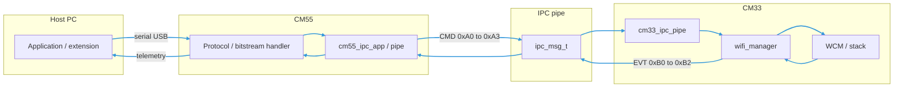
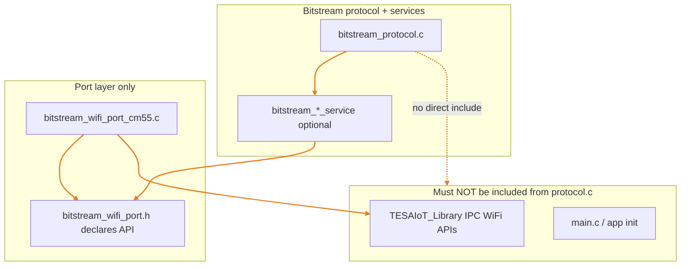

# Wi-Fi IPC Reference (CM55 ↔ CM33)

This document summarizes how Wi-Fi control is implemented in the **TESAIoT** firmware stack and how it relates to **host protocol work** on CM55. Use it when designing commands to change **SSID**, **password**, or **security** from the host application.

**Authoritative firmware sources** live outside this repo. Primary paths on this machine:

| Role | Path |
|------|------|
| Firmware tree | `D:\CODE\2026\TESAIoT_PSoC_Edge_Workspace\TESAIoT_Firmware` |
| Shared library | `D:\CODE\2026\TESAIoT_PSoC_Edge_Workspace\TESAIoT_Library` |

CM55 application and bitstream entry points: `TESAIoT_Firmware\proj_cm55\` (e.g. `src\bitstream`, `src\main`).

**Integration rule (mandatory for CM55 bitstream code):** The **bitstream protocol layer must not** `#include` headers from **`TESAIoT_Library`**, **`src/main`**, or other application glue. **All** calls into the IPC stack, drivers, or RTOS-specific APIs must go through **`port` translation units** under `proj_cm55\src\bitstream\`. See [Bitstream module port isolation (CM55)](#bitstream-module-port-isolation-cm55).

---

## Architecture Overview

- **CM33 (non-secure):** Runs the **WICED / WCM** Wi-Fi stack. A **Wi-Fi manager** task queues operations (scan, connect, disconnect, status) and drives the actual radio/API layer.
- **CM55:** Runs the **host-facing protocol** (e.g. UART / USB / bitstream) and **sensor pipeline**. It does not host the Wi-Fi driver; it forwards Wi-Fi **requests** to CM33 over **IPC** and receives **events/status** back.
- **Transport:** `ipc_msg_t` over the **IPC pipe** (see `ipc_communication.h` in the shared library).

---

## IPC Message Layout (Relevant to Wi-Fi)

The shared type `ipc_msg_t` includes a **command code** (`cmd`), optional **`value`**, and a **`data[]`** payload (length capped by `IPC_DATA_MAX_LEN`, typically 128 bytes).

Wi-Fi-related **CM55 → CM33** commands are defined in `ipc_communication.h`:

| Opcode | Symbol | Purpose |
|--------|--------|---------|
| `0xA0` | `IPC_CMD_WIFI_SCAN_REQ` | Request scan (optionally filtered). |
| `0xA1` | `IPC_CMD_WIFI_CONNECT_REQ` | **Connect using SSID, password, security.** |
| `0xA2` | `IPC_CMD_WIFI_DISCONNECT_REQ` | Disconnect from current AP. |
| `0xA3` | `IPC_CMD_WIFI_STATUS_REQ` | Request status snapshot / refresh. |

**CM33 → CM55** Wi-Fi events:

| Opcode | Symbol | Purpose |
|--------|--------|---------|
| `0xB0` | `IPC_EVT_WIFI_SCAN_RESULT` | Per-AP or incremental scan data (packed per design). |
| `0xB1` | `IPC_EVT_WIFI_SCAN_COMPLETE` | Scan finished (count / status). |
| `0xB2` | `IPC_EVT_WIFI_STATUS` | Link state, RSSI, reason, SSID string, etc. |

---

## Connect Payload: `ipc_wifi_connect_request_t`

Defined in `ipc_wifi_ipc_types.h` (included from `ipc_communication.h`). Shape used when sending **`IPC_CMD_WIFI_CONNECT_REQ`**:

| Field | Description |
|-------|-------------|
| `ssid` | C string; length tied to `WIFI_SSID_MAX_LEN` (**32** characters in `ipc_wifi_scan_types.h`) plus null terminator in the struct layout. |
| `password` | C string; buffer sized for typical WPA passphrase (**64 + 1** in the shared struct). |
| `security` | `uint32_t`; Wi-Fi security mode as understood by the CM55 helper (caller passes through to the connect path). |

**Design implication for host protocol:** Keep host-framed SSID/password lengths **equal to or stricter than** these firmware limits to avoid truncation or overflow when copying into `ipc_wifi_connect_request_t`.

---

## CM55: Sending Wi-Fi Commands

The library exposes helpers in **`cm55_ipc_app`** (implementation in `TESAIoT_Library\CM55\modules\cm55_ipc_app\cm55_ipc_app.c`), including:

| Function | Behavior |
|----------|----------|
| `cm55_trigger_scan_all()` | Pushes `IPC_CMD_WIFI_SCAN_REQ` with no SSID filter. |
| `cm55_trigger_scan_ssid(ssid)` | Pushes scan request with SSID filter. |
| `cm55_trigger_connect(ssid, password, security)` | Builds `ipc_wifi_connect_request_t`, pushes **`IPC_CMD_WIFI_CONNECT_REQ`**. |
| `cm55_trigger_disconnect()` | Pushes **`IPC_CMD_WIFI_DISCONNECT_REQ`**. |
| `cm55_trigger_status_request()` | Pushes **`IPC_CMD_WIFI_STATUS_REQ`**. |
| `cm55_get_wifi_status(out)` | Reads cached **`ipc_wifi_status_t`** on CM55 (updated from incoming IPC events). |

### Wi-Fi IPC event subscribers (CM55)

When code needs **notification** in the IPC receiver task (for example to bridge status into the bitstream channel or keep a UI cache), use the subscriber API in `cm55_ipc_app.h` instead of a single global callback:

| API | Role |
|-----|------|
| `CM55_WIFI_IPC_MAX_SUBSCRIBERS` | Fixed number of slots (**4**). |
| `cm55_wifi_ipc_add_event_handler(cb, user_ctx)` | Returns slot index `0`..`3`, or **-1** if `cb` is NULL or all slots are in use. |
| `cm55_wifi_ipc_remove_event_handler(slot)` | Unregisters the callback installed at that slot. |
| `cm55_wifi_ipc_set_event_handler(cb, user_ctx)` | **Legacy:** Clears **all** slots, then if `cb` is non-NULL registers that callback **only in slot 0**. |

**Integration rule:** Bitstream and examples register with **`add`** and store the returned **slot**; on teardown they call **`remove(slot)`** so other modules (e.g. product HMI) keep receiving events. Do **not** call `cm55_wifi_ipc_set_event_handler(NULL, NULL)` to “only” drop your module—that API clears every subscriber, including the bitstream bridge.

**Boot path example:** `cm55_wifi_connect()` in `cm55_init.c` delays briefly, then calls `cm55_trigger_connect()` and `cm55_trigger_status_request()` using SSID/password supplied from application code (e.g. `main.c` defaults). That confirms the **intended production flow**: CM55 does not need new IPC opcodes to apply new credentials—it needs a **caller** that supplies updated strings (CLI, protocol handler, or provisioning).

---

## CM33: Receiving Commands and Running Wi-Fi

In **`cm33_ipc_pipe.c`**, incoming requests are dispatched by `cmd`. For **`IPC_CMD_WIFI_CONNECT_REQ`**:

1. The payload is copied into a local **`ipc_wifi_connect_request_t`**.
2. Strings are null-terminated defensively.
3. **`wifi_manager_request_connect(&req)`** is called.

The **Wi-Fi manager** (`cm33_wifi_manager.c`) serializes scan/connect/disconnect/status on a queue and interacts with **`wifi_connect_*`** and **`cy_wcm_*`** as appropriate. Status and scan completion propagate upward and eventually result in **IPC events** back to CM55 (e.g. **`IPC_EVT_WIFI_STATUS`**).

---

## Changing SSID and Password: Firmware-Level Checklist

What **already exists:**

1. **IPC connect request** carrying SSID + password + security (`IPC_CMD_WIFI_CONNECT_REQ`).
2. **CM33 execution path** from IPC pipe → Wi-Fi manager → stack.
3. **Status feedback** to CM55 (`IPC_EVT_WIFI_STATUS` and related scan events).

What **still belongs to product/protocol design** (host ↔ CM55):

1. **Framed command** from the host (opcode, length-prefixed strings, security enum mapping).
2. **Validation** on CM55 before calling `cm55_trigger_connect()` (lengths, allowed characters, rate limiting).
3. **Async behavior:** Connection is not instantaneous; the host should consume **repeated status updates** (`connecting` → `connected` / error) rather than expecting a single ACK.
4. **Policy:** Whether to call **`cm55_trigger_disconnect()`** before a new **`cm55_trigger_connect()`** when switching networks (depends on stack behavior and desired UX).
5. **Persistence:** Storing credentials across power cycles requires **non-volatile storage** and a defined owner (CM33 vs CM55). Default SSID/password in `main.c` are **compile-time / boot defaults**, not a full provisioning store.

---

## Optional Adjacent Mechanisms

- **`IPC_CMD_CLI_EXEC_REQ` (CM55 → CM33):** Sends a **CLI line** to CM33 for execution (stdout captured back over IPC). This can be useful for **bring-up** or **debug** (`wifi` CLI if enabled), but it is usually **not** a substitute for a versioned binary protocol if you need tight integration with telemetry and error codes.

---

## Protocol Design Ideas (Host Layer)

Align host payload fields with **`ipc_wifi_connect_request_t`** to minimize translation bugs.

Consider:

- **Request correlation IDs** if multiple operations can overlap.
- **Explicit security type** mapping table shared between host and firmware.
- **Telemetry mirroring:** Surface **`ipc_wifi_status_t`** fields (state, reason, RSSI, SSID) on the existing sensor/bitstream channel where appropriate.

---

## Bitstream module port isolation (CM55)

This section is a **project architectural requirement**, not optional style guidance. It keeps the **frame parser, command dispatch, and codec** (`protocol/`, `core/`) independent from Infineon/TESA library headers and from **`main.c`** startup code so the bitstream tree can be reviewed, reused, and compiled with predictable boundaries.

### Non-negotiable rule

| Layer | Allowed `#include` sources (examples) |
|-------|----------------------------------------|
| **Protocol core** (`proj_cm55/src/bitstream/protocol/**`, `core/**`) | Other **`proj_cm55/src/bitstream/**`** headers, **C standard** headers, **project bitstream `config/**`** only |
| **Forbidden in protocol core** | **`TESAIoT_Library/**`** (e.g. `cm55_ipc_app.h`, `ipc_communication.h`), **`proj_cm55/src/main/**`**, **BSP/PDL headers** except where already abstracted by an existing port |

**Wi-Fi / IPC:** `cm55_trigger_connect()`, `cm55_get_wifi_status()`, and types such as `ipc_wifi_connect_request_t` live in **`TESAIoT_Library`**. Protocol code must **not** reference them directly. A dedicated **Wi-Fi port** implements the glue; the protocol includes **only** `bitstream_wifi_port.h` (name is illustrative until implemented).

### What counts as a port

A **port** is a small, stable API boundary:

- **`*.h`** — Declares functions and **neutral** value types (no `ipc_msg_t` in public protocol-facing headers unless you deliberately standardize on shared thin typedefs **inside** bitstream only).
- **`*_cm55.c`** (or `*_port_freertos.c`) — **Single integration site** that may `#include` **`TESAIoT_Library`**, FreeRTOS, HAL, etc.

Existing patterns under `proj_cm55/src/bitstream/` (reference names; paths follow the firmware tree):

| Concern | Port / module boundary | Role |
|---------|-------------------------|------|
| UART wire I/O | `modules/transport/uart/.../bitstream_transport_uart_port_cm55.c` | Moves bytes to/from hardware without coupling the codec to UART registers |
| Sensors | `modules/sensor/.../bitstream_sensor_port.c` + `*_cm55_*.c` | Reads IMU/env sensors for the streaming path |
| Diagnostics | `modules/diag/.../bitstream_diag_port.h` + `bitstream_diag_port_freertos.c` | RTOS/heap/task introspection without `#include` churn in the diag service |
| Platform | `platform/bitstream_platform_time.c`, `bitstream_platform_lock.c` | Time and locking primitives |

**Wi-Fi (planned glue):** Add something like:

- `modules/wifi/include/bitstream_wifi_port.h` — `bitstream_wifi_port_connect()`, `disconnect()`, `status_request()`, optional status getters/callbacks.
- `modules/wifi/src/bitstream_wifi_port_cm55.c` — **Only here:** `#include "cm55_ipc_app.h"` (or equivalent) and call `cm55_trigger_*` / `cm55_get_wifi_status()`.

The protocol layer calls **`bitstream_wifi_port_*`** only; it never includes **`ipc_communication.h`** for Wi-Fi work.

### Dependency direction

### Wi-Fi status path back to the host

IPC delivers **`IPC_EVT_WIFI_STATUS`** to **`cm55_ipc_app`**, which updates cached state. For bitstream telemetry:

- Either the **Wi-Fi port** exposes a **polling** read that internally calls `cm55_get_wifi_status()` (still hidden from `bitstream_protocol.c`), or
- **`cm55_ipc_app`** continues to feed a registered handler that copies into a **bitstream-owned buffer** through a **narrow callback** registered at init—**registration** still lives outside raw protocol parsing if possible (init module under `bitstream/`).

Do **not** subscribe to IPC events from `bitstream_protocol.c` using library types.

### Code review checklist

When adding a feature (Wi-Fi or otherwise):

1. Grep `proj_cm55/src/bitstream/protocol/` and `core/` for `#include` paths pointing at **`TESAIoT_Library`** or **`../main/`** — **should be zero**.
2. Confirm new hardware or IPC usage appears only under **`modules/**/`*`_port`* or **`*_cm55.c`** integration files.
3. **`main.c`** may call `bitstream_init()` and feature flags; it should **not** implement host-command handling for Wi-Fi credentials when those commands belong in the bitstream path.
4. Linker/project file lists the new `*_cm55.c` source.

### Relation to the TypeScript `bitstream` package (this repo)

The host-side **`src/bitstream`** package follows the same idea: **transport adapters** and a **self-contained core** must not import extension/webview code (`TRANSPORT_AGNOSTIC_PROTOCOL_ARCHITECTURE.md`). CM55 **port files** are the firmware analogue of those adapters and boundary layers.

### Implemented port (CM55 firmware tree)

| File | Role |
|------|------|
| `TESAIoT_Firmware/proj_cm55/src/bitstream/modules/wifi/include/bitstream_wifi_port.h` | Public API and `bitstream_wifi_status_t` (no library includes). |
| `TESAIoT_Firmware/proj_cm55/src/bitstream/modules/wifi/src/bitstream_wifi_port_cm55.c` | **Only** this file includes `cm55_ipc_app.h` and calls `cm55_trigger_*` / `cm55_get_wifi_status()`. |
| `TESAIoT_Firmware/proj_cm55/src/bitstream/bitstream.c` | Calls `bitstream_wifi_port_init()` / `deinit()` in the BitStream lifecycle (after sensor port init; deinit before sensor deinit). |
| `TESAIoT_Firmware/proj_cm55/Makefile` | Adds `bitstream_wifi_port_cm55.c` to `SOURCES` when `BITSTREAM_ENABLE=1`. |

### Bitstream wire protocol (channel `0x06`)

See **`src/bitstream/docs/FRAME_PROTOCOL_SPECIFICATION.md`** section **5.3 Wi-Fi Channel**. Summary:

- **Connect:** fixed **105-byte** payload (`corr_id`, `security`, padded SSID/password) → device ACK `0x81`, then async **`0xA0` STATUS_EVT** with RSSI / state / SSID (correlation ID retained while connecting).
- **Push:** CM33 → CM55 IPC Wi-Fi status is forwarded by **`bitstream_wifi_service.c`** (dedupe + optional RSSI heartbeat while connected).
- **CAPS:** Bit **5** (`1<<5`) advertises the Wi-Fi channel.

### Handler conflict note

Only **one** `cm55_wifi_ipc_set_event_handler` may be active. **`bitstream_wifi_service`** registers on protocol init. If **`example_wifi_ipc_register()`** (or similar) runs later, it **replaces** the BitStream handler — disable example Wi-Fi IPC hooks when using BitStream Wi-Fi on UART.

---

## Related Documentation in This Repo

- `src/webview/bitstream-app/docs/FIRMWARE_MULTI_CLIENT_AND_MCP_ARCHITECTURE.md` — broader firmware and tooling context.
- `src/bitstream/docs/FRAME_PROTOCOL_SPECIFICATION.md` — host framing conventions (extend with Wi-Fi commands as a separate revision).

---

## Revision Notes

- Document generated from library paths under `TESAIoT_Library` and CM55 `proj_cm55` sources. If firmware moves branches, re-verify opcode definitions in **`ipc_communication.h`** and struct sizes in **`ipc_wifi_ipc_types.h`**.
