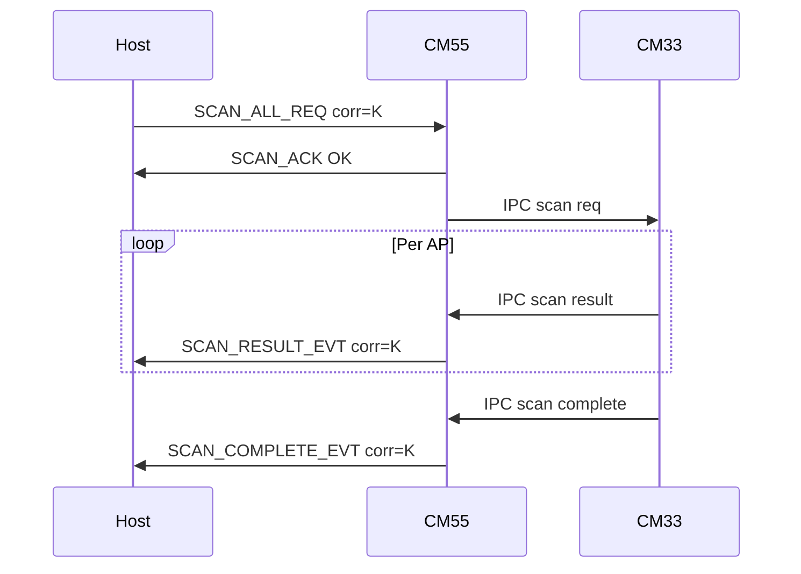
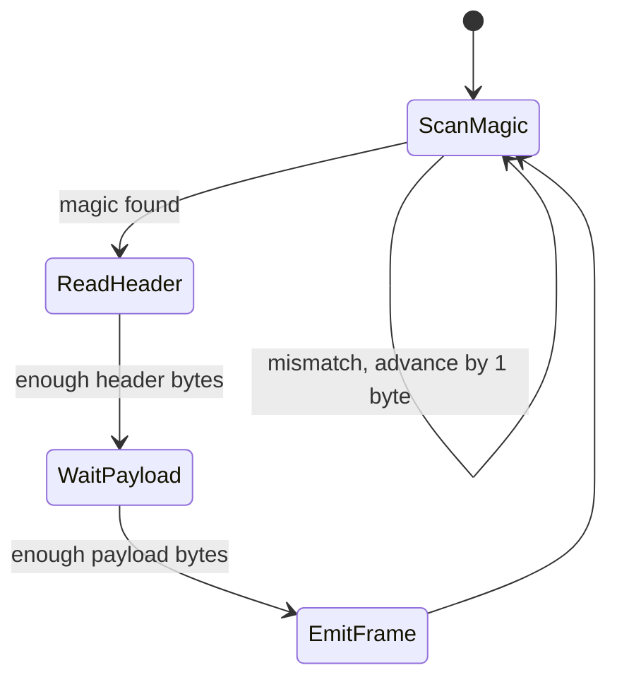

# Frame Protocol Specification (Host and Firmware)

## Table of contents

- [1. Purpose](#1-purpose)
  - [1.1 Byte-level reference map](#11-byte-level-reference-map)
- [2. Version and Endianness](#2-version-and-endianness)
- [3. Frame Layout](#3-frame-layout)
  - [3.1 Header Fields](#31-header-fields)
  - [3.2 Full Frame](#32-full-frame)
- [4. Channels](#4-channels)
- [5. Command and ACK IDs](#5-command-and-ack-ids)
  - [5.0 Control payload baseline (`0x03`)](#50-control-payload-baseline-0x03)
  - [5.1 Control Channel (`0x03`) Commands](#51-control-channel-0x03-commands)
  - [5.2 Control Channel ACK IDs](#52-control-channel-ack-ids)
  - [5.3 Wi-Fi Channel (`0x06`)](#53-wi-fi-channel-0x06)
  - [5.3.1 Wi-Fi async semantics](#531-wi-fi-async-semantics)
  - [5.3.2 Wi-Fi host timeouts](#532-wi-fi-host-timeouts)
  - [5.4 Diagnostics Channel (`0x05`) Commands](#54-diagnostics-channel-0x05-commands)
  - [5.5 Diagnostics ACK](#55-diagnostics-ack)
- [6. Payload Definitions](#6-payload-definitions)
  - [6.1 HELLO_REQ](#61-hello_req) · [6.2 HELLO_ACK](#62-hello_ack) · [6.3 PING_REQ](#63-ping_req) · [6.4 PING_ACK](#64-ping_ack) · [6.5 CAPS_ACK](#65-caps_ack) · [6.6 STATUS_ACK](#66-status_ack)
  - [6.7 SENSOR_CFG_GET_ACK](#67-sensor_cfg_get_ack) · [6.8 SENSOR_CFG_SET_REQ](#68-sensor_cfg_set_req) · [6.9 SENSOR_CFG_SET_ACK](#69-sensor_cfg_set_ack) · [6.10 SENSOR_REINIT_REQ](#610-sensor_reinit_req) · [6.11 SENSOR_REINIT_ACK](#611-sensor_reinit_ack)
  - [6.12 BMI270_MODE_SET_REQ](#612-bmi270_mode_set_req) · [6.13 BMI270_MODE_SET_ACK](#613-bmi270_mode_set_ack) · [6.14 BMI270_MODE_GET_REQ](#614-bmi270_mode_get_req) · [6.15 BMI270_FUSION_FEED_SET_REQ](#615-bmi270_fusion_feed_set_req) · [6.16 BMI270_FUSION_FEED_GET_REQ](#616-bmi270_fusion_feed_get_req)
  - [6.17 BMI270_FUSION_FEED_ACK](#617-bmi270_fusion_feed_ack) · [6.17 DIAG_ACK](#617-diag_ack)
  - [6.18 LOG_LEVEL_GET_REQ](#618-log_level_get_req) · [6.19 LOG_LEVEL_SET_REQ](#619-log_level_set_req) · [6.20 LOG_LEVEL_ACK](#620-log_level_ack) · [6.21 LOG_LEVEL Host Retry Policy](#621-log_level-host-retry-policy)
  - [6.22 STREAM_PAUSE_REQ](#622-stream_pause_req) · [6.23 STREAM_PAUSE_ACK](#623-stream_pause_ack) · [6.24 STREAM_RESUME_REQ](#624-stream_resume_req) · [6.25 STREAM_RESUME_ACK](#625-stream_resume_ack)
  - [6.26 WIFI_SCAN_RESULT_EVT](#626-wifi_scan_result_evt) · [6.27 WIFI_STATUS_EVT](#627-wifi_status_evt--wifi_status_poll_ack) · [6.28 WIFI_SCAN_COMPLETE_EVT](#628-wifi_scan_complete_evt) · [6.29 WIFI_POLICY_EVT](#629-wifi_policy_evt)
- [6.x Bitstream Isolation Constraint](#6x-bitstream-isolation-constraint)
- [7. Sensor Source and Mode Enumerations](#7-sensor-source-and-mode-enumerations)
  - [7.1 Sensor Source](#71-sensor-source) · [7.2 Publish Mode](#72-publish-mode)
- [8. Parsing Rules](#8-parsing-rules)
- [9. Validation Rules](#9-validation-rules)
- [10. Retry and Timeout Policy](#10-retry-and-timeout-policy)
- [11. Error Codes (Host Side)](#11-error-codes-host-side)
- [12. Example Frames (Hex)](#12-example-frames-hex)
  - [12.1](#121-hello_req-seq0x0001-version1) · [12.2](#122-hello_ack-success-seq0x0001-version1) · [12.3](#123-ping_req-nonce0x7f-seq0x0002) · [12.4](#124-ping_ack-success-nonce-echo-seq0x0002)
- [13. Mermaid Diagrams](#13-mermaid-diagrams)
  - [13.1 Frame Lifecycle](#131-frame-lifecycle) · [13.2 Parser State](#132-parser-state)
- [14. Transport Independence Notes](#14-transport-independence-notes)
- [15. Implementation Checklist](#15-implementation-checklist)
- [16. Change Management](#16-change-management)
- [17. ASCII Folder and File Structure](#17-ascii-folder-and-file-structure)
  - [17.1 Document Structure in docs/](#171-document-structure-in-docs) · [17.2 Proposed Implementation Structure in src/](#172-proposed-implementation-structure-in-src) · [17.3 Existing Integration Points in src/](#173-existing-integration-points-in-src)

## 1. Purpose

This document defines the binary frame protocol used between host and firmware for reliable command, response, and event exchange.

It complements:

- [src/bitstream/docs/TRANSPORT_AGNOSTIC_PROTOCOL_ARCHITECTURE.md](./TRANSPORT_AGNOSTIC_PROTOCOL_ARCHITECTURE.md)

Scope:

- Frame wire format
- Command and ACK IDs
- Channel usage
- Parsing and validation rules
- Error handling and retry behavior
- Example frames (hex)

Out of scope:

- UI behavior
- Transport-specific details (SerialPort, Web Serial, MQTT)

### 1.1 Byte-level reference map

Use this document for the **common 8-byte frame header** ([§3](#3-frame-layout)) and for **payload layouts** on:

| Topic | Section | Notes |
| ----- | ------- | ----- |
| Header (`magic`, `sequence`, `channel`, `flags`, `payloadLength`) | [§3 Frame layout](#3-frame-layout) | Total frame size = `8 + payloadLength`; multi-byte fields are **little-endian** ([§2](#2-version-and-endianness)). |
| Control channel `0x03` (commands, ACKs, `corrId`) | [§5.0](#50-control-payload-baseline-0x03)–[§5.2](#52-control-channel-ack-ids), [§6](#6-payload-definitions) ([6.1](#61-hello_req)–[6.21](#621-log_level-host-retry-policy)) | First payload byte is command or ACK ID; control requests use `corrId` at bytes 1–2 (u16 LE) after `cmdId`. |
| Sensor Data channel `0x01` (streaming samples) | [§4 Channels](#4-channels) (ID only) | **Wire layout of sensor payloads** is defined by firmware and mirrored in the host TypeScript decoder: **`src/bitstream/events/sensor-decoder.ts`** (and related event decoder). Authoritative packing for CM55 firmware: TESAIoT **`proj_cm55/src/bitstream`** (see workspace rules). |
| Diagnostics channel `0x05` | [§5.4](#54-diagnostics-channel-0x05-commands)–[§5.5](#55-diagnostics-ack), [§6.17 DIAG_ACK](#617-diag_ack) | Includes `DIAG_ACK` (`0x80`) layout. |
| Wi-Fi (BS2 wire) | `BITSTREAM_BS_FRAMED_PROTOCOL_SPEC.md` §8.3, §10; `WIFI_BS2_ASYNC_PROTOCOL.md`; `bitstream2/docs/WIFI_BS2.md` | `REQ`/`RES`/`EVT_STATUS`; scan = N×`SCAN_ROW` + `SCAN_DONE`. Legacy §5.3 deprecated. |

Duplicating a full “every byte” narrative in **TRANSPORT_AGNOSTIC_PROTOCOL_ARCHITECTURE.md** is unnecessary; that file describes **roles and layering**, not per-field packing.

For **command vs acknowledgement routing** from the React webview through the broker and bridge to firmware (and back), see **`../../webview/bitstream-app/docs/BITSTREAM_SERIAL_AND_BROKER_DATA_FLOW.md`** (section **Command and acknowledgement flows**).

## 2. Version and Endianness

- Protocol version: `2` (current baseline)
- Byte order: little-endian for all multi-byte numeric fields

## 3. Frame Layout

Each frame is:

- Header: 8 bytes
- Payload: variable length (`payloadLength`)

### 3.1 Header Fields

| Offset | Size | Field         | Type   | Description |
| ------ | ---- | ------------- | ------ | ----------- |
| 0      | 2    | magic         | u16 LE | Frame marker, must be `0xAA55` |
| 2      | 2    | sequence      | u16 LE | Request/response correlation sequence |
| 4      | 1    | channel       | u8     | Logical channel selector |
| 5      | 1    | flags         | u8     | Channel-specific flags |
| 6      | 2    | payloadLength | u16 LE | Number of payload bytes |

### 3.2 Full Frame

```text
+----------------+----------+---------+-------+---------------+----------+
| magic (u16 LE) | seq(u16) | channel | flags | payloadLen(u16)| payload  |
+----------------+----------+---------+-------+---------------+----------+
```

## 4. Channels

| Channel ID | Name         | Direction | Notes |
| ---------- | ------------ | --------- | ----- |
| `0x01`     | Sensor Data  | FW -> Host | Streaming sensor and derived telemetry |
| `0x03`     | Control      | Both | Handshake and sensor control commands |
| `0x05`     | Diagnostics  | Both | Diagnostics requests, ACKs, and streams |
| `0x06`     | Wi-Fi        | Both | STA connect/disconnect/scan/status; device pushes RSSI and link state |

Firmware references: `BITSTREAM_CHANNEL_WIFI`, `BITSTREAM_MSG_WIFI_*` in `proj_cm55/src/bitstream/protocol/include/bitstream_protocol.h`, handler in `modules/wifi/src/bitstream_wifi_service.c`.

## 5. Command and ACK IDs

Payload byte `0` is command ID (for request) or ACK/event ID (for response/event).

### 5.0 Control payload baseline (`0x03`)

All **control-channel** requests (`channel = 0x03`) include a 16-bit **correlation ID** (`corrId`) that is echoed back in the matching ACK:

```text
CONTROL request payload:
byte0: cmdId
byte1..2: corrId (u16 LE)
byte3..: command-specific fields
```

Notes:

- `sequence` (frame header) is still present and is used for retry/transport bookkeeping.
- In multi-client setups, the bridge may **rewrite** `corrId` on TX to avoid collisions across clients; the firmware must treat `corrId` as an opaque echo field.

### 5.1 Control Channel (`0x03`) Commands

| Command | ID    | Request Payload |
| ------- | ----- | --------------- |
| HELLO_REQ | `0x01` | `[cmd, corrId(u16), protocolVersion]` |
| PING_REQ | `0x02` | `[cmd, corrId(u16), nonce]` |
| CAPS_REQ | `0x03` | `[cmd, corrId(u16)]` |
| STATUS_REQ | `0x04` | `[cmd, corrId(u16)]` |
| SENSOR_CFG_GET_REQ | `0x05` | `[cmd, corrId(u16), sourceId]` |
| SENSOR_CFG_SET_REQ | `0x06` | **12** bytes total (payload after frame header): see [§6.8 SENSOR_CFG_SET_REQ](#68-sensor_cfg_set_req) |
| SENSOR_REINIT_REQ | `0x07` | `[cmd, corrId(u16)]` |
| BMI270_MODE_SET_REQ | `0x08` | `[cmd, corrId(u16), mode]` |
| BMI270_MODE_GET_REQ | `0x09` | `[cmd, corrId(u16)]` |
| BMI270_FUSION_FEED_SET_REQ | `0x0A` | `[cmd, corrId(u16), intervalMs (u16 LE)]` — requested BSX feed period; firmware clamps to **10–100 ms** (CM55; see firmware `bitstream_protocol.c`) |
| BMI270_FUSION_FEED_GET_REQ | `0x0B` | `[cmd, corrId(u16)]` |
| LOG_LEVEL_GET_REQ | `0x0C` | `[cmd, corrId(u16)]` |
| LOG_LEVEL_SET_REQ | `0x0D` | `[cmd, corrId(u16), level]` (`0..5`) |
| STREAM_PAUSE_REQ | `0x0E` | `[cmd, corrId(u16), scopeMask(u8), durationMs(u16 LE)]` |
| STREAM_RESUME_REQ | `0x0F` | `[cmd, corrId(u16), scopeMask(u8)]` |

### 5.2 Control Channel ACK IDs

| ACK | ID    | Expected Minimum Payload |
| --- | ----- | ------------------------ |
| HELLO_ACK | `0x81` | 5 bytes |
| PING_ACK | `0x82` | 5 bytes |
| CAPS_ACK | `0x83` | 6 bytes |
| STATUS_ACK | `0x84` | 7 bytes |
| SENSOR_CFG_GET_ACK | `0x85` | 13 bytes |
| SENSOR_CFG_SET_ACK | `0x86` | 7 bytes |
| SENSOR_REINIT_ACK | `0x87` | 4 bytes |
| BMI270_MODE_SET_ACK | `0x88` | 5 bytes |
| BMI270_FUSION_FEED_ACK | `0x8A` | 6 bytes |
| LOG_LEVEL_ACK | `0x8B` | 5 bytes |
| STREAM_PAUSE_ACK | `0x8C` | 7 bytes |
| STREAM_RESUME_ACK | `0x8D` | 6 bytes |

### 5.3 Wi-Fi Channel (`0x06`) — **DEPRECATED**

> **Superseded (2026-06-03):** New Wi-Fi work uses **BS2 wire** (`"BS "` + CRLF), not this legacy `0xAA55` channel.  
> **Normative spec:** `BITSTREAM_BS_FRAMED_PROTOCOL_SPEC.md` §8.3, §10 + `WIFI_BS2_ASYNC_PROTOCOL.md` + host `src/bitstream2/docs/WIFI_BS2.md`.  
> The tables below are kept for archaeology only; do not implement new features against them.

Little-endian for multi-byte numeric fields.

**Obsolete design reference:**  
`TESAIoT_Library/CM55/modules/bitstream/docs/WIFI_BS2_ASYNC_PROTOCOL.md` (2026-06-03 rewrite documents BS2 wire only).

#### Host → device (requests)

| Command | ID | Payload length | Layout |
| ------- | -- | -------------- | ------ |
| WIFI_CONNECT_REQ | `0x01` | **105** | `[cmd][corr_id u16 LE][security u32 LE][ssid 33 bytes][password 65 bytes]` — strings NUL-padded, **not** necessarily NUL-terminated in the middle of fixed fields |
| WIFI_DISCONNECT_REQ | `0x02` | **3** | `[cmd][corr_id u16 LE]` |
| WIFI_STATUS_POLL_REQ | `0x03` | **3** | `[cmd][corr_id u16 LE]` |
| WIFI_SCAN_ALL_REQ | `0x04` | **3** | `[cmd][corr_id u16 LE]` |
| WIFI_SCAN_SSID_REQ | `0x05` | **4 + N** | `[cmd][corr_id u16 LE][ssidLen u8][ssid bytes…]` — `ssidLen` ≤ 32 |
| WIFI_POLICY_GET_REQ | `0x06` | **3** | `[cmd][corr_id u16 LE]` |
| WIFI_POLICY_SET_REQ | `0x07` | **4** | `[cmd][corr_id u16 LE][flags u8]` — bit0 = auto-connect enabled |

#### Device → host (ACKs, same channel `0x06`)

| ACK | ID | Payload |
| --- | -- | ------- |
| WIFI_CONNECT_ACK | `0x81` | `[cmd][corr_id u16 LE][status u8]` — `status 0` = queued OK; `1` = invalid length; `2` = CM55→CM33 queue unavailable; `3` = busy |
| WIFI_DISCONNECT_ACK | `0x82` | `[cmd][corr_id u16 LE][status u8]` |
| WIFI_STATUS_POLL_ACK | `0x83` | Same **41-byte** layout as `WIFI_STATUS_EVT` ([§6.27](#627-wifi_status_evt--wifi_status_poll_ack)) |
| WIFI_SCAN_ACK | `0x84` | `[cmd][corr_id u16 LE][status u8]` — scan **queued only**; AP rows follow as `WIFI_SCAN_RESULT_EVT` |
| WIFI_POLICY_ACK | `0x85` | `[cmd][corr_id u16 LE][status u8][flags u8]` — bit0 in `flags` = auto-connect enabled |

#### Device → host (async events)

| Event | ID | Payload | When |
| ----- | -- | ------- | ---- |
| WIFI_STATUS_EVT | `0xA0` | **41 bytes** — [§6.27](#627-wifi_status_evt--wifi_status_poll_ack) | Link state / RSSI / reason / SSID change; connect progress |
| WIFI_SCAN_RESULT_EVT | `0xA3` | **53 bytes** — [§6.26](#626-wifi_scan_result_evt) | **One frame per AP** during scan (`index` / `total`) |
| WIFI_SCAN_COMPLETE_EVT | `0xA1` | **7 bytes** — [§6.28](#628-wifi_scan_complete_evt) | Scan session finished (same `corr_id` as scan REQ) |
| WIFI_POLICY_EVT | `0xA2` | **5 bytes** — [§6.29](#629-wifi_policy_evt) | Policy snapshot after get/set |

**Protocol note (2026-06-03):** `WIFI_SCAN_RESULT_EVT` is **new**. `WIFI_SCAN_COMPLETE_EVT` grows from **5** to **7** bytes (`corr_id` added). Hosts must upgrade decoders together with firmware.

### 5.3.1 Wi-Fi async semantics — **DEPRECATED**

> See **`WIFI_BS2_ASYNC_PROTOCOL.md`** for current async rules (`REQ`/`RES`/`EVT_STATUS`, **`reqId`**).

Wi-Fi on CM33 is **inherently async**. On the legacy Wi-Fi channel:

| Class | Meaning for the host |
| ----- | -------------------- |
| **REQ** | Ask CM55 to forward work to CM33 (scan, connect, …) |
| **ACK** | CM55 accepted the REQ (**not** “operation finished”) |
| **EVT** | CM33 outcome relayed to the host (status, each AP, scan done, policy) |

**Correlation ID (`corr_id`, u16 LE):**

- Host picks a non-zero `corr_id` per transaction (scan session, connect attempt, policy change).
- Device echoes it in the matching ACK and in EVTs for that transaction.
- **`corr_id = 0`** = unsolicited / background (e.g. periodic RSSI while connected).

**Scan event order (normative):**

1. `WIFI_SCAN_ACK` (queued)
2. Zero or more **`WIFI_SCAN_RESULT_EVT`** with the same `corr_id` (`index` 0 .. `total-1`)
3. Exactly one **`WIFI_SCAN_COMPLETE_EVT`** with the same `corr_id`

**Connect event order (typical):**

1. `WIFI_CONNECT_ACK` (queued)
2. One or more **`WIFI_STATUS_EVT`** (`CONNECTING` → `CONNECTED` or `ERROR`) — may use connect `corr_id` or `0`

**Do not** treat `WIFI_SCAN_ACK` or `WIFI_CONNECT_ACK` with `status=0` as completion.



CM55 caches IPC data in `cm55_ipc_app` (`s_wifi_status`, `s_wifi_list[]`) before encoding BS2 frames in `bitstream_wifi_service.c`.

### 5.3.2 Wi-Fi host timeouts

Suggested host-side timers (see also [§10](#10-retry-and-timeout-policy)):

| Transaction | Start | Stop | Timeout |
| ----------- | ----- | ---- | ------- |
| Scan | `SCAN_ACK` OK | `SCAN_COMPLETE_EVT` | 30 s |
| Connect | `CONNECT_ACK` OK | `STATUS_EVT` terminal state | 60 s |
| Disconnect | `DISCONNECT_ACK` OK | `STATUS_EVT` DISCONNECTED | 15 s |
| Policy | `POLICY_ACK` OK | `POLICY_EVT` | 5 s |
| Status poll | REQ sent | `STATUS_POLL_ACK` | 3 s |

On timeout, use `WIFI_STATUS_POLL_REQ` or abort UI state; use a **new** `corr_id` for a retry (do not overlap transactions).

#### Connect semantics and deterministic reconnect

- Firmware does not require a manual disconnect before every connect request.
- For deterministic behavior when users submit connect repeatedly:
  - Same SSID + same credentials/security while already connected/connecting is treated as duplicate intent.
  - Changed connect intent while connected/connecting is handled as reconnect (disconnect/stop then connect).
- Host must use **`WIFI_STATUS_EVT`** / poll for confirmation, not ACK alone.

**CAPS:** When supported, `CAPS_ACK` includes capability bits, including:
- bit **5**: Wi-Fi channel (`BITSTREAM_CAPS_FLAG_WIFI_CHANNEL_0X06` / `1<<5`)
- bit **7**: control-channel log-level GET/SET (`BITSTREAM_CAPS_FLAG_LOG_LEVEL_CONTROL` / `1<<7`)
- bit **8**: streaming pause/resume control (`BITSTREAM_CAPS_FLAG_STREAMING_PAUSE_CONTROL` / `1<<8`)

**Rate limiting (firmware):** identical status snapshots may be suppressed before UART TX; while **connected**, RSSI may be pushed when delta exceeds a threshold or on a coarse heartbeat (`bitstream_wifi_service_process`). IPC may still update CM55 cache more often.

### 5.4 Diagnostics Channel (`0x05`) Commands

| Command | ID    | Request Payload |
| ------- | ----- | --------------- |
| DIAG_GET_SNAPSHOT_REQ | `0x01` | `[cmd, diagMajor, diagMinor]` |
| DIAG_STREAM_START_REQ | `0x02` | 7 bytes total |
| DIAG_STREAM_STOP_REQ | `0x03` | `[cmd, diagMajor, diagMinor]` |
| DIAG_GET_TASK_TABLE_REQ | `0x04` | `[cmd, diagMajor, diagMinor]` |
| DIAG_SET_TASK_PRIORITY_REQ | `0x10` | 8 bytes total |

### 5.5 Diagnostics ACK

| ACK | ID    | Payload |
| --- | ----- | ------- |
| DIAG_ACK | `0x80` | `[ackCmdId, resultCode, requestId(u16), detail(u16)]` |

## 6. Payload Definitions

### 6.1 HELLO_REQ

```text
byte0: 0x01
byte1..2: corrId (u16 LE)
byte3: protocolVersion (u8)
```

### 6.2 HELLO_ACK

```text
byte0: 0x81
byte1: status (0x00 = ok)
byte2..3: corrId (u16 LE)
byte4: protocolVersion
```

### 6.3 PING_REQ

```text
byte0: 0x02
byte1..2: corrId (u16 LE)
byte3: nonce (u8)
```

### 6.4 PING_ACK

```text
byte0: 0x82
byte1: status
byte2..3: corrId (u16 LE)
byte4: nonce echo
```

### 6.5 CAPS_ACK

```text
byte0: 0x83
byte1: status
byte2..3: corrId (u16 LE)
byte4: capsFlags low byte
byte5: capsFlags high byte
```

### 6.6 STATUS_ACK

```text
byte0: 0x84
byte1: status
byte2..3: corrId (u16 LE)
byte4..5: counter (u16 LE)
byte6: protocolVersion
```

### 6.7 SENSOR_CFG_GET_ACK

```text
byte0: 0x85
byte1: status
byte2..3: corrId (u16 LE)
byte4: sourceId
byte5: enabled (0/1)
byte6: publishMode
byte7..8: samplingIntervalMs (u16 LE)
byte9..10: deltaX100 (u16 LE)
byte11..12: minPublishIntervalMs (u16 LE)
```

### 6.8 SENSOR_CFG_SET_REQ

Total **12** bytes in the frame **payload** (the length recorded in `payloadLength` in the frame header): **`commandId` (1) + `corrId` (2) + sensor parameters (9)**. On the reference host, `ProtocolEngine.createRequest` prepends `commandId`, and `HostSession` builds the remainder as `withCorrId` over a **9-byte** body (`sourceId` through `minPublishIntervalMs`).

```text
byte0: 0x06
byte1..2: corrId (u16 LE)
byte3: sourceId
byte4: enabled (0/1)
byte5: publishMode
byte6..7: samplingIntervalMs (u16 LE)
byte8..9: deltaX100 (u16 LE)
byte10..11: minPublishIntervalMs (u16 LE)
```

### 6.9 SENSOR_CFG_SET_ACK

```text
byte0: 0x86
byte1: status
byte2..3: corrId (u16 LE)
byte4: sourceId
byte5..6: appliedMask (u16 LE)
```

### 6.10 SENSOR_REINIT_REQ

```text
byte0: 0x07
byte1..2: corrId (u16 LE)
```

### 6.11 SENSOR_REINIT_ACK

```text
byte0: 0x87
byte1: status
byte2..3: corrId (u16 LE)
```

### 6.12 BMI270_MODE_SET_REQ

```text
byte0: 0x08
byte1..2: corrId (u16 LE)
byte3: mode (0=raw, 1=fusion, 2=hybrid)
```

### 6.13 BMI270_MODE_SET_ACK

```text
byte0: 0x88
byte1: status
byte2..3: corrId (u16 LE)
byte4: mode echo
```

### 6.14 BMI270_MODE_GET_REQ

```text
byte0: 0x09
byte1..2: corrId (u16 LE)
```

### 6.15 BMI270_FUSION_FEED_SET_REQ

```text
byte0: 0x0A
byte1..2: corrId (u16 LE)
byte3..4: fusion_feed_interval_ms requested (u16 LE); firmware clamps to [10, 100] ms on CM55
```

### 6.16 BMI270_FUSION_FEED_GET_REQ

```text
byte0: 0x0B
byte1..2: corrId (u16 LE)
```

### 6.17 BMI270_FUSION_FEED_ACK

```text
byte0: 0x8A
byte1: status (0x00 = ok; 0x01 = invalid length)
byte2..3: corrId (u16 LE)
byte4..5: applied_fusion_feed_interval_ms (u16 LE)
```

### 6.17 DIAG_ACK

```text
byte0: 0x80
byte1: ackCmdId
byte2: resultCode
byte3..4: requestId (u16 LE)
byte5..6: detail (u16 LE)
```

### 6.18 LOG_LEVEL_GET_REQ

```text
byte0: 0x0C
byte1..2: corrId (u16 LE)
```

### 6.19 LOG_LEVEL_SET_REQ

```text
byte0: 0x0D
byte1..2: corrId (u16 LE)
byte3: level (u8, 0..5)
```

### 6.20 LOG_LEVEL_ACK

```text
byte0: 0x8B
byte1: status (0x00=ok, 0x01=invalid length, 0x02=invalid value)
byte2..3: corrId (u16 LE)
byte4: applied_level (u8, 0..5)
```

### 6.21 LOG_LEVEL Host Retry Policy

```text
LOG_LEVEL_GET_REQ / LOG_LEVEL_SET_REQ are sent as single-attempt commands on host.
No automatic retries are applied (retryCount=0) to avoid duplicate side effects.
```

### 6.22 STREAM_PAUSE_REQ (proposed, firmware feature)

Pauses or throttles streaming publishers so CONTROL ACKs and other responses can flush promptly under load.

This is intended to support:

- User-facing “Pause streaming” quick command (typical: ≤ 1 second, max: 2 seconds).
- Reliable (ACK-confirmed) control operations under heavy sensor/diagnostics traffic.

```text
byte0: 0x0E
byte1..2: corrId (u16 LE)
byte3: scopeMask (u8)
byte4..5: durationMs (u16 LE, 1..2000)
```

Recommended `scopeMask` bits:

- bit0: sensors (channel `0x01` publishers)
- bit1: diagnostics stream (channel `0x05` periodic publishers)
- bit2: Wi‑Fi async events (channel `0x06`) (optional; default off)
- remaining bits reserved (must be ignored by firmware)

### 6.23 STREAM_PAUSE_ACK (proposed)

```text
byte0: 0x8C
byte1: status (0x00=ok, 0x01=invalid length, 0x02=invalid value)
byte2..3: corrId (u16 LE)
byte4: appliedScopeMask (u8)
byte5..6: appliedDurationMs (u16 LE)
```

### 6.24 STREAM_RESUME_REQ (proposed)

Resumes streaming for the selected scopes immediately (clears any pending pause timer for those scopes).

```text
byte0: 0x0F
byte1..2: corrId (u16 LE)
byte3: scopeMask (u8)
```

### 6.25 STREAM_RESUME_ACK (proposed)

```text
byte0: 0x8D
byte1: status (0x00=ok, 0x01=invalid length)
byte2..3: corrId (u16 LE)
byte4: appliedScopeMask (u8)
```

### 6.26 WIFI_SCAN_RESULT_EVT

**ID:** `0xA3` · **Length:** 53 bytes · **Channel:** `0x06`

One access point per frame during an active scan session. Maps from CM33 `IPC_EVT_WIFI_SCAN_RESULT` / `wifi_info_t` (trimmed for wire).

| Offset | Size | Field | Type | Description |
| ------ | ---- | ----- | ---- | ----------- |
| 0 | 1 | cmd | u8 | `0xA3` |
| 1 | 2 | corr_id | u16 LE | Same as `WIFI_SCAN_*_REQ` |
| 3 | 2 | index | u16 LE | 0-based AP index |
| 5 | 2 | total | u16 LE | AP count for this scan |
| 7 | 2 | rssi | i16 LE | dBm |
| 9 | 1 | channel | u8 | RF channel |
| 10 | 4 | security | u32 LE | Same encoding as `WIFI_CONNECT_REQ` |
| 14 | 33 | ssid | char[33] | NUL-padded |
| 47 | 6 | bssid | u8[6] | BSSID |

Firmware may store at most **10** AP rows in RAM (`CM55_IPC_APP_WIFI_STORE_MAX`); `total` may exceed stored rows — host must tolerate gaps if `index` ≥ stored count.

### 6.27 WIFI_STATUS_EVT / WIFI_STATUS_POLL_ACK

**IDs:** `0xA0` (event), `0x83` (poll ACK) · **Length:** 41 bytes · **Channel:** `0x06`

| Offset | Size | Field | Type | Description |
| ------ | ---- | ----- | ---- | ----------- |
| 0 | 1 | cmd | u8 | `0xA0` or `0x83` |
| 1 | 2 | corr_id | u16 LE | Connect transaction, or `0` if unsolicited |
| 3 | 1 | state | u8 | `0` DISCONNECTED, `1` CONNECTING, `2` CONNECTED, `3` SCANNING, `4` ERROR |
| 4 | 2 | rssi | i16 LE | dBm; use `-127` when not associated |
| 6 | 2 | reason | u16 LE | `IPC_WIFI_REASON_*` |
| 8 | 33 | ssid | char[33] | Associated SSID when known |

### 6.28 WIFI_SCAN_COMPLETE_EVT

**ID:** `0xA1` · **Length:** 7 bytes (was 5 before 2026-06-03 — **breaking**) · **Channel:** `0x06`

| Offset | Size | Field | Type | Description |
| ------ | ---- | ----- | ---- | ----------- |
| 0 | 1 | cmd | u8 | `0xA1` |
| 1 | 2 | corr_id | u16 LE | Scan session correlation |
| 3 | 2 | total_count | u16 LE | AP count reported by CM33 |
| 5 | 2 | status | u16 LE | Mirrors `ipc_wifi_scan_complete_t.status` |

Emitted **after** all `WIFI_SCAN_RESULT_EVT` frames for that `corr_id`.

### 6.29 WIFI_POLICY_EVT

**ID:** `0xA2` · **Length:** 5 bytes · **Channel:** `0x06`

| Offset | Size | Field | Type | Description |
| ------ | ---- | ----- | ---- | ----------- |
| 0 | 1 | cmd | u8 | `0xA2` |
| 1 | 2 | corr_id | u16 LE | Policy REQ correlation |
| 3 | 1 | status | u8 | `0x00` = OK |
| 4 | 1 | flags | u8 | bit0 = auto-connect enabled |

## 6.x Bitstream Isolation Constraint

- Bitstream protocol/service code is library-isolated.
- Platform/board integration (IPC, runtime logging backend, OS hooks) must be bridged via Bitstream port modules only.
- Direct includes from Bitstream core into application-layer modules are not allowed.

## 7. Sensor Source and Mode Enumerations

### 7.1 Sensor Source

| Value | Source |
| ----- | ------ |
| 0 | dummy/unknown |
| 1 | sht40 |
| 2 | dps368 |
| 3 | bmm350 |
| 4 | bmi270 |

### 7.2 Publish Mode

| Value | Mode |
| ----- | ---- |
| 0 | periodic |
| 1 | on_change |
| 2 | hybrid |

## 8. Parsing Rules

1. Input is arbitrary byte chunks.
2. Parser scans for magic `0xAA55` in little-endian bytes (`55 AA` in stream order).
3. If magic mismatch at offset, advance by one byte and continue.
4. Once header is available, compute `frameLen = 8 + payloadLength`.
5. If frame not complete yet, wait for more bytes.
6. Emit frame only when complete.
7. Preserve remaining bytes for next feed.

## 9. Validation Rules

For a response to match a request:

- Same `channel`
- Same `sequence`
- Expected ACK ID for request type
- Payload length satisfies minimum expected bytes

Failure conditions:

- Timeout waiting for matching ACK
- ACK status not `0x00`
- Sequence mismatch
- Invalid payload length

## 10. Retry and Timeout Policy

Recommended defaults:

- timeout per request: 3000 ms
- retry count: 2
- backoff strategy: fixed or linear (implementation choice)

On timeout:

- Retry until max retries reached
- Then return structured TimeoutError

On status error ACK:

- Do not retry by default
- Return ProtocolStatusError with status code

## 11. Error Codes (Host Side)

Host-side canonical errors:

- `TRANSPORT_CLOSED`
- `TIMEOUT`
- `ACK_SEQUENCE_MISMATCH`
- `INVALID_ACK_PAYLOAD`
- `PROTOCOL_STATUS_ERROR`
- `DECODE_ERROR`
- `UNSUPPORTED_PROTOCOL_VERSION`

## 12. Example Frames (Hex)

### 12.1 HELLO_REQ, seq=0x0001, version=1

- Header:
  - magic = `55 AA`
  - seq = `01 00`
  - channel = `03`
  - flags = `00`
  - payloadLen = `02 00`
- Payload:
  - `01 01`

Full frame:

```text
55 AA 01 00 03 00 02 00 01 01
```

### 12.2 HELLO_ACK success, seq=0x0001, version=1

Payload: `81 00 01`

Full frame:

```text
55 AA 01 00 03 00 03 00 81 00 01
```

### 12.3 PING_REQ nonce=0x7F, seq=0x0002

```text
55 AA 02 00 03 00 02 00 02 7F
```

### 12.4 PING_ACK success nonce echo, seq=0x0002

```text
55 AA 02 00 03 00 03 00 82 00 7F
```

## 13. Mermaid Diagrams

### 13.1 Frame Lifecycle


### 13.2 Parser State



## 14. Transport Independence Notes

This specification is intentionally transport-neutral.

Equivalent payload bytes should be identical regardless of transport:

- SerialPort direct
- Serial over WebSocket bridge
- Web Serial API
- MQTT payload topic

Only framing of transport envelope changes, not protocol frame bytes.

## 15. Implementation Checklist

- Implement FrameEncoder and FrameDecoder exactly per this spec
- Add unit tests for all command and ACK pairs
- Add vector tests for split buffers and resync behavior
- Enforce sequence and channel matching in request tracker
- Surface typed errors to application layer

## 16. Change Management

Any protocol change must update:

1. This specification document
2. `TESAIoT_Library/CM55/modules/bitstream/docs/WIFI_BS2_ASYNC_PROTOCOL.md` (Wi-Fi async design)
3. `bitstream_protocol.h` constants
4. Protocol core / `bitstream_wifi_service.c` (firmware)
5. Host decoders and test vectors

**2026-06-03 Wi-Fi async v2:** Added `WIFI_SCAN_RESULT_EVT` (`0xA3`, 53 bytes). Extended `WIFI_SCAN_COMPLETE_EVT` to 7 bytes (`corr_id`). Documented async REQ/ACK/EVT in §5.3.1.

## 17. ASCII Folder and File Structure

### 17.1 Document Structure in docs/

```text
docs/
|-- BRIDGE.md
|-- TRANSPORT_AGNOSTIC_PROTOCOL_ARCHITECTURE.md
|-- FRAME_PROTOCOL_SPECIFICATION.md
`-- ...
```

### 17.2 Proposed Implementation Structure in src/

```text
src/
`-- bitstream/
  |-- index.ts
  |-- frame/
  |   |-- frame-types.ts
  |   |-- frame-encoder.ts
  |   `-- frame-decoder.ts
  |-- engine/
  |   |-- protocol-engine.ts
  |   |-- request-tracker.ts
  |   `-- timeout-policy.ts
  |-- commands/
  |   |-- command-types.ts
  |   |-- handshake-commands.ts
  |   |-- sensor-commands.ts
  |   `-- diagnostics-commands.ts
  |-- events/
  |   |-- event-types.ts
  |   `-- event-decoder.ts
  |-- session/
  |   `-- host-session.ts
  `-- transport/
    |-- transport-adapter.ts
    |-- adapter-serial-ws.ts
    |-- adapter-node-serialport.ts
    |-- adapter-web-serial.ts
    `-- adapter-mqtt.ts
```

### 17.3 Existing Integration Points in src/

```text
src/
|-- serialport-bridge/
|   |-- protocol.ts
|   `-- SerialPortWebSocketBridge.ts
|-- serialport/
|   `-- T3DSerialPort.ts
|-- webview/
|   `-- serialport/
|       `-- serial-port-store.ts
`-- mqtt-handle.ts
```
