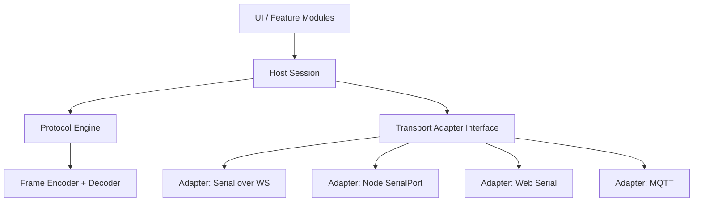
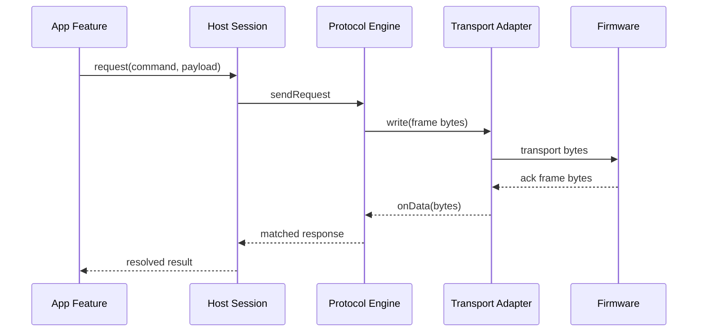

# Transport-Agnostic Bitstream Protocol Architecture for TERNION Host

## 1. Goal

This document defines how the host application should reliably exchange binary data frames and events with firmware, without relying on CLI flows.

Protocol naming note:

- The protocol name is `bitstream`.
- In this document, "bitstream protocol" and "frame protocol" refer to the same protocol.

Primary goals:

- Deterministic frame encode/decode between host and firmware
- Single bitstream core reusable across transports
- Transport adapters for Node SerialPort, Web Serial, MQTT, and future sources
- Strong request/reply matching, timeouts, retries, and event streaming
- Self-contained `bitstream` module that can be copied into another project and used as a library

Non-goals for this phase:

- CLI command UX and text-only parsing
- Transport-specific protocol implementations duplicated in multiple modules
- **Per-byte wire formats** (frame header, channel payloads) — see **[FRAME_PROTOCOL_SPECIFICATION.md](./FRAME_PROTOCOL_SPECIFICATION.md)** ([table of contents](./FRAME_PROTOCOL_SPECIFICATION.md#table-of-contents), [§1.1 Byte-level reference map](./FRAME_PROTOCOL_SPECIFICATION.md#11-byte-level-reference-map)).

Portability goals:

- The `bitstream` folder should be self-contained and portable.
- Another project should be able to copy only `src/bitstream` and use it with minimal glue code.
- `bitstream` must not import app-specific modules from this repository.

## 2. Current System Summary

Current serial path in this repository is already good for transport and streaming:

- Serial bridge topics are defined in [src/serialport-bridge/protocol.ts](../../serialport-bridge/protocol.ts)
- Serial bridge runtime is in [src/serialport-bridge/SerialPortWebSocketBridge.ts](../../serialport-bridge/SerialPortWebSocketBridge.ts)
- Serial hardware wrapper is in [src/serialport/T3DSerialPort.ts](../../serialport/T3DSerialPort.ts)
- Webview serial store is in [src/webview/serialport/serial-port-store.ts](../../webview/serialport/serial-port-store.ts)
- Web Serial is currently not used, confirmed by [src/webview/quick-scene/qs-serial-monitor/README.md](../../webview/quick-scene/qs-serial-monitor/README.md)

This gives a stable foundation to add a pure protocol core above transport.

## 3. Proposed Architecture

### 3.1 Layers

- Protocol Core Layer
  - Pure TypeScript, no Node/browser dependencies
  - FrameEncoder, FrameDecoder, ProtocolEngine
  - Handles sequence IDs, command lifecycle, retries, timeouts, ACK matching
- Transport Adapter Layer
  - Unified byte stream interface for all transports
  - Adapters: SerialPort over WS, Node SerialPort direct, Web Serial, MQTT
- Session Layer
  - HostSession composes ProtocolEngine + one adapter
  - Exposes high-level API: connect, handshake, request, subscribe event
- UI/Application Layer
  - Uses Session API, not raw frame parsing
  - Keeps current store patterns where useful

### 3.2 Layer Diagram



## 4. Bitstream Core Responsibilities

### 4.1 Frame Codec

- Encode outbound frame:
  - magic, sequence, channel, flags, payload length, payload
- Decode inbound stream:
  - handles partial chunks
  - handles multiple frames per chunk
  - resynchronizes on invalid bytes

### 4.2 Protocol Engine

- Request lifecycle:
  - allocate sequence
  - send frame
  - await matching ACK by sequence and command type
- Reliability:
  - configurable timeout and retry
  - reject with structured error when failed
- Event routing:
  - decoded event frames emitted as typed host events
- Safety:
  - ignore stale or mismatched responses
  - optional duplicate detection

### 4.3 Request and ACK Flow



## 5. Transport Adapter Contract

Each adapter must implement:

- open()
- close()
- write(bytes: Uint8Array)
- onData(callback)
- onState(callback)
- optional metadata:
  - transportName
  - mtuHint
  - capabilities

Rules:

- Adapters do not parse protocol frames
- Adapters pass raw bytes only
- Protocol correctness remains in core

## 6. Proposed File and Folder Structure

Suggested new structure under src:

- bitstream/
  - README.md
  - package.json (optional when extracted to standalone package)
  - tsconfig.json (optional when extracted to standalone package)
  - docs/
    - BITSTREAM_USER_MANUAL.md
    - FRAME_PROTOCOL_SPECIFICATION.md
    - STREAMSIGHT_REFERENCE_SYNC.md
    - TRANSPORT_AGNOSTIC_PROTOCOL_ARCHITECTURE.md
  - frame/
    - frame-types.ts
    - frame-encoder.ts
    - frame-decoder.ts
  - engine/
    - protocol-engine.ts
    - request-tracker.ts
    - timeout-policy.ts
  - commands/
    - command-types.ts
    - handshake-commands.ts
    - sensor-commands.ts
    - diagnostics-commands.ts
  - events/
    - event-types.ts
    - event-decoder.ts
  - session/
    - host-session.ts
  - transport/
    - transport-adapter.ts
    - in-memory-transport.ts
    - serial-bridge-transport.ts
    - web-serial-transport.ts
    - adapter-mqtt.ts
  - index.ts

ASCII tree view:

```text
src/
`-- bitstream/
  |-- README.md
  |-- package.json              (optional for standalone package)
  |-- tsconfig.json             (optional for standalone package)
  |-- docs/
  |   |-- BITSTREAM_USER_MANUAL.md
  |   |-- FRAME_PROTOCOL_SPECIFICATION.md
  |   |-- STREAMSIGHT_REFERENCE_SYNC.md
  |   `-- TRANSPORT_AGNOSTIC_PROTOCOL_ARCHITECTURE.md
  |-- index.ts
  |-- frame/
  |   |-- frame-types.ts
  |   |-- frame-encoder.ts
  |   `-- frame-decoder.ts
  |-- engine/
  |   |-- protocol-engine.ts
  |   |-- request-tracker.ts
  |   `-- timeout-policy.ts
  |-- commands/
  |   |-- command-types.ts
  |   |-- handshake-commands.ts
  |   |-- sensor-commands.ts
  |   `-- diagnostics-commands.ts
  |-- events/
  |   |-- event-types.ts
  |   `-- event-decoder.ts
  |-- session/
  |   `-- host-session.ts
  `-- transport/
      |-- transport-adapter.ts
      |-- in-memory-transport.ts
      |-- serial-bridge-transport.ts
      |-- web-serial-transport.ts
      `-- adapter-mqtt.ts
```

Portability constraints for `src/bitstream`:

- Allowed imports:
  - TypeScript/JavaScript standard language features
  - Stable public dependencies declared for the module itself (if any)
- Disallowed imports:
  - `src/webview/*`
  - `src/serialport-bridge/*`
  - `src/mqtt-*`
  - any extension-specific VS Code module or app-local store module

This keeps `bitstream` independent from UI, extension host, and transport runtime details.

Integration points in current codebase:

- Existing serial bridge protocol: [src/serialport-bridge/protocol.ts](../../serialport-bridge/protocol.ts)
- Existing serial store: [src/webview/serialport/serial-port-store.ts](../../webview/serialport/serial-port-store.ts)
- Existing bridge runtime: [src/serialport-bridge/SerialPortWebSocketBridge.ts](../../serialport-bridge/SerialPortWebSocketBridge.ts)
- Existing MQTT runtime entry: [src/mqtt-handle.ts](../../mqtt-handle.ts)

## 6.1 StreamSight Reference Sync

To keep this repository aligned with StreamSight protocol evolution, we track reference file hashes.

Reference project root:

- `D:/CODE/2026/TESAIoT_PSoC_Edge_Workspace/StreamSight`

Sync assets in this repository:

- Lock file: [src/bitstream/docs/streamsight-reference-lock.json](streamsight-reference-lock.json)
- Workflow doc: [src/bitstream/docs/STREAMSIGHT_REFERENCE_SYNC.md](STREAMSIGHT_REFERENCE_SYNC.md)
- Check script: [scripts/check-streamsight-bitstream-sync.js](../../../scripts/check-streamsight-bitstream-sync.js)

Commands:

- `node scripts/check-streamsight-bitstream-sync.js`
- `node scripts/check-streamsight-bitstream-sync.js --update`

## 7. Data Model and Error Model

### 7.1 Core Types

- OutboundRequest
  - requestId
  - commandId
  - payload
  - timeoutMs
  - retryCount
- InboundResponse
  - sequence
  - commandId
  - status
  - payload
- InboundEvent
  - eventId
  - payload
  - timestamp

### 7.2 Error Types

- TransportClosedError
- TimeoutError
- AckMismatchError
- DecodeError
- UnsupportedVersionError

All errors should carry:

- transport name
- sequence/requestId when available
- commandId
- raw status code

## 8. Versioning and Compatibility

- Add protocolVersion in handshake and status exchange
- Maintain capability flags for optional features
- Reject unsupported major versions clearly
- Allow minor-version feature detection with capability bits

## 9. Testing Strategy

- Unit tests:
  - frame encode/decode with fixed vectors
  - parser with split chunks and noise bytes
  - request tracker timeout/retry behavior
- Integration tests:
  - ProtocolEngine with mock adapter
  - Serial-over-WS adapter loopback
  - MQTT adapter loopback
- Regression tests:
  - known firmware frames from captured logs

## 10. Rollout Plan

1. Build bitstream with mock transport tests
2. Integrate adapter-serial-ws first using current serial flow
3. Add HostSession into one feature screen for validation
4. Add Web Serial adapter for browser mode
5. Add MQTT adapter if firmware path is validated
6. Migrate remaining features from raw write/read to HostSession API

## 11. Risks and Mitigations

- Risk: Mixed text and binary on same port
  - Mitigation: dedicated binary session mode and explicit ownership
- Risk: Response mismatch under high event traffic
  - Mitigation: strict sequence + command matching
- Risk: Transport-specific bugs leak into protocol
  - Mitigation: keep adapters thin and protocol pure

## 12. Acceptance Criteria

- Host can handshake and validate firmware using binary frames only
- Host can send command and receive correct ACK/event under timeout/retry policy
- Same ProtocolEngine runs unchanged with:
  - serial over WS adapter
  - Web Serial adapter
  - MQTT adapter
- No CLI dependency required for protocol operation

## 13. Related Existing Docs

- [docs/BRIDGE.md](./BRIDGE.md)
- [docs/BRIDGE.md](../../../docs/BRIDGE.md)
- [src/serialport-bridge/ARCHITECTURE.md](../../serialport-bridge/ARCHITECTURE.md)
- [src/serialport-bridge/GUIDE.md](../../serialport-bridge/GUIDE.md)
- [src/bitstream/docs/BITSTREAM_USER_MANUAL.md](./BITSTREAM_USER_MANUAL.md)
- [src/bitstream/README.md](../README.md)

## 14. Library Readiness Checklist

Before calling `bitstream` reusable across projects, verify:

1. No imports from app-specific paths outside `src/bitstream`.
2. Public API exposed only via `src/bitstream/index.ts`.
3. Transport interaction only through adapter interfaces.
4. All protocol behavior covered by tests with deterministic vectors.
5. A consumer can copy `src/bitstream` into a clean TS project and compile.
6. User manual includes quick-start, adapter contract, and troubleshooting.
