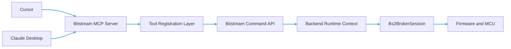
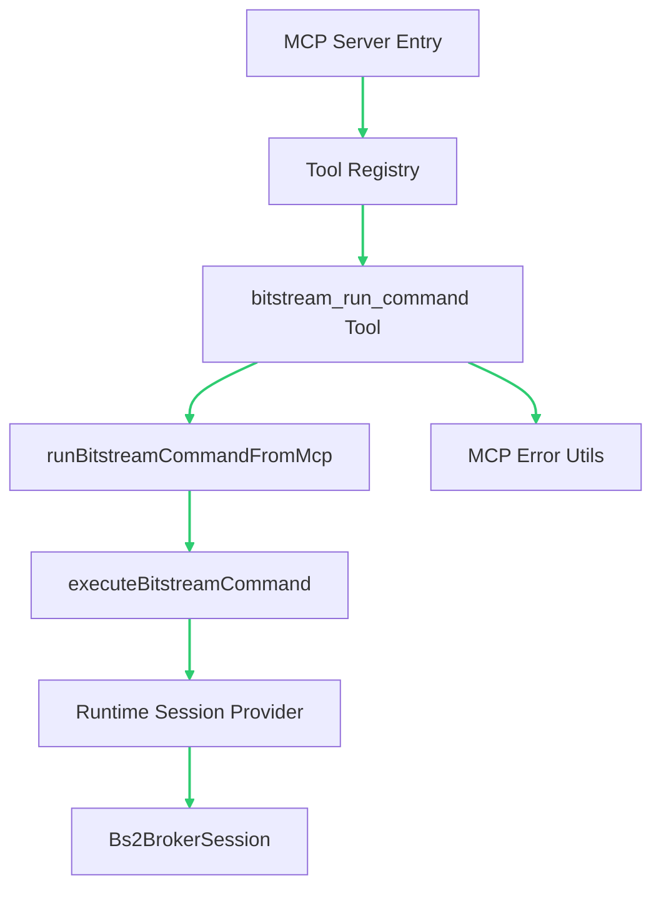

# Bitstream MCP Server Architecture

## Purpose

The Bitstream MCP server provides a safe, typed control plane for backend runtime and MCU/firmware interaction from MCP clients such as Cursor and Claude Desktop.

This layer does not replace the backend runtime. It wraps runtime capabilities behind stable MCP tools and JSON-schema contracts.

## Design Goals

- Keep backend runtime as the single source of truth for connection and session state.
- Expose command execution through typed MCP tools with strict input/output schemas.
- Reuse the existing Bitstream Command API and MCP adapter logic to avoid duplicated protocol logic.
- Normalize all tool errors into predictable envelopes for retries and agent-safe handling.
- Keep architecture modular so server bootstrap can run in-process today and as a standalone process later.

## Tech Stack Decisions

- **Language**: TypeScript (same as existing backend and command API layers)
- **Runtime**: Node.js LTS
- **Transport**: MCP stdio for v1 (best fit for Cursor and Claude Desktop local usage)
- **Validation/Contracts**: JSON-schema tool contracts via existing command API MCP wrappers
- **Testing**: vitest unit tests for tool registration, normalization, and runtime context behavior

### Dependency Count (v1)

- **Required new dependencies**: 2
  - MCP TypeScript SDK for server bootstrap and tool wiring
  - `zod` peer dependency required by MCP SDK schema interfaces
- **Optional dependencies**: 0 to 1
  - Structured logger

Recommendation: start with the two required dependencies, then add optional logging after first working end-to-end flow.

## System Context



## Runtime Boundaries

- **MCP Server boundary**: validates tool input and returns schema-safe output.
- **Command API boundary**: executes typed command requests over a `Bs2BrokerSession` via `bitstream2/req` (`bs2CommandRegistry`).
- **Backend runtime boundary**: owns serial state, connection lifecycle, and session availability.
- **Firmware boundary**: receives encoded protocol commands and emits responses/events.

## Logical Components



## Request Lifecycle

```mermaid
sequenceDiagram
participant Client as MCP Client
participant Server as MCP Server
participant Tool as bitstream_run_command
participant Runtime as Runtime Context
participant Session as Bs2BrokerSession

Client->>Server: Tool call with command payload
Server->>Tool: Validate input schema
Tool->>Runtime: Request active session
Runtime-->>Tool: Session or null
Tool->>Session: Execute typed bitstream command
Session-->>Tool: Ack or error
Tool-->>Server: Normalized envelope
Server-->>Client: JSON response
linkStyle default stroke:#E67E22,stroke-width:2px;
```

## Error Model

All errors returned by MCP tools should be normalized to a shared envelope:

- `type`: high-level category, for example `mcp.internal.error`
- `errorCode`: stable machine-readable code
- `retryable`: whether automated retry is recommended
- `recommendedBackoffMs`: retry delay hint when retryable
- `timestamp`: server-side normalization timestamp
- `error`: human-readable explanation

Current policy is centralized in MCP error utilities so all tools share the same retry/backoff behavior.

## File Structure (ASCII)

```text
src/bitstream/mcp-server/
|-- ARCHITECTURE.md
|-- index.ts                     # MCP server bootstrap and lifecycle
|-- runtime-context.ts           # Bs2BrokerSession provider and runtime handles
|-- bitstream-bs2-session-attach.ts  # HELLO-verified broker attach
|-- bitstream-attach-cli.ts      # Shared CLI/env parsing
|-- register-tools.ts           # Registers all bitstream MCP tools
|-- sdk-stdio-server.ts          # MCP SDK stdio bootstrap and tool adapter
|-- run.mcp-server.ts            # Runnable entry for local MCP stdio process
|-- mcp-e2e-smoke.ts             # End-to-end smoke for registration and callability
|-- types.ts                     # Shared MCP server interfaces
|-- tools/
|   |-- bitstream-run-command.ts # Tool binding to command API adapter
|   |-- control-ops.ts           # hello/ping/caps/status/sensor_reinit
|   |-- diag-snapshot-get.ts
|   |-- diag-fault-events-get.ts
|   |-- diag-task-table-get.ts
|   |-- diag-task-priority-set.ts
|   |-- sensor-latest-samples-get.ts
|   |-- sensor-config-get.ts
|   |-- sensor-status-get.ts
|   |-- sensor-start-stop-set.ts
|   `-- health-check.ts          # Optional readiness/diagnostics tool
`-- README.md                   # Runtime notes and launch examples
```

## Integration with Existing Command API

- Keep core command types and executors in `src/bitstream/command-api`.
- MCP server tools call the existing MCP adapter/tool wrappers.
- Tool registration should use `createBitstreamMcpToolRegistration(...)` or `registerBitstreamMcpTool(...)`.
- Avoid direct firmware command logic in `mcp-server` layer; keep it in command API and session classes.
- Serial port listing for UI/automation should use shared backend service `src/bitstream/services/serial-port-details-service.ts`.

## Bootstrap Modes

- **In-process mode**: extension/backend starts MCP server and shares runtime context directly.
- **Standalone mode**: dedicated MCP process connects to backend runtime through a stable IPC or WS control API.

Current bootstrap supports standalone local mode over stdio plus serial attach options (`--path`, `--autoDetectPort`, `--allowManufacturer`, `--denyPattern`, `--baudRate`, `--mode`, `--url`) for direct runtime session creation.
When auto-detect is enabled, the runtime filters likely virtual Bluetooth ports and requires handshake verification before selecting a port.

Both modes must preserve identical tool contracts and error envelopes.

## Security and Safety Baseline

- Validate all incoming tool payloads against schemas before command execution.
- Do not expose unrestricted raw transport writes as public tools.
- Keep command allowlist explicit and versioned.
- Log tool invocations with request IDs for traceability.
- Keep timeouts bounded for all command operations.

## Observability Baseline

- Record tool latency, success/failure, and error code distribution.
- Track retryable vs non-retryable error counts.
- Surface backend readiness and session status through diagnostic tools.

## Incremental Implementation Plan

- Create server bootstrap files under `src/bitstream/mcp-server`.
- Wire runtime context and session provider.
- Register `bitstream_run_command` first as the primary control tool.
- Add diagnostics tools (`get_runtime_diagnostics`, readiness checks).
- Add process docs for Claude Desktop and Cursor MCP client configs.
- Add MCP smoke test script that validates tool registration and input-shape compatibility.

## Firmware Parity Plan

- [x] `bitstream_run_command` covers high-level command set (9 commands)
- [x] Add dedicated diagnostics task-table API for parsed task rows
- [x] Add dedicated diagnostics task-priority API with direct wire payload visibility
- [x] Add dedicated diagnostics snapshot API for structured metrics
- [x] Add explicit low-level control ops API (`hello`, `ping`, `caps`, `status`, `sensor_reinit`)
- [x] Add structured fault event API for diagnostics `0x84`
- [x] Add dedicated sensor configuration API (`bitstream_sensor_config_get`)
- [x] Add dedicated sensor runtime status API (`bitstream_sensor_status_get`)
- [x] Add explicit sensor start/stop API with config-preserving flow (`bitstream_sensor_start_stop_set`)
- [x] Add dedicated latest sensor samples API (`bitstream_sensor_latest_samples_get`)
- [ ] Add integration tests to assert firmware command/event parity continuously

## Claude Desktop MCP Config (Windows)

Claude Desktop config file:

- `C:\Users\drsanti\AppData\Roaming\Claude\claude_desktop_config.json`

Example configuration:

```json
{
  "mcpServers": {
    "bitstream-mcp": {
      "command": "node",
      "args": [
        "D:\\CODE\\2026\\ternion-t3d\\t3d-extension\\node_modules\\tsx\\dist\\cli.mjs",
        "D:\\CODE\\2026\\ternion-t3d\\t3d-extension\\src\\bitstream\\mcp-server\\run.mcp-server.ts",
        "--autoDetectPort=true",
        "--allowManufacturer=STMicroelectronics,Silicon,Cypress",
        "--denyPattern=bluetooth,rfcomm,bth",
        "--baudRate=921600",
        "--mode=both",
        "--url=ws://127.0.0.1:9998"
      ],
      "cwd": "D:\\CODE\\2026\\ternion-t3d\\t3d-extension"
    }
  }
}
```

Notes:

- Keep backend bridge running on `ws://127.0.0.1:9998`.
- Claude Desktop should launch MCP stdio process from this config; no manual terminal run is required.
- After updating config, fully restart Claude Desktop.
- Prefer `command: "node"` with `tsx/dist/cli.mjs` over `npm run` for stdio reliability.

Quick validation sequence:

- Call `bitstream_health_check` and confirm `commandsReady` is true (and `transport.state` is `connected`), not only `sessionAttached`.
- Call `bitstream_run_command` with `handshake.run` payload and confirm `ok: true`.
- Run `npm run bitstream:mcp:smoke` to verify both wrapped and direct argument shapes are accepted.
- For full sensor parity checks, call:
  - `bitstream_sensor_status_get` for `sourceIds: [1,2,3,4]`
  - `bitstream_sensor_config_get` for a specific source
  - `bitstream_sensor_start_stop_set` and verify post-state

## Troubleshooting (Claude and Cursor)

- `Server disconnected` at startup:
  - Prefer `node` + `tsx/dist/cli.mjs` instead of `npm run` wrappers to avoid stdout protocol noise.
  - Keep absolute paths in `args` and a correct `cwd`.
  - Restart client after config edits.

- `Invalid Bitstream command payload` for `handshake.run`:
  - Use either `{"command":{"type":"handshake.run","payload":{}}}` or `{"type":"handshake.run","payload":{}}`.
  - Current MCP adapter normalizes both shapes and stringified JSON payload fields.

## Non-Goals

- Reimplementing Bitstream protocol parsing in the MCP layer.
- Moving backend authoritative state management into MCP tools.
- Coupling UI component state directly to MCP transport internals.
