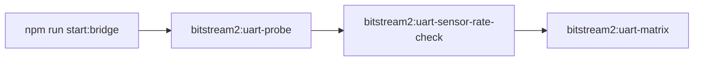

# BS2 UART hardware test commands

CLI scripts to validate **real MCU** BS2 telemetry over serial (not loopback simulator).

**Prerequisites**

1. Firmware flashed with `BITSTREAM_BS_WIRE=1` (`make program DEV_MODE_ENABLE=1` from `TESAIoT_Firmware`).
2. Bridge running **without** loopback: `npm run start:bridge` (`BITSTREAM2_DEV_LOOPBACK` unset).
3. Correct COM port and **921600** baud (default in scripts).

**Related docs**

| Doc | Role |
|-----|------|
| `HOW_TO_RUN.md` § MCU stack | Webview + bridge setup |
| `TESAIoT_Firmware/AGENT_HANDOFF.md` §9.2 | Full bring-up checklist |
| `TESAIoT_Library/.../bitstream/docs/BS_WIRE.md` | EVT_SENSOR mask + scalar order |
| `.cursor/skills/tesaiot-bs2-uart-bringup/SKILL.md` (firmware repo) | Agent skill summary |

---

## Recommended order



1. **`bitstream2:uart-probe`** — link, HELLO, PING, SENSOR_CFG, short soak, CRC.
2. **`bitstream2:uart-sensor-rate-check`** — configured Hz, BMI270 mode, EVT mask/`valuesLen`, optional value dump.
3. **`bitstream2:uart-matrix`** — automated sweep (modes, masks, publishMode, rates).
4. **`bitstream2:uart-cfg-roundtrip`** — SET ack + GET field parity (v2.1).
5. **`bitstream2:uart-cfg-behavior`** — EVT rate vs publishMode / intervals.

All scripts support **`--help`**.

### Configuration access under high telemetry load

When sensors stream at **~50–100 Hz** (multiple enabled), **`SENSOR_CFG_GET/SET` may time out** unless the bus is quieted first. This is documented in **`SENSOR_CFG_V2.md` §10.1** and enforced in behavior/roundtrip CLIs via **quiet bus** (disable all sensors, settle, then apply case cfg).

| Practice | Used by |
|----------|---------|
| Disable all sensors (`enabled=false`) before cfg-heavy suites | `run-uart-sensor-cfg-behavior.ts` (`quietAllSensors`) |
| Per-case isolate (disable non-target sensors) | behavior + matrix harness |
| `--settle-ms=600` after SET before soak | matrix, rate-check, behavior |
| REQ timeout **10 s** under load | behavior harness (`reqTimeoutMs`) |

Constants: `src/bitstream2/domains/config/sensor-cfg-access-policy.ts`.

---

## `npm run bitstream2:uart-probe`

**Script:** `run-uart-probe.ts`  
**Purpose:** Automates `AGENT_HANDOFF` §9.2 steps 0–6 (HELLO through SENSOR_CFG SET + metrics).

### Usage

```bash
cd t3d-extension
npm run bitstream2:uart-probe -- --path COM3 --baud 921600
npm run bitstream2:uart-probe -- --help
```

### Options

| Flag | Default | Description |
|------|---------|-------------|
| `--path=` | `COM3` or `BITSTREAM_UART_PATH` | Serial port |
| `--baud=` | `921600` or `BITSTREAM_UART_BAUD` | Baud rate |
| `--soak-ms=` | `90000` | Telemetry soak duration (ms) |
| `--skip-open` | off | Do not `serialport/open` (UI already holds COM) |
| `--skip-set` | off | Skip SENSOR_CFG_SET rate test |
| `--hello-timeout-ms=` | `90000` | Wait for `bitstream2/hello` |
| `--req-timeout-ms=` | `4000` | PING / CFG RPC timeout |
| `--help` / `-h` | | Print usage and exit |

### Examples

```bash
# Standard bring-up
npm run bitstream2:uart-probe -- --path COM3 --baud 921600

# COM already open in Bitstream webview
npm run bitstream2:uart-probe -- --skip-open --soak-ms 300000

# Long soak (5 min) after probe passed once
npm run bitstream2:uart-probe -- --skip-open --soak-ms 300000
```

### Pass criteria

- Console ends with **`PROBE PASSED`**
- All four sensors received EVT during soak
- `bitstream2/metrics`: `framesCrcFail` flat; PING and SENSOR_CFG GET/SET OK

---

## `npm run bitstream2:uart-sensor-rate-check`

**Script:** `run-uart-sensor-rate-check.ts`  
**Purpose:** Apply SENSOR_CFG rates, optional BMI270 mode/BSX feed, measure EVT Hz, verify EVT payload masks and scalar counts, optionally print decoded frame values.

### Usage

```bash
cd t3d-extension
npm run bitstream2:uart-sensor-rate-check -- --path COM3 --hz=50
npm run bitstream2:uart-sensor-rate-check -- --help
```

### Connection options

| Flag | Default | Description |
|------|---------|-------------|
| `--path=` | `COM3` | Serial port |
| `--baud=` | `921600` | Baud rate |
| `--soak-ms=` | `15000` | Measurement window after config (ms) |

### Rate options (independent)

| Flag | Default | Maps to |
|------|---------|---------|
| `--hz=` | `20` | `SENSOR_CFG.samplingIntervalMs` (hardware read cadence) |
| `--publish-hz=` | same as `--hz` | `SENSOR_CFG.publishIntervalMs` (UART EVT cadence; omit → 0 = same as sampling) |
| `--fusion-feed-hz=` / `--bsx-feed-hz=` | `2 × --hz` | `BMI270_FUSION_FEED_SET` (CM55→CM33 BSX feed; firmware clamps 10–100 ms) |
| `--min-pass-ratio=` | `0.6` | Fail if measured EVT Hz &lt; ratio × telemetry Hz (DPS368 exempt: ≥ 0.8 Hz warn only) |

### Sensor scope

| Flag | Default | Description |
|------|---------|-------------|
| `--only=` | all four | Comma list: `bmi270`, `bmm350`, `sht40`, `dps368`, or ids `0`–`3` |
| `--only-bmi270` | | Shorthand for `--only=bmi270` |
| `--bmi270-mode=` | `raw` | `raw` \| `fusion` \| `hybrid` (sets `BMI270_MODE_SET` before soak) |

### Print / inspect EVT values

| Flag | Default | Description |
|------|---------|-------------|
| `--print-samples` / `--print-summary` / `--print` | off | After soak: dump decoded samples (first, distinct mask, last) |
| `--print-live` | off | Stream samples during soak (capped) |
| `--print-max=` | `3` summary / `10` live | Max lines per sensor |
| `--print-only=` | same as `--only` | Limit print to named sensors |

Decoded lines show **raw int16 array** plus fields (e.g. BMI270 `acc`, `gyr`, `temp`, `euler`, `quat`) in host canonical order.

### Examples

```bash
# All sensors @ 50 Hz raw
npm run bitstream2:uart-sensor-rate-check -- --path COM3 --hz=50

# Separate sampling vs UART publish vs BSX feed
npm run bitstream2:uart-sensor-rate-check -- --path COM3 --hz=50 --publish-hz=50 --fusion-feed-hz=100 --bmi270-mode=hybrid

# BMI270 fusion only @ 100 Hz
npm run bitstream2:uart-sensor-rate-check -- --only=bmi270 --hz=100 --bmi270-mode=fusion

# Inspect decoded payloads after soak
npm run bitstream2:uart-sensor-rate-check -- --path COM3 --hz=50 --print-samples --print-max=5

# Stream first 10 BMI270 frames during soak
npm run bitstream2:uart-sensor-rate-check -- --only=bmi270 --print-live --print-max=10
```

### Pass criteria

- **`Telemetry check PASSED`** — each enabled sensor meets Hz threshold
- **`EVT payload fields (mask + scalar count)` OK** — configured mask bits present; `values.length` matches host decoder
- BMI270 fusion/hybrid: at least one sample with Euler + Quaternion when mode is not `raw`
- Full BMI270 mask `0x1f` + fusion: **14** scalars (includes temperature)

### EVT scalar reference (host decode order)

| Sensor | Mask (cfg) | Order |
|--------|------------|-------|
| BMI270 | `0x1f` typical | ACC(3) → GYR(3) → TMP(1) → EULER(3) → QUAT(4) |
| BMM350 | `0x03` | MAG(3) → TMP(1) |
| SHT40 | `0x03` | TEMP → HUM |
| DPS368 | `0x03` | PRESS → TMP |

See **`BS_WIRE.md`** in `TESAIoT_Library` for firmware packing details.

---

## `npm run bitstream2:uart-matrix`

**Script:** `run-uart-sensor-matrix.ts`  
**Purpose:** Run a tiered matrix of SENSOR_CFG + BMI270 mode cases against real UART hardware.

### Usage

```bash
cd t3d-extension
npm run bitstream2:uart-matrix:smoke -- --path COM3
npm run bitstream2:uart-matrix:standard -- --path COM3 --continue-on-fail
npm run bitstream2:uart-matrix -- --list-cases --tier=standard
npm run bitstream2:uart-matrix -- --case=bmi270-fusion-50hz --path COM3
npm run bitstream2:uart-matrix -- --help
```

### Options

| Flag | Default | Description |
|------|---------|-------------|
| `--tier=` | `standard` | `smoke` · `standard` · `exhaustive` |
| `--case=` | (all in tier) | Run one case by id |
| `--list-cases` | off | Print case ids for tier and exit |
| `--path=` | `COM3` | Serial port |
| `--baud=` | `921600` | Baud rate |
| `--soak-ms=` | `12000` | Default soak per case (ms) |
| `--settle-ms=` | `600` | Post-config settle before soak; clears EVT tail |
| `--disabled-max-evt=` | `20` | Max EVT from disabled sensors per case |
| `--min-pass-ratio=` | `0.6` | Periodic mode Hz pass threshold |
| `--continue-on-fail` | off | Keep running after failed cases |
| `--print-fail-samples` | off | Print up to 3 EVT samples on failure |
| `--resume-from=` | (all) | Start at case id (inclusive) |
| `--ws-url=` | broker default | Bridge WebSocket URL |
| `--skip-open` | off | COM already open in webview |
| `--help` / `-h` | | Print usage and exit |

### Tiers

| Tier | Cases (approx.) | Runtime (approx.) | Coverage |
|------|-----------------|---------------------|----------|
| `smoke` | ~10 | ~5 min | All-sensors raw/fusion/hybrid, per-sensor isolation, decimation |
| `standard` | ~38 | ~30–45 min | + BMI270 Hz grid, mask sweep, env masks, publishMode 0/1/2, CFG GET |
| `exhaustive` | ~60+ | hours | + all BMI270 fusion masks with Euler/Quat bits |

### Pass criteria (per case)

- Active sensors meet Hz threshold (or ≥1 EVT for `on_change` / `hybrid` publishMode cases)
- EVT mask + `valuesLen` + host decode OK (**BMI270 raw:** expected wire mask `0x07` even when cfg is `0x1f`)
- Disabled sensors stay below `--disabled-max-evt` after settle window
- Optional `SENSOR_CFG GET` when case requires it

### Shared modules

| File | Role |
|------|------|
| `uart-test-harness.ts` | WS bridge, COM, SENSOR_CFG SET, BMI270 mode/feed |
| `uart-sensor-test-matrix.ts` | Case definitions and tiers |
| `uart-sensor-assert.ts` | EVT mask/scalar/decode assertions |

---

## Other bitstream2 dev scripts

| npm script | Script | Use |
|------------|--------|-----|
| `bitstream2:mock-probe` | `run-mock-probe.ts` | Loopback / simulator smoke |
| `bitstream2:sim-scenario` | `run-sim-scenario.ts` | Scripted simulator scenarios |
| `bitstream2:golden:gen` | `generate-golden-fixtures.ts` | Capture host golden frames |
| `bitstream2:uart-cfg-roundtrip` | `run-uart-sensor-cfg-roundtrip.ts` | SET ack + GET field compare (36 cases) |
| `bitstream2:uart-cfg-behavior` | `run-uart-sensor-cfg-behavior.ts` | EVT rate vs publishMode (quiet bus first) |
