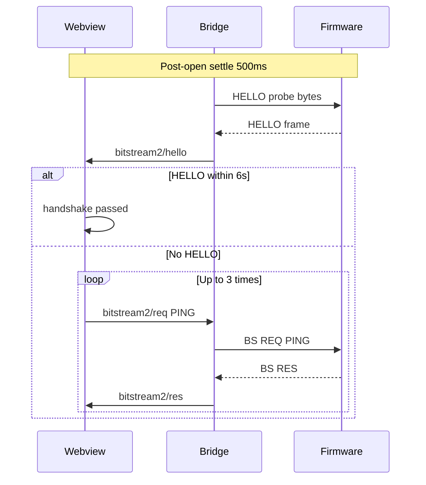

# Host UART link management (BS2 companion)

**Status:** Normative for T3D host (webview + SerialPort bridge)  
**Wire protocol:** unchanged — see `t3d-extension/docs/BITSTREAM_BS_FRAMED_PROTOCOL_SPEC.md` §2–§11  
**Canonical host section:** same file **§13 Host UART link lifecycle**

This document is a scannable companion for implementers working under `src/bitstream2/` and `src/webview/bitstream-app/`.

---

## Quick reference

| Scenario | Expected behavior |
|---|---|
| Browser refresh (F5), bridge still running | Reuse open COM via `serialport/status`; skip `open` if path/baud match; run §13.6 handshake |
| UART → Simulator | `serialport/close`; no COM during sim |
| Simulator → UART (board connected) | Full bring-up: list → open → HELLO/PING |
| Simulator → UART (board unplugged) | Failed list → `uartAwaitingReplug`; poll until plug-in |
| Unplug on UART | `uartAwaitingReplug`; poll `list` every 500 ms |
| Plug-in after wait | Auto `uartBringUpPending` → full bring-up without user action |

## Timing constants (T3D reference)

| Constant | Value | Location |
|---|---:|---|
| Bridge status wait (refresh) | 1500 ms | `openUartPortAndHandshake.ts` |
| Post-open settle | 500 ms | same |
| HELLO wait | 6000 ms | same |
| PING attempts | 3 | same |
| PING timeout | 4000 ms | same |
| List retry (enumeration) | 10 × 400 ms | same |
| Hotplug list poll | 500 ms | `useUartFirmwareHotplugRecovery.ts` |
| Hotplug poll timeout | 120 s | same |

## State flags (webview)

| Flag | Set when | Cleared when |
|---|---|---|
| `uartBringUpPending` | Sim→UART route, COM detected after replug | Consumed at start of `connectSession` bring-up |
| `uartAwaitingReplug` | Unplug, empty list after failed bring-up | `requestUartBringUpAfterHotplug()` |

## Handshake sequence (after COM open)

## Related docs

- Bridge overview: `extension/docs/BRIDGE.md` (if present) or `HOW_TO_RUN.md`
- Dev / UART probes: `src/bitstream2/dev/UART_TEST_COMMANDS.md`, `extension/HOW_TO_RUN.md`
