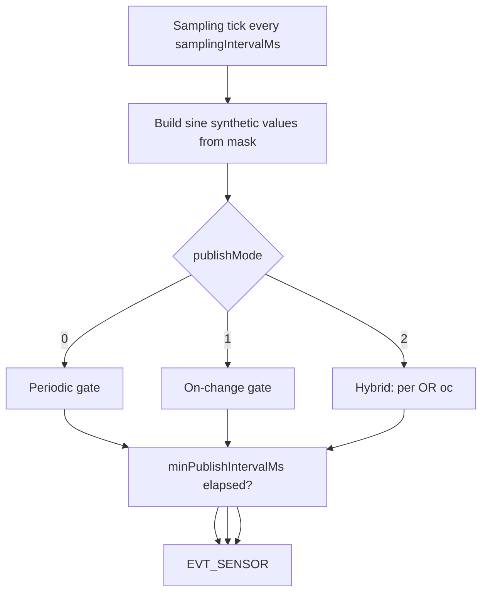

# Bitstream vNext — `SENSOR_CFG` body v2 (draft)

**Status:** Draft — v2 + v2.1 implemented on host simulator; firmware should follow §7–§8  
**Last updated:** 2026-05-26  
**Audience:** `bitstream2` encode/decode, `BsFirmwareSimulator`, webview `bitstream-app` / `bitstream2-simulator`, TESAIoT firmware alignment  
**Canonical wire doc:** [`extension/docs/BITSTREAM_BS_FRAMED_PROTOCOL_SPEC.md`](../../../docs/BITSTREAM_BS_FRAMED_PROTOCOL_SPEC.md) (§8.4 SENSOR_CFG)

---

## 1. Goals

| Goal | Notes |
|------|--------|
| **v1 parity** | Same semantics as legacy Bitstream `SENSOR_CFG` (`publishMode`, `samplingIntervalMs`, `deltaX100`, `minPublishIntervalMs`) |
| **vNext mask** | Keep per-sensor `mask` in the cfg blob (not in legacy v1 `SENSOR_CFG_GET_ACK`) |
| **Host simulator** | `BsFirmwareSimulator` must implement publish gating, not only `setInterval` |
| **UI later** | Webview binds to this shape; draft/apply unchanged |

**v2.1 (implemented on host):** separate `publishIntervalMs` for telemetry decimation (§7).

---

## 2. Versioning and negotiation

### 2.1 `HELLO.caps` bit

| Bit | Name | Meaning |
|-----|------|---------|
| 4 | `BS_CAPS_SENSOR_CFG_V2` (`0x0010`) | `SENSOR_CFG_GET/SET` body is at least **10 bytes** (§3). If clear, peers may use legacy **7-byte** body (§6) during transition |
| 5 | `BS_CAPS_SENSOR_CFG_V21` (`0x0020`) | Body is **12 bytes** — adds `publishIntervalMs` (§7) |

### 2.2 `HELLO.ver`

- **`ver = 1`:** 7-byte cfg (legacy transition)
- **`ver = 2`:** firmware **should** set `BS_CAPS_SENSOR_CFG_V2`; hosts **must** use 10-byte bodies when bit4 is set
- **Host simulator today:** `ver = 2`, `caps = 0x000f \| 0x0010 \| 0x0020` (`0x003f`) — 12-byte cfg

Simulator and loopback bridge advertise **v2 + v2.1** caps.

---

## 3. Wire layout — `SENSOR_CFG` body v2 (10 bytes)

Used as the **`body`** of:

- `REQ` + `cmdId = 0x10` (`SENSOR_CFG_GET`) — GET request body is **1 byte**: `sensorId` only (unchanged)
- `REQ` + `cmdId = 0x11` (`SENSOR_CFG_SET`)
- `RES` + `cmdId = 0x10` / `0x11` — echo full cfg on success

```text
--------+---------+-------------+------+---------------------+-------------+------------------------+
| sensorId | enabled | publishMode | mask | samplingIntervalMs | deltaX100 | minPublishIntervalMs |
--------+---------+-------------+------+---------------------+-------------+------------------------+
| u8       | u8      | u8          | u8   | u16 LE              | u16 LE      | u16 LE                 |
--------+---------+-------------+------+---------------------+-------------+------------------------+
```

All multi-byte integers: **little-endian**.

### 3.1 Field definitions

| Field | Type | Range | Description |
|-------|------|-------|-------------|
| `sensorId` | u8 | §6 sensor table | Target sensor |
| `enabled` | u8 | `0` / `1` | `0` = stream off; `1` = stream may run if mask ≠ 0 |
| `publishMode` | u8 | `0…2` | See §4 |
| `mask` | u8 | `0…255` | Fields included in each `EVT_SENSOR` (per-sensor bit defs in `domains/sensors/`) |
| `samplingIntervalMs` | u16 | `0…65535` | Firmware **sample** period (ms). `0` = no sampling tick |
| `deltaX100` | u16 | `0…65535` | Change threshold × **0.01** (same as legacy `deltaX100`) |
| `minPublishIntervalMs` | u16 | `0…65535` | Minimum time between **UART publishes** (debounce / cap) |

### 3.2 TypeScript shape (host)

```typescript
export type Bs2SensorConfigV2 = {
  sensorId: number;
  enabled: boolean;
  publishMode: 0 | 1 | 2;
  mask: number;
  samplingIntervalMs: number;
  deltaX100: number;
  minPublishIntervalMs: number;
};
```

---

## 4. Publish modes (aligned with legacy v1)

| `publishMode` | Name | Publish when |
|---------------|------|----------------|
| `0` | **periodic** | Every `samplingIntervalMs` (subject to `minPublishIntervalMs` if nonzero) |
| `1` | **on_change** | Sample every `samplingIntervalMs`; **emit** only if gated values moved ≥ `deltaX100` (×0.01), and `minPublishIntervalMs` elapsed since last emit |
| `2` | **hybrid** | **Periodic** emit every `samplingIntervalMs` **or** **on_change** emit when delta exceeded (whichever gate opens first), still respecting `minPublishIntervalMs` |

**Legacy reference:** `t3d-extension/src/bitstream/docs/FRAME_PROTOCOL_SPECIFICATION.md` §7.2.

**Not publish mode:** BMI270 **stream mode** raw / fusion / hybrid (`BMI270_MODE_SET`) — separate command in both stacks.

### 4.1 Field use by mode (host UI hints)

| Field | periodic (`0`) | on_change (`1`) | hybrid (`2`) |
|-------|----------------|-----------------|--------------|
| `samplingIntervalMs` | Required (>0) | Required (>0) | Required (>0) |
| `deltaX100` | Ignored (UI may hide) | **Required** for meaningful gating | **Required** |
| `minPublishIntervalMs` | Optional cap | **Recommended** | **Recommended** |
| `mask` | Required (≠0 to stream) | Required | Required |

### 4.2 Delta comparison (simulator + firmware — to confirm on TESAIoT)

Until CM55 source is copied into this repo, implement the **host simulator** as:

1. On each sample tick, build synthetic values for fields selected by `mask` (host: `device/sensor-synth.ts` — all masked scalars are sine waves; see §9.1).
2. For each **scalar channel** in the masked set, compute `abs(current - lastPublished)`.
3. If **any** channel delta ≥ `deltaX100 / 100`, the sample is **eligible** for on_change publish.
4. Apply `minPublishIntervalMs` between successful `EVT_SENSOR` sends.

Document per-sensor “which scalars count” in `domains/sensors/*.ts` when implementing (e.g. BMM350: `mx,my,mz,temp` as separate channels).

**TESAIoT check:** `proj_cm55/src/bitstream` — confirm comparison uses the same units (×100 fixed-point) and whether fusion quaternions use a different rule.

---

## 5. Partial updates — `STREAM_MASK_SET` / `STREAM_RATE_SET`

Keep existing command IDs; they patch a subset of the cfg blob:

| cmdId | Name | Body | Effect on cfg v2 |
|-------|------|------|------------------|
| `0x12` | `STREAM_MASK_SET` | `sensorId u8`, `mask u8` | Updates `mask` only; re-evaluates stream |
| `0x13` | `STREAM_RATE_SET` | `sensorId u8`, `intervalMs u16` | Updates **`samplingIntervalMs`** only (not `minPublishIntervalMs`); re-evaluates stream |

**Naming note:** `STREAM_RATE_SET` payload field stays `intervalMs` on the wire for cmd `0x13`; semantically it maps to **`samplingIntervalMs`** in v2.

---

## 6. Migration from current 7-byte body (bitstream2 today)

Current layout (`Bs2SensorConfig` in code):

```text
sensorId | enabled | mask | intervalMs | minIntervalMs
```

| Old (7-byte) | New (10-byte) | Rule |
|--------------|---------------|------|
| `enabled` | `enabled` | Same |
| `mask` | `mask` | Same |
| `intervalMs` | `samplingIntervalMs` | Rename; same numeric value |
| `minIntervalMs` | `minPublishIntervalMs` | Rename; same numeric value |
| — | `publishMode` | Default **`0` (periodic)** |
| — | `deltaX100` | Default **`0`** |

Hosts that read 7-byte responses when `BS_CAPS_SENSOR_CFG_V2` is clear should map as above.

---

## 7. v2.1 — `publishIntervalMs` (12-byte body)

When `HELLO.caps` bit5 (`BS_CAPS_SENSOR_CFG_V21`) is set, append:

```text
… minPublishIntervalMs u16 | publishIntervalMs u16 |
```

| Field | Description |
|-------|-------------|
| `publishIntervalMs` | Minimum time between **periodic / hybrid periodic** UART publishes (ms). **`0`** = use `samplingIntervalMs` (same rate). |

**Runtime:**

- Firmware runs an internal **sample tick** every `samplingIntervalMs` (when enabled, mask ≠ 0).
- **Periodic** mode: emit `EVT_SENSOR` only when `now - lastEmitMs >= effectivePublishIntervalMs`, where `effectivePublishIntervalMs = publishIntervalMs` if nonzero, else `samplingIntervalMs`.
- **On change** / **hybrid**: see §4; delta and `minPublishIntervalMs` still apply. Hybrid **periodic leg** uses `publishIntervalMs`; on-change leg is delta-driven.

### 7.1 Validation — telemetry cannot be faster than sampling (normative)

**Problem:** e.g. internal **1 Hz** (`samplingIntervalMs = 1000`) and telemetry **20 Hz** (`publishIntervalMs = 50`) is physically invalid — there is no new sample to publish 20 times per second.

**Rule (hosts and firmware MUST apply on `SENSOR_CFG_SET`):**

| Condition | Action |
|-----------|--------|
| `publishIntervalMs == 0` | Allowed — treat as “same as sampling” |
| `publishIntervalMs > 0` and `publishIntervalMs < samplingIntervalMs` | **Coerce** `publishIntervalMs := samplingIntervalMs` before storing/applying |
| `samplingIntervalMs == 0` | Stream off; `publishIntervalMs` ignored |

**Example (invalid request):**

| Field | User sets | After coerce |
|-------|-----------|--------------|
| `samplingIntervalMs` | 1000 (1 Hz) | 1000 |
| `publishIntervalMs` | 50 (20 Hz) | **1000** (1 Hz) |

**Example (valid decimation):**

| Field | Value |
|-------|--------|
| `samplingIntervalMs` | 20 (50 Hz) |
| `publishIntervalMs` | 100 (10 Hz) |

**Not in scope (v2.1):** repeating the **last** sample at a higher telemetry rate (UI smoothing). That would be a separate feature if product requires it.

**Reference implementation:** `normalizeSensorCfg()` in `domains/config/sensor-config.ts`; tests in `tests/bitstream2/sensor-config.test.ts`.

---

## 8. `RES.status` for `SENSOR_CFG_SET`

| status | Meaning |
|--------|---------|
| `0` | OK; body is full cfg v2 |
| `1` | Invalid body length or unknown `sensorId` |
| `2` | Invalid `publishMode` (not 0…2) |
| `3` | Invalid combination (e.g. `enabled=1`, `mask=0`) — optional, firmware may coerce instead |

Firmware **may** return status `0` and echo the **coerced** cfg (host simulator does this) rather than rejecting with an error.

---

## 9. Simulator requirements (`BsFirmwareSimulator`)

Implemented in `device/firmware-simulator.ts`, `device/publish-gate.ts`, `device/sensor-synth.ts`, `device/sensor-stream.ts`.



| Requirement | Detail |
|-------------|--------|
| **State per sensor** | `lastPublishedScalars`, `lastEmitMs`; sample phase from wall-clock `tMs` (not a stepped accumulator) |
| **`enabled=0` or `mask=0`** | Clear timers; no `EVT_SENSOR` |
| **`DEV_SIM_STATE`** | Publish full cfg list on `bitstream2/dev/sim/state` |
| **Defaults** | `device/board-profile.ts` — BMI270 mask `0x1f`, others `0x03`, periodic publish |
| **Streaming idle** | Webview publishes `bitstream2/dev/sim/control` `{ mode: "idle" \| "run" }` when toolbar selects **UART** with loopback on (mock timers off); **Simulator** sends `run` |
| **Telemetry ingest (webview)** | `shouldIngestTelemetry()` — Simulator always ingests BS2 samples; UART + loopback ingests only when serial is open (mock does not fake UART mode) |

### 9.1 Synthetic sensor values (sine)

`buildSyntheticSensorValues(sensorId, mask, tMs)` packs **i16 LE** channels in canonical sensor order (same as `domains/sensors/*` decoders).

| Constant / API | Role |
|----------------|------|
| `SIM_SINE_HZ` (`0.2`) | Fundamental frequency (~5 s per cycle) |
| `simPhaseFromTimeMs(tMs, sensorId)` | `2π × SIM_SINE_HZ × (tMs/1000) + sensorId × 0.41` |
| `simSineI16(phase, channelOffsetRad, center, amplitude)` | `round(center + amplitude × sin(phase + offset))` |

Every **enabled** scalar in the mask uses **sine only** (unique `channelOffsetRad` per axis so traces differ). Examples:

- **BMI270:** acc, gyro (all axes), temp, euler (heading/pitch/roll), quaternion (w,x,y,z) — no fixed channels.
- **BMM350 / SHT40 / DPS368:** mag/temp/humidity/pressure as applicable.

Tests: `tests/bitstream2/sensor-synth.test.ts`.

---

## 10. UI mapping (after protocol + sim)

| UI control | cfg v2 field |
|------------|----------------|
| Enable | `enabled` |
| Channel checkboxes | `mask` |
| Publish mode: Periodic / Change / Hybrid | `publishMode` |
| **Sampling frequency** (`SensorSamplingFrequencyCard`; Hz presets) | Sets `samplingIntervalMs` and **`publishIntervalMs = 0`** (telemetry same rate as sampling) |
| Telemetry decimation (advanced / `bitstream2-simulator` dashboard) | `publishIntervalMs` (v2.1, when ≠ 0) |
| Delta threshold (×0.01) | `deltaX100` |
| Min publish interval | `minPublishIntervalMs` |
| Draft / Apply | unchanged; extend signature to v2 fields |

Hide delta + min publish when `publishMode === 0` (same as legacy `bitstream-app` panels).

### 10.1 Configuration access under high telemetry load (normative for hosts)

When one or more sensors are **enabled** at high sample/telemetry rates (typical: `samplingIntervalMs ≤ 100` per sensor, or **aggregate** effective telemetry ≳ **80 Hz** across enabled sensors), the CM55 UART path spends most of its budget on **I2C sampling**, **EVT_SENSOR framing**, and **serial TX**. **`SENSOR_CFG_GET` / `SENSOR_CFG_SET` REQ/RES are not real-time** and may:

- exceed host REQ timeout (observed on COM3 when BMI270 + env sensors stream at ~50–100 Hz),
- return after long delay while the link is saturated,
- appear to succeed on SET ack / GET body while **EVT cadence has not yet switched** (apply + settle required before rate assertions).

This is an **operational limitation**, not a wire-format error. Hosts **must** design for it.

| Layer | Requirement |
|-------|-------------|
| **UART test CLIs** | **Quiet bus** before cfg-heavy cases: `SENSOR_CFG_SET` all sensors `enabled=false` (or `samplingIntervalMs ≥ 500`), **settle** (~600 ms), then apply case cfg. See `run-uart-sensor-cfg-behavior.ts`, `UART_TEST_COMMANDS.md`. |
| **Rate / behavior tests** | Do not treat REQ timeout during cfg while high-rate EVT is active as a protocol failure without retry after quieting. |
| **Webview / Sensor Studio** | Before **Apply** or cold **GET** sweep: show hint when load is high; prefer **serialized** applies (existing queue); **retry** SET/GET on timeout; optional future: auto-pause telemetry or lower rates during edit. |
| **Shared constants** | `src/bitstream2/domains/config/sensor-cfg-access-policy.ts` — `CFG_ACCESS_*`, `isHighTelemetryLoadForCfgAccess()`, `cfgAccessSetTimeoutMs()`. |

**Recommended host sequence (MCU UART):**

1. Optionally disable unused sensors or raise `samplingIntervalMs` (≥ **500 ms** for cfg-only operations).
2. `SENSOR_CFG_SET` / `GET` with timeout **≥ 2500 ms** idle, **≥ 10000 ms** under load.
3. **Settle** ≥ **600 ms** after SET; clear EVT buffer before measuring new cadence.
4. Re-enable / restore prior rates after test or edit session.

**UI copy (English):** use `CFG_ACCESS_UI_HINT` from `sensor-cfg-access-policy.ts` on sampling / Apply surfaces when `effectiveBackend === "uart"`.

**Firmware note:** Long-term, firmware may expose `BS_RES_BUSY` or pause EVT during cfg handling; until then, hosts follow the table above.

**Firmware note (2026-05-27):** Sample/publish gating requires a **monotonic** `bitstream_platform_time_now_ms()` (FreeRTOS tick on CM55). A stub returning `0` breaks all interval checks.

---

## 11. Implementation checklist (repo)

| Step | Path / action |
|------|----------------|
| 1 | This doc reviewed; confirm vs TESAIoT `proj_cm55/.../bitstream` |
| 2 | `domains/config/sensor-config.ts` — v2/v2.1 encode/decode, `normalizeSensorCfg` (§7.1) |
| 3 | `tests/bitstream2/` — golden frames, `sensor-config.test.ts`, `sensor-synth.test.ts` |
| 4 | `device/firmware-simulator.ts` + `publish-gate.ts` + `sensor-synth.ts` — gating + sine synth |
| 5 | `board-profile.ts` — defaults + `HELLO.ver` / caps |
| 6 | `docs/BITSTREAM_BS_FRAMED_PROTOCOL_SPEC.md` §8.4 — normative table |
| 7 | `webview/bitstream-app/` — `SensorSamplingFrequencyCard`, BS2 cfg transport, telemetry source |
| 8 | `webview/bitstream2-simulator/` — full cfg dashboard (incl. separate telemetry Hz) |
| 9 | `domains/config/sensor-cfg-access-policy.ts` + §10.1 — quiet bus / UI hint / REQ timeouts |

---

## 12. TESAIoT alignment checklist

Firmware truth (off-repo on Windows host per workspace rules):

| Path | Verify |
|------|--------|
| `TESAIoT_Firmware/proj_cm55/src/bitstream` | `publishMode` enum values 0/1/2 |
| Same | `deltaX100` units and compared channels |
| Same | hybrid = periodic OR delta (not AND only) |
| Same | `minPublishIntervalMs` enforcement |
| Same | whether `mask` lives in cfg or only `STREAM_MASK_SET` |
| Same | **§7.1** — coerce `publishIntervalMs` if faster than `samplingIntervalMs` |
| Same | **§10.1** — cfg GET/SET under high EVT load (quiet bus, timeouts, UI hint) |
| Same | `effectivePublishIntervalMs` for periodic / hybrid periodic leg |

If firmware uses **only** 9-byte v1 cfg (no mask in SET), host may still keep `mask` in v2 wire for vNext; firmware port adds one byte.

---

## 13. References

| Document | Role |
|----------|------|
| `src/bitstream/docs/FRAME_PROTOCOL_SPECIFICATION.md` §6.7–6.8, §7.2 | Legacy v1 `SENSOR_CFG` |
| `src/webview/bitstream-app/` | UX precedent (publish mode, delta cards) |
| `src/bitstream2/domains/config/sensor-config.ts` | v2/v2.1 encode/decode |
| `src/bitstream2/domains/config/sensor-cfg-access-policy.ts` | High-load cfg access timeouts + UI hint |
| `src/bitstream2/device/firmware-simulator.ts` | Host simulator |
| `src/bitstream2/device/sensor-synth.ts` | Sine synthetic `valuesBytes` |
| `src/webview/bitstream-app/utils/bitstreamTelemetryTransport.ts` | UART vs Simulator ingest gating |
