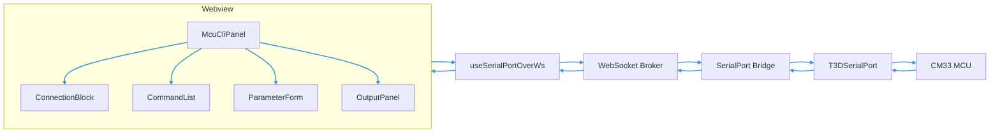
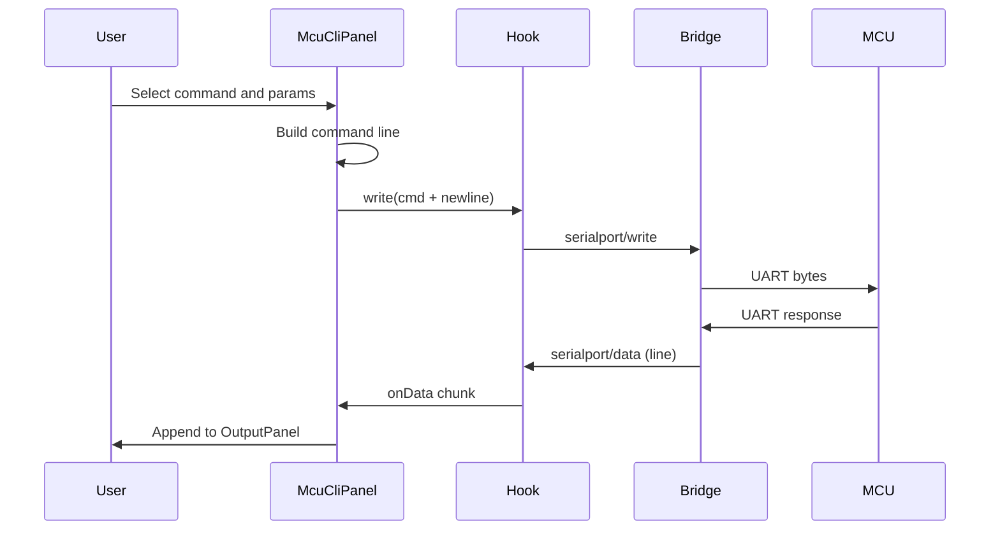

# Architecture

## Tech Stack

- **UI**: React + Tailwind CSS. All MCU CLI UI is built with React; styling is Tailwind (utility-first). Other UI libraries already in package.json may be used (e.g. Radix UI for Select, Tabs, Switch, Tooltip, ScrollArea; lucide-react for icons; react-toastify for toasts; clsx / tailwind-merge / class-variance-authority for styling). Prefer existing dependencies; no new UI libs required for MVP.
- **Existing**: WebSocket client and [useSerialPortOverWs](../webview/serialport/useSerialPortOverWs.ts) hook, serialport-bridge protocol ([protocol.ts](../serialport-bridge/protocol.ts)).
- **New**: CLI command metadata (command list, subcommands, parameters) in a small TS module derived from [cli-command-list.md](cli-command-list.md), e.g. under `webview/` or `plan/` (e.g. `cli-commands.ts`).

## Component Strategy

- **Reusable components preferred**: Put shared building blocks in `webview/ui/components/` (e.g. `Button`, `Select`, `Input`, `Card`). MCU CLI–specific pieces live under `webview/ui/components/mcu-cli/` and should use these primitives where possible so the same components can be used by other panels (Serial tester, Tools, etc.).
- **Composition**: McuCliPanel composes ConnectionBlock, CommandList, ParameterForm, OutputPanel, ConfirmDialog; each of those may use shared UI components. Avoid duplicating layout or form patterns—extract to a shared component if used in more than one place.

## File Structure

**Existing**

- `webview/serialport/SerialPortTester.tsx` — raw serial list/open/close/write + stream (text/hex).
- `webview/serialport/useSerialPortOverWs.ts` — hook for list, open, close, write, stream.
- `webview/TestWebSocketAndSerialBridge.tsx` — tabs: WS, Serial, Model Downloader.

**New (suggested)**

- `webview/ui/components/mcu-cli/` — MCU CLI UI components:
  - `ConnectionBlock.tsx` — connect, list ports, select port/baud, open/close.
  - `CommandList.tsx` or sidebar — choose command (and subcommand) by category.
  - `ParameterForm.tsx` — dynamic form for command parameters (echo, time set, ping, wifi connect, udp send, ipc send).
  - `OutputPanel.tsx` — stream output (line mode), clear, optional text/hex toggle.
  - `ConfirmDialog.tsx` — confirmation for reset/reboot.
- `webview/serialport/McuCliPanel.tsx` — composes the above; uses `useSerialPortOverWs` with line mode; builds CLI line from selected command + subcommand + params and calls `write(cmdLine + '\n')`.
- Optional: `webview/cli-commands.ts` (or `plan/cli-commands.ts`) — command/subcommand/param definitions and UI hints from cli-command-list.

**Integration**

- Either add a new tab “MCU CLI” in [TestWebSocketAndSerialBridge.tsx](../webview/TestWebSocketAndSerialBridge.tsx) that renders `McuCliPanel`, or extend the existing “Serial” tab with a “Raw” vs “CLI” toggle. Decision recorded in [JOURNAL.md](JOURNAL.md).

## Data Flow

- **User → MCU**: User selects command (and subcommand/params) in UI → build string (e.g. `wifi scan`) → `write(cmd + '\n')` via hook → bridge → serial → MCU.
- **MCU → User**: MCU response → serial → bridge → `serialport/data` (line mode) → hook `onData` → append to OutputPanel (optionally parse for errors).
- **MVP**: No new WebSocket topics; only existing list, open, close, write, data, status.

