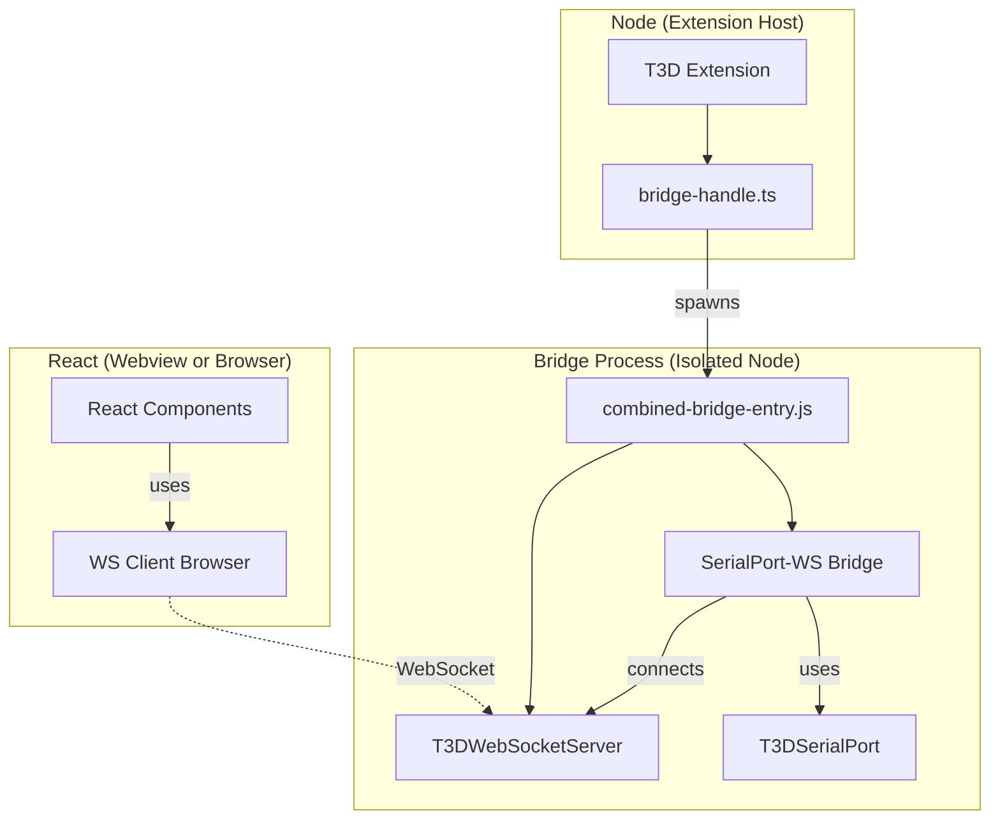
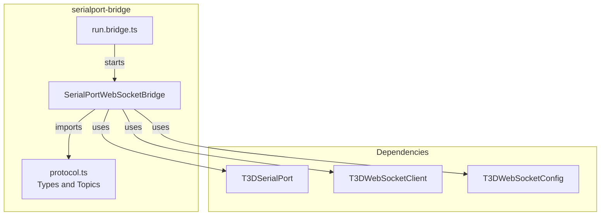
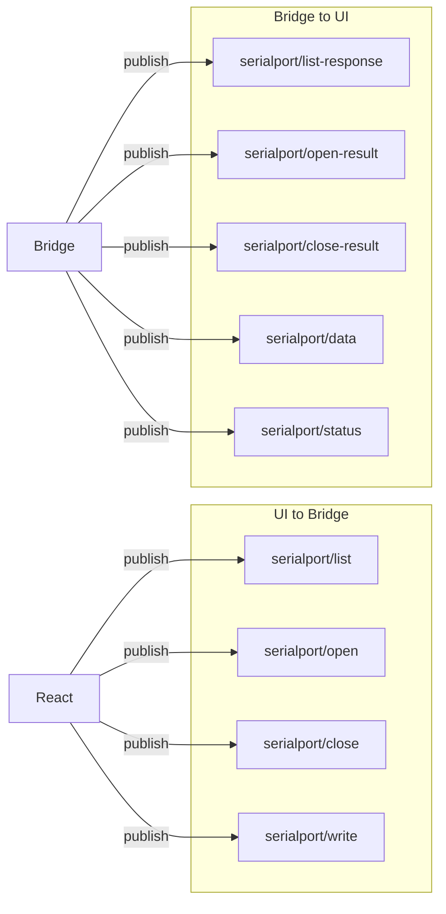
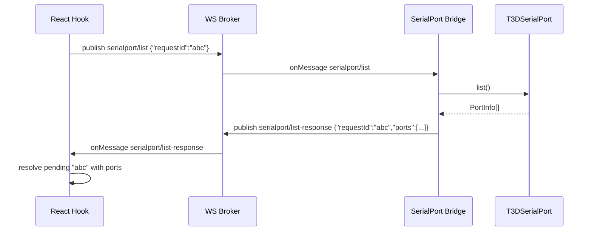
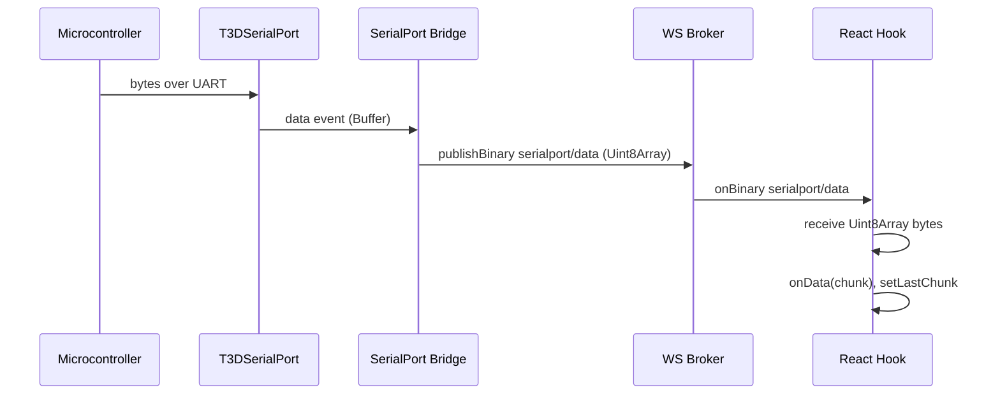
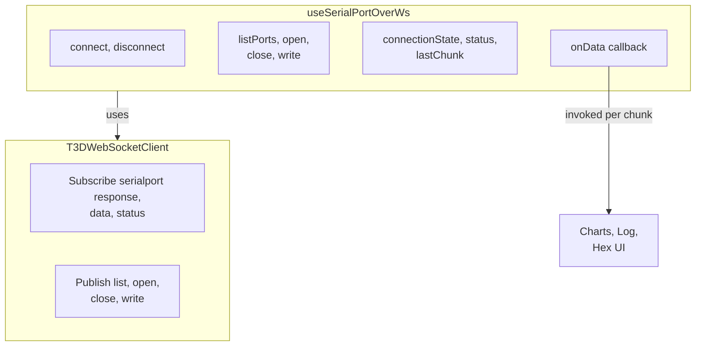

# SerialPort–WebSocket Bridge Architecture

This document describes the architecture of the SerialPort–WebSocket bridge, which enables React components (Webview and Browser) to exchange data with serial ports via the T3D WebSocket broker.

## Table of Contents

- [SerialPort–WebSocket Bridge Architecture](#serialportwebsocket-bridge-architecture)
  - [Table of Contents](#table-of-contents)
  - [System Overview](#system-overview)
    - [Key Points](#key-points)
  - [Bridge Architecture](#bridge-architecture)
    - [Components](#components)
  - [Protocol and Topics](#protocol-and-topics)
    - [Topic Summary](#topic-summary)
  - [Request–Response Flow](#requestresponse-flow)
  - [Data Streaming Flow](#data-streaming-flow)
  - [React-Side API](#react-side-api)
    - [Hook Options and Return Value](#hook-options-and-return-value)
    - [Data Reception Modes](#data-reception-modes)
    - [Usage in Webview Tester](#usage-in-webview-tester)

## System Overview

The bridge runs in Node.js (extension host or standalone). It owns `T3DSerialPort` and connects to the T3D WebSocket broker as a client. React UIs (Webview or Browser) use `T3DWebSocketClient` only; they publish commands and subscribe to `serialport/*` topics. The broker routes messages between the bridge and UI clients.

### Key Points

- **Bridge Process**: In production, both the WebSocket Broker and the Serial Bridge logic are bundled into a single entry point: `src/combined-bridge-entry.ts` (extension root), compiled to `out/combined-bridge-entry.js`. The extension spawns this file via `src/bridge-handle.ts` using `initializeSerialBridge(extensionPath)`.
- **Isolation**: The bridge process is isolated from the VS Code Extension Host to ensure that any issues with native serial port drivers do not crash the main extension.
- **Communication**: The React UI communicates with the Broker over standard WebSockets. The Bridge also connects to this same Broker to relay data.

**File locations (extension root = `t3d-extension/src/`):**

| Location                                    | Description                                                                                               |
| ------------------------------------------- | --------------------------------------------------------------------------------------------------------- |
| `bridge-handle.ts`                          | Spawns `out/combined-bridge-entry.js`, forwards bridge status to webview.                               |
| `combined-bridge-entry.ts`                  | Production entry: starts WebSocket server then both bridges in one process.                              |
| `src/run.bridge.ts`                         | Dev entry: runs **both** Serial Port and Model Downloader bridges (used by `npm run start:bridge`).      |
| `serialport-bridge/`                        | Protocol, `SerialPortWebSocketBridge`, `run.bridge.ts` (runs **only** the Serial Port bridge).            |
| `webview/serialport/useSerialPortOverWs.ts` | React hook.                                                                                               |
| `webview/serialport/SerialPortTester.tsx`   | Webview SerialPort tab UI.                                                                                |

## Bridge Architecture

The bridge module consists of the protocol types, the bridge class, and a standalone run script.

### Components

| Component                     | Role                                                                                                                                                                                                                   |
| ----------------------------- | ---------------------------------------------------------------------------------------------------------------------------------------------------------------------------------------------------------------------- |
| **protocol.ts**               | Platform-agnostic types and `SERIALPORT_TOPICS`. No Node/serialport imports so the hook can use it from Webview.                                                                                                       |
| **SerialPortWebSocketBridge** | Creates `T3DWebSocketClient` and `T3DSerialPort`. Subscribes to list, open, close, write. Handles messages, calls serial APIs, publishes responses and streams data. Exposes `startBridge` / `stopBridge` (singleton). |
| **combined-bridge-entry.ts**  | **Production entry point** in `src/` (extension root). Starts `T3DWebSocketServer` then `startBridge({ wsUrl })` in one process. Bundled to `out/combined-bridge-entry.js` and spawned by `bridge-handle.ts`.          |
| **run.bridge.ts**             | Standalone script in this folder for running **only** the Serial Port bridge (requires a separate broker). For local dev with both Serial Port and Model Downloader bridges, use `npm run start:bridge` (which runs `src/run.bridge.ts` and the broker). |

## Protocol and Topics

Control messages use JSON. For high-volume raw serial bytes, the bridge publishes **binary** WebSocket frames on `serialport/data` (no base64 overhead). Line-mode packets are still published as JSON with base64 payload and `encoding`.

In practice:

- **Requests / results / status**: JSON
- **Raw serial stream (`serialport/data`)**: binary frames
- **Line stream (`serialport/data` with `encoding`)**: JSON `{ data: base64, encoding: 'utf8', ... }`

### Topic Summary

| Topic                      | Direction   | Payload                                                       | Notes                                                         |
| -------------------------- | ----------- | ------------------------------------------------------------- | ------------------------------------------------------------- |
| `serialport/list`          | UI → Bridge | `{ requestId }`                                               | List available ports                                          |
| `serialport/list-response` | Bridge → UI | `{ requestId, ports, error? }`                                | Response                                                      |
| `serialport/open`          | UI → Bridge | `{ requestId, path, baudRate, mode?, ... }`                   | Open port (mode: 'data'\|'line'\|'both')                      |
| `serialport/open-result`   | Bridge → UI | `{ requestId, success, error? }`                              | Result                                                        |
| `serialport/close`         | UI → Bridge | `{ requestId }`                                               | Close port                                                    |
| `serialport/close-result`  | Bridge → UI | `{ requestId, success, error? }`                              | Result                                                        |
| `serialport/write`         | UI → Bridge | `{ requestId?, data }`                                        | Data as string or base64; fire-and-forget (no response topic) |
| `serialport/data`          | Bridge → UI | **binary** (raw bytes) or JSON `{ data: base64, encoding }`   | Raw stream is binary; line mode is JSON                       |
| `serialport/status`        | Bridge → UI | `{ isOpen, path, baudRate, bytesRead, bytesWritten, error? }` | On open, close, error                                         |

## Request–Response Flow

Requests include a `requestId` (UUID or similar). The hook stores pending promises keyed by `requestId` and resolves or rejects when the matching response arrives.

The same pattern applies for **open** and **close**: UI publishes with `requestId`, bridge performs the operation, publishes result with the same `requestId`, hook resolves the corresponding promise.

## Data Streaming Flow

Serial data from the MCU is streamed to the UI for live visualization (logs, hex dumps, charts). Each chunk is published immediately on `serialport/data`; no batching by default.

- **Bridge**:
  - Raw bytes (`data` event): publishes **binary** `serialport/data` frames
  - Parsed lines (`line` event): publishes JSON `serialport/data` messages with `encoding: 'utf8'` and base64 `data`
- **Hook**: Subscribes to `serialport/data` in both JSON and binary forms.
  - `mode: 'data'`: process binary raw frames
  - `mode: 'line'`: process JSON line packets (`encoding` present)
  - `mode: 'both'`: process both
- **Visualization**: Code uses `onData` to update charts, logs, or hex view.

## React-Side API

The `useSerialPortOverWs` hook (`src/webview/serialport/useSerialPortOverWs.ts`) wraps `T3DWebSocketClient` and the request–response protocol.

### Hook Options and Return Value

| Option   | Type                          | Description                                                               |
| -------- | ----------------------------- | ------------------------------------------------------------------------- |
| `wsUrl`  | `string`                      | WebSocket broker URL. Default: `T3D_DEFAULT_WS_CLIENT_URL`                |
| `onData` | `(chunk: Uint8Array) => void` | Called for each `serialport/data` chunk. Use for streaming visualization. |

| Return                  | Type                                            | Description                                                                                                  |
| ----------------------- | ----------------------------------------------- | ------------------------------------------------------------------------------------------------------------ |
| `connectionState`       | `string`                                        | `disconnected`, `connecting`, `connected`, `reconnecting`, `error`                                           |
| `status`                | `SerialPortStatusPayload \| null`               | Latest bridge status (isOpen, path, baudRate, bytesRead, bytesWritten, error)                                |
| `listPorts`             | `() => Promise<PortInfo[]>`                     | List available ports                                                                                         |
| `open`                  | `(config) => Promise<void>`                     | Open port (path, baudRate, mode?, readline?, readlineDelimiter?). Optional mode: 'data' \| 'line' \| 'both'. |
| `close`                 | `() => Promise<void>`                           | Close port                                                                                                   |
| `write`                 | `(data: string \| Uint8Array) => Promise<void>` | Send data (string or raw bytes)                                                                              |
| `connect`, `disconnect` | `() => Promise<void>`                           | Connect/disconnect WebSocket to broker                                                                       |
| `isConnected`           | `boolean`                                       | True when WebSocket is connected                                                                             |
| `lastChunk`             | `Uint8Array \| null`                            | Most recent serial chunk (alternative to `onData` for polling)                                               |

### Data Reception Modes

The bridge supports three data reception modes, controlled by the `mode` parameter in the `open` request:

| Mode   | Description                     | Events Emitted                | Use Case                    |
| ------ | ------------------------------- | ----------------------------- | --------------------------- |
| `data` | Raw bytes only                  | `data` events (Buffer)        | Binary protocols, hex dumps |
| `line` | Parsed lines only               | `line` events (string)        | Text protocols, log parsing |
| `both` | Both raw bytes and parsed lines | Both `data` and `line` events | Debugging, dual processing  |

**Mode Selection:**

- Set `mode: 'data' | 'line' | 'both'` in the `open` request
- The bridge configures `T3DSerialPort` accordingly
- The hook filters incoming `serialport/data` messages based on the `encoding` field:
  - Messages without `encoding` = raw bytes (from `data` event)
  - Messages with `encoding` = parsed lines (from `line` event)

**Backward Compatibility:**

- The deprecated `readline: boolean` option is still supported
- `readline: true` maps to `mode: 'line'`
- `readline: false` maps to `mode: 'data'`

### Usage in Webview Tester

The SerialPort tab (`src/webview/serialport/SerialPortTester.tsx`) uses `useSerialPortOverWs` with `onData` to append chunks to a stream log. Users can:

- Select reception mode: **Data** (raw bytes), **Line** (parsed lines), or **Both**
- Set readline delimiter (e.g. `\n`) when using Line or Both mode
- Switch between **Text** and **Hex** view
- Clear the log
- List, open, close ports and write data

The same setup works in Browser when a broker and bridge are running locally. Use `npm run start:bridge` to run `run.ws.server.ts` and `src/run.bridge.ts` (both bridges) as two processes, or in production the extension spawns the single `out/combined-bridge-entry.js` process (broker + bridge).
