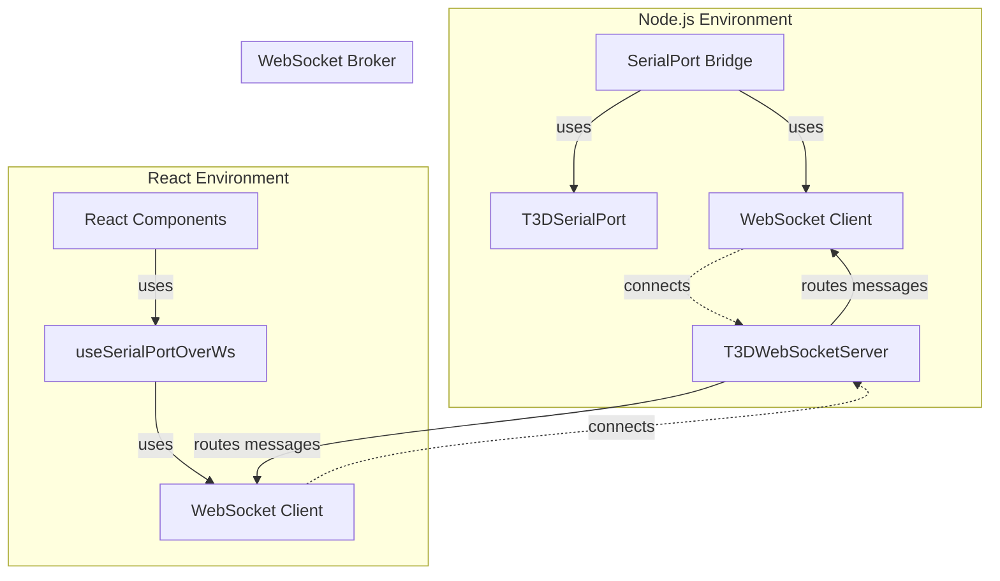
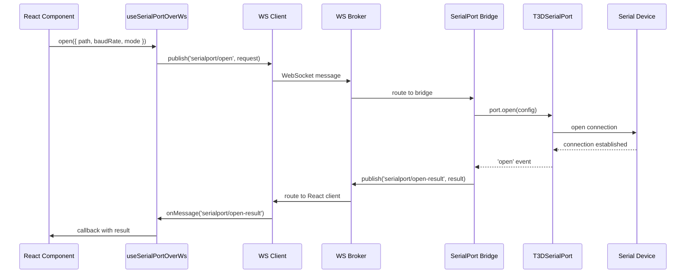
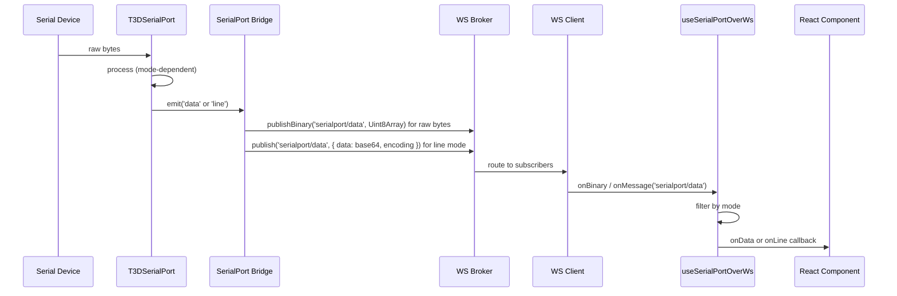

# SerialPort–WebSocket Bridge Guide

This guide explains how to run and use the SerialPort–WebSocket bridge system, which enables React components (both in VS Code webviews and browsers) to communicate with serial ports through a WebSocket broker.

## Table of Contents

- [SerialPort–WebSocket Bridge Guide](#serialportwebsocket-bridge-guide)
  - [Table of Contents](#table-of-contents)
  - [Quick Start](#quick-start)
  - [How to Run](#how-to-run)
    - [Browser Mode (Development)](#browser-mode-development)
    - [VS Code Extension Mode](#vs-code-extension-mode)
    - [Manual Start (Individual Services)](#manual-start-individual-services)
    - [Configuration](#configuration)
      - [Default Ports and URLs](#default-ports-and-urls)
      - [Command-Line Arguments](#command-line-arguments)
      - [Environment Variables](#environment-variables)
  - [How It Works](#how-it-works)
    - [System Architecture](#system-architecture)
    - [Component Overview](#component-overview)
    - [Data Flow](#data-flow)
      - [Opening a Serial Port](#opening-a-serial-port)
      - [Receiving Data](#receiving-data)
    - [Communication Protocol](#communication-protocol)
  - [Data Reception Modes](#data-reception-modes)
    - [Mode: 'data' (Raw Bytes)](#mode-data-raw-bytes)
    - [Mode: 'line' (Parsed Lines)](#mode-line-parsed-lines)
    - [Mode: 'both' (Both Simultaneously)](#mode-both-both-simultaneously)
  - [Usage Examples](#usage-examples)
    - [React Hook Usage](#react-hook-usage)
    - [SerialPortTester Component](#serialporttester-component)
  - [Troubleshooting](#troubleshooting)
    - [Connection Issues](#connection-issues)
    - [Port Listing Issues](#port-listing-issues)
    - [Data Not Received](#data-not-received)
    - [Mode-Specific Issues](#mode-specific-issues)
  - [Advanced Topics](#advanced-topics)
    - [Custom WebSocket URLs](#custom-websocket-urls)
    - [Environment Variables](#environment-variables-1)
    - [Error Handling](#error-handling)
  - [Related Documentation](#related-documentation)

## Quick Start

The fastest way to get started:

```bash
# From t3d-extension directory
npm run start:bridge
```

This starts both the WebSocket server and serial port bridge. Then:
- **Browser mode**: Open your React app in a browser
- **VS Code mode**: Press F5 to run the extension

## How to Run

### Browser Mode (Development)

When developing in a browser, you need to start the bridge servers manually:

1. **Start both services** (recommended):
   ```bash
   npm run start:bridge
   ```
   
   This runs:
   - WebSocket server on `ws://localhost:9998`
   - Both bridges (Serial Port and Model Downloader) via `src/run.bridge.ts`, which connects to the WebSocket server

2. **Start your React app** (in a separate terminal):
   ```bash
   npm run dev:webview
   # or
   npm run dev:browser
   ```

3. **Open your browser** and navigate to the development server URL (usually `http://localhost:5173`)

**Note**: The `start:bridge` script uses `concurrently` to run both services with colored, labeled output. If either service fails, both will be terminated (`--kill-others-on-fail true`).

### VS Code Extension Mode (Production)

When running as an installed extension (or via F5):

1.  **Automatic Launch**: The extension automatically spawns the **Combined Bridge Process** using VS Code's internal Node.js runtime (`process.execPath`).
2.  **Self-Contained**: It runs the pre-bundled `out/combined-bridge-entry.js` file, so users do not need `npm` or Node.js installed on their system.
3.  **Process Isolation**: The bridge runs as a separate process from the main extension to protect against hardware driver crashes and ensure compatibility with native modules.

**Manual Control**:
- Commands: `TERNION: Start Serial Bridge` and `TERNION: Stop Serial Bridge`.
- Logs: Check the **"TERNION Serial Bridge"** Output Channel in the VS Code bottom panel.

### Manual Start (Individual Services)

If you need to run services separately or with custom configuration:

**WebSocket Server Only:**
```bash
npx tsx src/websocket/run.ws.server.ts
# or with custom port
npx tsx src/websocket/run.ws.server.ts --port=9999
```

**Serial Port Bridge Only:**
```bash
npx tsx src/serialport-bridge/run.bridge.ts
# or with custom WebSocket URL
npx tsx src/serialport-bridge/run.bridge.ts --url=ws://localhost:9999
```

**Note**: The bridge requires the WebSocket server to be running first.

### Configuration

#### Default Ports and URLs

- **WebSocket Server**: `ws://localhost:9998` (port 9998, host 0.0.0.0)
- **Serial Port Bridge**: Connects to `ws://localhost:9998` by default

#### Command-Line Arguments

**WebSocket Server** (`run.ws.server.ts`):
- `--port=<number>`: WebSocket server port (default: 9998)
- `--host=<string>`: WebSocket server host (default: 0.0.0.0)

**Serial Port Bridge only** (`serialport-bridge/run.bridge.ts`) and **Both bridges** (`src/run.bridge.ts`):
- `--url=<url>`: WebSocket broker URL (default: ws://localhost:9998)

#### Environment Variables

You can also configure via environment variables:

```bash
# WebSocket Server
export T3D_WS_PORT=9999
export T3D_WS_HOST=127.0.0.1
npx tsx src/websocket/run.ws.server.ts

# Serial Port Bridge
export T3D_WS_CLIENT_URL=ws://localhost:9999
npx tsx src/serialport-bridge/run.bridge.ts
```

## How It Works

### System Architecture

The system consists of three main components:



### Component Overview

1. **T3DWebSocketServer** (`src/websocket/T3DWebSocketServer.ts`)
   - WebSocket broker that routes messages between clients.
   - Handles subscriptions, publishing, and QoS.
   - Runs on port 9998 by default.

2. **combined-bridge-entry.ts** (`src/combined-bridge-entry.ts`)
   - **Production Orchestrator**. Launches both the WebSocket Broker and the Bridge logic in a single isolated process.
   - Bundled into a standalone `.js` file for distribution.

3. **SerialPortWebSocketBridge** (`src/serialport-bridge/SerialPortWebSocketBridge.ts`)
   - Logic that manages serial port hardware via `T3DSerialPort`.
   - Maps between JSON commands (WebSocket) and Serial Port actions.

4. **useSerialPortOverWs** (`src/webview/serialport/useSerialPortOverWs.ts`)
   - React hook providing the serial API to the UI over WebSockets.

### Data Flow

#### Opening a Serial Port



#### Receiving Data



### Communication Protocol

The system uses a topic-based publish/subscribe protocol:

**Topics:**
- `serialport/open` - Open a serial port (request)
- `serialport/open-result` - Open result (response)
- `serialport/close` - Close a serial port (request)
- `serialport/close-result` - Close result (response)
- `serialport/write` - Write data to port (request)
- `serialport/write-result` - Write result (response)
- `serialport/list` - List available ports (request)
- `serialport/list-result` - List result (response)
- `serialport/data` - Serial data received (event)

**Message Format:**

`serialport/data` has two encodings:

- **Raw bytes**: binary WebSocket frames (preferred for high volume)
- **Line packets**: JSON `{ data: base64, encoding: 'utf8', ... }`

All other topics are JSON.

```typescript
{
  topic: 'serialport/open',
  payload: {
    requestId: 'uuid',
    path: 'COM3',
    baudRate: 921600,
    mode: 'data' | 'line' | 'both'
  }
}
```

See `src/serialport-bridge/protocol.ts` for complete protocol definitions.

## Data Reception Modes

The system supports three data reception modes, controlled by the `mode` parameter when opening a port:

### Mode: 'data' (Raw Bytes)

Receives raw `Buffer` chunks as they arrive from the serial port.

**Use case**: Binary protocols, custom parsing, low-level data handling

**Example:**
```typescript
const { open, onData } = useSerialPortOverWs();

open({
  path: 'COM3',
  baudRate: 921600,
  mode: 'data'
});

onData((buffer: Buffer) => {
  console.log('Raw bytes:', buffer.toString('hex'));
});
```

### Mode: 'line' (Parsed Lines)

Receives complete lines (strings) when a delimiter is found (default: `\n`).

**Use case**: Text-based protocols, log parsing, line-oriented communication

**Example:**
```typescript
const { open, onLine } = useSerialPortOverWs();

open({
  path: 'COM3',
  baudRate: 921600,
  mode: 'line',
  readlineDelimiter: '\n',
  readlineEncoding: 'utf8'
});

onLine((line: string) => {
  console.log('Received line:', line);
});
```

### Mode: 'both' (Both Simultaneously)

Receives both raw bytes AND parsed lines simultaneously.

**Use case**: Debugging, monitoring, applications that need both representations

**Example:**
```typescript
const { open, onData, onLine } = useSerialPortOverWs();

open({
  path: 'COM3',
  baudRate: 921600,
  mode: 'both'
});

onData((buffer: Buffer) => {
  console.log('Raw bytes:', buffer.length);
});

onLine((line: string) => {
  console.log('Parsed line:', line);
});
```

**Implementation Details:**
- Uses a `PassThrough` stream to duplicate the data flow
- Raw data is emitted directly
- The same stream feeds a `ReadlineParser` for line parsing
- Both events are emitted independently

## Usage Examples

### React Hook Usage

```typescript
import { useSerialPortOverWs } from './useSerialPortOverWs';

function MyComponent() {
  const {
    isConnected,
    isOpen,
    open,
    close,
    write,
    listPorts,
    onData,
    onLine,
    error
  } = useSerialPortOverWs();

  // List available ports
  useEffect(() => {
    listPorts().then(ports => {
      console.log('Available ports:', ports);
    });
  }, []);

  // Handle data reception
  useEffect(() => {
    if (mode === 'data' || mode === 'both') {
      onData((buffer: Buffer) => {
        console.log('Raw data:', buffer);
      });
    }
    if (mode === 'line' || mode === 'both') {
      onLine((line: string) => {
        console.log('Line:', line);
      });
    }
  }, [mode]);

  // Open port
  const handleOpen = () => {
    open({
      path: 'COM3',
      baudRate: 921600,
      mode: 'line'
    }, (result) => {
      if (result.success) {
        console.log('Port opened successfully');
      } else {
        console.error('Failed to open port:', result.error);
      }
    });
  };

  return (
    <div>
      <button onClick={handleOpen} disabled={isOpen}>
        Open Port
      </button>
      <button onClick={close} disabled={!isOpen}>
        Close Port
      </button>
      <button onClick={() => write(Buffer.from('Hello'))} disabled={!isOpen}>
        Write Data
      </button>
    </div>
  );
}
```

### SerialPortTester Component

The `SerialPortTester` component (`src/webview/serialport/SerialPortTester.tsx`) provides a complete UI for testing serial port functionality:

- Port selection dropdown
- Mode selection (data/line/both)
- Connection controls (open/close)
- Data display (raw bytes or lines)
- Write functionality
- Status indicators

To use it, import and render:
```typescript
import { SerialPortTester } from './serialport/SerialPortTester';

function App() {
  return <SerialPortTester />;
}
```

## Troubleshooting

### Connection Issues

**Problem**: React component cannot connect to WebSocket server

**Symptoms**:
- Console errors: `ECONNREFUSED`, `WebSocket connection failed`
- `isConnected` remains `false`

**Solutions**:
1. Verify WebSocket server is running:
   ```bash
   # Check if port 9998 is in use
   netstat -an | grep 9998  # Windows
   lsof -i :9998            # macOS/Linux
   ```

2. Check server logs for errors

3. Verify WebSocket URL matches server configuration:
   - Default: `ws://localhost:9998`
   - Check `T3DWebSocketConfig.ts` for defaults

4. Ensure firewall allows connections on port 9998

### Port Listing Issues

**Problem**: "List ports" button shows no ports or times out

**Symptoms**:
- Dropdown shows "Select..." indefinitely
- Console shows: "List ports request timeout"

**Solutions**:
1. **Verify bridge is running**: The serial port bridge must be running to handle list requests
   ```bash
   npm run start:bridge
   ```

2. **Check bridge logs**: Look for errors in the bridge console output

3. **Verify WebSocket connection**: The bridge must be connected to the broker
   - Bridge log should show: `[serialport-bridge] connected to ws://localhost:9998`

4. **Timeout**: The hook has a 5-second timeout. If the bridge is slow to respond, increase the timeout in `useSerialPortOverWs.ts`

### Data Not Received

**Problem**: Serial port is open but no data is received

**Symptoms**:
- Port opens successfully
- `isOpen` is `true`
- No data callbacks are triggered

**Solutions**:
1. **Verify hardware connection**: Ensure the serial device is connected and powered

2. **Check baud rate**: Mismatched baud rates cause garbled or missing data

3. **Verify mode**: Ensure you're listening to the correct callback:
   - `mode: 'data'` → use `onData()`
   - `mode: 'line'` → use `onLine()`
   - `mode: 'both'` → use both `onData()` and `onLine()`

4. **Check data flow**: Add logging in the bridge to verify data is being received from the hardware

5. **Verify subscriptions**: Check broker logs to ensure the React client is subscribed to `serialport/data`

### Mode-Specific Issues

**Problem**: 'line' mode not displaying data

**Causes**:
- Delimiter mismatch (default is `\n`, device might use `\r\n`)
- Encoding mismatch (default is `utf8`)

**Solutions**:
```typescript
open({
  path: 'COM3',
  baudRate: 921600,
  mode: 'line',
  readlineDelimiter: '\r\n',  // Try different delimiters
  readlineEncoding: 'utf8'     // Or 'ascii', 'latin1', etc.
});
```

**Problem**: 'both' mode behaves like 'data' mode

**Cause**: Mode filtering in the hook might not be set correctly

**Solution**: Ensure `modeRef.current` is updated immediately when `open()` is called (this should be handled automatically, but check hook implementation)

## Advanced Topics

### Custom WebSocket URLs

To use a different WebSocket server:

**Via command line:**
```bash
npx tsx src/serialport-bridge/run.bridge.ts --url=ws://192.168.1.100:9999
```

**Via environment variable:**
```bash
export T3D_WS_CLIENT_URL=ws://192.168.1.100:9999
npx tsx src/serialport-bridge/run.bridge.ts
```

**In React code** (if hook supports it):
```typescript
const client = new T3DWebSocketClient({
  url: 'ws://192.168.1.100:9999'
});
```

### Environment Variables

| Variable            | Default               | Description           |
| ------------------- | --------------------- | --------------------- |
| `T3D_WS_PORT`       | `9998`                | WebSocket server port |
| `T3D_WS_HOST`       | `0.0.0.0`             | WebSocket server host |
| `T3D_WS_CLIENT_URL` | `ws://localhost:9998` | WebSocket client URL  |

### Error Handling

The system provides error information through:

1. **Hook callbacks**: `open()`, `close()`, `write()` callbacks include `error` fields
2. **Hook state**: `error` state in `useSerialPortOverWs`
3. **Console logs**: All components log errors to console with prefixes:
   - `[t3d-ws]` - WebSocket server
   - `[serialport-bridge]` - Serial port bridge
   - `[useSerialPortOverWs]` - React hook

**Example error handling:**
```typescript
open({
  path: 'COM3',
  baudRate: 921600
}, (result) => {
  if (!result.success) {
    console.error('Open failed:', result.error);
    // Handle error (show notification, retry, etc.)
  }
});
```

## Related Documentation

- **[ARCHITECTURE.md](./ARCHITECTURE.md)** - Detailed architecture and protocol documentation
- **[T3DSerialPort ARCHITECTURE.md](../serialport/ARCHITECTURE.md)** - Serial port wrapper documentation
- **[WebSocket ARCHITECTURE.md](../websocket/ARCHITECTURE.md)** - WebSocket broker documentation
- **[SerialPortTester Component](../webview/serialport/SerialPortTester.tsx)** - Complete UI example

---

**Last Updated**: 2026-01-22 10:30:34
