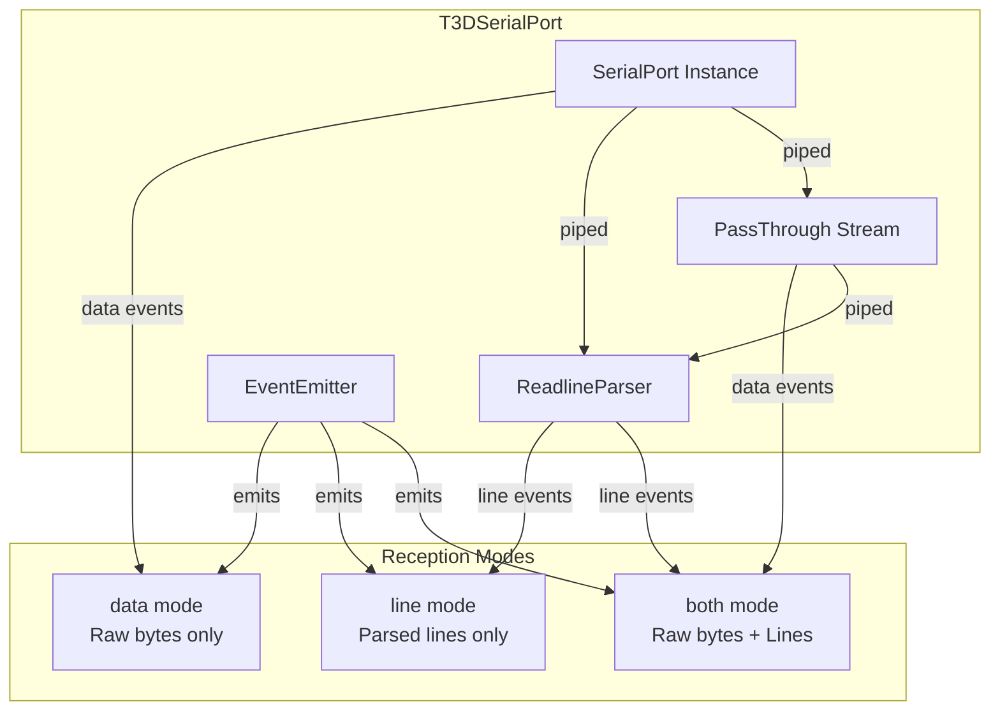
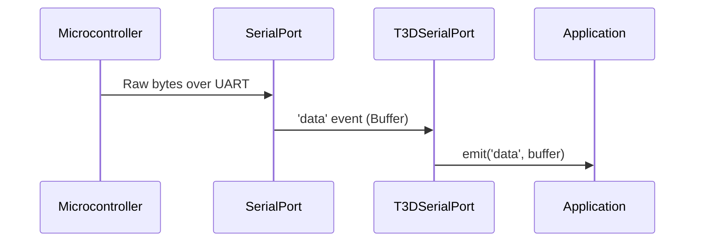
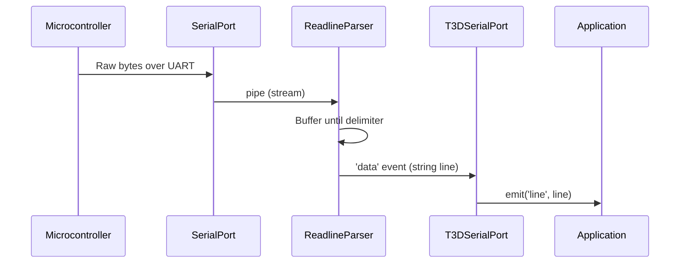
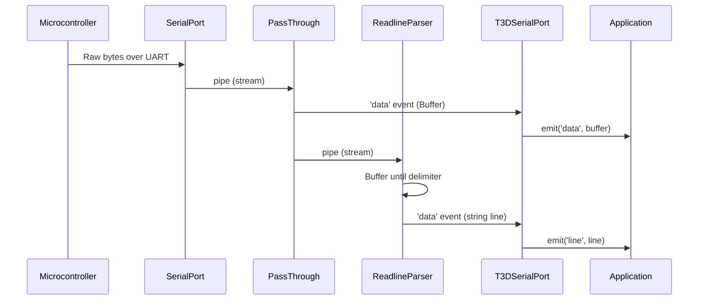
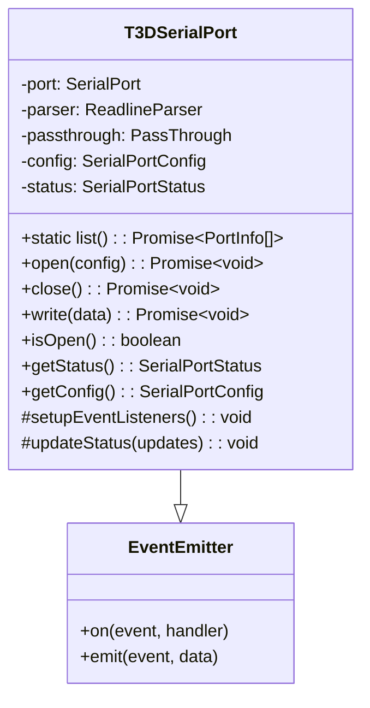

# T3DSerialPort Architecture

This document describes the architecture of the `T3DSerialPort` class, a wrapper around the `serialport` package that provides serial port communication functionality with support for multiple data reception modes.

## Table of Contents

- [T3DSerialPort Architecture](#t3dserialport-architecture)
  - [Table of Contents](#table-of-contents)
  - [Overview](#overview)
  - [Data Reception Modes](#data-reception-modes)
    - [Mode: 'data' (Raw Bytes)](#mode-data-raw-bytes)
    - [Mode: 'line' (Parsed Lines)](#mode-line-parsed-lines)
    - [Mode: 'both' (Both Simultaneously)](#mode-both-both-simultaneously)
  - [Class Structure](#class-structure)
  - [Stream Architecture](#stream-architecture)
    - ['data' Mode Stream Flow](#data-mode-stream-flow)
    - ['line' Mode Stream Flow](#line-mode-stream-flow)
    - ['both' Mode Stream Flow](#both-mode-stream-flow)
  - [Event System](#event-system)
  - [Usage Examples](#usage-examples)
    - [Basic Usage (Raw Bytes)](#basic-usage-raw-bytes)
    - [Line Mode Usage](#line-mode-usage)
    - [Both Mode Usage](#both-mode-usage)
    - [Backward Compatibility](#backward-compatibility)

## Overview

`T3DSerialPort` is a Node.js class that wraps the `serialport` package, providing:
- Serial port listing, opening, closing, and writing
- Multiple data reception modes (raw bytes, parsed lines, or both)
- Event-based API for data reception
- Status tracking (bytes read/written, connection state)
- Error handling and cleanup



## Data Reception Modes

The class supports three data reception modes, controlled by the `mode` configuration option:

### Mode: 'data' (Raw Bytes)

In this mode, the class emits raw `Buffer` chunks as they arrive from the serial port.



**Configuration:**
```typescript
await port.open({
  path: 'COM3',
  baudRate: 115200,
  mode: 'data'  // or omit (default)
});
```

**Event:**
- `port.on('data', (buffer: Buffer) => { ... })` - Emitted for each raw chunk

### Mode: 'line' (Parsed Lines)

In this mode, the class pipes data through a `ReadlineParser` and emits complete lines (strings) when a delimiter is found.



**Configuration:**
```typescript
await port.open({
  path: 'COM3',
  baudRate: 115200,
  mode: 'line',
  readlineDelimiter: '\n',  // optional, default: '\n'
  readlineEncoding: 'utf8'  // optional, default: 'utf8'
});
```

**Event:**
- `port.on('line', (line: string) => { ... })` - Emitted for each complete line

### Mode: 'both' (Both Simultaneously)

In this mode, the class emits both raw bytes AND parsed lines simultaneously. This is achieved using a `PassThrough` stream to duplicate the data flow.



**Configuration:**
```typescript
await port.open({
  path: 'COM3',
  baudRate: 115200,
  mode: 'both',
  readlineDelimiter: '\n',
  readlineEncoding: 'utf8'
});
```

**Events:**
- `port.on('data', (buffer: Buffer) => { ... })` - Raw bytes
- `port.on('line', (line: string) => { ... })` - Parsed lines

**Implementation Details:**
- A `PassThrough` stream is created to duplicate the data flow
- Raw data is emitted directly from the `PassThrough` stream
- The same stream is piped to `ReadlineParser` for line parsing
- Both events are emitted independently, allowing applications to process either or both

## Class Structure



## Stream Architecture

The stream architecture varies based on the selected mode:

### 'data' Mode Stream Flow

```
SerialPort → [data events] → T3DSerialPort → Application
```

### 'line' Mode Stream Flow

```
SerialPort → [pipe] → ReadlineParser → [data events] → T3DSerialPort → Application
```

### 'both' Mode Stream Flow

```
SerialPort → [pipe] → PassThrough → [data events] → T3DSerialPort → Application
                                    ↓
                              [pipe] → ReadlineParser → [data events] → T3DSerialPort → Application
```

## Event System

The class extends `EventEmitter` and emits the following events:

| Event            | Payload            | Mode(s)        | Description              |
| ---------------- | ------------------ | -------------- | ------------------------ |
| `open`           | -                  | All            | Port successfully opened |
| `close`          | -                  | All            | Port closed              |
| `error`          | `Error`            | All            | Error occurred           |
| `data`           | `Buffer`           | 'data', 'both' | Raw bytes received       |
| `line`           | `string`           | 'line', 'both' | Parsed line received     |
| `status-changed` | `SerialPortStatus` | All            | Status updated           |

## Usage Examples

### Basic Usage (Raw Bytes)

```typescript
import { T3DSerialPort } from './T3DSerialPort';

const port = new T3DSerialPort();

port.on('data', (buffer: Buffer) => {
  console.log('Received:', buffer.toString('hex'));
});

await port.open({
  path: 'COM3',
  baudRate: 115200,
  mode: 'data'
});
```

### Line Mode Usage

```typescript
const port = new T3DSerialPort();

port.on('line', (line: string) => {
  console.log('Received line:', line);
});

await port.open({
  path: 'COM3',
  baudRate: 115200,
  mode: 'line',
  readlineDelimiter: '\n'
});
```

### Both Mode Usage

```typescript
const port = new T3DSerialPort();

port.on('data', (buffer: Buffer) => {
  console.log('Raw bytes:', buffer.length);
});

port.on('line', (line: string) => {
  console.log('Parsed line:', line);
});

await port.open({
  path: 'COM3',
  baudRate: 115200,
  mode: 'both'
});
```

### Backward Compatibility

The `readline` boolean option is still supported but deprecated:

```typescript
// Old way (deprecated)
await port.open({
  path: 'COM3',
  baudRate: 115200,
  readline: true  // Maps to mode: 'line'
});

// New way (recommended)
await port.open({
  path: 'COM3',
  baudRate: 115200,
  mode: 'line'
});
```
