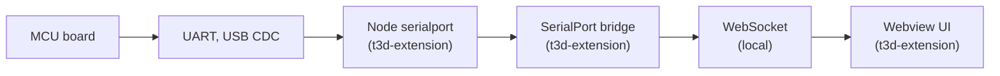

# SerialPort development plan (t3d-extension)

This document is a **high-level plan** for extending SerialPort support in the **VS Code extension**.

## Goals

- Support **VS Code desktop** SerialPort mode:
  - MCU ↔ Node `serialport` ↔ bridge ↔ webview UI
- Keep the UI flexible so **multiple sub-applications** can choose how to interpret data:
  - Text, JSON, or Binary (application-defined)
- Keep responsibilities separated so we can later support **browser** builds without rewriting the UI.

## Non-goals (for now)

- Final protocol/framing decisions for binary payloads
- Publishing/telemetry/analytics
- MCU firmware design

## Where code lives

- **Node serial implementation**: `t3d-extension/src/serialport/`
- **Bridge (SerialPort ↔ WebSocket)**: `t3d-extension/src/serialport-bridge/`
- **Webview UI hooks + panels**: `t3d-extension/src/webview/serialport/`

## Architecture (current + target)

## Development phases

### Phase1_Baseline

- Ensure the extension can reliably:
  - List ports
  - Connect and disconnect
  - Send and receive bytes
  - Report status to the webview (connected, error, port info)

### Phase2_CodecSelection

- Add a **user-selectable decode/encode mode** per sub-application:
  - Text mode (line-based or raw text)
  - JSON mode (line-delimited JSON recommended)
  - Binary mode (framed packets; framing TBD)

### Phase3_SubApplicationIntegration

- Provide a stable internal interface so each sub-application can:
  - Subscribe to received messages
  - Send messages
  - Store its own settings (port, baud, codec, framing options)

### Phase4_BrowserSupportStrategy

- Keep the webview UI compatible with a browser build by ensuring:
  - Transport-specific code stays in `t3d-extension` (Node-only)
  - UI consumes a transport-agnostic message API
- Browser paths (future):
  - WebSerial when available
  - Network bridge when WebSerial is not available

## Test approach (lightweight)

- **Local loopback tests** using a virtual serial port pair (OS tooling) where available
- **Example scripts** under `t3d-extension/src/serialport/examples/` for manual validation
- A small “SerialPort Tester” UI for connect/send/receive sanity checks

