# T3D WebSocket Architecture

This document describes the architecture of the T3D WebSocket broker and client implementation, including cross-platform support, message routing, and Quality of Service (QoS) handling.

## Table of Contents

- [System Overview](#system-overview)
- [Server Architecture](#server-architecture)
- [Client Architecture](#client-architecture)
- [Transport Layer](#transport-layer)
- [Message Protocol](#message-protocol)
- [QoS Flow](#qos-flow)
- [Topic Routing](#topic-routing)

## System Overview

The T3D WebSocket system consists of a broker server and cross-platform clients that communicate using a custom protocol over WebSocket connections.

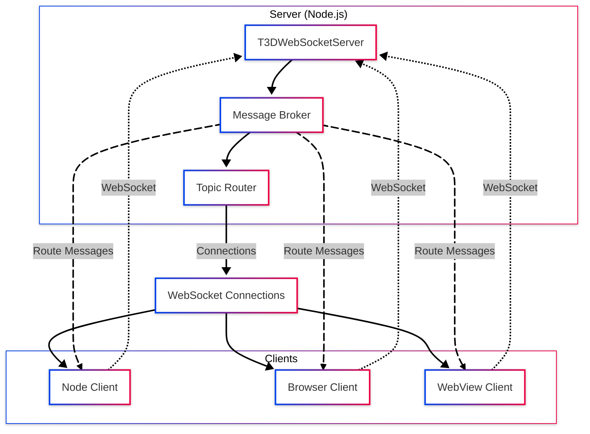

### Key Features

- **Multi-client broker**: Supports unlimited concurrent WebSocket connections
- **MQTT-style topics**: Topic-based pub/sub with wildcard support (`+`, `#`)
- **Dual channels**: Separate JSON and binary data channels
- **QoS levels**: Supports QoS 0 (at most once), QoS 1 (at least once), and QoS 2 (exactly once)
- **Cross-platform client**: Works in Node.js, Browser, and VS Code WebView environments

## Server Architecture

The server acts as a message broker, routing messages from publishers to subscribers based on topic patterns.

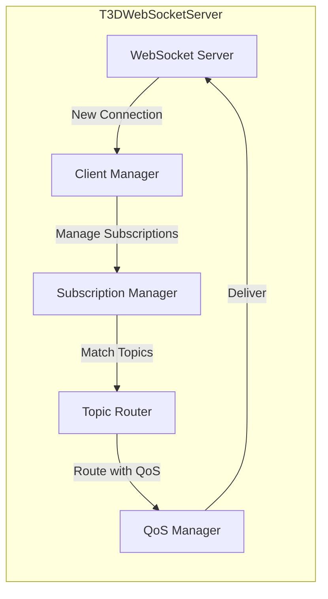

### Server Components

#### Client Manager

- Tracks all connected clients
- Maintains client state (connected, subscriptions, etc.)
- Handles client disconnection cleanup

#### Subscription Manager

- Stores topic subscriptions per client
- Supports MQTT wildcards (`+` for single-level, `#` for multi-level)
- Maintains separate subscription sets for JSON and binary channels

#### Topic Router

- Matches published topics against subscription patterns
- Handles wildcard expansion
- Routes messages to all matching subscribers

#### QoS Manager

- Implements QoS 0, 1, and 2 delivery guarantees
- Manages message acknowledgments (PUBACK, PUBREC, PUBREL, PUBCOMP)
- Handles retransmission with exponential backoff

## Client Architecture

The client is designed for cross-platform compatibility with automatic transport selection.

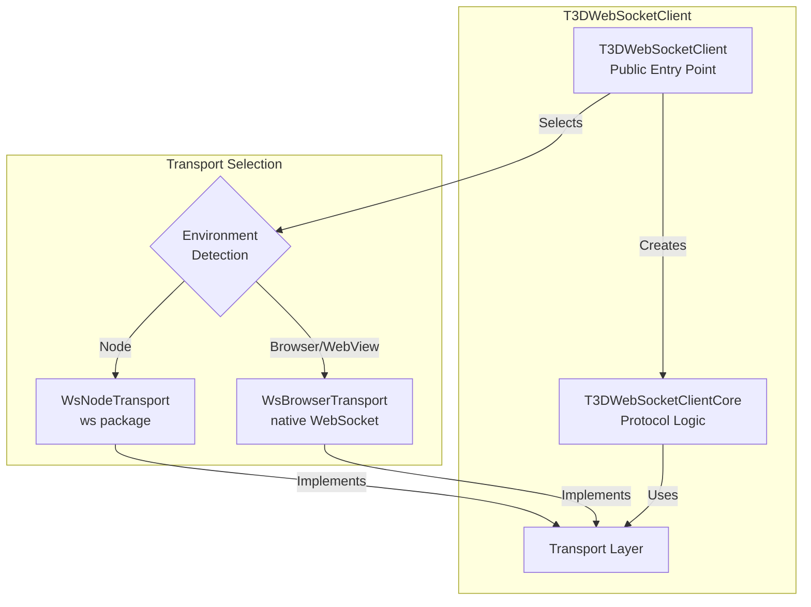

### Client Components

#### T3DWebSocketClient (Public Entry Point)

- Auto-detects environment (Node vs Browser/WebView)
- Creates appropriate transport
- Delegates to core implementation
- Provides unified API regardless of platform

#### T3DWebSocketClientCore

- Implements protocol logic (subscribe, publish, QoS handling)
- Manages connection state and reconnection
- Handles message parsing and callbacks
- Uses `SimpleEventEmitter` for cross-platform event handling

#### Transport Layer

- Abstracts WebSocket implementation differences
- Normalizes binary data to `Uint8Array`
- Provides unified interface for core to use

## Transport Layer

The transport layer abstracts platform-specific WebSocket implementations.

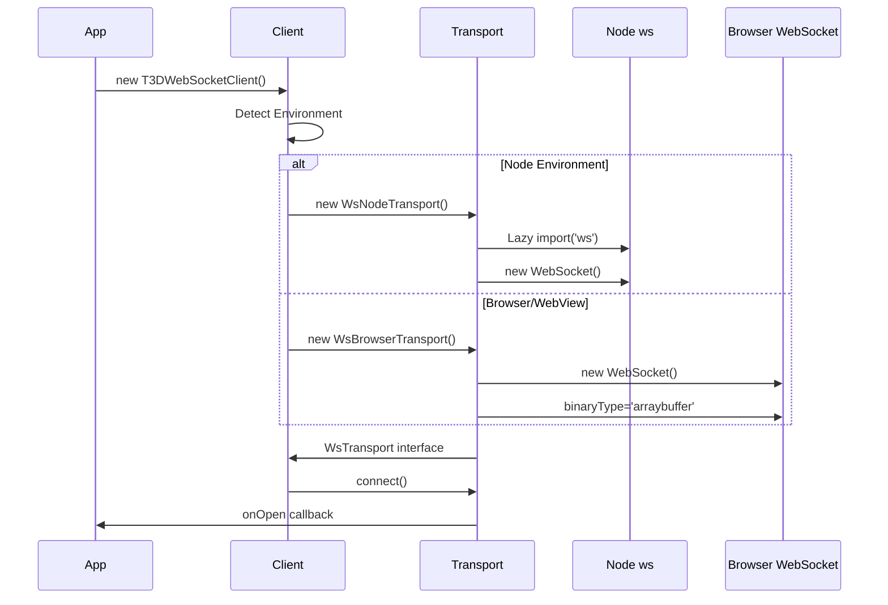

### Transport Interface

Both transports implement the same `WsTransport` interface:

- `connect()`: Establish WebSocket connection
- `close()`: Close connection
- `sendText(text: string)`: Send JSON messages
- `sendBinary(data: Uint8Array)`: Send binary data
- `readyState`: Connection state (CONNECTING, OPEN, CLOSING, CLOSED)
- Event handlers: `onOpen`, `onMessage`, `onError`, `onClose`

### Binary Data Normalization

- **Node**: Converts `Buffer` → `Uint8Array` (Buffer extends Uint8Array)
- **Browser**: Converts `ArrayBuffer`/`Blob` → `Uint8Array`
- **Result**: Unified `Uint8Array` API across all platforms

## Message Protocol

The protocol uses JSON for control messages and a header+data pattern for binary streams.

### JSON Channel Protocol

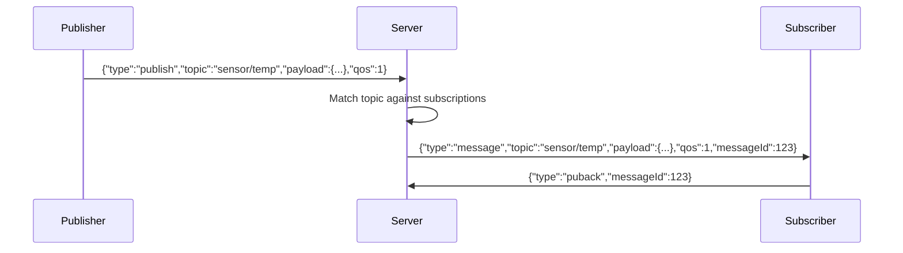

### Binary Channel Protocol

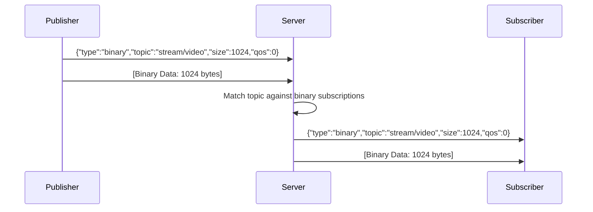

### Message Types

#### Inbound (Client → Server)

- `subscribe`: Subscribe to a topic
- `unsubscribe`: Unsubscribe from a topic
- `publish`: Publish JSON message
- `binary`: Publish binary data (header message)
- `ping`: Keepalive ping
- `puback`, `pubrec`, `pubrel`, `pubcomp`: QoS acknowledgments

#### Outbound (Server → Client)

- `suback`: Subscription acknowledgment
- `unsuback`: Unsubscription acknowledgment
- `message`: JSON message delivery
- `binary`: Binary data header
- `pong`: Keepalive response
- `error`: Error message
- `puback`, `pubrec`, `pubrel`, `pubcomp`: QoS acknowledgments

## QoS Flow

The system implements three QoS levels with different delivery guarantees.

### QoS 0: At Most Once

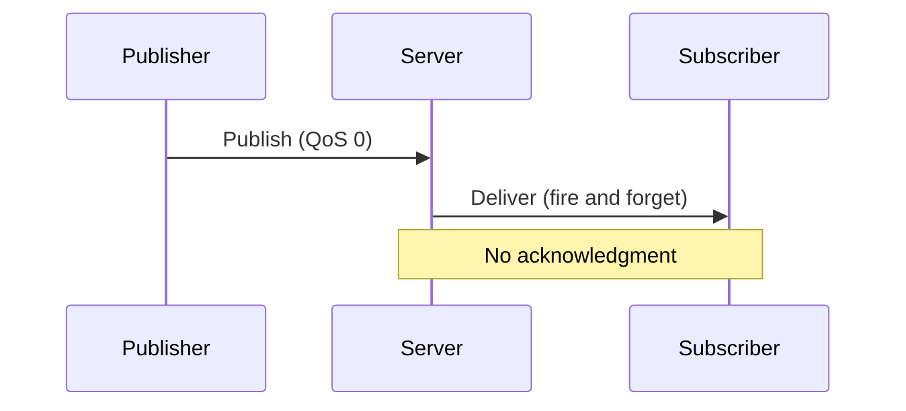

### QoS 1: At Least Once

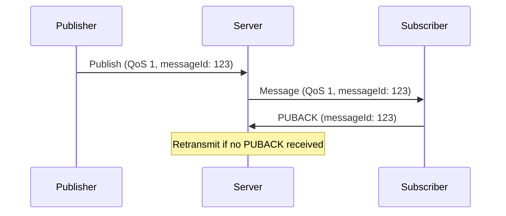

### QoS 2: Exactly Once

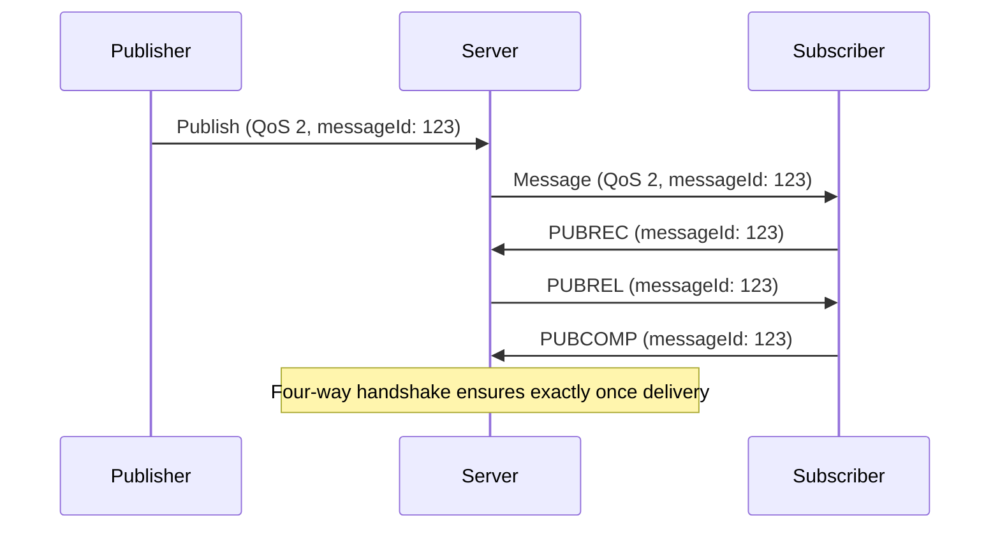

### QoS Retransmission

The server implements retransmission with exponential backoff:

- Base delay: Configurable (default: 1000ms)
- Max retries: Configurable (default: 3)
- Backoff: `delay = baseDelay * 2^(attempt - 1)`

## Topic Routing

Topics support MQTT-style wildcards for flexible subscription patterns.

### Wildcard Patterns

- `+`: Single-level wildcard (matches one segment)
  - `sensor/+` matches `sensor/temperature`, `sensor/humidity`
  - Does not match `sensor/room1/temperature`

- `#`: Multi-level wildcard (matches zero or more segments)
  - `device/#` matches `device/room1/temp`, `device/room2/humidity`
  - Also matches `device` itself

### Topic Matching Algorithm

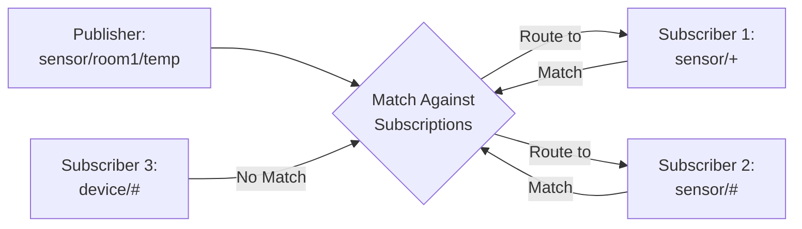

### Routing Flow

1. Publisher sends message with topic
2. Server iterates through all client subscriptions
3. For each subscription pattern:
   - Expand wildcards (`+`, `#`)
   - Match against published topic
   - If match: add client to delivery list
4. Deliver message to all matching subscribers
5. Apply QoS guarantees per subscriber

### Channel Separation

Subscriptions are maintained separately for JSON and binary channels:

- JSON subscriptions: Stored in `jsonSubscriptions` set
- Binary subscriptions: Stored in `binarySubscriptions` set
- Same topic can have different QoS levels per channel
- Unsubscribe can target specific channel or both

## Connection Lifecycle

### Client Connection Flow

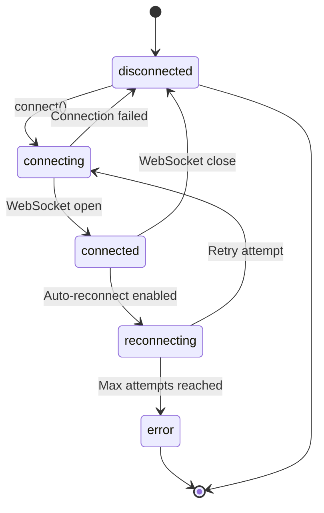

### Auto-Reconnection

- Exponential backoff: `delay = reconnectPeriod * 2^(attempt - 1)`
- Configurable max attempts (default: 10, -1 for unlimited)
- Re-subscribes to all remembered subscriptions on reconnect
- State transitions: `disconnected` → `reconnecting` → `connecting` → `connected`

## Error Handling

### Server-Side Errors

- Invalid message format → Send `error` message to client
- Subscription errors → Send `error` with details
- QoS timeout → Retransmit or drop (based on max retries)

### Client-Side Errors

- Connection timeout → Trigger reconnection
- Invalid subscription → Throw error to caller
- QoS acknowledgment timeout → Log warning, continue
- Binary size mismatch → Emit error event

## Performance Considerations

### Server

- Subscription matching: O(n) where n = number of subscriptions
- Wildcard expansion: Cached for performance
- QoS retransmission: Timers cleaned up on client disconnect
- Binary routing: Header sent first, then data frame

### Client

- Transport lazy loading: `ws` package only loaded in Node environment
- Binary normalization: Minimal overhead (Buffer → Uint8Array is zero-copy in Node)
- Reconnection: Exponential backoff prevents thundering herd
- Subscription memory: Remembered subscriptions persist across reconnects

## Configuration

Default configurations are centralized in `T3DWebSocketConfig.ts`:

- Server defaults: Port, host, QoS retry settings
- Client defaults: URL, auto-connect, reconnect settings
- Single source of truth ensures consistency

## Examples

See `run.ws.client.ts` for 10 comprehensive examples demonstrating:

- Basic connection and subscription
- Publishing with QoS levels
- Binary channel usage
- Wildcard subscriptions
- Multiple subscriptions management
- Connection state monitoring
- Manual connection control
- Ping keepalive
- Error handling
- Combined JSON and binary channels
