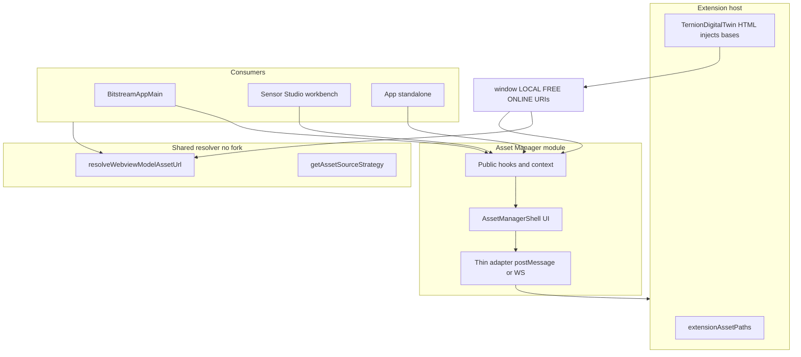

# Asset Manager — architecture (self-contained module + hooks)

**Status:** design (implementation follows in phases).  
**Related:** [Global asset directories](../../../../docs/GLOBAL_ASSET_DIRECTORIES.md) (where bytes live on disk), [Online assets repo](../../../../docs/ASSETS_ONLINE_REPO.md) (GitHub `ternion-3d-assets-free` layout), [Assets location system](../../../../docs/ASSETS_LOCATION_SYSTEM.md), [Managing downloaded assets](../../../../docs/MANAGING_DOWNLOADED_ASSETS.md), [BRIDGE](../../../../docs/BRIDGE.md).

## Goals

- **Single product surface** for “where are my models / cubemaps / free pack?” — sync, browse, diagnostics, and source strategy in one place where possible. **Directory truth** is defined in **[Global asset directories](../../../../docs/GLOBAL_ASSET_DIRECTORIES.md)**; this module implements UX and hooks on top of that contract.
- **Self-contained module** under **`src/webview/assets-manager/`** with its own UI shell, internal state, and **public hooks** for other apps (Bitstream, Sensor Studio, standalone `App`, Project 4).
- **No second resolver** — URL and base-URI rules stay in **`resolveWebviewModelAssetUrl`**, **`getAssetSourceStrategy`**, and host injection (`TernionDigitalTwin` HTML / `main.tsx`). The Asset Manager **reads** and **explains** that contract; it does not fork path logic.

## Non-goals (initial phases)

- Replacing **`src/assetLayout.ts`** or **`extensionAssetPaths.ts`** (host remains source of truth for filesystem roots).
- Moving the Model Downloader **native bridge** into the webview bundle (bridge stays in `src/model-downloader/`; the module **talks** to it via existing WS / postMessage patterns).

## Problem statement

Today, asset UX is **spread** across:

- **Free pack / loader** — `FreeAssetsLoaderDashboard`, `useFreeAssetsLoaderRuntime`
- **Model Catalog** — scan, merge, bridge paths
- **Sensor Studio** — Asset Browser, manifest overlay
- **Bitstream / App** — menus that open loader, preview missing mesh flows

Shared behavior (bases, strategy, “why 404”) is easy to **duplicate or drift**. The Asset Manager module **centralizes orchestration** while consumers keep thin integration.

## Layer model

| Layer | Responsibility | Owns |
| ----- | -------------- | ---- |
| **Host (VS Code)** | `globalStorage`, bridge roots, `asWebviewUri` | `extension.ts`, `TernionDigitalTwin.ts`, `extensionAssetPaths.ts` |
| **Resolver (shared)** | Stable URL from logical path + strategy | `resolveWebviewModelAssetUrl`, `joinAssetBase`, `getAssetSourceStrategy` |
| **Asset Manager (new)** | UX, progress, discovery, “open manager” affordances, optional Zustand/context | New folder + hooks API |
| **Consumers** | Pass `vscode` API ref, open tabs, render previews | Bitstream, Sensor Studio, `App.tsx` |



## Module layout (proposed)

```text
src/webview/assets-manager/
  store/
    asset-presets.ts           # Default remotes + helpers (T3D online roots)
    browser-storage-key.ts     # localStorage key for browser-only base URL
    index.ts                     # Barrel for store-facing exports
  hooks/
    index.ts                     # Hooks (useAssetRuntimeConfig, …) — see architecture doc
  components/
    index.ts                     # UI shell components (AssetManagerShell, …)
  docs/
    ASSET_MANAGER_ARCHITECTURE.md
  index.ts                       # Public package API (re-exports store; hooks/components when added)
```

**Mount:** **Menu → Asset Manager** or **Alt+M** (toggle) opens via **`useOpenAssetManager()`** (internally the same visibility state). **`AssetManagerMain`** mounts inside **`BitstreamAppWrapper`** (same `workspaceBoundsRef` as Bitstream Assistant): bounded **`TRNWindow`**, `modal={false}`, no drawer/backdrop.

**Next files (per phased rollout):** Zustand slices under **`store/`** if needed; **`hooks/useAssetRuntimeConfig.ts`**, **`hooks/useOpenAssetManager.ts`**; **`components/AssetManagerShell.tsx`**, **`components/AssetManagerProvider.tsx`**; optional **`adapters/`** for postMessage (keep adapters sibling to hooks or under `store/` — pick one when implementing). **Global directories panel:** see **[Global Directories panel design](../../../../docs/GLOBAL_DIRECTORIES_PANEL_DESIGN.md)** — tabs, **`TRNAccordion`**, **`TRNDataGrid`**, loader launchers (**`TRNButton`**), **`src/webview/ui/TRN/`** for theme parity.

**Browse** tab can **embed** existing presentational pieces (e.g. a slim **Asset Browser** route or link-out) rather than re-listing the catalog merge in v1.

## Public hook contract (v1 sketch)

Types are illustrative; tighten during implementation.

### `useAssetRuntimeConfig()`

- **Returns:** `{ localBase, freeBase, onlineBase, strategy, isWebview, refresh }`
- **Behavior:** Single subscriber to **`asset-config-response`** (or reads `window.*` when already set). **`refresh`** posts **`asset-config`** once (same as today).
- **Rule:** No path string building beyond display; resolution for assets stays **`resolveWebviewModelAssetUrl(relativePath)`**.

### `useAssetSourceStrategyUi()`

- **Returns:** `{ strategy, setStrategy }` aligned with `getAssetSourceStrategy` / URL query / `localStorage` keys already used in `main.tsx`.

### `useOpenAssetManager()` (for consumers)

- **Returns:** `{ openAssetManager, closeAssetManager, isOpen, setTab }`
- **Backed by:** small Zustand store or React context at the **root** that owns modal / route visibility so Bitstream and Sensor Studio do not each keep duplicate `useState(false)`.

### Optional: `useAssetDiagnostics()`

- **Returns:** `{ copyDiagnosticsJson }` — bundles bases, strategy, last sync error from provider state (useful support flow).

## Integration patterns

### Embedding modes (choose per surface)

| Mode | What users see | Building blocks |
| ---- | -------------- | ---------------- |
| **Button → floating window** (current default) | **`AssetManagerMain`** (`TRNWindow` inside **`BitstreamAppWrapper`**) opens via **`useOpenAssetManager()`**, Alt+M, Bitstream ☰, Sensor Studio toolbar / Asset Browser header. One shared window for the whole Bitstream + Sensor Studio shell. | `openAssetManager({ globalDirectoriesTab?: … })`, `AssetManagerMain` |
| **Inline pane** (optional later) | **`AssetManagerWorkspace`** fills a host layout (workbench pane, side drawer, tab body). Same UX body as the floating window, without `TRNWindow`. Pass the same loader callbacks as **`AssetManagerMain`**. | `AssetManagerWorkspace`, loader props from host |

Do **not** fork URL or path logic in either mode — resolution stays **`resolveWebviewModelAssetUrl`** / **`logical-asset-url.ts`**.

### Bitstream / main toolbar

- Prefer **`useOpenAssetManager()`** over importing **`useAssetManagerUiStore`** directly.
- Keep **`FreeAssetsLoaderDashboard`** as **implementation detail** behind Actions until a full merge is justified.

### Sensor Studio

- **Primary:** toolbar **Asset Manager** button and Asset Browser header folder icon → **`openAssetManager()`** → floating window (same instance as Bitstream).
- **Future inline:** mount **`AssetManagerWorkspace`** in a workbench pane or nested route; reuse loader wiring (`usePreviewMeshMissingUiStore` or injected callbacks).

### Standalone browser `App.tsx`

- Same pattern as Bitstream when **`AssetManagerMain`** is mounted once at the app root; **`useOpenAssetManager`** controls visibility.

## Phased rollout

| Phase | Deliverable |
| ----- | ----------- |
| **P0** | `AssetManagerProvider` + `useAssetRuntimeConfig` + `useOpenAssetManager`; mount shell in Bitstream only; toolbar opens it |
| **P1** | Move **Free pack** UI into shell tab; deprecate direct `FreeAssetsLoaderDashboard` mount from Bitstream (keep export for compatibility) |
| **P2** | Sensor Studio + `App.tsx` use same provider; optional workbench pane |
| **P3** | “Browse” tab embeds shared catalog subset or deep-links to Model Catalog |

**Pack resource catalog (parallel track):** [`STUDIO_ASSET_MANIFEST_IMPLEMENTATION_PLAN.md`](./STUDIO_ASSET_MANIFEST_IMPLEMENTATION_PLAN.md) — redesign interim registry trio (`studio-asset-manifest.v1.json`, `free-pack-model-ids.v1.json`, `free-pack-cubemap-ids.v1.json`) into **one sync/build pipeline** + overrides file + schema v2. Phases **M0–M5**; v1 bundled catalog until **M3** runtime migration.

## Risks and mitigations

| Risk | Mitigation |
| ---- | ---------- |
| Circular imports between assets-manager and bitstream-app | Asset Manager sits under `src/webview/assets-manager/`; Bitstream **imports from** assets-manager, not the reverse |
| Webview vs browser divergence | Provider reads **`isVsCodeExtensionWebview()`** where needed; do not branch URL logic — branch **UI copy** only |
| Bundle size | Lazy `React.lazy(() => import('./AssetManagerShell'))` for the shell body |

## Success criteria

- **One** documented place for “how bases are set” (this doc + link from [ASSETS_LOCATION_SYSTEM](../../../../docs/ASSETS_LOCATION_SYSTEM.md)).
- Consumers use **hooks** for open/refresh/strategy; **zero** new `join(freeBase, path)` helpers outside `resolveWebviewModelAssetUrl`.
- User can complete **sync + verify bases** without opening Sensor Studio or Model Catalog unless they choose the Browse tab.

---

## Appendix — cross-link for ASSETS_LOCATION_SYSTEM

When the first phase lands, add a short subsection there: **“Asset Manager UI”** → points to **`src/webview/assets-manager/docs/ASSET_MANAGER_ARCHITECTURE.md`** and states that the module is the **recommended** entry for operators; technical path rules remain in **Assets location system**.
