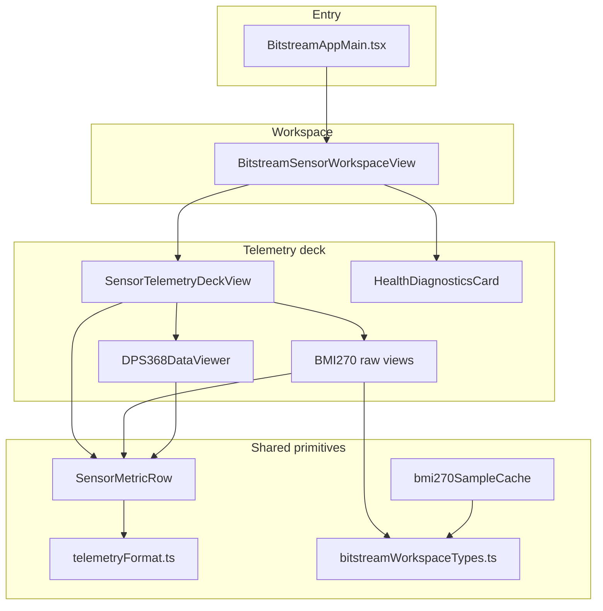

# BitstreamAppMain.tsx refactor plan

**Last updated:** 2 May 2026 (Saturday)

This document records the **analysis**, **proposed file layout**, **phased rollout**, and **open decisions** for splitting `BitstreamAppMain.tsx` into smaller modules. Implementation follows after this plan is approved.

**Goal:** Reduce file size and improve navigation **without changing runtime behavior** (same JSX, props, state defaults, and side effects).

---

## 1. Scope

| Item | Detail |
|------|--------|
| Source file | `src/webview/bitstream-app/BitstreamAppMain.tsx` (~2091 lines at time of writing) |
| Public API | `export function BitstreamAppMain` — must remain available from `bitstream-app/index.ts` as today |
| Non-goals | No UX or firmware-protocol changes; no unrelated refactors |

---

## 2. Current structure (reference map)

Approximate line ranges and responsibilities:

| Region (lines) | Symbols / role |
|----------------|----------------|
| ~43–131 | Types from `useBitstreamLive`, `SensorTelemetryCardId`, `DEFAULT_SENSOR_TELEMETRY_CARD_ORDER`, `BMI270_*` constants, `Bmi270SampleCacheState` |
| ~133–187 | `mergeBmi270SampleCache` |
| ~189–224 | `toScaledValue`, `toScaledValueBy`, `toNormalizedQwFromBucket`, `metricProgressPercent` |
| ~226–474 | `SensorMetricRow` |
| ~475–569 | `getBmi270AxisColorClass`, `getBmi270AxisGaugeBaseColorHex`, `getBmi270AxisGaugeFillColorHex` |
| ~571–809 | `Bmi270AnimatedParameter` |
| ~810–887 | `Bmi270RawSection` |
| ~888–1090 | `Bmi270RawGyroDataView`, `Bmi270RawAccelDataView`, `Bmi270RawTemperatureDataView`, `Bmi270FusionQuaternionDataView`, `Bmi270FusionEulerDataView` |
| ~1093–1389 | `SensorTelemetryDeckView` |
| ~1392–1474 | `DPS368DataViewer` |
| ~1476–1537 | `HealthDiagnosticsCard` |
| ~1539–2067 | `BitstreamSensorWorkspaceView` |
| ~2069–2091 | `BitstreamAppMain` entry (wrapper + toast + workspace) |

### 2.1 Folder trees (ASCII)

Summary of main folders and files. Leaf files under `components/*/cards/` are abbreviated as `...` where unchanged by this refactor.

#### Current layout — `src/webview/bitstream-app/`

```
bitstream-app/
├── BitstreamAppMain.tsx          # large monolith (~2091 lines)
├── BitstreamAppWrapper.tsx
├── index.ts
├── installBitstreamHostConfigSync.ts
├── README.md
├── constants/
│   └── sensorSourceIds.ts
├── docs/
│   ├── BITSTREAM_APP_MAIN_REFACTOR_PLAN.md
│   └── CONTROL_PANEL_MULTI_INSTANCE_SYNC.md
├── hooks/
│   ├── useBitstreamConfig.ts
│   ├── useBitstreamConnection.ts
│   ├── useBitstreamHandshake.ts
│   ├── useBitstreamLive.ts
│   └── useBitstreamSession.ts
├── state/
│   ├── bitstreamConfig.store.ts
│   ├── bitstreamConnection.store.ts
│   ├── bitstreamDeviceSensorConfig.store.ts
│   └── bitstreamLive.store.ts
├── types/
│   └── sensorConfigAck.ts
├── ui/
│   ├── BitstreamMainToolbar.tsx
│   ├── BitstreamRecoveryPortCard.tsx
│   └── BitstreamSystemStatusIndicators.tsx
├── system-tools/
│   ├── BitstreamSerialPortList.tsx
│   ├── SystemSerialportInfo.tsx
│   ├── SystemWebsocketActivity.tsx
│   └── admin-websocket-activity.store.ts
└── components/
    ├── bmi270/
    │   ├── BMI270ControlPanel.tsx
    │   ├── types.ts
    │   └── cards/
    │       ├── BMI270DeltaThresholdCard.tsx
    │       ├── BMI270MinPublishIntervalCard.tsx
    │       ├── BMI270OperationCard.tsx
    │       └── BMI270SamplingIntervalCard.tsx
    ├── bmm350/
    │   ├── BMM350ControlPanel.tsx
    │   ├── types.ts
    │   └── cards/ ...
    ├── dps368/
    │   ├── DPS368ControlPanel.tsx
    │   ├── types.ts
    │   └── cards/ ...
    └── sht40/
        ├── SHT40ControlPanel.tsx
        ├── types.ts
        └── cards/ ...
```

#### Proposed layout — after refactor (new files marked `(new)`)

```
bitstream-app/
├── BitstreamAppMain.tsx              # thin entry only
├── BitstreamAppWrapper.tsx
├── index.ts
├── installBitstreamHostConfigSync.ts
├── README.md
├── bmi270/                           # (new) non-JSX BMI270 telemetry
│   ├── bmi270TelemetryConstants.ts
│   └── bmi270SampleCache.ts
├── telemetry/                        # (new)
│   └── telemetryFormat.ts
├── workspace/                      # (new)
│   └── BitstreamSensorWorkspaceView.tsx
├── constants/
│   └── sensorSourceIds.ts
├── docs/
│   └── ...
├── hooks/
│   └── ...
├── state/
│   └── ...
├── types/
│   ├── sensorConfigAck.ts
│   └── bitstreamWorkspaceTypes.ts    # (new)
├── ui/
│   └── ...
├── system-tools/
│   └── ...
└── components/
    ├── telemetry/                  # (new)
    │   ├── SensorMetricRow.tsx
    │   └── SensorTelemetryDeckView.tsx
    ├── bmi270/
    │   ├── ...                     # existing control panels + cards
    │   ├── bmi270AxisTelemetryStyles.ts    # (new)
    │   ├── Bmi270AnimatedParameter.tsx      # (new)
    │   ├── Bmi270RawSection.tsx             # (new)
    │   ├── HealthDiagnosticsCard.tsx        # (new)
    │   │
    │   │   # Option A — five separate files:
    │   ├── Bmi270RawGyroDataView.tsx        # (new)
    │   ├── Bmi270RawAccelDataView.tsx       # (new)
    │   ├── Bmi270RawTemperatureDataView.tsx # (new)
    │   ├── Bmi270FusionQuaternionDataView.tsx   # (new)
    │   └── Bmi270FusionEulerDataView.tsx    # (new)
    │   │
    │   │   # Option B — replace Option A with one file:
    │   # └── Bmi270RawDataViews.tsx          # (new)
    ├── dps368/
    │   ├── ...                     # existing
    │   └── DPS368DataViewer.tsx    # (new)
    ├── bmm350/
    │   └── ...
    └── sht40/
        └── ...
```

| Note | Detail |
|------|--------|
| Root `bmi270/` vs `components/bmi270/` | Root holds constants/cache only; `components/bmi270/` keeps UI modules including new telemetry views. |
| Raw views | Choose **Option A** or **Option B** in §6 — tree shows both alternatives (comment one branch when implementing). |
| Existing subtrees | `hooks/`, `state/`, `system-tools/`, `ui/` — full file lists omitted when unchanged. |

---

## 3. Proposed module map

### 3.1 New / moved files (draft names)

| Module path (under `bitstream-app/`) | Contents |
|--------------------------------------|----------|
| `bmi270/bmi270TelemetryConstants.ts` | `BMI270_CACHE_TTL_MS`, `BMI270_NUMERIC_KEYS`, `BMI270_FIELD_TTL_MS` and related key types |
| `types/bitstreamWorkspaceTypes.ts` | Live sample aliases, `SensorPublishMode`, `SensorTelemetryCardId`, `DEFAULT_SENSOR_TELEMETRY_CARD_ORDER`, `Bmi270SampleCacheState` |
| `bmi270/bmi270SampleCache.ts` | `mergeBmi270SampleCache` |
| `telemetry/telemetryFormat.ts` | `toScaledValue`, `toScaledValueBy`, `toNormalizedQwFromBucket`, `metricProgressPercent` |
| `components/telemetry/SensorMetricRow.tsx` | `SensorMetricRow` |
| `components/bmi270/bmi270AxisTelemetryStyles.ts` | Axis color / gauge hex helpers |
| `components/bmi270/Bmi270AnimatedParameter.tsx` | Animated parameter row |
| `components/bmi270/Bmi270RawSection.tsx` | Shared raw section layout |
| **Option A:** `components/bmi270/Bmi270RawGyroDataView.tsx` … `Bmi270FusionEulerDataView.tsx` (five files) **Option B:** `components/bmi270/Bmi270RawDataViews.tsx` (single file exporting all five) | Raw + fusion cards |
| `components/dps368/DPS368DataViewer.tsx` | Pressure viewer card (alongside existing DPS controls) |
| `components/bmi270/HealthDiagnosticsCard.tsx` | Health / diagnostics card |
| `components/telemetry/SensorTelemetryDeckView.tsx` | Sortable right-panel deck |
| `workspace/BitstreamSensorWorkspaceView.tsx` | Tabs, control panels, layout wiring |
| `BitstreamAppMain.tsx` | Thin entry: compose wrapper, workspace, overlays, `ToastContainer` |

Paths prefixed with `components/` align with existing `components/bmi270`, `components/dps368`, etc.

### 3.2 Dependency diagram (logical)

High-level import direction after split:



---

## 4. Phased rollout (recommended)

Execute in order; run **`npm run compile`** after each phase (or at minimum after phase 5).

| Phase | Deliverable | Risk |
|-------|-------------|------|
| **1** | Types + `bmi270TelemetryConstants` + `bmi270SampleCache` + `telemetryFormat` | Low |
| **2** | `SensorMetricRow` + `bmi270AxisTelemetryStyles` + `Bmi270AnimatedParameter` | Low–medium |
| **3** | `Bmi270RawSection` + raw/fusion views (+ optional early `HealthDiagnosticsCard`) | Medium |
| **4** | `DPS368DataViewer` + `SensorTelemetryDeckView` | Medium |
| **5** | `BitstreamSensorWorkspaceView` | Large move; behavior-preserving lift-and-shift |
| **6** | Thin `BitstreamAppMain.tsx` + final compile | Low |

---

## 5. Behavioral guarantees

- Same React hook order and mount boundaries inside `BitstreamSensorWorkspaceView` after move.
- Same initial `useState` values and `useEffect` dependencies (verbatim moves).
- Same class names, copy, and TRN component props.
- No new barrels (`index.ts` re-exports) unless they clearly shorten imports without hiding side effects.

---

## 6. Open decisions (need approval before coding)

1. **Raw views packaging**
   - **Option A:** Five separate files (clear ownership, more files).
   - **Option B:** One `Bmi270RawDataViews.tsx` (fewer files, longer file).

2. **Folder naming**
   - **`workspace/`** for `BitstreamSensorWorkspaceView.tsx` vs keeping it under `components/` (e.g. `components/workspace/`). Current plan uses top-level `bitstream-app/workspace/` to separate “page shell” from reusable widgets.

3. **`types/`** location — `bitstream-app/types/bitstreamWorkspaceTypes.ts` vs co-locating types next to `bmi270/` only; workspace-wide types favor a small `types/` folder.

---

## 7. Post-implementation checklist

- [ ] `npm run compile` clean
- [ ] No new linter errors in touched files
- [ ] Quick smoke: connect serial, open BMI270 tabs, reorder telemetry cards, confirm multi-instance sync unchanged (if applicable)
- [ ] Update this doc: mark phases done and adjust line counts if needed

---

## 8. Revision log

| Date | Note |
|------|------|
| 2026-05-02 | Initial plan from monolith analysis; implementation pending approval |
| 2026-05-02 | Added §2.1 ASCII folder trees (current vs proposed). |
