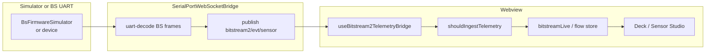
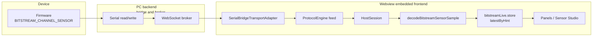
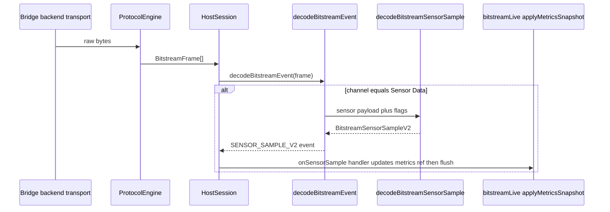
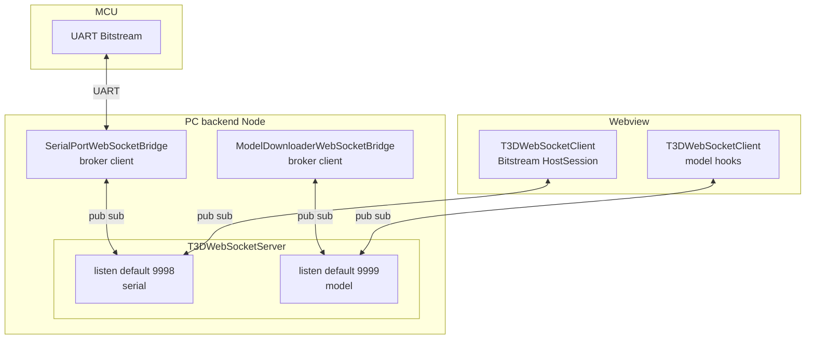
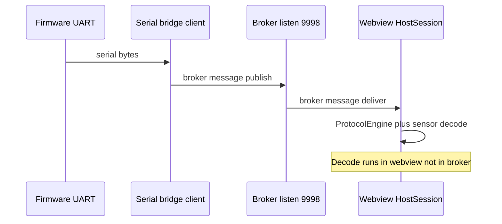
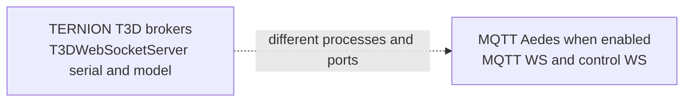
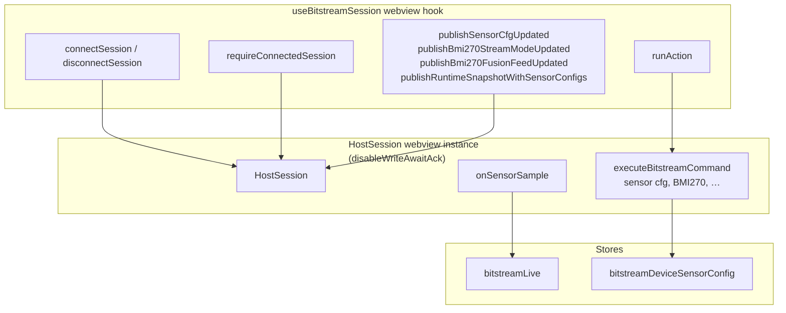
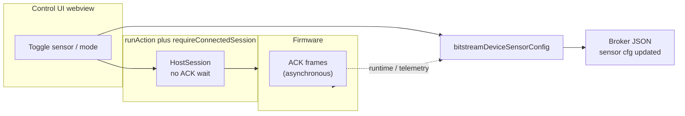

# Bitstream sensor data: firmware to UI, stores, and hooks

**Last updated:** 27 May 2026

> **2026-05-27 — Webview transport simulator-only:** Main shell removed **`serialport/*`** UI exchange, serial port list, wedge auto-reconnect, and **`runtimeSync`**. Telemetry flows via **`useBitstream2TelemetryBridge`** only. See **`BITSTREAM_WEBVIEW_TRANSPORT_SIMULATOR_ONLY.md`**.

> **2026-05-27 — Webview sensor cfg I/O stubbed:** The Bitstream shell no longer runs boot **`sensor.cfg.get`** / BS2 **`SENSOR_CFG_GET`** cold sync, **`useBitstream2SensorCfgTransport`** was removed, and **`useSensorConfigController`** updates the device sensor store as **local draft only** (`updatedAtMs: 0`). Sections below that mention cold sync, broker **`sensor-cfg-updated`**, or immediate firmware apply describe the **previous** architecture until this document is rewritten for the new pipeline.

## Definitions and terminology

Use these terms consistently in this document and when reading the code:

| Term | Meaning |
| ---- | ------- |
| **Firmware** | Software running on the **MCU**. It emits and accepts **Bitstream binary frames** on UART. Not part of VS Code or Node. |
| **Backend (PC)** | Processes on the developer machine **outside** the webview sandbox. Here that mainly means the **serial bridge** (Node: opens COM, forwards bytes on WebSocket) and optionally the **VS Code extension host** (Node: activates the extension, webview lifecycle, `postMessage`). Neither path performs **`BitstreamSensorSampleV2` decoding** for the main UI flow. |
| **Webview / embedded frontend** | The VS Code **webview panel**: HTML plus bundled JavaScript (React, Zustand). This is **UI code** running inside an isolated renderer context. It talks to COM **indirectly** via WebSocket to the bridge. |
| **`HostSession`** | TypeScript class in **`../../../bitstream/session/host-session.ts`**. It runs **inside the webview bundle** when you use **`useBitstreamSession`**. It attaches to the transport, runs **`ProtocolEngine`**, decodes frames into events, and sends commands. “Host” means **host-side firmware peer**, not “runs on the backend server.” |
| **Bitstream decode** | Interpreting **Bitstream wire bytes** (magic, channel, flags, payload) into **`BitstreamFrame`** / **`BitstreamSensorSampleV2`**. Implemented in **`../../../bitstream/`** and executed **in the webview** alongside **`HostSession`**. |
| **Bridge transport envelope** | The bridge exposes its **own** WebSocket messages for open/read/write and pub/sub. Parsing those messages is **not** the same as decoding **sensor channel `0x01`** payloads. |
| **T3D WebSocket broker** | **`T3DWebSocketServer`** TCP listener(s), default **9998** (serial) and **9999** (model). Multiple **clients** (Node bridges + webview) attach as peers. See **§2**. |

**One-line data path (legacy v1):** firmware UART bytes → **bridge (backend)** → WebSocket → **webview (`HostSession`)** → Bitstream decode → Zustand stores → React UI.

**One-line data path (BS2 / simulator):** `BsFirmwareSimulator` or BS-framed UART → bridge decode → **`bitstream2/evt/sensor` JSON** → **`useBitstream2TelemetryBridge`** → same live stores / Sensor Studio.

This document describes how **sensor streaming bytes** become **`BitstreamSensorSampleV2`** **inside the webview**, which **Zustand stores** hold live and configuration state, and which **React hooks** to use for **reading** telemetry and **issuing control** commands.

For **BS2 cfg, simulator sine synth, and `SENSOR_CFG` v2.1**, see **`../../../../src/bitstream2/docs/SENSOR_CFG_V2.md`** and **`HOW_TO_RUN.md`** (UART vs Simulator).

For **transport layers** (UART, WebSocket broker, MCP, bridge ownership), see **`BITSTREAM_SERIAL_AND_BROKER_DATA_FLOW.md`**.

For **stale telemetry, BRx vs decode Δ, decode rejects, firmware pause, and fix plan**, see **`../../../../docs/BITSTREAM_TELEMETRY_STALE_PIPELINE.md`**.

For **frame header layout, channels, and command IDs**, see **`../../../bitstream/docs/FRAME_PROTOCOL_SPECIFICATION.md`**.

Firmware remains the **authoritative** definition of on-wire payload packing; the TypeScript decoder lives in **`../../../bitstream/events/sensor-decoder.ts`**.

---

## 0. BS2 and Simulator path (preferred for new work)

When the toolbar **Telemetry data source** is **Simulator**, or when **Bitstream** (firmware) speaks **BS framing**, samples arrive as **JSON** on the broker — not only through legacy `HostSession` channel `0x01`.

| Piece | Path / topic |
| ----- | ------------- |
| Synthetic values (sim only) | `src/bitstream2/device/sensor-synth.ts` — all masked scalars are **sine** (~0.2 Hz) |
| Ingest gating | `../utils/bitstreamTelemetryTransport.ts` — **Simulator** always; **UART** requires open serial and **no** loopback-only mock when source is UART |
| BS2 cfg apply | `useBitstream2SensorCfgTransport` → `bitstream2/req` (`SENSOR_CFG_SET`) |
| Panel unlock | `useSensorSettingsPanelReady` — WS + HELLO / handshake / loopback, not serial snapshot alone |
| Simulator idle | `bitstream2/dev/sim/control` `{ mode: "idle" }` when UART selected with loopback on |

Legacy **v1** `HostSession` + `decodeBitstreamSensorSample` (§1 below) still applies for older firmware; BS2 JSON may update the same UI hints in parallel when ingested.

---

## 1. End-to-end path (reading sensor data)

At a high level, sensor samples are **not** JSON: they are **binary frames** on **channel `0x01` (Sensor Data)**. After bytes reach the webview, **`HostSession`** and **`ProtocolEngine`** parse them into **`BitstreamSensorSampleV2`**; **`useBitstreamSession`** then pushes snapshots into **`bitstreamLive`** for React.

### 1.1 Decode pipeline (webview JavaScript, same task as UI bundle)

Key implementation files:

| Stage | Role | Path |
| ----- | ---- | ---- |
| Frame assembly | Deframing and sequencing (runs in webview) | `../../../bitstream/engine/protocol-engine.ts` |
| Session wiring | Bytes in, events out (runs in webview) | `../../../bitstream/session/host-session.ts` |
| Sensor decode | Flags plus payload to `BitstreamSensorSampleV2` | `../../../bitstream/events/sensor-decoder.ts` |
| Event naming | Channel `0x01` maps to `SENSOR_SAMPLE_V2` | `../../../bitstream/events/event-decoder.ts` |
| React integration | `session.onEvent` (reject counter) + `onSensorSample` → metrics → store flush | `../hooks/useBitstreamSession.ts` |
| Live store | `MetricsSnapshot` includes **`sensorChannelDecodeRejectCount`** (sensor `0x01` frames where decode returned `null`) | `../state/bitstreamLive.store.ts` |

### 1.2 What each sample contains

`BitstreamSensorSampleV2` is the **unified** shape for all sensors. Fields are populated depending on **`frame.flags`** (source bits and BMI270 fusion bit). See `sensor-decoder.ts` for exact offsets; briefly:

- **Common base:** `counter`, `temperatureCx100`, `secondaryX100`, `sourceHint`
- **BMM350:** magnetic axes (`magneticXUtX100`, …)
- **BMI270:** either short **base** payload, **20-byte IMU**, or **20-byte fusion** (quaternion buckets plus Euler)

---

## 2. WebSocket brokers and clients (how processes attach)

The repo uses **`ws`** in two different architectural roles:

- **`T3DWebSocketServer`** (`../../../websocket/T3DWebSocketServer.ts`) — TERNION **message broker** (topics, pub/sub, QoS helpers) used for **serial tunneling**, **model downloader**, and related extension traffic.
- **MQTT / Aedes** (`../../../mqtt/aedes/broker.ts`) — **optional**, separate stack with **its own** WebSocket listeners (MQTT-over-WebSocket plus a **control** WebSocket). Treat ports as **independent** from the T3D defaults unless you align configs deliberately.

Shared defaults: **`../../../websocket/T3DWebSocketConfig.ts`** — serial broker **`9998`**, model broker **`9999`**, client URLs prefer **`ws://127.0.0.1:…`** on Windows.

### 2.1 Servers (listeners)

| Role | Class | Default port | Started from |
| ---- | ----- | ------------ | ------------ |
| **Serial / Bitstream broker** | `T3DWebSocketServer` | **`9998`** (`T3D_WS_PORT`) | `../../../combined-bridge-entry.ts`, `../../../websocket/run.ws.server.ts` |
| **Model / catalog broker** | `T3DWebSocketServer` | **`9999`** (`T3D_MODEL_BROKER_WS_PORT`, or VS Code `ternion.ws.modelBrokerPort`) | `combined-bridge-entry.ts`, `../../../embedded-model-loader-broker.ts` (extension host; **no listen** if port already taken) |
| **Merged mode** | Same class | **Single** TCP port when model port **equals** serial port | `combined-bridge-entry.ts` prints single-server mode |

**MQTT (when enabled):** `WebSocketServer` inside `../../../mqtt/aedes/broker.ts` — e.g. MQTT WS default **`8883`**, control default **`9999`**. That control **`9999`** can **collide** with the **T3D model broker**; only run one listener per port.

### 2.2 Clients (`T3DWebSocketClient`)

Main implementation: **`../../../websocket/T3DWebSocketClient.ts`**. Typical attachments:

| Consumer | Path | Typical broker |
| -------- | ---- | -------------- |
| Bitstream UART tunnel | `../../../bitstream/transport/serial-bridge-transport.ts`, `../hooks/useBitstreamSession.ts` | Serial broker **`9998`** |
| Serial bridge process | `../../../serialport-bridge/SerialPortWebSocketBridge.ts` | Same — owns **COM**, forwards bytes |
| Model downloader | `../../../model-downloader/ModelDownloaderWebSocketBridge.ts`, `../../../webview/model-downloader/useModelDownloaderOverWs.ts` | Model broker **`9999`** |
| Assets / generic store | `../../../webview/asset-sync/useFreeAssetsSyncOverWs.ts`, `../../../webview/ws-client-store.ts`, … | URL from settings |

Some CLIs use raw **`WebSocket`** (`../../../broker-control/control-client.ts`, `../../../mqtt-node/broker-control-cli.ts`), not `T3DWebSocketClient`.

### 2.3 Combined bridge: two brokers and two Node bridge clients

`combined-bridge-entry` starts **up to two** `T3DWebSocketServer` instances (unless ports match), then connects:

- **`SerialPortWebSocketBridge`** → serial broker
- **`ModelDownloaderWebSocketBridge`** → model broker

The **webview** opens **additional** `T3DWebSocketClient` connections as **peers** on the same brokers.

### 2.4 Bitstream path on port 9998 (sequence)

UART bytes are **not** injected into Chromium directly. The **serial bridge** publishes broker messages; the **webview client** receives them and runs **`ProtocolEngine`** plus Bitstream decode.

UI commands traverse **WV → BR → SP → UART → FW** on the same logical socket path. **CLI probes and MCP** still use **`writeAwaitAck`** where the transport supports it; the **Bitstream webview** session opts out via **`disableWriteAwaitAck`** for interactive CONTROL traffic so ACK bytes are not awaited before returning to React.

### 2.5 Optional MQTT stack (orthogonal)

---

## 3. Zustand stores (sensor-related)

### 3.1 Reading live telemetry

| Store | Purpose |
| ----- | ------- |
| **`useBitstreamLiveStore`** | **Primary live dashboard state:** `latestByHint` (`BitstreamSensorSampleV2` per `sourceHint`), receive counters, `lastAtByHint`, handshake summary fields, diag counters, last diag hex |
| **`useBmi270FusionQuatWireTapStore`** | Per-wire BMI270 samples pushed for **quaternion** diagnostics and Sensor Studio paths that need tap semantics |
| **`useBmi270FusionEulerWireTapStore`** | Same pattern for **Euler** tap |

Path: `../state/bitstreamLive.store.ts`, `../state/bmi270FusionQuatWireTap.store.ts`, `../state/bmi270FusionEulerWireTap.store.ts`.

### 3.2 Device sensor configuration rows (store + broker, not only UART read-back)

| Store | Purpose |
| ----- | ------- |
| **`useBitstreamDeviceSensorConfigStore`** | **`bySourceId` rows** merged from **optimistic UI writes**, broker **`SENSOR_CFG_UPDATED`** / **`RUNTIME_SNAPSHOT.sensorConfigs`**, and MCP fan-out: `enabled`, `publishMode`, `samplingIntervalMs`, `deltaX100`, `minPublishIntervalMs`, `updatedAtMs`. Optional **`localStorage`** hydration / debounced save (**`deviceSensorConfigLocalStorage.ts`**) for reload UX before UART cold sync completes. |

Used so the UI stays aligned across tabs and can **seed defaults** before runtime rows arrive. The webview **`getSensorConfig`** helper is **store-only** (it does **not** issue **`sensor.cfg.get`** on each call). After handshake **`passed`**, **`BitstreamAppWrapper`** runs a **cold `sensor.cfg.get` sweep** into this store (`sync-effects/sensorCfgColdSyncFromSession.ts`), then may republish **`RUNTIME_SNAPSHOT.sensorConfigs`** using **verified** rows only (`updatedAtMs > 0`). Path: `../state/bitstreamDeviceSensorConfig.store.ts`.

### 3.2.1 Reload alignment — firmware read on session (P0 shipped **2026-05-12**)

**Problem (historical):** A **full browser reload** re-initialized **`bySourceId`** from **`SEEDED_DEFAULT_CONFIGS`** until verified data merged. The post-handshake **“firmware sensor truth sync”** republished **`sensorConfigs`** from that in-memory store, which could still be **seeds** — wrong for all row fields.

**Implemented (webview):** After handshake **`passed`**, **`runAction("Firmware sensor cfg cold sync")`** calls **`HostSession.sendSensorCfgGet`** for SHT40, DPS368, BMM350, and BMI270 (sequential), merges each ACK via **`mergeVerifiedDeviceSensorConfig`**, then republishes **`RUNTIME_SNAPSHOT.sensorConfigs`** only for rows with **`updatedAtMs > 0`** (never fan out seed defaults as firmware truth). **`firmwareSensorTruthReady`** is set when the action completes (or is skipped if there is no session).

**Firmware policy (current product direction):** **`sensor.cfg`** is treated as **RAM-backed on the MCU for now** — there is **no NVM persistence** requirement for sensor configuration in this phase. **Wi‑Fi** credentials and related NVM behavior stay **unchanged** (still NVM-backed where the firmware already uses NVM).

**Host / bridge:** The serial bridge subscribes to **`RUNTIME_SNAPSHOT`**, merges inbound **`sensorConfigs`** (verified rows only, monotonic **`updatedAtMs`** per `sourceId`) into an **in-memory cache**, and **re-attaches** that cache on bridge-published snapshots so a **late-connecting** webview gets a baseline without racing the first tab. The cache is **cleared on serial close** so a new UART session cannot reuse rows from the previous device.

**Webview persistence:** **`useBitstreamDeviceSensorConfigStore`** hydrates from **`localStorage`** key **`ternion.bitstream.deviceSensorConfig.v1`** at init (rows with **`updatedAtMs > 0`** only) and **debounced** writes on store changes. Persisted blobs **never override** in-memory rows with a **newer **`updatedAtMs`**** (same rule as **`mergeVerifiedDeviceSensorConfig`**). **`clearDeviceSensorConfigs()`** removes the key and resets seeds (tests / explicit factory reset — **not** used on disconnect).

**Deferred:** **Sensor `cfg` NVM** (power-cycle carry) is **explicitly out of scope** until firmware chooses to implement it; track in **TESAIoT** when that milestone exists.

### 3.3 Connection, runtime, and user preferences

| Store | Purpose |
| ----- | ------- |
| **`useBitstreamConnectionStore`** | WebSocket and serial bridge **connection** shape: `connected`, `transportState`, `availablePorts`, logs, `runtimeSyncState`, runtime snapshot hooks |
| **`useBitstreamConfigStore`** | **Persisted UI and control prefs:** `wsUrl`, `serialPath`, `baudRateText`, `bmi270StreamMode`, `bmi270FusionFeedIntervalMs`, telemetry tween settings, diagnostics text fields, etc. |

Paths: `../state/bitstreamConnection.store.ts`, `../state/bitstreamConfig.store.ts`.

### 3.4 Other stores (related but not primary sensor stream)

| Store | Purpose |
| ----- | ------- |
| **`useBitstreamDiagStore`** | Diagnostics **snapshot** fetch UI state |
| **`useBitstreamWifiStore`** | Wi-Fi channel payloads and correlation |
| **`useSerialPortUiAlertsStore`** | Port manager alerts |

---

## 4. React hooks: how to read and how to control

### 4.1 Thin store accessors

These re-export Zustand stores with stable names:

| Hook | Store |
| ---- | ----- |
| **`useBitstreamLive()`** | `useBitstreamLiveStore` |
| **`useBitstreamConnection()`** | `useBitstreamConnectionStore` |
| **`useBitstreamConfig()`** | `useBitstreamConfigStore` |

Paths: `../hooks/useBitstreamLive.ts`, `../hooks/useBitstreamConnection.ts`, `../hooks/useBitstreamConfig.ts`.

### 4.2 Session lifecycle and commands: `useBitstreamSession`

**`useBitstreamSession`** is the **central integration hook** (webview React). It:

- Builds **`HostSession`** with **`SerialBridgeTransportAdapter`** (WebSocket to the bridge) when the user connects, passing **`disableWriteAwaitAck: true`** so interactive CONTROL sends use the transport **`write`** path instead of **`writeAwaitAck`** (firmware may still ACK on the wire; the UI does not block on that envelope).
- Subscribes **`onSensorSample`** and flushes metrics into **`bitstreamLive`**
- Exposes **`requireConnectedSession`** and **`runAction`** for **command helpers**
- Publishes optional **broker fan-out** messages (`publishSensorCfgUpdated`, `publishBmi270StreamModeUpdated`, …) for multi-client sync

Public API surface (return object): see **`../hooks/useBitstreamSession.ts`** — includes **`connectSession`**, **`detectPorts`**, **`disconnectSession`**, **`requireConnectedSession`**, **`runAction`**, and the **`publish*`** helpers listed above.

### 4.3 Handshake orchestration: `useBitstreamHandshake`

**`useBitstreamHandshake`** runs the **`handshake.run`** command via **`executeBitstreamCommand`** (through **`runAction`**), and writes results into **`useBitstreamLive`** (`handshake`, `handshakeState`, errors). Path: **`../hooks/useBitstreamHandshake.ts`**.

Typical usage is in **`BitstreamAppWrapper`**: session hook provides **`requireConnectedSession`** / **`runAction`**; handshake hook consumes them.

### 4.4 Control path (conceptual)

**Reading** is passive in the UI: bridge delivers bytes → **`HostSession`** decodes → stores.

**Control** is active from the **webview**: components call **`requireConnectedSession`**, then **`executeBitstreamCommand`** or **`HostSession`** helpers (often wrapped by **`runAction`**). Outbound frames travel **webview → bridge → UART → firmware**. For sensor configuration, **`useSensorConfigController`** applies an **optimistic** row to **`bitstreamDeviceSensorConfig`**, **publishes** **`sensor-cfg-updated`** for peer dashboards, then **fires** `sensor.cfg.set` without awaiting a CONTROL ACK in this shell. **`mergeVerifiedDeviceSensorConfig`** is still used for broker snapshot payloads and remote merges even when the name reads “verified” — treat it as **canonical merge** into the shared store.

Core command dispatch for structured actions: **`../../../bitstream/command-api/bitstreamCommandExecutor.ts`** (see call sites from **`useBitstreamHandshake`** and UI actions).

---

## 5. Consumer examples

| Consumer | What it reads |
| -------- | ------------- |
| **`BitstreamSensorWorkspaceView`** | `latestByHint` for per-sensor panels and stream counters |
| **Sensor Studio `useFlowEditorStore`** | `useBitstreamLiveStore` for `latestByHint` and health; BMI270 wire taps for fusion wiring |

---

## 6. Related documents

| Document | Topic |
| -------- | ----- |
| `BITSTREAM_SERIAL_AND_BROKER_DATA_FLOW.md` | Broker, bridge, MCP, COM ownership (**deep MCP diagram**) |
| `../../../../src/bitstream2/docs/SENSOR_CFG_V2.md` | BS2 cfg, simulator sine synth, sampling UI |
| `../../../../HOW_TO_RUN.md` | Loopback dev, UART vs Simulator checklist |
| `../../../bitstream/docs/FRAME_PROTOCOL_SPECIFICATION.md` | Legacy v1 binary frame and channel IDs |
| `DIAGNOSTICS_SNAPSHOT_UI.md` | Diagnostics channel and snapshot UI |
