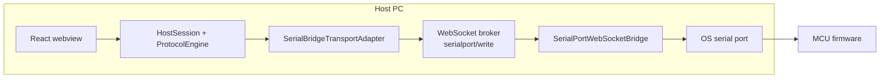
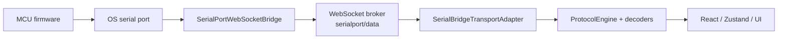
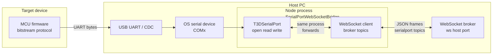
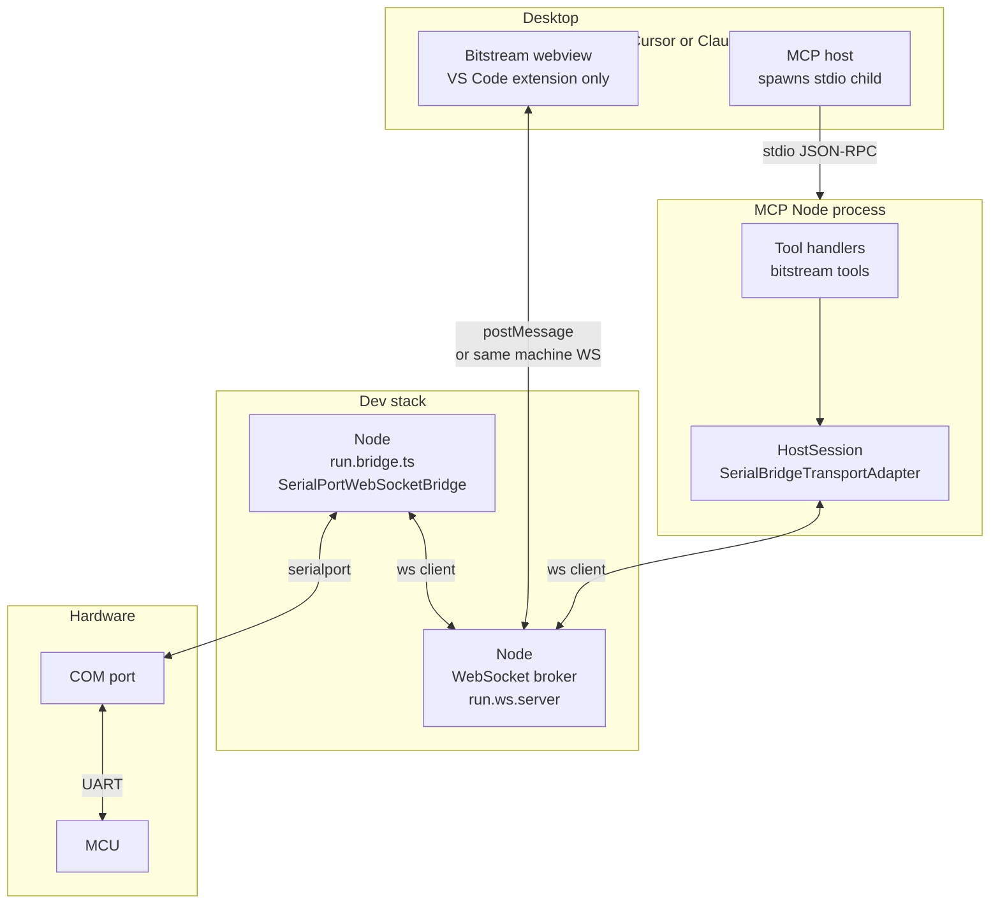
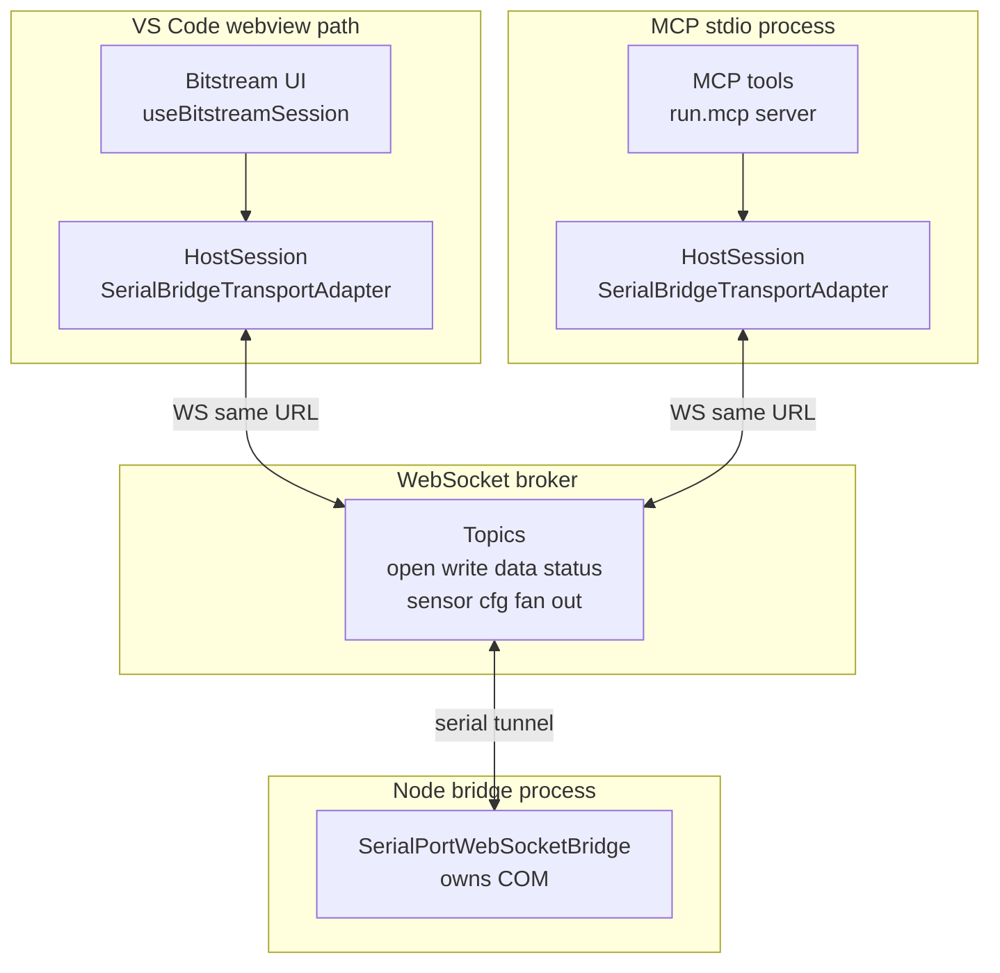
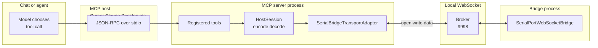
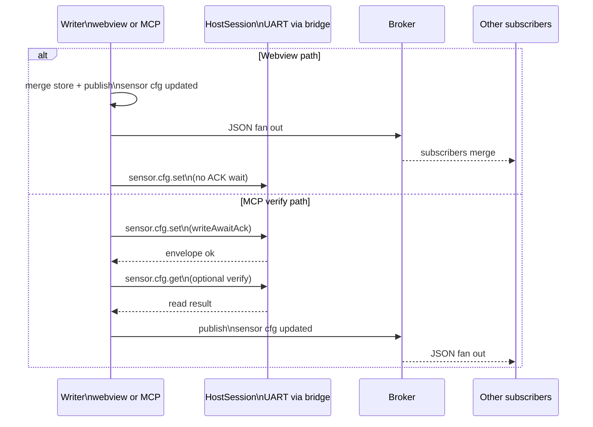

# Bitstream serial and broker data flow (MCU to dashboards and MCP)

**Last updated:** 8 May 2026

This note complements **`FIRMWARE_MULTI_CLIENT_AND_MCP_ARCHITECTURE.md`** with **end-to-end diagrams**: where bytes move, where the WebSocket broker sits, and how the VS Code webview and the MCP Node process attach. **Any desktop app that implements an MCP client over stdio** (for example **Cursor** or **Claude Desktop**) can run the same **`run.mcp-server.ts`** stack; only the **config file path and UI** differ—the bridge and WebSocket URL rules are the same.

---

## Command and acknowledgement flows (React / webview ↔ firmware)

Binary layout and IDs: [`src/bitstream/docs/FRAME_PROTOCOL_SPECIFICATION.md`](../../../bitstream/docs/FRAME_PROTOCOL_SPECIFICATION.md). Reference code: **`HostSession`** and **`ProtocolEngine`** (`src/bitstream/session/host-session.ts`, `src/bitstream/engine/protocol-engine.ts`), **`SerialBridgeTransportAdapter`** (`src/bitstream/transport/serial-bridge-transport.ts`), **`SerialPortWebSocketBridge`** (`src/serialport-bridge/SerialPortWebSocketBridge.ts`).

### Command path (UI → broker → bridge → UART → firmware)

| Step | What runs |
| ---- | ----------- |
| 1 | **React / webview** — controls call `executeBitstreamCommand`, `HostSession` helpers, or sensor / Wi‑Fi **NoAck** send APIs (via hooks such as `useBitstreamSession` / `useBitstreamAppControl`). |
| 2 | **`ProtocolEngine.createRequest`** — builds the **Bitstream frame** (8-byte header + payload: `commandId`, and on control channel `0x03` also `corrId` and command fields). |
| 3 | **`SerialBridgeTransportAdapter`** — sends the frame on the **WebSocket** client (broker URL, often **`ws://127.0.0.1:9998`**). For fire-and-forget it uses **`serialport/cmd`** without waiting; for ACK-confirmed requests it uses **`serialport/cmd`** with `awaitAck: true` (bridge returns `ackFrameB64`). |
| 4 | **WebSocket broker** — forwards **`serialport/cmd`** and **`serialport/cmd-result`** between clients and the bridge process. |
| 5 | **`SerialPortWebSocketBridge`** — **writes** the same bytes to the OS **serial** port (only this stack component holds `COMx`). |
| 6 | **UART** — bytes reach the **MCU**; firmware decodes and handles the command. |



### Acknowledgement path (firmware → UART → bridge → broker → UI)

| Step | What runs |
| ---- | ----------- |
| 1 | **Firmware** — emits an ACK or event frame on **UART** (same Bitstream framing). |
| 2 | **`SerialPortWebSocketBridge`** — reads serial bytes. For ACK-confirmed requests, it matches inbound ACK frames to the pending `serialport/cmd` request and includes the full ACK frame bytes as `ackFrameB64` in **`serialport/cmd-result`**. It also continues to publish the raw RX stream on **`serialport/data`** for dashboards and telemetry. |
| 3 | **WebSocket broker** — delivers **`serialport/data`** to subscribed clients (webview transport, MCP, others). |
| 4 | **`SerialBridgeTransportAdapter`** — `onData` feeds raw bytes into **`HostSession`**. |
| 5 | **`ProtocolEngine` / decoders** — deframe and decode; pending **`sendCommandAndDecode`** requests complete when a matching ACK arrives. |
| 6 | **React / stores** — events update **`bitstreamLive`** and related state; UI re-renders. |



### Webview note: send path vs inbound ACKs

The Bitstream webview often constructs **`HostSession`** with **`disableWriteAwaitAck: true`** so interactive **control** sends do not block on **`writeAwaitAck`** at the transport. **ACK bytes still return on the UART** and are still parsed on the **inbound** path above; only the **outbound wait** semantics differ from CLI/MCP probes that await CONTROL ACKs by default.

**Current implementation note (May 2026):** The transport supports backend ACK correlation via `serialport/cmd` (see `SerialBridgeTransportAdapter.writeAwaitAck`). The webview chooses whether to await ACK per operation (Command confirmation mode), while the bridge can still fan-out raw RX bytes over `serialport/data` for live dashboards.

---

## Explaining this to users (why MCP “looks” like it opens COM)

People often assume: *“MCP config lists `COMx` and baud, so the MCP process must open the serial port.”* In this stack that intuition is **wrong**, but the **config shape** is easy to misread. Use the explanations below when onboarding or writing support text.

### One sentence

**The MCP server never opens the serial port; it only sends *instructions* over the network. The bridge is the only component that calls the OS to open `COMx`.**

### Remote-control analogy

- **MCP + WebSocket** = the **remote control** (buttons, channel number, volume). It talks to the TV over **Wi‑Fi**; Wi‑Fi is not the picture and not the antenna cable.
- **Bridge** = the **TV set** that actually has the **antenna socket** (COM) plugged in and tuned (baud, mode).
- **`--baudRate` / `--path` / auto-detect filters** = the numbers you dial on the remote so the TV switches to the **right input**—still **not** “the remote owns the coax plug.”

### Who owns what (share this table)

| Question | Answer |
|----------|--------|
| **Who holds the Windows/macOS serial handle?** | Only the **bridge** process (`SerialPortWebSocketBridge`). |
| **What does MCP’s `--url` do?** | Chooses which **WebSocket broker** to talk to (like which Wi‑Fi router). |
| **What do MCP’s `--path` / `--baudRate` / auto-detect args do?** | They are **parameters for `serialport/open`** messages the MCP code sends through the broker so the **bridge** can open or reuse the correct port. |
| **Why list serial settings next to MCP at all?** | Because **Cursor’s MCP config only has one place** to pass CLI args to `run.mcp-server.ts`. Those args are **session configuration**, not proof that Node opened COM inside the MCP process. |

### Different COM (or baud) while another session is already open

Only **one** OS serial configuration is active per bridge at a time. If the bridge already has **COM9** open and MCP (or the UI) sends **`serialport/open`** for **COM5** — or the **same** COM but a **different baud** — the bridge treats that as a **new** configuration:

1. If **`path` and `baudRate` match** the already-open port → **reuse** (success, no close).
2. Otherwise → **`close()`** the current port, then **`open()`** the requested port/settings.

So **COM9 is dropped** and the bridge **switches** to **COM5**. The session that expected COM9 may break until it reconnects or you align **`--path`** / UI selection with the live device.

Implementation reference: `handleOpen` in `src/serialport-bridge/SerialPortWebSocketBridge.ts` (`sameConfigOpen`, then close-if-open, then open).

### Phrasing that reduces confusion

Prefer:

- “**Configure** the serial link (path, baud, filters) for the **bridge**.”
- “MCP talks **WebSocket to localhost**; the **extension / dev stack** runs the process that **owns COM**.”

Avoid implying:

- “MCP opens the port” → say **“MCP requests an open; the bridge performs it.”**

### Tiny data-flow picture (no Mermaid)

```text
  Cursor MCP config  --stdio-->  run.mcp-server.ts  --WebSocket-->  broker  --WebSocket-->  bridge  --OS API-->  COMx  --UART-->  MCU
                                        |                                      |
                                        +-- serial args used here -------------+-- only here is COM opened
```

After this section, the numbered sections below spell out the same story with diagrams and file pointers.

---

## 1. Physical and host path (firmware to bridge process)

Bytes leave the MCU on **UART** (often USB‑CDC). On the PC, that appears as a **COM port**. The **Node** process that holds the serial port also connects to the **WebSocket broker** and maps broker messages to `read`/`write` on that port.



**Roles**

| Segment | Responsibility |
|---------|------------------|
| **MCU firmware** | Encodes bitstream frames; responds on the UART. |
| **COM** | OS name for the serial device the bridge opens. |
| **`SerialPortWebSocketBridge`** | Subscribes to **`serialport/write`**, **`serialport/open`**, etc.; pushes **`serialport/data`** and **`serialport/status`** to the broker. |
| **WebSocket broker** | Fan‑out hub (default client URL often **`ws://127.0.0.1:9998`**). Multiple clients can subscribe; **one** bridge process typically **owns** the open COM session. |

### Host PC processes (`npm run start:bridge`)

`start:bridge` runs **two** Node children in parallel (via `concurrently`): a **WebSocket broker process** and a **bridge process**. A small **supervisor** process only starts and monitors those two; the meaningful work is in the table below. This stack is **separate** from your **MCP desktop client** (Cursor, Claude Desktop, etc.) and from the **`run.mcp-server.ts`** child process.

| Process | Entry script | Role |
|---------|----------------|------|
| **WebSocket broker** | `src/websocket/run.ws.server.ts` | Listens on the configured host/port (default **`ws://127.0.0.1:9998`**). Accepts many WebSocket clients. Relays **`serialport/*`** (and related) messages between subscribers—it does **not** open COM or touch UART hardware. |
| **Bridge client** | `src/run.bridge.ts` | Connects to the broker as a **client**. Runs **`SerialPortWebSocketBridge`**: when any client sends **`serialport/open`**, this process opens the OS serial device and forwards **`serialport/write`** to UART and publishes **`serialport/data`** / **`serialport/status`** back through the broker. Also starts the model-downloader bridge on the same URL when configured. |



**What each part in the diagram does**

| Part | What it does |
|------|----------------|
| **Extension webview / Bitstream UI** | Renders the control panel; talks to the extension host over VS Code APIs and may open a WebSocket to the **same** broker URL for **`SerialBridgeTransportAdapter`** (dev/browser paths vary). Sends **`serialport/open`** / **`serialport/write`**; receives **`serialport/data`**. |
| **MCP host** | The desktop app’s built-in MCP client: reads the product’s MCP config, spawns **`run.mcp-server.ts`** as a **child process**, and exchanges **JSON-RPC over stdio** (tool list, tool calls, responses). Examples: **Cursor** (`mcp.json`), **Claude Desktop** (app MCP config). Does not implement bitstream itself. |
| **MCP Node process (`run.mcp-server.ts`)** | Standalone Node program: registers bitstream MCP tools, maintains **`HostSession`**, and uses **`SerialBridgeTransportAdapter`** as a **second** WebSocket client to the broker. |
| **Tool handlers** | MCP tool entry points (e.g. sensor cfg, health). They call into **`HostSession`** to encode requests and decode replies; they never open `COMx` directly. |
| **`HostSession` + `SerialBridgeTransportAdapter` (MCP side)** | Protocol engine + transport: turns typed commands into bytes, sends them via **`serialport/write`**, and parses RX from **`serialport/data`**. |
| **WebSocket broker (`run.ws.server`)** | Central message bus for all clients (webview transport, MCP transport, bridge). Forwards published topics (e.g. sensor-cfg fan-out) to every subscribed connection. |
| **Bridge (`run.bridge.ts`)** | **Only** this stack component holds the **`node-serialport`** handle after a successful **`serialport/open`**. Multiplexes many logical “sessions” onto one physical port according to bridge rules. |
| **COM port** | OS device name for USB‑CDC / UART adapter; exclusive open per OS rules unless sharing is explicitly supported. |
| **MCU** | Firmware that speaks the bitstream protocol on UART; source of truth for frame layout and behavior (see TESAIoT firmware paths in workspace rules). |

---

## 2. Logical clients (webview and MCP share the broker, not the UART)

The **VS Code extension webview** and the **MCP stdio server** do **not** open COM directly. Each runs a **`SerialBridgeTransportAdapter`**: a WebSocket client that sends **`serialport/open`** (path, baud), then **`serialport/write`** with base64 payload. Inbound **`serialport/data`** is delivered as:

- **binary frames** for raw serial bytes (high-volume path), and
- JSON `{ data: base64, encoding }` for line-mode packets.

Both encodings are fed into `HostSession` as RX bytes for the protocol engine.



**Important**

- **Two transports** mean **two WebSocket connections** to the broker; both issue **`serialport/open`** for the **same** `COMx` only if the bridge allows it—often the **second** open fails or the first client holds the lease. In practice: start the **extension / `npm start` bridge** first, then start **MCP** so attach order matches your setup.
- **Telemetry** (sensor frames) flows **MCU → bridge → `serialport/data` → every** subscribed `HostSession` that opened successfully.
- **Commands** (bitstream requests) flow **client → `serialport/write` → bridge → UART → MCU**.

### LLM tool call path (MCP stdio then same broker as UI)

The model does not talk to the COM port. The **MCP host** inside your desktop client (**Cursor**, **Claude Desktop**, or any compatible host) connects to **`run.mcp-server.ts`** as a **child process** and exchanges the **Model Context Protocol** over **stdio**: **bidirectional JSON-RPC** (e.g. `tools/list`, `tools/call` from the host; results and errors from the server). The **LLM** only influences that traffic indirectly when the host forwards a **tool call** to the server. The server then uses **WebSocket** to the broker—the same transport pattern as the webview—not stdio for serial tunneling.



### What to run before using MCP (LLM + serial)

The MCP server talks to the MCU **only** through the **WebSocket broker** and the **bridge** process. The **MCP host** in **Cursor**, **Claude Desktop**, or another compatible client spawns the Node **`run.mcp-server.ts`** child and uses **stdin/stdout** as the MCP wire; that child process is **not** the bridge—it is another WebSocket **client** like the webview transport.

| Situation | Command (from `t3d-extension`) | What you get |
|-----------|-------------------------------|--------------|
| **Typical MCP + hardware** | **`npm run start:bridge`** | Starts **both** the broker (`run.ws.server.ts`) and the serial bridge (`run.bridge.ts`). This is the **usual minimum** before the model can open a port and send bitstream frames. |
| **Broker already listening** (e.g. another terminal started `run.ws.server` only, or port conflict) | **`npm run start:bridge:attach`** | Runs **only** `run.bridge.ts`, which connects to the existing broker URL. Avoids starting a second broker on the same host/port. |
| **Full extension dev + bridge** | **`npm run start`** | Runs `start:bridge` **and** `dev:all` (extension watch + Vite). **More** than MCP alone needs, but convenient when you are also iterating on the Bitstream UI. |

**The WebSocket URL in your MCP server args must match the broker URL** the bridge and transports use (commonly **`ws://127.0.0.1:9998`**). That URL is set in the client’s MCP config (for example Cursor’s **`mcp.json`** or Claude Desktop’s **MCP server entry**). If the URL points elsewhere, the server may start but **never** reaches the process that owns **COM**—tool calls will fail or stay disconnected until the URLs line up.

**Order of operations (practical):** start **`npm run start:bridge`** (or attach) **before** relying on MCP tools that need UART; then ensure your MCP client has enabled and started the **`run.mcp-server.ts`** server. The MCP process can exit and restart independently of the bridge, but **without** a running broker **and** bridge, LLM/MCP cannot drive the firmware over serial.

---

## 3. Config change and multi‑dashboard fan‑out

**Webview:** after a local **`sensor.cfg.set` intent**, **`useSensorConfigController`** merges into **`useBitstreamDeviceSensorConfigStore`** and **immediately** publishes JSON on **`serialport/sensor-cfg-updated`** so other tabs merge the same values without waiting for UART ACKs (the webview **`HostSession`** uses **`disableWriteAwaitAck`**).

**MCP / verified tools:** after a successful **`sensor.cfg.set`** (and optional **`sensor.cfg.get`** verify where the tool implements it), the writer publishes the same topic so dashboards stay aligned.



---

## 4. Quick reference table

| Direction | Path |
|-----------|------|
| **Prereq for LLM/MCP + serial** | From repo root: **`npm run start:bridge`** (broker + bridge). Align the **WebSocket URL in the MCP server config** (Cursor `mcp.json`, Claude Desktop MCP settings, etc.) with the broker. See **§2 — What to run before using MCP**. |
| **MCU → UI** | MCU UART → USB → COM → **bridge** `read` → **`serialport/data`** → **`SerialBridgeTransportAdapter`** → `HostSession` / decode → stores UI |
| **UI / MCP → MCU** | `HostSession.send` → encode → **`serialport/write`** → **bridge** `write` → COM → UART → MCU |
| **Sync between UIs** | **Webview:** optimistic merge → **`publishBrokerJson`** on **`serialport/sensor-cfg-updated`** (and BMI270 topics) → subscribers merge · **MCP:** verify path may publish the same topics after successful tool execution |

---

## 5. Related files

| Area | Path |
|------|------|
| Bridge | `src/serialport-bridge/SerialPortWebSocketBridge.ts` |
| Transport | `src/bitstream/transport/serial-bridge-transport.ts` |
| Session | `src/bitstream/session/host-session.ts` |
| Webview session hook | `src/webview/bitstream-app/hooks/useBitstreamSession.ts` |
| MCP entry | `src/bitstream/mcp-server/run.mcp-server.ts` |
| MCP fan‑out | `src/bitstream/command-api/mcpBrokerFanOut.ts` |
| Broker topic names | `src/serialport-bridge/protocol.ts` |

---

## See also

- **`FIRMWARE_MULTI_CLIENT_AND_MCP_ARCHITECTURE.md`** — MCP inventory, fan‑out triggers, hybrid model.
- **`CONTROL_PANEL_MULTI_INSTANCE_SYNC.md`** — webview store merge and `instanceToken` behavior.

---

## At a glance (no Mermaid)

| Layer | What moves |
|-------|----------------|
| **Chat** | Natural language → tool name + JSON arguments (MCP). |
| **stdio** | Bidirectional MCP JSON-RPC between the **desktop MCP host** (Cursor, Claude Desktop, …) and **`run.mcp-server.ts`** (stdin/stdout of the child process). |
| **WebSocket** | `serialport/*` JSON messages between any client and the broker; the bridge maps them to UART. |
| **UART** | Bitstream binary frames defined by firmware and mirrored in host decode. |
