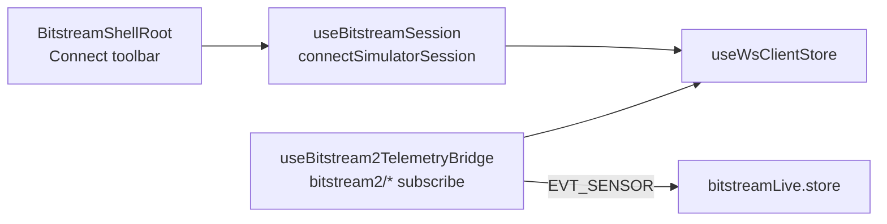

# Bitstream webview transport — simulator-only (May 2026)

**Date:** 2026-05-27

**Status:** The main Bitstream shell (`BitstreamShellRoot` / `BitstreamAppWrapper`) **no longer exchanges data with the serial bridge** over `serialport/*` WebSocket topics. UART / COM / `SerialBridgeTransportAdapter` / `runtimeSync` / serial port list UI were **removed** pending a full redesign.

**Still supported in the webview today:**

| Path | Mechanism |
|------|-----------|
| **Simulator telemetry** | `useWsClientStore` + `useBitstream2TelemetryBridge` on `bitstream2/*` (HELLO, `EVT_SENSOR`, `DEV_SIM_STATE`, loopback control) |
| **Simulator session** | `useBitstreamSession` — connect/disconnect WebSocket only; live metrics ingest |
| **BS2 control (simulator)** | `useBitstream2Bmi270Transport`, `bitstream2/req` when backend is simulator |
| **Local UI draft cfg** | `useSensorConfigController` — store-only (`updatedAtMs: 0`); no broker fan-out |

**Not wired in the webview (removed or stubbed):**

- `serialport/status`, `serialport/runtime-snapshot`, `serialport/data`, `serialport/list`
- `SerialBridgeTransportAdapter`, auto COM pick, serial port list window
- Telemetry wedge auto-reconnect (`useAutoReconnectTelemetryWhenWedged`, `BitstreamTelemetryWedgeRuntime`)
- Broker `publish*` helpers from `useBitstreamSession` (no-op stubs)
- `HostSession` / legacy v1 UART decode in the main shell hook

**Bitstream (firmware) work** continues via:

- Node bridge + CLI (`bitstream2:uart-probe`, matrix harnesses) — see `HOW_TO_RUN.md` and `UART_TEST_COMMANDS.md`
- Future webview redesign will reattach UI ↔ bridge on a clean BS2-only transport layer

## Connect flow (simulator)

1. Set telemetry **SOURCE** to **Simulator**.
2. Start the **bitstream-simulator** extension and bridge (`npm run start:bridge`).
3. Click **Connect** — session opens shared WebSocket; bridge publishes sine samples on `bitstream2/evt/sensor`.

## Key files

| File | Role |
|------|------|
| `hooks/useBitstreamSession.ts` | Simulator WS connect, metrics coalesce, stub `publish*` |
| `hooks/useBitstream2TelemetryBridge.ts` | BS2 topic subscription and sample mapping |
| `utils/bitstreamTelemetryTransport.ts` | Gating: UART transport/ingest disabled until redesign |
| `bitstream-shell/BitstreamShellRoot.tsx` | Shell composition (no serial port windows) |

## Related docs

- `HOW_TO_RUN.md` — loopback dev stack
- `BITSTREAM_SENSOR_DATA_FLOW_AND_STATE.md` — live store and BS2 path (§0)
- `DEVELOPMENT_TRACKER.md` — session log entry 2026-05-27
