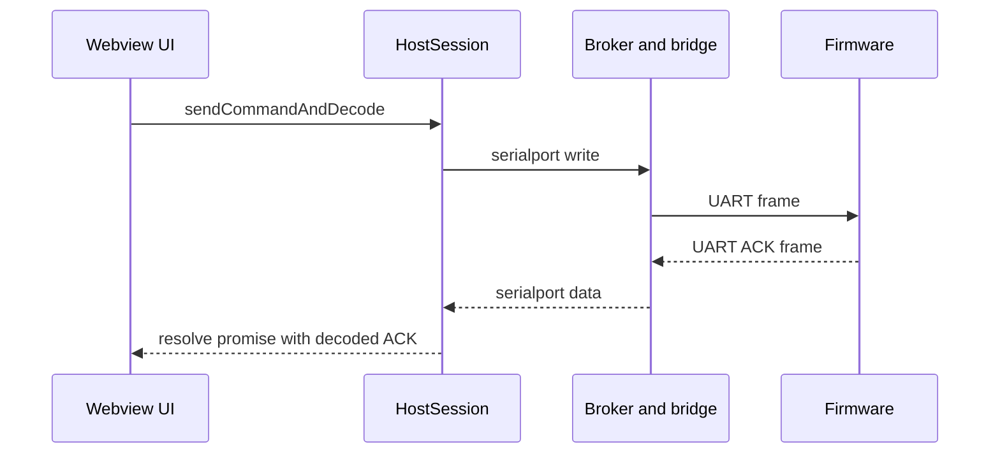
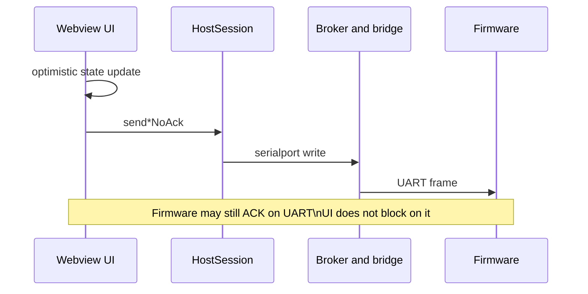

# Command acknowledgement confirmation modes (Bitstream dashboard)

**Last updated:** 8 May 2026

This document proposes a user-facing feature for the Bitstream dashboard: a small set of **command confirmation modes** that control whether the UI **awaits firmware ACKs** (request/response completion) or uses **fire-and-forget** semantics with optimistic UI updates.

This is **host/UI policy**. The firmware may still transmit ACK frames on the wire regardless of the mode; the difference is whether the dashboard **blocks UI workflows** on a matching ACK envelope.

Related:

- Bitstream framing and ACK IDs: `src/bitstream/docs/FRAME_PROTOCOL_SPECIFICATION.md`
- Webview ↔ firmware routing (command vs ACK path): `src/webview/bitstream-app/docs/BITSTREAM_SERIAL_AND_BROKER_DATA_FLOW.md`
- Host session knobs: `src/bitstream/session/host-session.ts` (`disableWriteAwaitAck`)

---

## Problem statement

Under heavy sensor streaming load, awaiting CONTROL ACKs can create a poor UX:

- Long “pending” states (seconds)
- Spurious timeouts / retries when ACKs are delayed
- Confusing outcomes when multiple clients or high-volume streams compete on one UART

At the same time, some commands must be **confirmed** (reads, diagnostics snapshots, handshake correctness) and should remain ACK-gated for correctness and debuggability.

---

## Goals

- **Good default:** zero user configuration for most users.
- **Predictable behavior:** the same command should behave consistently per mode.
- **Fast UX where it matters:** interactive controls should not feel blocked by UART latency.
- **Reliable correctness where required:** reads and boot-critical operations must remain confirmed.
- **Supportability:** easy to ask users “which mode are you in?” during triage.

Non-goals:

- No per-command “advanced checkbox matrix” in the UI.
- No wire protocol changes required for initial rollout.

---

## Proposed user modes

Expose **three** modes only.

### Mode: Auto (recommended)

Auto uses a per-command policy:

- Commands that **return data** or are **boot/safety critical** are **ACK-confirmed**.
- Commands that are **high-frequency** and have good reconciliation signals are **fire-and-forget**.

### Mode: Reliable (strict)

Prefer **ACK-confirmed** behavior whenever the transport supports it.

Used for:

- QA bring-up
- Deep debugging
- “I need proof firmware applied it”

### Mode: Fast (best effort)

Prefer **fire-and-forget** for all commands.

Used for:

- Demos and unstable links
- “Keep UI responsive even if the device is busy”

This mode must show a warning that outcomes are **not confirmed** and may be corrected later by snapshots/telemetry.

---

## Command classification (Auto mode)

This table maps Bitstream command categories to the default Auto policy.

### Always ACK-confirmed

- Handshake and capability discovery
  - `handshake.run` (and its steps: HELLO/PING/CAPS/STATUS)
- Any `*.get` command
  - `sensor.cfg.get`
  - `sensor.bmi270.mode.get`
  - `sensor.bmi270.fusion.feed.get`
  - `diag.snapshot.get`
  - `diag.task.table.get`
- Diagnostics stream control (recommended confirmed)
  - `diag.stream.start`
  - `diag.stream.stop`
- Any command whose UX depends on the returned payload immediately

### Default fire-and-forget

- High-frequency interactive “set” commands with good reconciliation sources
  - `sensor.cfg.set` (sliders/toggles)
  - `sensor.bmi270.mode.set` (mode switch when rapidly toggled)
  - `sensor.bmi270.fusion.feed.set` (when driven by a slider)
- Wi‑Fi operations where status events provide continuous truth
  - scan / connect / disconnect / status poll, if the UI uses event-driven status instead of waiting on ACK
- Firmware log level `set` when the UI prefers responsiveness and can tolerate correction

### Notes

- “Fire-and-forget” means the UI does not block on a matched ACK envelope. It does **not** imply the firmware stops sending ACK frames.
- Auto should still record “last send” and surface transport failures (write error) even when not waiting for ACK.

---

## UX design

### Entry point

Put the selector in one place only (for example in the Bitstream shell hamburger under a “Communication” or “Firmware link” section):

- Label: **Command confirmation**
- Options: **Auto (recommended)**, **Reliable (wait for confirmation)**, **Fast (don’t wait)**

### Suggested copy

Auto:

- “Balances speed and correctness. Reads and boot steps wait for confirmation; sliders do not.”

Reliable:

- “Waits for firmware confirmation where possible. Can feel slower under heavy streaming.”

Fast:

- “Best effort. Commands may not be applied. UI may correct later from snapshots and telemetry.”

### Visual behavior guidance

- Do not show a blocking spinner immediately.
- If a command is ACK-confirmed and takes longer than a short threshold, show a subtle “Applying…” indicator.
- For fire-and-forget actions, show immediate optimistic UI update plus a lightweight “sent” log line.

---

## Implementation sketch (webview)

### Core idea

Introduce a single, typed policy decision function in the webview:

```text
ackPolicyFor(commandType, mode) -> awaitAck boolean
```

Then route command execution through either:

- `sendCommandAndDecode` (ACK-confirmed), or
- `*NoAck` / `writeCmd` (fire-and-forget).

### Where it integrates

The bridge transport supports **ACK-confirmed RPC** using `serialport/cmd` and a returned `cmd-result` that includes `ackFrameB64` when `awaitAck: true`.

- `HostSession.send()` uses transport `writeAwaitAck()` when available and not disabled. This path is robust under streaming load because the bridge correlates ACKs on the backend.
- The dashboard mode primarily decides whether each **UI action** uses an ACK-confirmed helper (`sendCommandAndDecode`, `sendLogLevelGet/Set`, etc.) or a fire-and-forget helper (`*NoAck`, `writeCmd`).

### Recommended approach for Auto in this codebase

Given current patterns already have explicit `*NoAck` helpers for several commands, the simplest safe Auto design is:

- Keep webview session global `disableWriteAwaitAck: true` (interactive-friendly baseline).
- Implement “await ACK” by explicitly using `HostSession.sendCommandAndDecode` for the “Always ACK-confirmed” commands only.
- Continue to use `*NoAck` helpers for “Default fire-and-forget” commands.

This avoids flipping session-global behavior in the middle of a run.

**Current implementation note (May 2026):** The dashboard now uses backend ACK correlation for ACK-confirmed operations (bridge `awaitAck: true`), while still allowing Fast mode to fire-and-forget without waiting for confirmation.

---

## Sequence diagrams

### ACK-confirmed command



### Fire-and-forget command



---

## Operational guidance

### Support checklist

When debugging a user report, always ask:

- Which **confirmation mode** is selected
- Whether sensor streaming was running and at what cadence
- Whether multiple clients were connected to the same broker

### Firmware-side improvements that complement ACK modes

If Reliable mode is expected to stay under a tight user-visible budget (for example under one second):

- Prefer ACK prioritization (pause streaming briefly, or priority TX queue)
- Keep CONTROL handlers short and defer heavy work

These changes are firmware-side and can improve the experience without changing the host protocol.

### Selected direction: firmware-native streaming pause (Option C)

This project selects the firmware-native pause/resume control command approach (Option C) to keep ACK-confirmed commands responsive under streaming load. See:

- `src/webview/bitstream-app/docs/STREAMING_PAUSE_QUICK_COMMAND.md`
- `src/bitstream/docs/FRAME_PROTOCOL_SPECIFICATION.md` (§6.22–§6.25)

