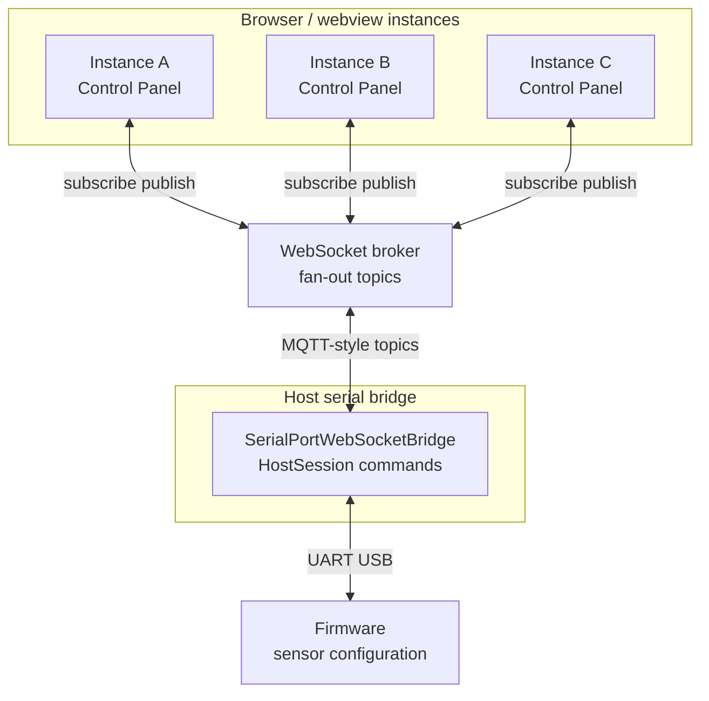
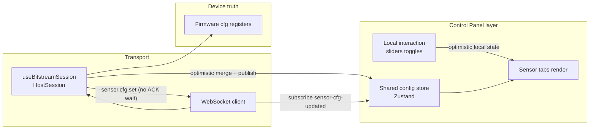

# Control Panel multi-instance sync — design notes

**Last updated:** 27 May 2026

**Implementation status (2026-05-27):** Broker fan-out and **`serialport/*`** webview session are **removed** pending transport redesign. **`useSensorConfigController`** is **local store draft only** (`updatedAtMs: 0`). Sections below describe the **previous** multi-instance design for when fan-out is restored.

---

## 1. Current gap (historical)

- **Local UI state** in `BitstreamSensorWorkspaceView` (`workspace/BitstreamSensorWorkspaceView.tsx`) historically held sampling interval, publish mode, delta, min publish, enabled, etc. in **`useState`**, with cold reads from firmware on mount.
- When **one instance** successfully changed firmware-visible settings, **other instances** could stay stale until they received a **shared** update signal.
- **Telemetry** (`applyMetricsSnapshot` / `latestByHint`) reflects live behavior, but **Control Panel widgets** also need a **shared config** path (broker JSON + Zustand store).
- **BroadcastChannel / `storage` events** only sync across tabs on the **same machine** — they do **not** cover multiple machines or a central broker.

---

## 2. Goals

| ID | Goal |
|----|------|
| G1 | After a Control Panel change is **issued** toward firmware, **every instance** on the same broker must **converge on the same displayed intent** quickly (optimistic merge + broker fan-out). |
| G2 | **Authoritative reconciliation** — firmware / bridge **`RUNTIME_SNAPSHOT`** (and live samples) remain the long-term source of truth when they disagree with optimistic UI. |
| G3 | Clients must receive updates via the **shared broker** — not rely only on per-window memory. |

### Non-goals (initial phases)

- No mandatory advanced UX (e.g. conflict modal) — can be added later.
- No change to VSIX vs browser detection behavior beyond subscribing an additional topic on the same session.

---

## 3. Design principles

1. **Push after local merge (webview)** — On each `sensor.cfg.set` **intent**, the originating webview **first** merges the resolved row into **`useBitstreamDeviceSensorConfigStore`**, then **immediately** publishes **`SensorCfgUpdatedPayload`** on **`serialport/sensor-cfg-updated`** (see §7). Other tabs merge the same JSON without waiting for a UART round-trip.
2. **Fan-out** — The WebSocket broker delivers that message to **every client** subscribed to the topic (same pattern as telemetry / `RUNTIME_SNAPSHOT`).
3. **Central config store (webview)** — Clients merge payloads into **`useBitstreamDeviceSensorConfigStore`** (`state/bitstreamDeviceSensorConfig.store.ts`). Control panels read store-backed values; **`getSensorConfig`** in **`useSensorConfigController`** is **store-only** (it does **not** issue **`sensor.cfg.get`** on each call).
4. **Cold / boot path (webview)** — After handshake passes, **`BitstreamAppWrapper`** runs **`sensor.cfg.get`** per supported **`sourceId`** (**`sensorCfgColdSyncFromSession.ts`**), merges into the store, then **`publishRuntimeSnapshotWithSensorConfigs`** with **verified** rows only (`updatedAtMs > 0`) and sets **`firmwareSensorTruthReady`** so boot chrome and downstream effects (for example log-level auto-apply) can proceed. Seeded default rows (`updatedAtMs === 0`) are **not** fan out as firmware truth.

---

## 4. Block diagram — system context

System-level view: multiple UI instances, one broker, bridge owns serial to firmware.



Main flows:

- Any instance sends **`sensor.cfg.set`** (and related CONTROL commands) through the existing command path → bridge → serial → firmware. The webview does **not** pair each interactive `set` with **`sensor.cfg.get`**.
- The **originating instance** publishes to `serialport/sensor-cfg-updated` **immediately after** optimistic store merge (see section 7) → broker **fans out** → every instance **merges into the store** and **updates the UI**. Firmware may still ACK on the wire; the webview **`HostSession`** does not await that ACK for these sends when **`disableWriteAwaitAck`** is enabled.

---

## 5. Block diagram — data flow (logical)



---

## 6. Sequence — happy path (implemented)

Flow when **user on Instance A** changes a value while **Instance B** stays open:

```mermaid
sequenceDiagram
  participant UserA as User instance A
  participant UIA as UI A
  participant Br as Broker
  participant Bridge as Serial bridge
  participant FW as Firmware
  participant UIB as UI B

  UserA->>UIA: Change sampling interval
  UIA->>UIA: merge store (optimistic)
  UIA->>Br: publish SENSOR_CFG_UPDATED JSON
  Br-->>UIA: subscribed clients receive
  Br-->>UIB: subscribed clients receive
  UIA->>Br: sensor.cfg.set via session (fire-and-forget)
  Br->>Bridge: command routing
  Bridge->>FW: write configuration
  Note over FW,Bridge: Firmware may ACK on UART;\nwebview does not block UI on it
  UIB->>UIB: merge store from broker JSON
```

---

## 7. Protocol (aligned with `protocol.ts`)

| Item | Value |
|------|--------|
| Topic name | `serialport/sensor-cfg-updated` (`SERIALPORT_TOPICS.SENSOR_CFG_UPDATED`) |
| Payload type | `SensorCfgUpdatedPayload` |
| Fields | `sourceId`, `enabled`, `publishMode`, `samplingIntervalMs`, `deltaX100`, `minPublishIntervalMs`, `timestampMs`, optional `requestId`, optional **`instanceToken`** (per-tab id — suppresses self-echo toasts) |
| Emit timing | Immediately after optimistic **`mergeVerifiedDeviceSensorConfig`** in **`useSensorConfigController`** (before / independent of UART ACK); wired from **`BitstreamAppWrapper`** via **`publishSensorCfgUpdated`** |
| Emitter | **Webview** (`publishSensorCfgUpdated` from `useBitstreamSession`), not the Node `SerialPortWebSocketBridge` |
| Subscribers | Status-channel WebSocket client in `useBitstreamSession` (same connection used for `RUNTIME_SNAPSHOT`) |

**`RUNTIME_SNAPSHOT` extension:** `BridgeRuntimeSnapshotPayload.sensorConfigs` (type `BridgeRuntimeSnapshotSensorConfigs`) is optional. When present, `useBitstreamSession` merges rows into the device sensor store. The stock Node `SerialPortWebSocketBridge` does not populate this field on its own. After handshake passes, **`BitstreamAppWrapper`** first runs **`sensor.cfg.get`** cold sync into the store, then calls **`publishRuntimeSnapshotWithSensorConfigs`** with **verified** rows (`updatedAtMs > 0`) so late joiners receive a firmware-aligned baseline in addition to per-source **`SENSOR_CFG_UPDATED`** publishes.

---

## 8. Webview implementation plan (phased)

| Phase | Scope | Status |
|-------|--------|--------|
| **A** | Broker emits config intent events | **N/A for host bridge** — webview publishes JSON on the existing broker topic; no bridge frame parsing |
| **B** | Client subscribes and updates store | **Done** — `useBitstreamSession` + `bitstreamDeviceSensorConfig.store.ts` |
| **C** | Control panels read from store | **Done** — `BitstreamAppMain` merges fetch + store-driven `useEffect` sync |
| **D** | Boot / late-joiner baseline | **Done** — merge `sensorConfigs` from `RUNTIME_SNAPSHOT` when present; after handshake, cold **`sensor.cfg.get`** sweep + republish verified **`sensorConfigs`** (`BitstreamAppWrapper`, `sensorCfgColdSyncFromSession.ts`) |
| **E** | UX | **Done** — `react-toastify` info toast when another instance’s cfg payload is merged (`instanceToken` ≠ this tab); `ToastContainer` in `BitstreamAppMain` |

---

## 8a. Host bridge relay — not implemented (by design)

The WebSocket broker already **fans out** `SENSOR_CFG_UPDATED` to every subscribed webview. A separate **relay inside the Node serial bridge** is unnecessary unless a non-webview subscriber must observe cfg without joining the same JSON topic — out of scope for this dashboard.

---

## 9. Edge cases

| Case | Handling |
|------|----------|
| Two users change settings concurrently | Broker payloads reflect **publish order**; firmware truth converges via **`RUNTIME_SNAPSHOT`** and live telemetry |
| Instance offline | On reconnect, **`RUNTIME_SNAPSHOT`** + broker topics repopulate shared store when the status WebSocket returns |
| Same browser only | Broker fan-out still applies; `BroadcastChannel` remains optional |
| Publish fails (status WS down) | Multi-instance sync degrades silently; local instance still merged store on success |

---

## 10. Sensor config ACK state (legacy hooks; not ACK-gated UX)

- **`useSensorConfigController`** still exposes **`sensorConfigAck`** (`SensorConfigAckState` in `types/sensorConfigAck.ts`) for transport errors and a narrow retry path (for example BMI270 output-mode retry wiring).
- Interactive **`sensor.cfg.set`** does **not** drive card-level “pending → ok” transitions from CONTROL ACKs; the webview uses **`HostSession`** with **`disableWriteAwaitAck: true`** so the transport does not **`writeAwaitAck`** for those frames.
- **`sourceId`** on ack-related state (when used) still scopes panels via **`ackSensorSourceId`** on `*ControlPanel` components.
- Source id constants: `constants/sensorSourceIds.ts`.

---

## 11. Related files (current codebase)

- Sensor config controller: `control/useSensorConfigController.ts` (optimistic merge, broker publish, fire-and-forget `executeBitstreamCommand`)
- Control shell and panel state: `BitstreamAppMain.tsx` (includes `ToastContainer` for remote-config toasts), `BitstreamAppWrapper.tsx`
- Session / WebSocket: `hooks/useBitstreamSession.ts`
- Device sensor config store: `state/bitstreamDeviceSensorConfig.store.ts`
- Source labels for toasts: `constants/sensorSourceIds.ts` (`getSensorSourceDisplayLabel`)
- Config persistence (dashboard UI prefs, not live sensor cfg): `state/bitstreamConfig.store.ts`
- Live metrics: `state/bitstreamLive.store.ts`
- Bridge topics: `src/serialport-bridge/protocol.ts`
- Runtime operations log (not sensor cfg sync): `RUNTIME_OPERATION` → `pushRuntimeOperation`

---

## 12. Implementation TODO checklist

All planned items for this feature set are complete.

- [x] Add `SERIALPORT_TOPICS.SENSOR_CFG_UPDATED` + `SensorCfgUpdatedPayload`
- [x] Add Zustand store `useBitstreamDeviceSensorConfigStore` + **no** clear on serial disconnect (last verified rows kept; cold sync refreshes after reconnect)
- [x] Subscribe / publish from `useBitstreamSession` status client
- [x] Optimistic merge + immediate broker publish in **`useSensorConfigController`**; **`setSensorConfig`** wired from **`BitstreamAppWrapper`**
- [x] `BitstreamAppMain`: cold fetch writes store; store sync effects update sliders
- [x] Toast when remote overwrite applied (`instanceToken` + `react-toastify` + `ToastContainer` on bitstream entry)
- [x] Extend `BridgeRuntimeSnapshotPayload` with optional `sensorConfigs` + merge on snapshot in `useBitstreamSession`
- [x] Host bridge relay — **declined** (documented in §8a; broker fan-out is sufficient)

---

## 13. Revision log

| Date | Note |
|------|------|
| 2026-05-02 | Initial design — block diagrams and phased plan before coding |
| 2026-05-02 | Document language: English only (see repository Markdown rule) |
| 2026-05-02 | Renamed IMU-prefixed workspace symbols in code to **BMI270** where those symbols are BMI270-only. Multi-sensor workspace: **`BitstreamSensorWorkspaceView`**; telemetry deck: **`SensorTelemetryDeckView`**. |
| 2026-05-02 | **`BitstreamSensorWorkspaceView`**: local React state and handlers use sensor-prefixed names (**`bmi270*`**, **`dps368*`**, **`sht40*`**, **`bmm350*`**); **`dps368StreamCounter`** (was `dpsFrameCounter`). |
| 2026-05-02 | Workspace component renamed **`Bmi270WorkspaceView` → `BitstreamSensorWorkspaceView`** (multi-sensor layout); panel **`persistKey`** values updated (`left-sensor-settings`, `right-sensor-telemetry`). |
| 2026-05-02 | **`bmi270ConfigAck` → `sensorConfigAck`** with **`sourceId`**; control panels filter by `ackSensorSourceId`. |
| 2026-05-02 | Implemented multi-instance sync: **`serialport/sensor-cfg-updated`**, **`bitstreamDeviceSensorConfig.store.ts`**, subscribe/publish in **`useBitstreamSession`**, merge/publish in **`BitstreamAppWrapper`**, store-driven sync in **`BitstreamSensorWorkspaceView`**. |
| 2026-05-02 | Multi-instance UX + cold path: **`instanceToken`** on **`SensorCfgUpdatedPayload`**, optional **`sensorConfigs`** on **`BridgeRuntimeSnapshotPayload`**, remote toast, **`getSensorSourceDisplayLabel`**, **`ToastContainer`** in **`BitstreamAppMain`**. Validated with three concurrent instances. |
| 2026-05-12 | **P1:** Serial disconnect no longer clears **`useBitstreamDeviceSensorConfigStore`** (avoid seed flash); checklist §12 updated |
| 2026-05-12 | Boot path: post-handshake **`sensor.cfg.get`** cold sync + verified-only **`RUNTIME_SNAPSHOT.sensorConfigs`** republish; docs §3 / §7 / phase **D** updated |
| 2026-05-08 | Document refresh: webview **no-ACK-wait** session, **optimistic** `sensor.cfg.set` + immediate **`sensor-cfg-updated`** publish; interactive paths still **no per-click `sensor.cfg.get` verify** (MCP tools may verify separately). Boot **`firmwareSensorTruthReady`**: see **2026-05-12** (post-handshake cold sync). |
