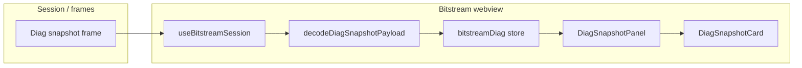

# Diagnostics Snapshot UI

**Scope:** `src/webview/bitstream-app/components/diag/` — **Diagnostics Control** and **Diagnostics Snapshot** cards in the left workspace column (`DiagCardsDeck` inside `BitstreamSensorWorkspaceView`).

---

## 1. Components

| Component | Role |
|-----------|------|
| **`DiagCardsDeck.tsx`** | `TRNSortableContainer` + two sortable cards: control panel + snapshot card; local order/collapse state. |
| **`DiagControlPanel.tsx`** | Host-facing diag streaming controls (collapses, wraps `DiagControlCard`). |
| **`DiagSnapshotPanel.tsx`** | Reads **`useBitstreamDiagStore`** and renders **`DiagSnapshotCard`** (no manual refresh). |
| **`DiagSnapshotCard.tsx`** | `TRNInteractiveCard` titled **Diagnostics Snapshot** — grid of `TRNParameter` rows (CPU, idle, heap, tasks, runtime). |

---

## 2. Snapshot data flow

- Live frames are handled in **`useBitstreamSession`**; payloads tagged as diagnostic snapshot are **`decodeDiagSnapshotPayload`**’d and passed to **`useBitstreamDiagStore.getState().setSnapshot`**.
- **`DiagSnapshotPanel`** only **displays** `snapshot`, `error`, and `updatedAt` from the store; it does **not** expose a **Refresh** action in the card header.
- The header shows **drag handle** + **chart icon** + title only (no protocol badge, no refresh button).

---

## 3. `TRNParameter` in the snapshot grid

- **`nameColumnLayout="auto"`**, **`valueColumnLayout="auto"`** for long labels in a 2-column grid.
- **`iconPulseOnValueChange`** so icons pulse when values update (same hook as sensor rows; see **`TRNParameter.md`**).

---

## 4. Related store

- **`state/bitstreamDiag.store.ts`** — `snapshot`, `error`, `updatedAt`, `loading` / `setLoading`, `setSnapshot`, `setError` (loading still used internally when applying snapshot/error paths from the session).
