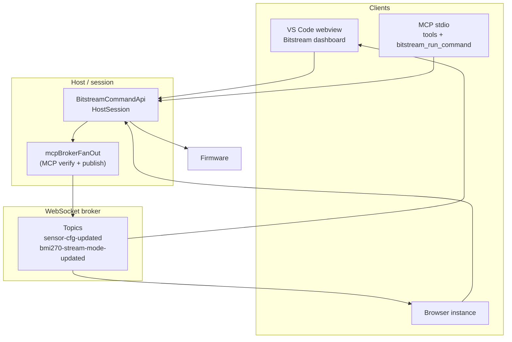

# Firmware control — multi-client sync, MCP/LLM as a client, and backend fan-out

**Last updated:** 8 May 2026 (diagnostics matrix: firmware `proj_cm55` diag service)

This document captures architecture decisions for **boot/device UI**, **multiple clients** (browser, VS Code webview, MCP/LLM), and **backend-observed changes** that must **publish** state so every UI stays aligned. It complements the implemented **`sensor.cfg` multi-instance fan-out** described in **`CONTROL_PANEL_MULTI_INSTANCE_SYNC.md`**.

For **MCU → COM → bridge → WebSocket → webview/MCP** byte-level diagrams, see **`BITSTREAM_SERIAL_AND_BROKER_DATA_FLOW.md`**.

---

## 1. Goals

| ID | Goal |
|----|------|
| G1 | **Single command vocabulary** — same typed `BitstreamCommandRequest` for UI, tests, and MCP (`bitstream_run_command`). |
| G2 | **Device truth** — firmware and bridge **`RUNTIME_SNAPSHOT`** / telemetry are authoritative over time. **MCP** paths that need a strict audit trail still use ACK + **`sensor.cfg.get` verify** before broker publish; the **Bitstream webview** uses **optimistic store merge + immediate** **`sensor-cfg-updated`** (no per-click verify read on each **`sensor.cfg.set`**). After handshake **`passed`**, the webview runs a **bounded `sensor.cfg.get` cold sync** into the shared store (`sensorCfgColdSyncFromSession.ts`). |
| G3 | **Multi-client sync** — when **any** client successfully changes firmware-visible behavior, **all** subscribed dashboards receive an update (WebSocket broker fan-out). |
| G4 | **MCP/LLM is one client** — Cursor agents use MCP tools; they are **not** a separate firmware path; outcomes must **fan-out** like webview-initiated writes. |
| G5 | **Revision / ordering** — payloads carry **`timestampMs`**, optional **`requestId`**, and **`instanceToken`** so clients can suppress self-echo toasts and detect stale messages. |

---

## 2. Strict LLM-only vs hybrid (terminology)

| Mode | Behavior |
|------|-----------|
| **Strict LLM-only** | Only MCP/agent commands reach the device; webview never sends `sensor.cfg.*` directly. (Conflicts with current sensor tabs unless those are redesigned.) |
| **Hybrid (recommended)** | Webview **and** MCP share the **same** typed command vocabulary and broker topics. **MCP** may still **verify then publish**; the webview **publishes intent immediately** and **fire-and-forgets** `sensor.cfg.set` while **`HostSession.disableWriteAwaitAck`** avoids blocking on CONTROL ACKs. |

This codebase targets **hybrid**: product UX stays responsive; agents stay first-class; broadcast keeps everyone in sync.

---

## 3. What “backend perceives” means

Treat a **configuration change** as a two-layer story:

**Webview (dashboard)**

1. User intent → **`mergeVerifiedDeviceSensorConfig`** (optimistic row) → **`publishSensorCfgUpdated`** on the broker (other tabs merge immediately).
2. **`executeBitstreamCommand(session, { type: "sensor.cfg.set", … })`** runs **without** awaiting a CONTROL ACK envelope when the session uses **`disableWriteAwaitAck`** (see `useBitstreamSession`).
3. Longer-term alignment → **`RUNTIME_SNAPSHOT`**, live samples, and optional MCP publishes from other clients.

**MCP / agents (strict path)**

1. Command applied → firmware ACK path observed (normal `HostSession` / transport **`writeAwaitAck`** usage).
2. **`sensor.cfg.get`** (or equivalent) confirms registers where the tool contract requires it.
3. **Publish** JSON on broker topics (e.g. `serialport/sensor-cfg-updated`) via **`mcpBrokerFanOut`**.

**Important:** The VS Code webview cannot invoke Cursor MCP tools directly. MCP runs in a Node stdio process that shares the **same WebSocket broker** as the dashboard when configured; fan-out may originate from **either** path, using the **same topic schema**.

---

## 4. Existing MCP ↔ firmware surface (inventory)

### 4.1 Umbrella tool — `bitstream_run_command`

- **Code:** `bitstreamCommandMcpTool.ts`, `runBitstreamCommandFromMcp` → `BitstreamCommandApi` → `executeBitstreamCommand`.
- **`BitstreamCommandApi` command types:** `handshake.run`, `sensor.cfg.set`, `sensor.cfg.get`, `sensor.bmi270.mode.set`, `sensor.bmi270.mode.get`, `sensor.bmi270.fusion.feed.set`, `sensor.bmi270.fusion.feed.get`, `diag.stream.start`, `diag.stream.stop`, `diag.snapshot.get`, `diag.task.table.get`, `diag.task.priority.set`.
- **Normalization:** `bitstreamCommandMcpAdapter.ts` maps MCP JSON into typed requests.

### 4.2 Dedicated MCP tools (`register-tools.ts`)

| Tool | Role |
|------|------|
| `bitstream_health_check` | Connectivity |
| `bitstream_control_ops` | Low-level **`hello`**, **`ping`**, **`caps`**, **`status`**, **`sensor_reinit`** (not the typed `BitstreamCommandRequest` diag set) |
| `bitstream_sensor_config_get` | **`sensor.cfg.get`** |
| `bitstream_sensor_status_get` | Status snapshot |
| `bitstream_sensor_latest_samples_get` | Parsed samples window |
| **`bitstream_sensor_start_stop_set`** | **`sensor.cfg.get` → preserve → `sensor.cfg.set` → verify `get`** (custom tool; not `runBitstreamCommandFromMcp`) |
| `bitstream_diag_snapshot_get` | Diagnostics **snapshot** (typed **`diag.snapshot.get`** / firmware **0x01**) — parsed **`0x81`** payload |
| `bitstream_diag_fault_events_get` | Collects diagnostics **fault / audit** events (**`0x84`**) from the stream — **not** a separate wire “command” in `bitstreamCommandTypes.ts` |
| `bitstream_diag_task_table_get` | **Task table** (**`diag.task.table.get`** / firmware **0x04**) — structured rows |
| `bitstream_diag_task_priority_set` | **Set task priority** (**`diag.task.priority.set`** / firmware **0x10**) |
| `bitstream_run_command` | Any typed **`BitstreamCommandRequest`** (including all diagnostics commands below) |

Cursor IDE descriptors mirror these names under **`mcps/user-bitstream-backend/tools/*.json`**.

### 4.3 Broker fan-out after MCP (implemented)

| Trigger | Topic | `instanceToken` | Module |
|---------|--------|-----------------|--------|
| **`bitstream_run_command`** with successful **`sensor.cfg.set`** | `serialport/sensor-cfg-updated` | **`mcp`** | **`mcpBrokerFanOut.ts`** → verify **`sensor.cfg.get`** then publish |
| **`bitstream_run_command`** with successful **`sensor.bmi270.mode.set`** | `serialport/bmi270-stream-mode-updated` | **`mcp`** | **`mcpBrokerFanOut.ts`** → publish from ACK **`modeEcho`** |
| **`bitstream_sensor_start_stop_set`** success (verified **`after`**) | `serialport/sensor-cfg-updated` | **`mcp`** | **`publishSensorCfgUpdatedFanOut`** in **`mcpBrokerFanOut.ts`** |

**Transport:** `SerialBridgeTransportAdapter.publishBrokerJson` (optional on **`TransportAdapter`**). In-memory / WebSerial transports skip publish (no-op).

### 4.4 Command outcome hooks (for diag fan-out / observability)

- **`executeBitstreamCommand`** accepts optional **`onOutcome`** (`BitstreamCommandOutcomeContext`: **`session`**, **`command`**, **`envelope`**) after the registry handler completes (success or caught failure). Observer errors are logged and do **not** change the returned envelope.
- **`BitstreamCommandApi`** accepts optional **`onCommandOutcome`** with the same envelope shape; **`session`** may be **`null`** when UART is unavailable (same error as today). Invalid **`executeRaw`** payloads do **not** invoke this hook (they fail before **`execute`**).

### 4.5 Diagnostics command matrix (firmware ↔ host ↔ webview ↔ MCP)

**Firmware source of truth (TESAIoT):** `TESAIoT_Firmware/proj_cm55/src/bitstream/modules/diag/src/bitstream_diag_service.c` — command IDs:

| ID | DIAG command |
|----|----------------|
| **`0x01`** | Get snapshot |
| **`0x02`** | Stream start (periodic telemetry) |
| **`0x03`** | Stream stop |
| **`0x04`** | Get task table (multi-frame **`0x82`** / **`0x83`** events) |
| **`0x10`** | Set task priority |

**Diagnostics channel events** (same module): **`0x80`** ACK, **`0x81`** snapshot body, **`0x82`** task list header, **`0x83`** task item, **`0x84`** fault event.

**Host typed commands** (`bitstreamCommandTypes.ts` / `HostSession`): map 1:1 to those wire commands except fault collection (event-driven).

| Typed command | Wire payload (host encoding) | Webview UI | MCP / agents |
|---------------|------------------------------|------------|--------------|
| **`diag.stream.start`** | **`diagMajor`**, **`diagMinor`**, **`globalPeriodMs`** (uint16 LE), **`taskPeriodMs`** (uint16 LE) — “global interval” and “task interval” for the diagnostics stream | **Yes** — **`DiagControlPanel`** (`globalPeriodMs` / `taskPeriodMs` sliders + start) | **`bitstream_run_command`** |
| **`diag.stream.stop`** | **`diagMajor`**, **`diagMinor`** | **Yes** — same panel (stop) | **`bitstream_run_command`** |
| **`diag.snapshot.get`** | **`diagMajor`**, **`diagMinor`** | **Yes** — **`DiagSnapshotPanel`** via **`getDiagSnapshot`** in **`BitstreamAppWrapper`** | **`bitstream_diag_snapshot_get`** or **`bitstream_run_command`** |
| **`diag.task.table.get`** | **`diagMajor`**, **`diagMinor`** | **Not in UI today** — use MCP or **`bitstream_run_command`** | **`bitstream_diag_task_table_get`** or **`bitstream_run_command`** |
| **`diag.task.priority.set`** | **`diagMajor`**, **`diagMinor`**, **`taskId`**, **`newPriority`**, inner **`requestId`** | **Not implemented in UI (planned)** | **`bitstream_diag_task_priority_set`** or **`bitstream_run_command`** |

**Fault / audit events (`0x84`):** no matching **`BitstreamCommandRequest`**; MCP **`bitstream_diag_fault_events_get`** gathers parsed events from the session.

**Stream period limits:** firmware enforces min/max period (ms); the webview clamps via **`clampDiagStreamIntervalMs`** / **`diagStreamIntervals.ts`** before **`sendDiagStreamStart`**.

**Caps:** firmware may advertise **`BITSTREAM_CAPS_FLAG_DIAGNOSTICS_TASK_PRIORITY_CONTROL`** when priority changes are allowed — UI should respect this when the task-priority panel is added.

---

## 5. Relationship to other docs / code

| Topic | Document / code |
|-------|------------------|
| Multi-instance control panels | **`CONTROL_PANEL_MULTI_INSTANCE_SYNC.md`**, `bitstreamDeviceSensorConfig.store.ts`, `useBitstreamSession.publishSensorCfgUpdated` |
| BMI270 stream mode (webview) | **`serialport/bmi270-stream-mode-updated`**, `publishBmi270StreamModeUpdated` |
| Command types | **`bitstreamCommandTypes.ts`**, **`BitstreamCommandApi`** |
| Diagnostics matrix | **§4.5** (this file); firmware: **`proj_cm55/.../bitstream_diag_service.c`** |
| MCP server listing | **`src/bitstream/mcp-server/README.md`** |

---

## 6. High-level architecture



---

## 7. Sequence — MCP changes config; other clients update

```mermaid
sequenceDiagram
  participant Agent as Cursor agent
  participant MCP as MCP tool
  participant API as Session slash API
  participant FW as Firmware
  participant Br as WS broker
  participant WV as Webview dashboard

  Agent->>MCP bitstream_run_command or sensor_start_stop_set
  MCP->>API: command slash session helpers
  API->>FW: UART via bridge
  FW-->>API: ACK slash verified read
  MCP->>Br: publish JSON fan-out
  Br-->>WV: subscribers merge store
  WV->>WV: UI matches firmware
```

---

## 8. Boot UI

**Boot UI** covers lifecycle and safe-operation chrome: connection phase, broker snapshot sync, handshake outcome, sensor cold-truth sync, and **interaction blocking** until the firmware handshake completes.

**Implementation:** `BitstreamBootLifecycleBar` + `BitstreamBootInteractionVeil` in `BitstreamAppWrapper` (`src/webview/bitstream-app/ui/`). The veil blocks pointer interaction with the sensor workspace while `RUNTIME_SNAPSHOT` is pending or the handshake is `unknown` / `running`; it clears on `handshakeState === passed` or `failed` (failure keeps banners usable without the veil). The fourth lifecycle pill (`firmwareSensorTruthReady`) turns **true** after handshake passes and the wrapper finishes **`sensor.cfg.get`** cold sync plus optional verified **`RUNTIME_SNAPSHOT.sensorConfigs`** republish (see `sync-effects/sensorCfgColdSyncFromSession.ts`). **MCP** tools that change cfg may still follow verify-then-publish rules independently.

---

## 9. File layout (ASCII)

```
t3d-extension/
  src/
    bitstream/
      command-api/
        mcpBrokerFanOut.ts                # MCP broker fan-out (sensor cfg + BMI270 mode)
        bitstreamCommandMcpAdapter.ts    # invokes fan-out after successful run_command
        bitstreamCommandMcpTool.ts
      mcp-server/
        tools/
          sensor-start-stop-set.ts        # calls publishSensorCfgUpdatedFanOut after verify
      transport/
        transport-adapter.ts             # optional publishBrokerJson()
        serial-bridge-transport.ts         # implements publish via T3DWebSocketClient
    serialport-bridge/
      protocol.ts                        # SensorCfgUpdatedPayload, topics
    webview/bitstream-app/docs/
      FIRMWARE_MULTI_CLIENT_AND_MCP_ARCHITECTURE.md   # this file
    webview/bitstream-app/ui/
      BitstreamBootLifecycleBar.tsx
      BitstreamBootInteractionVeil.tsx
```

---

## 10. Implementation checklist

| Status | Task |
|--------|------|
| [x] | Architecture doc (this file) |
| [x] | Optional **`publishBrokerJson`** on serial bridge transport + **`TransportAdapter`** |
| [x] | **`mcpBrokerFanOut`**: **`sensor.cfg.set`** via **`runBitstreamCommandFromMcp`** → verify **`sensor.cfg.get`** → **`sensor-cfg-updated`** (`instanceToken` **`mcp`**) |
| [x] | **`mcpBrokerFanOut`**: **`sensor.bmi270.mode.set`** via **`runBitstreamCommandFromMcp`** → **`bmi270-stream-mode-updated`** |
| [x] | **`bitstream_sensor_start_stop_set`** → **`publishSensorCfgUpdatedFanOut`** after verified **`after`** read |
| [x] | Generic **`onOutcome`** on **`executeBitstreamCommand`** + optional **`onCommandOutcome`** on **`BitstreamCommandApi`** (central hook for diag fan-out / MCP hosts; observer errors logged, never fail the command) |
| [x] | Boot UI shell + lifecycle states (`BitstreamBootLifecycleBar`, `BitstreamBootInteractionVeil`) |
| [x] | Bridge **`RUNTIME_SNAPSHOT.sensorConfigs`**: optional merge in **`useBitstreamSession`**; webview republishes snapshot rows from the **device config store** after handshake (stock Node bridge may still omit **`sensorConfigs`** — see **`CONTROL_PANEL_MULTI_INSTANCE_SYNC.md` §7**) |

---

## 11. Revision log

| Date | Note |
|------|------|
| 2026-05-03 | Initial document; MCP **`sensor.cfg.set`** verify + broker publish. |
| 2026-05-03 | Renamed module to **`mcpBrokerFanOut.ts`**; added **`sensor.bmi270.mode.set`** fan-out and **`bitstream_sensor_start_stop_set`** fan-out; expanded MCP inventory and checklist. |
| 2026-05-03 | **`RUNTIME_SNAPSHOT.sensorConfigs`**: webview republish after cold sync (`publishRuntimeSnapshotWithSensorConfigs`). |
| 2026-05-03 | **`executeBitstreamCommand`** optional **`onOutcome`**; **`BitstreamCommandApi`** optional **`onCommandOutcome`**. |
| 2026-05-08 | Webview **no-ACK-wait** + **optimistic** multi-instance publish; doc split **MCP verify path** vs **dashboard intent path**. |
| 2026-05-03 | Boot UI: **`BitstreamBootLifecycleBar`** + **`BitstreamBootInteractionVeil`** in **`BitstreamAppWrapper`**. |
| 2026-05-03 | §4.5 Diagnostics matrix (firmware diag IDs, stream intervals, UI vs MCP coverage). |
