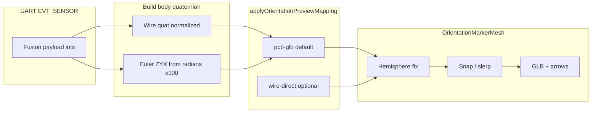

# 3D Rotation Preview (Sensor Workspace)

This document lives under **`docs/ROTATION_3D_PREVIEW.md`** next to other bitstream-app technical notes; implementation code stays in **`components/3d-rotation/`**.

It describes the theory, frame conventions, and **exact calculations** used by the rotation previews under **`components/3d-rotation/`** (quaternion card, Euler card, split view). The visualization shows BMI270 **BSX fusion** orientation using a **GLB model**, **body-frame axis arrows** (`ArrowHelper`), optional **ground grid**, **cubemap environment / IBL**, and a corner **`GizmoViewport`** (mini orientation widget).

**Primary orientation source:** normalized **fusion quaternion** from the wire sample. **Euler** (`roll`, `pitch`, `heading` in radians ×100) is used **only** when fusion quaternion integers are **missing** on the wire but Euler fields are present—avoiding reliance on Euler for the main path (see §3).

**Scope:** Preview display and optional smoothing. `extractNormalizedQuatFromBmi270Sample` decodes the wire format (§4). Mesh orientation applies a **selectable mapping** (§2); default **`pcb-glb`** aligns the PSoC GLB axes to BSX body axes on the rig.

**Sensor Studio scene JSON:** The Rotation node in Sensor Studio persists a separate **`Scene3DConfigV1`** blob (model URL, lights, camera, environment, shadows, helpers). That contract is documented in **[`ROTATION_SCENE3D_CONFIG.md`](../../sensor-studio/docs/ROTATION_SCENE3D_CONFIG.md)**; keep quaternion/frame math here and scene authoring details there.

---

## 1. Reference frames

### 1.1 Firmware / BSX navigation frame (conceptual)

Fusion output is treated as a **right-handed** navigation-style frame **N** where:

- **Z<sub>N</sub>** points **up** (against gravity when the device is level in the fusion convention).
- **X<sub>N</sub>**, **Y<sub>N</sub>** span the horizontal plane.

The wire carries scaled quaternion integers; exact semantic authority for `ipc_fusion_result_t` remains in the TESAIoT firmware workspace when needed.

### 1.2 Three.js scene frame **T**

Three.js uses a **Y-up** right-handed world:

| Axis | Typical screen direction |
|------|---------------------------|
| **+X** | Right |
| **+Y** | Up |
| **+Z** | Toward default camera; camera looks along **−Z** |

**Body axes** in the preview use **`ArrowHelper`**: red **+X**, green **+Y**, blue **+Z**, attached to the rotating group. The corner **gizmo** shows world axes for navigation only.

### 1.3 Goal at fusion identity

When fusion reports **identity** in **N**, the mesh should appear **level** in **T** with body axes aligned to world **X/Y/Z** as expected for this hardware path after §2 (**`pcb-glb`** or **`firmware-full`**).

### 1.4 Firmware rates (do not confuse with UI “Sampling frequency”)

Three independent cadences affect what you see:

| Rate | Control | Typical | Host sees |
|------|---------|---------|-----------|
| **Fusion Feed (BSX)** | BMI270 panel **Fusion Feed (BSX)** / BS2 `FUSION_FEED_SET` (`fusionFeedIntervalMs`, default **10 ms → 100 Hz**) | CM55 **physical IMU read** + IPC push to CM33; CM33 runs BSXLite | Internal only — **not** UART packet rate |
| **BSX fusion output** | Driven by fusion feed | Same order as feed | Latest quat/euler held until next EVT publish |
| **UART telemetry** | BMI270 **Sample Rate** (`samplingIntervalMs`; Periodic/Hybrid also sets `publishIntervalMs`) | e.g. **20 Hz** or **100 Hz** | **Wire quat** in HUD, 3D preview props, plots |

Firmware (BS2): `bitstream_bmi270_runtime_fusion_tick()` performs **`read_sample`** at fusion-feed cadence before each CM33 push (`TESAIoT_Library/CM55/modules/bitstream/docs/BS_WIRE.md`). EVT packing uses `samplingIntervalMs` / `publishIntervalMs` only.

### 1.5 Wire Euler fields → Three.js `Euler` components (bench-aligned)

For the **Euler path**, decoded radians (`field / 100`) are composed with intrinsic **`"ZYX"`** order (`FUSION_EULER_ORDER`). BSX wire names **`roll` / `pitch` / `heading`** do **not** line up one-to-one with “rotation about body X / Y / Z” using naive naming: on hardware, rotation about frame **N**’s **X** tracks the **`pitch`** field; about **N**’s **Y** tracks **`roll`**; about **N**’s **Z** tracks **`heading`** (yaw about **N**’s up axis).

Code maps wire → **`euler.set(ex, ey, ez, "ZYX")`** via **`fusionWireEulerHundredthsToThreeEulerRadComponents`** (`fusionEulerWireToThreeEulerRad.ts`). After `field/100`, each component is wrapped to **(−π, π]** with **`wrapRadiansSignedPi`** (equivalent to **±180°** if firmware used a **0 … 2π** range on the wire):

| Rotation about (frame **N**, firmware / BSX) | Wire field that moves | Three.js `Euler` component |
|----------------------------------------------|-------------------------|----------------------------|
| **X** | **`pitch`** (`fusionPitchRadX100`) | **`x`** (`ex`) |
| **Y** | **`roll`** (`fusionRollRadX100`) | **`y`** (`ey`) |
| **Z** (heading / yaw about **N**’s Z) | **`heading`** (`fusionHeadingRadX100`) | **`z`** (`ez`) |

The wire does **not** use the literal name `yaw`; **`heading`** is the third scalar. Those angles describe orientation in frame **N** **before** mesh mapping (**§2**) converts the body quaternion for the GLB.

---

## 2. Mesh mapping modes (body → mesh quaternion)

All mesh targets go through **`applyOrientationPreviewMapping`** (`orientationPreviewMapping.ts`) after building **`body`**:

- From **wire quaternion**: `body.set(qx, qy, qz, qw)` (Three.js **x, y, z, w**).
- From **Euler** (fallback or Euler-only card): wire→`ex/ey/ez` per §1.5, `setFromEuler(..., "ZYX")`, then **`body.invert()`** before mapping.

Cycle modes in the viewport HUD (**Mesh mapping**). Persisted: `bitstream:rotation-preview:orientation-mapping-mode`.

| Mode | Label | Use |
|------|-------|-----|
| **`pcb-glb`** (default) | PCB ↔ GLB | **Visual match** on the PSoC E84 GLB vs physical PCB (bench-verified 2026-05-29). |
| **`wire-direct`** | Wire direct | Decoded BSX quat on mesh **with no remap** — wire HUD numbers match mesh quat; axes may not match GLB. |
| **`streamsight-z-up`** | Z-up → Y-up | StreamSight **`IMUQuaternionViewer`** similarity only (Rx(−π/2)). |
| **`firmware-full`** | Firmware full | Z-up similarity + Ry(π) conjugation (`applyFirmwareOrientationMapping`). |

**HUD:** **Wire quat** always shows **decoded firmware** values. **Mesh quat (mapped)** shows the quaternion **after** the selected mode. **Δ wire − Δ mesh** is near **0°** only when **Wire direct** is selected (and slerp is off).

### 2.1 Default — `pcb-glb` (BSX body → PSoC GLB axes)

Rigid basis change from BSX body vectors **v<sub>B</sub>** to GLB mesh vectors **v<sub>G</sub>**:

| BSX / wire **+** axis | GLB mesh **+** axis |
|----------------------|---------------------|
| **X** | **−X** |
| **Y** | **Z** |
| **Z** | **Y** |

Basis matrix **M** (columns map BSX unit axes into GLB coordinates):

```text
M = [ -1  0  0 ]
    [  0  0  1 ]
    [  0  1  0 ]
```

Rotation similarity (stable vs per-component swaps):

\[
\mathbf{q}_{\text{mesh}} = \mathbf{q}_M\,\mathbf{q}_{\text{body}}\,\mathbf{q}_M^{-1}
\]

Implemented in **`applyBsxToPcbGlbMapping`** (`firmwareOrientationMapping.ts`). Numerically equivalent to the historical component remap **(−q<sub>x</sub>, q<sub>z</sub>, q<sub>y</sub>, q<sub>w</sub>)** for this rig, but preferred near ±180°.

### 2.2 `wire-direct`

`out.copy(body)` — no transform. Use for **protocol parity** checks (wire decode vs mesh quaternion components).

### 2.3 `streamsight-z-up`

Similarity with **b** = R<sub>x</sub>(−π/2):

\[
\mathbf{q}_{\text{out}} = \mathbf{b}\,\mathbf{q}_{\text{body}}\,\mathbf{b}^{-1}
\]

### 2.4 `firmware-full`

**§2.3** then conjugation by **p** = R<sub>y</sub>(π):

\[
\mathbf{q}_{\text{out}} = \mathbf{p}\,\mathbf{q}_{1}\,\mathbf{p}
\]

See **`applyFirmwareOrientationMapping`** for the full Three.js sequence.

---

## 3. Quaternion vs Euler input

| Path | When | Construction of `body` |
|------|------|-------------------------|
| **Quaternion** | Fusion payload **and** all four quaternion scalars present on the wire | Normalized **(qx, qy, qz, qw)** from §4 |
| **Euler fallback** | Fusion payload **but** quaternion scalars incomplete **and** roll/pitch/heading present | `setFromEuler` with **intrinsic ZYX** and wire→Euler mapping **§1.5** (`ex`, `ey`, `ez` radians) |

If quaternion fields are complete, Euler is **not** used for the mesh even when Euler card data exists—this avoids gimbal-related artifacts from reconstructing orientation from Euler alone.

---

## 4. Wire format → normalized quaternion

Fields from `Bmi270LiveSample`:

| Field | Decoding |
|-------|-----------|
| `fusionQuatXX10000`, `fusionQuatYX10000`, `fusionQuatZX10000` | Divide by **10000** |
| `fusionQuatWBucketX10000` | \(q_w = (\texttt{raw} - 10000) / 10000\) |

Then:

\[
\hat{\mathbf{q}} = \frac{(q_x, q_y, q_z, q_w)}{\lVert (q_x, q_y, q_z, q_w) \rVert}
\]

Guard: if \(\lVert\cdot\rVert &lt; \varepsilon\) with **`QUAT_NORM_EPS = 1e-8`**, return identity.

### 4.1 Wire-rate spike gate (quaternion plot overlay only)

**`useBmi270FusionQuatWireTapStore`** applies **`evaluateFusionQuatWireFrame`** when **`bmi270FusionQuatSpikeRejectEnabled`** is on (Realtime UI; default **off**).

- **Hemisphere align**, rate-based \(\Delta\theta\) cap (\(\omega_{\max} = 720°/s\)), monotonic **`counter`** check.
- Rejected frames do not update the **plot** ring buffer; **`spikeRejectedSinceReset`** in the HUD.

**3D mesh path:** **`useBmi270FusionQuatOrientationStore`** is **pass-through** (no spike reject). **`QuaternionRotation3DPreviewCard`** prefers **live sample decode** for mesh props; the store is fallback when UI coalescing lags.

---

## 5. Hemisphere continuity (short arc)

**q** and **−q** are the same rotation. After mapping (**§2**), if the **dot** product of the **previous** displayed quaternion and **target** is **negative**, the target is **negated** so interpolation follows the **short** arc.

---

## 6. Smoothing (`OrientationMarkerMesh`)

Let \(\mathbf{c}\) = current displayed quaternion, \(\mathbf{t}\) = target from §2–5, \(\Delta t\) = frame delta (seconds).

### 6.1 Target update (when telemetry changes)

When the angular separation \(\angle(\mathbf{c},\mathbf{t}) &gt; \texttt{QUAT\_JUMP\_SNAP\_RAD}\) (**0.55** rad), **`c`** is **snapped** to **`t`** immediately so large telemetry steps do not lag.

Constants:

- **`QUAT_JUMP_SNAP_RAD`** = **0.55**
- **`QUAT_SNAP_ANGLE_RAD`** = **0.022** (used in §6.2)

### 6.2 Frame integration (when smoothing enabled)

Effective response frequency:

\[
f_{\text{eff}} = \max(10,\, f_{\text{slerp}})
\]

where \(f_{\text{slerp}}\) comes from user settings or §7 (adaptive).

Exponential blend:

\[
\alpha = 1 - e^{-\,f_{\text{eff}}\,\Delta t}
\]

Let \(\theta = \angle(\mathbf{c},\mathbf{t})\).

- If \(\theta &gt; \texttt{QUAT\_JUMP\_SNAP\_RAD}\) **or** \(\theta &lt; \texttt{QUAT\_SNAP\_ANGLE\_RAD}\): **snap** \(\mathbf{c} \leftarrow \mathbf{t}\).
- Else: \(\mathbf{c} \leftarrow \mathrm{slerp}(\mathbf{c},\mathbf{t},\alpha)\), then **normalize** \(\mathbf{c}\).

When smoothing is **disabled**, \(\mathbf{c}\) copies \(\mathbf{t}\) every frame.

---

## 7. Adaptive slerp rate (`computeAdaptiveRotationPreviewSlerpHz`)

Used when **auto** smoothing is on: derive a fresh effective \(f_{\text{slerp}}\in[12,90]\) from wire cadence and jitter.

Inputs:

- **`diag`**: `Bmi270WireReceiveDiag | null` — uses **`wireHzFromGaps`**, **`jitterStdMs`** when present.
- **`gainHz`**: user “gain” from config (normalized inside the store).
- **`options.uiHzFallback`**: optional Hz from UI counter when wire Hz is missing.

**Rate estimate**

\[
f_{\text{rate}} =
\begin{cases}
\texttt{wireHzFromGaps} & \text{if finite and } &gt; 0 \\
\texttt{uiHzFallback} & \text{if finite and } &gt; 0 \\
\text{null} & \text{otherwise}
\end{cases}
\]

If \(f_{\text{rate}}=\) null, return **`normalizeQuaternionPreviewSlerpHz(gainHz)`** (store helper).

Otherwise clamp jitter:

\[
j = \mathrm{clamp}(\texttt{jitterStdMs},\, 0,\, 80)
\]

\[
g_{\mathrm{norm}} = \texttt{normalizeQuaternionPreviewSlerpHz}(\texttt{gainHz})
\]

\[
\texttt{gainFactor} = \mathrm{clamp}\!\left(\frac{g_{\mathrm{norm}}}{40},\, 0.45,\, 1.75\right)
\]

\[
\texttt{core} = 12 + f_{\text{rate}} \times 1.22 - j \times 0.32
\]

\[
\texttt{scaled} = \texttt{core} \times \texttt{gainFactor}
\]

Return:

\[
\mathrm{round}\bigl(\mathrm{clamp}(\texttt{scaled},\, 12,\, 90)\bigr)
\]

---

## 8. Scene content (non-orientation)

### 8.1 GLB model

- URL key: **`models/psoc-e84-ai/psoc-e84-ai.glb`** via **`resolveDefaultPreviewMeshGlbUrl()`**.
- Source policy is runtime-configurable (`ternion.assets.sourceStrategy`): `local-only`, `local-first` (default), `online-only`.
- In browser mode with local-first, this key resolves from **`/__ternion_user_free/models/...`** first (globalStorage free mirror). If missing there, other strategy-dependent fallbacks apply.
- Clone loaded scene; **`centerObject3dBoundingBoxAtOrigin`** translates the root so the **AABB center** is at the origin (stable pivot vs. authored pivot).
- Scale **`ROTATION_PREVIEW_BODY_GLB_SCALE`** = **0.5**.
- Child group **`BOARD_GROUP_POSITION_Y`** = **0.08** offsets the mesh along **local +Y**; **body arrows** stay at the parent origin (**world (0,0,0)** when the outer group has no translation).

### 8.2 Environment

Cubemap from **`T3DEngineConfig.environment.cubeMaps`** at index **`cubeMapIndex`**; **`CubeTextureLoader`** + **`buildCubeMapFaceUrls`**. **`scene.background`** (cubemap vs solid) is toggled with the **Image** control in **`RotationPreviewViewport`**; **`scene.environment`** (IBL / reflections on the GLB) is toggled independently with the **Sparkles** control. Defaults include **`ROTATION_PREVIEW_DEFAULT_USE_CUBEMAP_IBL`** in **`rotationPreviewConstants.ts`**; **`ROTATION_PREVIEW_ENV_INTENSITY_SCALE`** scales **`environmentIntensity`**. Per-viewport Sparkles state is persisted under **`localStorage`** (`*:cubemap-ibl`). Restores prior scene environment on unmount.

In browser local-first mode, cubemap faces (`posx.jpg`, etc.) prefer the free mirror (`/__ternion_user_free/textures/cubemap/...`) before local or online fallbacks.

### 8.3 Camera

- Position **(0, 0, 2.8)**, **fov 55**.

### 8.4 Grid

Optional infinite **`Grid`** from drei; user toggle **show/hide** (overlay control).

---

## 9. End-to-end data flow



**Branching:** **`meshOrientationFromEulerFallback`** selects **E** only when fusion quaternion scalars are incomplete but Euler fields exist; otherwise **Q** is used when possible.

---

## 10. Related source files

| File | Role |
|------|------|
| `components/3d-rotation/shared/orientationPreviewMapping.ts` | Mapping modes §2 (`pcb-glb`, `wire-direct`, …) |
| `components/3d-rotation/shared/firmwareOrientationMapping.ts` | `applyBsxToPcbGlbMapping`, `applyFirmwareOrientationMapping` |
| `components/3d-rotation/QuaternionRotation3DPreviewCard.tsx` | Live wire decode → scene; HUD wiring |
| `components/3d-rotation/shared/OrientationMarkerMesh.tsx` | Target quat + hemisphere + slerp §5–6 |
| `components/3d-rotation/shared/ViewportTelemetryHud.tsx` | Wire vs mesh quat, mapping cycle, Δ since mark |
| `components/3d-rotation/shared/rotationPreviewViewportPersistence.ts` | `orientationMappingMode` localStorage |
| `state/bmi270FusionQuatOrientation.store.ts` | Wire-rate pass-through store (3D fallback) |
| `state/bmi270FusionQuatWireTap.store.ts` | Plot overlay + optional spike gate §4.1 |
| `docs/ROTATION_3D_PREVIEW.md` | This document |
| `../TESAIoT_Library/CM55/modules/bitstream/docs/BS_WIRE.md` | Fusion feed vs UART publish (firmware) |

---

## 11. References (conventions)

- Three.js **`Quaternion`**: component order **(x, y, z, w)**; **`multiply`** / **`premultiply`** follow Three.js semantics.
- Hamilton unit quaternions; **q** and **−q** represent the same rotation.
