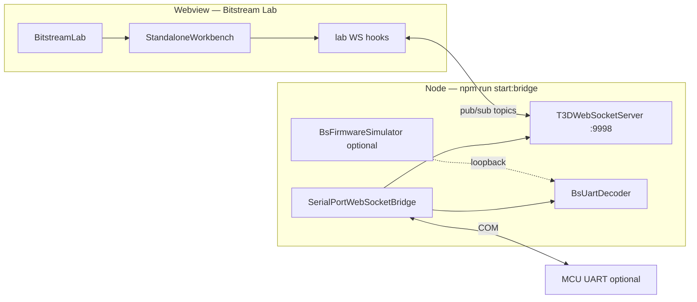

# Bitstream Lab — module design

Self-contained **developer lab** for inspecting and exercising the Bitstream **transport stack** (WebSocket broker → serial bridge → BS2 decode/publish). Not a product UI; not Sensor Studio.

> **Status (2026-05-28):** The legacy standalone **Bitstream Lab** entry (`/?standalone=bitstream-lab`) and `dev:bitstream-lab` script were removed.
> This folder is kept as **archived source/reference** until its diagnostics panels are reintroduced inside the **Sensor Lab** workspace.

## Agent continuation (read this on a new machine)

| Item | Value |
|------|--------|
| **Monorepo handoff** | `ternion-t3d/AGENT_HANDOFF.md` (branch **`BS2`**, clone §1) |
| **This module runbook** | **`docs/RUNBOOK.md`** — commands, Close/flood fixes, firmware SENSOR_CFG defaults, phases 4–8 |
| **Landmark commit** | `eaa347f` — Lab phases 0–3 + serial bridge `hostUartSessionActive` / no raw UART by default |
| **After `git pull`** | Restart **`npm run start:bridge`** (Node keeps old code until restart); hard-refresh Lab |

**Simulator:** `npm run dev:bitstream2-loopback` → browser opens `/?app=bitstream`.
**Real MCU:** use CLI probes (see `t3d-extension/HOW_TO_RUN.md`); webview UART is not wired in this build.

## Goals

| In scope | Out of scope |
|----------|----------------|
| Broker connect/disconnect, URL, **clients, topics, traffic**, monitor events | Full sensor cfg editor (use `bitstream-app` / `bs2-sensor-control-monitor`) |
| `serialport/*` list / open / close / status | 3D scene, assets, MQTT |
| **Serial bridge** UART byte rate, decode frame rate, publish rates, runtime ops | Long soak matrix / rate certification (use `bs2-sensor-control-monitor`) |
| Bridge/runtime snapshots (`serialport/status`, `runtime/*`) | (covered by **bridge** pane) |
| BS2 smoke: HELLO, PING, metrics, last `evt/sensor` | Firmware simulator parameter tuning (use `bitstream2-simulator`) |
| Topic tap / publish console (filtered) | |
| Loopback visibility (`bitstream2/dev/status`, sim control) | |
| **Activity log** (user actions + transport events, tone-colored) | |
| **Protocol analytics** (frame inspect, per-type Hz, link quality scorecard) | Full sensor cfg editor |

## How this differs from nearby tools

| Module | Role |
|--------|------|
| `TestWebSocketAndSerialBridge.tsx` | Legacy monolith at webview root; keep until Lab replaces it |
| `bitstream2-simulator/` | Mock **firmware** behavior (params, streams, synthetic sensors) |
| `bs2-sensor-control-monitor/` | **Protocol QA** (matrix, rate check, UART probe runners) |
| `shared/SensorTestWorkbench.tsx` | BS2 **sensor cfg** tester (tabs) — not a split layout |
| **`bitstream-lab/`** | **Infrastructure X-ray** — “is the pipe healthy?” |

## UI shell: `StandaloneWorkbench` (default)

Lab uses the shared split-pane workbench from **`../ui/workbench`** (same engine as Sensor Studio), not a fixed `TRNTabs` layout.

| Capability | Provided by |
|------------|-------------|
| Split pane **vertical / horizontal** | `PaneFrame` header buttons |
| **Resize** splits | `Splitter` drag |
| **Close** pane | `PaneFrame` |
| **Swap** pane content | Header dropdown → registry entry |
| **Persist** layout | `StandaloneWorkbench` + `persistenceKey="bitstream-lab"` → `localStorage` key `ternion_workbench_bitstream-lab` |
| **Reset** layout | `workbenchRef.resetLayout()` from toolbar |

Reference implementation: `sensor-studio/features/editor/components/StudioLayout.tsx`.

### Layout model

Tree of `LayoutNode` (`split` \| `editor`) — see `ui/workbench/types.ts`. Each `editor` pane has an `editorType` string key into `WorkbenchRegistry`.

### Default tiling (7 panes visible)

```text
┌─ LabLinkBar + LabHealthStrip (full width) ───────────────────────────────────┐
├──────────────┬───────────────────────────────────────────────────────────────┤
│ Topic Tap    │ BS2 Smoke                                                     │
├──────────────┼───────────────────────────────────────────────────────────────┤
│ Activity Log │ Serial                                                        │
├──────────────┼────────────────────────────┬──────────────────────────────────┤
│ Broker       │ Loopback                   │ Publish                          │
└──────────────┴────────────────────────────┴──────────────────────────────────┘
```

Encode as `DEFAULT_LAB_WORKBENCH_LAYOUT` in `workbench/default-lab-workbench-layout.ts` (ratios tuned in Phase 0). Users can still close/split; registry supports **9** panel types.

Full design for frame rates and link quality: **`docs/PROTOCOL_ANALYTICS.md`**.  
WebSocket broker (topics, clients, traffic): **`docs/BROKER_OBSERVABILITY.md`**.  
Serial bridge (UART/decode/publish rates): **`docs/BRIDGE_OBSERVABILITY.md`**.

### Registry panel ids (**9** workbench panes)

| `editorType` | Panel component | Focus |
|--------------|-----------------|--------|
| `broker` | `BrokerObservabilityPanel` | WS broker: clients, topics, traffic, monitor events (5 inner tabs) |
| `bridge` | `BridgeObservabilityPanel` | SerialPortWebSocketBridge: UART B/s, frame rates, publish rates, runtime (5 inner tabs) |
| `serial` | `SerialPanel` | list / open / close / status (control only) |
| `bs2` | `Bs2SmokePanel` | HELLO, metrics, ping |
| `loopback` | `LoopbackPanel` | dev/status, sim control |
| `tap` | `TopicTapPanel` | live topic ring buffer (raw traffic) |
| `publish` | `PublishPanel` | manual publish console |
| `activity` | `ActivityLogPanel` | human-readable event log (actions + outcomes) |
| `protocol` | `ProtocolAnalyticsPanel` | BS frames, per-type Hz, quality scorecard (3 inner tabs) |

Icons: `lucide-react` — `Radio`, `Usb`, `Activity`, `Repeat`, `List`, `Send`, `ScrollText`, `LineChart` (protocol).

**`protocol` pane** — **Frames | Rates | Quality**. **`bridge` pane** — **Overview | UART | Decode | Publish | Runtime**. See `docs/PROTOCOL_ANALYTICS.md` and `docs/BRIDGE_OBSERVABILITY.md`.

**Activity vs Topic Tap:** Tap = every broker message (high volume, filterable). Activity = curated lines from Lab actions (connect, open COM, ping, publish, errors). Do not duplicate full tap stream into activity.

### Panel wireframes (ASCII)

**Shell chrome**

```text
┌─ LabLinkBar ─────────────────────────────────────────────────────────────────┐
│ WS [ ws://127.0.0.1:9998        ▾]  [ Connect ] [ Disconnect ] [ Reset layout ]│
└──────────────────────────────────────────────────────────────────────────────┘
┌─ LabHealthStrip ─────────────────────────────────────────────────────────────┐
│ ● Broker   ● Serial   ● BS2   ○ Loopback                                   │
└──────────────────────────────────────────────────────────────────────────────┘
```

**`broker`** (5 inner tabs — detail in `docs/BROKER_OBSERVABILITY.md`; uses topic **`t3d/broker/monitor`**)

```text
┌─ Broker ─────────────── [ Overview | Clients | Topics | Traffic | Events ] ─┐
│ Connections: 3   Topics: 22   Lab RX: 12 MB   Publish/s: 82 (60s window)   │
└─────────────────────────────────────────────────────────────────────────────┘
```

**`serial`**

```text
┌─ Serial ──────────────────────────────── [▾] [⫿] [⫾] [×] ─┐
│ [ List ports ]   Path COM7   Baud [ 921600 ▾]  [ Open ][ Close ]│
│ status JSON: { "open": true, "path": "COM7", … }           │
└────────────────────────────────────────────────────────────┘
```

**`bs2`**

```text
┌─ BS2 Smoke ───────────────────────────── [▾] [⫿] [⫾] [×] ─┐
│ HELLO: version 2, caps …, age 2.1s                         │
│ Metrics: frames OK / CRC fail    Last evt/sensor: BMM350 … │
│ [ Ping ]  last RES: OK  18 ms                              │
└────────────────────────────────────────────────────────────┘
```

**`loopback`**

```text
┌─ Loopback ────────────────────────────── [▾] [⫿] [⫾] [×] ─┐
│ loopbackEnabled: YES    Sim: ( ) idle  (•) run  [ Apply ]  │
│ dev/sim/state JSON (read-only)                             │
└────────────────────────────────────────────────────────────┘
```

**`tap`**

```text
┌─ Topic Tap ───────────────────────────── [▾] [⫿] [⫾] [×] ─┐
│ Filter [ bitstream2/ ]  [ Pause ] [ Clear ] [ Export ]     │
├──────────────────┬─────────────────────────────────────────┤
│ time · topic     │ payload JSON (selected)                 │
│ 12:01.2 hello    │ { "version": 2, … }                     │
└──────────────────┴─────────────────────────────────────────┘
```

**`publish`**

```text
┌─ Publish ─────────────────────────────── [▾] [⫿] [⫾] [×] ─┐
│ Topic [ bitstream2/req ▾ ]   JSON editor                   │
│ [ Validate ] [ Format ] [ Publish ]   Presets: PING, list  │
└────────────────────────────────────────────────────────────┘
```

**`activity`** (7th pane — like `bs2-sensor-control-monitor` activity log)

```text
┌─ Activity Log ────────────────────────── [▾] [⫿] [⫾] [×] ─┐
│ Filter [ all ▾ ]  [ Pause scroll ] [ Clear ] [ Copy all ]  │
├────────────────────────────────────────────────────────────┤
│ [12:01:01.024] WS connected (ws://127.0.0.1:9998)        │
│ [12:01:02.110] Listed 2 serial ports                       │
│ [12:01:05.331] Open COM7 @ 921600 — OK                     │
│ [12:01:05.890] HELLO received (version 2)                  │
│ [12:01:10.002] Ping REQ → RES OK (18 ms)                   │
│ [12:01:12.400] Publish bitstream2/dev/sim/control run      │
│ [12:01:15.221] WARN: metrics CRC fail count > 0            │
│ … (ring ~200 lines, auto-scroll)                           │
└────────────────────────────────────────────────────────────┘
```

Log line shape in `types/labTypes.ts`: `{ id, atMs, text, tone: "info"|"ok"|"warning"|"error" }`. Append via `LabWorkbenchShellProvider.appendActivity(line)` from hooks/panels; optional mirror of errors from `useLabHealth`.

**`protocol`** (3 inner tabs — full spec in `docs/PROTOCOL_ANALYTICS.md`)

```text
┌─ Protocol Analytics ─────────────── [ Frames | Rates | Quality ] ─┐
│ Rates:  0x04 EVT_SENSOR 20.0 Hz   CRC 0.00%   UART 42 kB/s        │
│ Quality: ● Good — 4/4 sensors in band · HELLO 1.2s ago            │
└────────────────────────────────────────────────────────────────────┘
```

**`bridge`** (5 inner tabs — `docs/BRIDGE_OBSERVABILITY.md`)

```text
┌─ Bridge ───────────────── [ Overview | UART | Decode | Publish | Runtime ] ─┐
│ UART RX 42 kB/s  TX 0.8 kB/s · frames OK 20/s · evt/sensor 80/s · ● alive   │
└─────────────────────────────────────────────────────────────────────────────┘
```

### Shell wiring (sketch)

```tsx
// BitstreamLab.tsx
import { useRef } from "react";
import { StandaloneWorkbench, type StandaloneWorkbenchHandle } from "../ui/workbench";
import { LabLinkBar } from "./components/LabLinkBar";
import { LabHealthStrip } from "./components/LabHealthStrip";
import { LabWorkbenchShellProvider } from "./workbench/lab-workbench-context";
import { LAB_WORKBENCH_REGISTRY } from "./workbench/lab-workbench-registry";
import { DEFAULT_LAB_WORKBENCH_LAYOUT } from "./workbench/default-lab-workbench-layout";

export function BitstreamLab() {
  const workbenchRef = useRef<StandaloneWorkbenchHandle>(null);

  return (
    <div className="flex h-full min-h-0 flex-col">
      <LabLinkBar onResetLayout={() => workbenchRef.current?.resetLayout()} />
      <LabHealthStrip />
      <main className="relative min-h-0 flex-1 px-2 pb-2">
        <LabWorkbenchShellProvider>
          <StandaloneWorkbench
            ref={workbenchRef}
            initialLayout={DEFAULT_LAB_WORKBENCH_LAYOUT}
            registry={LAB_WORKBENCH_REGISTRY}
            persistenceKey="bitstream-lab"
          />
        </LabWorkbenchShellProvider>
      </main>
    </div>
  );
}
```

**`LabWorkbenchShellProvider`** — optional React context for shared lab state (WS URL, health flags, `publish`, `listPorts`) so registry panel components stay thin. Pattern: `sensor-studio/.../studio-workbench-context.tsx`. Panels call `useLabWorkbenchShell()` instead of prop-drilling through the workbench.

**Isolation:** Lab may import **`../ui/workbench`** and **`../ui/TRN`** only from shared UI; do not import Sensor Studio workbench files.

### When to use `TRNSplitPane` instead

Use **`TRNSplitPane`** only *inside* a single workbench panel (e.g. tap list | detail). Do not use it as the top-level Lab shell — that duplicates workbench behavior.

## Runtime stack (what Lab observes)



**Topics (read-only import from shared protocol files):**

- Serial: `src/serialport-bridge/protocol.ts` → `SERIALPORT_TOPICS`
- BS2: `src/bitstream2/bridge/protocol.ts` → `BITSTREAM2_TOPICS`

Lab must **not** import `bitstream-app/`, `bitstream-shell/`, or feature stores (`useBitstreamTelemetrySourceStore`, etc.).

## Folder layout

```
bitstream-lab/
├── README.md
├── index.ts
├── BitstreamLab.tsx              # link bar + health strip + StandaloneWorkbench
├── types/
│   └── labTypes.ts
├── workbench/
│   ├── default-lab-workbench-layout.ts
│   ├── lab-workbench-registry.tsx
│   └── lab-workbench-context.tsx   # optional shell provider
├── store/
│   ├── labSession.store.ts
│   ├── labTopicTap.store.ts
│   └── labActivity.store.ts        # ring buffer for ActivityLogPanel
├── hooks/
│   ├── useLabBroker.ts
│   ├── useLabSerialPort.ts
│   ├── useLabBs2Smoke.ts
│   ├── useLabHealth.ts
│   ├── useLabProtocolAnalytics.ts  # frames, rates, quality
│   ├── useLabBrokerMonitor.ts      # t3d/broker/monitor → clients, topics
│   ├── useLabWsTraffic.ts          # lab client bytes + per-topic RX/TX
│   └── useLabBridgeObservability.ts # UART + metrics + runtime → rates
├── lib/
│   ├── labTopics.ts
│   ├── formatPayload.ts
│   ├── labPersist.ts               # session prefs (not layout tree)
│   ├── protocol-window.ts          # sliding-window Hz counters
│   ├── protocol-quality.ts         # scorecard thresholds + alerts
│   ├── parse-frame-display.ts      # BS envelope → display fields
│   ├── broker-monitor-aggregate.ts # clients/topics from monitor envelopes
│   ├── broker-traffic-window.ts    # publish Hz, bytes/s windows
│   ├── bridge-metrics-delta.ts     # Δ status/metrics → B/s and frame Hz
│   └── bridge-quality.ts           # bridge-specific alerts
├── components/
│   ├── LabLinkBar.tsx
│   ├── LabHealthStrip.tsx
│   ├── panels/                     # one component per registry entry
│   │   ├── BrokerObservabilityPanel.tsx
│   │   ├── BridgeObservabilityPanel.tsx
│   │   ├── SerialPanel.tsx
│   │   ├── Bs2SmokePanel.tsx
│   │   ├── LoopbackPanel.tsx
│   │   ├── TopicTapPanel.tsx
│   │   ├── PublishPanel.tsx
│   │   ├── ActivityLogPanel.tsx
│   │   └── ProtocolAnalyticsPanel.tsx
│   └── shared/
│       ├── JsonBlock.tsx
│       └── TopicRow.tsx
└── docs/
    ├── RUNBOOK.md
    ├── PROTOCOL_ANALYTICS.md       # BS UART frames, Hz, quality
    ├── BROKER_OBSERVABILITY.md     # WS broker clients, topics, traffic
    └── BRIDGE_OBSERVABILITY.md     # Serial bridge byte + frame rates
```

Import `../ui/workbench/workbench.css` once from `BitstreamLab.tsx` if panes render unstyled (Sensor Studio loads it via `Workbench.tsx`).

## Public API

```ts
// index.ts
export { BitstreamLab } from "./BitstreamLab";
export type { BitstreamLabProps } from "./BitstreamLab";
```

```tsx
export type BitstreamLabProps = {
  defaultWsUrl?: string;
  autoConnect?: boolean;
};
```

## Data layer rules

1. **Single listener id** per hook family, e.g. `bitstream-lab-broker`, `bitstream-lab-tap`.
2. **Shared WS transport:** OK to use `../ws-client-store` (one broker per webview). Session prefs in `labPersist.ts` (`bitstream-lab-v1`). Layout tree is separate: `ternion_workbench_bitstream-lab`.
3. **Protocol types:** import from `../../bitstream2/bridge/protocol` and `../../serialport-bridge/protocol` only.
4. **Encoding:** reuse `../../bitstream2/util/base64` and `BS2_CMD` via `lib/` helpers.

## Health model (`useLabHealth`)

| Flag | True when |
|------|-----------|
| `brokerUp` | WebSocket connected |
| `serialOpen` | `serialport/status.open === true` |
| `bs2Linked` | `hello` received after last serial open (or loopback without COM) |
| `loopbackOn` | `dev/status.loopbackEnabled === true` |

`LabHealthStrip` stays **above** the workbench (always visible). Amber banner when WS is connected but COM is not open and loopback is off:

> Broker OK — Serial pane: List ports → Open COM @ 921600 (real MCU). Simulator: `npm run dev:bitstream2-loopback`.

## Mount options

### A — Standalone dev entry (recommended)

```tsx
import { BitstreamLab } from "./bitstream-lab";

STANDALONE_APP === "bitstream-lab" ? <BitstreamLab /> : ...
```

Open: `http://localhost:5173/?standalone=bitstream-lab`

### B — Webview shell entry

1. Add `bitstreamLab` to `WebviewShellEntry`.
2. Map `?app=bitstream-lab` in `webviewShellUrl.ts`.
3. `WebviewRoot.tsx` → `case "bitstreamLab": return <BitstreamLab />`.
4. Launcher tile + Quick Action `webview-open-bitstream-lab`.

## Implementation phases

| Phase | Deliverable |
|-------|-------------|
| **0** | `BitstreamLab` + `workbench/*` + link bar + health strip — **done** |
| **1** | `TopicTapPanel` + tap store — **done** |
| **2** | `SerialPanel` + `useLabSerialPort` + `ActivityLogPanel` + `labActivity.store` — **done** |
| **3** | `Bs2SmokePanel` + `useLabBs2Smoke` (HELLO, metrics, PING, Prime HELLO) — **done** |
| **4** | `LoopbackPanel` + `PublishPanel`; tune default layout ratios |
| **5** | `BrokerObservabilityPanel` B1–B3 (monitor, Clients, Topics, Traffic) — `docs/BROKER_OBSERVABILITY.md` |
| **6** | `ProtocolAnalyticsPanel` P1–P2 — `docs/PROTOCOL_ANALYTICS.md` |
| **7** | `BridgeObservabilityPanel` R1–R3 — `docs/BRIDGE_OBSERVABILITY.md` |
| **8** | Protocol P3–P4 + bridge `framesOkByType` / `serialport/bridge/telemetry`; maintain **`docs/RUNBOOK.md`** (started 2026-05-27) |

## Dev browser open URL

Vite `server.open` is controlled by **`VITE_DEV_OPEN`** (see `vite.config.ts`).

| npm script | Browser opens |
|------------|----------------|
| `npm run dev`, `dev:webview`, `dev:browser`, `dev:all`, … | `/?launcher=1` (TERNION app launcher) |
| `npm run dev:bitstream-lab` | `/?standalone=bitstream-lab` (Vite only — use with `start:bridge` for MCU) |
| `npm run dev:bitstream2-loopback` | `/?standalone=bitstream-lab` (bridge + loopback + Vite) |

Manual URLs (port may be **5174** if 5173 is busy):

- Lab standalone: `http://localhost:5173/?standalone=bitstream-lab`
- Lab via shell: `http://localhost:5173/?app=bitstream-lab`
- Launcher: `http://localhost:5173/?launcher=1`

`npm run start:bridge` alone does **not** start Vite; open one of the URLs above after starting the bridge.

## Runbook (summary)

Full agent runbook: **`docs/RUNBOOK.md`** (troubleshooting Close/flood, bridge env vars, file index).

| Scenario | Command |
|----------|---------|
| Simulator / loopback | `npm run dev:bitstream2-loopback` |
| Broker + bridge only | `npm run start:bridge` |
| UART + MCU | `start:bridge` + `dev:bitstream-lab`; Serial pane → open COM @ 921600 |
| CLI parity check | `npm run bitstream2:uart-probe` |

Env: `BITSTREAM2_DEV_LOOPBACK=1` on bridge process for loopback panels.  
Optional raw UART tap on broker: `T3D_BRIDGE_PUBLISH_RAW_UART=1` (off by default after `eaa347f`).

## Testing checklist

- [ ] Lab connects with bridge down → clear error, no throw.
- [ ] Split / close / swap panes; reload page → layout restored from `ternion_workbench_bitstream-lab`.
- [ ] Reset layout clears storage and restores `DEFAULT_LAB_WORKBENCH_LAYOUT`.
- [ ] Loopback: HELLO + `evt/sensor` without COM.
- [ ] UART: list → open → HELLO + metrics increment.
- [ ] Ping REQ/RES round-trip &lt; 2s.
- [ ] `?standalone=bitstream-lab` does not load Bitstream shell stores.
- [ ] Activity log receives connect/open/ping lines; clear/pause works; no duplicate of every tap line.
- [ ] Link bar buttons clickable in browser dev (`t3d-shell-overlay pointer-events-auto` on `BitstreamLab` root — `#root` is `pointer-events: none` in `app.css`).

## Pane count summary

| Layer | Count |
|-------|------:|
| Workbench registry panes | **9** (`protocol` / `bridge` / `broker` = inner tabs) |
| Fixed chrome (`LabLinkBar`, `LabHealthStrip`) | **2** |
| **Total UI regions** | **11** |

## Naming

- Folder: `bitstream-lab` (kebab).
- React component: `BitstreamLab` (PascalCase).

## Related paths

| Path | Role |
|------|------|
| `docs/RUNBOOK.md` | **Agent handoff** — continue Lab/bridge work from another PC |
| `../ui/workbench/` | `Workbench`, `StandaloneWorkbench`, `LayoutNode`, split utils |
| `../sensor-studio/.../StudioLayout.tsx` | Production workbench integration reference |
| `../sensor-telemetry/SensorTelemetryWorkspace.tsx` | Empty placeholder — not a workbench yet |
| `../../../serialport-bridge/SerialPortWebSocketBridge.ts` | `hostUartSessionActive`, CLOSE, RX gating |
| `../../../../AGENT_HANDOFF.md` | Monorepo onboarding (§4, §8–§10) |
