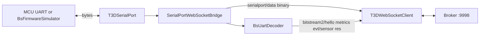

# Bitstream Lab — Serial bridge observability

**Agent handoff:** See **`RUNBOOK.md`** (bridge Close/RX gating in `eaa347f`; this panel is phase **7**).

Inspect **`SerialPortWebSocketBridge`** (Node): UART **byte rates**, BS **frame/decode rates**, handshake, liveness, and runtime operations. The bridge sits between **broker** (WebSocket) and **MCU UART** (or loopback simulator).

| Layer | Doc |
|-------|-----|
| WebSocket broker | `BROKER_OBSERVABILITY.md` |
| BS protocol (per-type frames) | `PROTOCOL_ANALYTICS.md` |
| COM open/close UI | `serial` pane (control) |

Code: `src/serialport-bridge/SerialPortWebSocketBridge.ts`, `protocol.ts`.

---

## What the bridge does (observable path)



---

## UI placement

Add workbench pane **`bridge`** → **`BridgeObservabilityPanel`** with **TRNTabs** (control stays in **`serial`** pane).

```text
┌─ Bridge ───────────────── [ Overview | UART | Decode | Publish | Runtime ] ─┐
│  (active sub-view)                                                           │
└──────────────────────────────────────────────────────────────────────────────┘
```

**Registry count:** **9** workbench panes (was 8) + 2 chrome = **11** regions.

**Overlap:**

| Other pane | Bridge pane |
|------------|-------------|
| `serial` | Opens COM; bridge shows resulting UART/decode stats |
| `loopback` | Sim control; bridge **Overview** shows `devLoopback` + mock streaming |
| `protocol` | Per-`BS_TYPE` wire Hz; bridge **Decode** shows framer totals + links “open Protocol → Rates” |
| `broker` | WS fabric; bridge **Overview** shows bridge session on broker (via monitor) |

---

## Sub-views (ASCII)

### **Overview**

```text
│ Bridge process (SerialPortWebSocketBridge)          Lab subscription: ● live  │
├───────────────────────────────────────────────────────────────────────────────┤
│ Broker WS        ● connected   identity: serialport-bridge                    │
│ UART session     ● open COM7 @ 921600   gen #3                                  │
│ BS2 handshake    passed   last error: —                                        │
│ Firmware liveness ● alive   last RX 12 ms ago                                  │
│ Loopback         BITSTREAM2_DEV_LOOPBACK=1   sim streaming: run               │
├──────────────────────────────┬────────────────────────────────────────────────┤
│ UART (60s)                   │ Decode (60s)                                   │
│   RX  42.3 kB/s              │   frames OK     20.0 /s                         │
│   TX   0.8 kB/s              │   CRC fail       0.0 /s                         │
│   Δread 2.54 MB total        │   resync skips  12 B/s                          │
├──────────────────────────────┴────────────────────────────────────────────────┤
│ Published to broker (60s)   evt/sensor 80/s · metrics 1/s · status 0.2/s     │
└───────────────────────────────────────────────────────────────────────────────┘
```

### **UART** — raw serial byte rates

```text
│ Source: serialport/status (bytesRead/bytesWritten) + firmware/liveness         │
├───────────────────────────────────────────────────────────────────────────────┤
│ Window [ 10s ▾ ]                                                              │
│ Sparkline: RX kB/s ────────────────╮   TX kB/s ──╮                           │
│                                                                               │
│ Path COM7   baud 921600   bytesRead 12_400_221   bytesWritten 88_102          │
│ Liveness: alive · lastRxAtMs 12:01:05.331 · reason rx-active                  │
│                                                                               │
│ [ ] Subscribe serialport/data (binary) — high volume; Lab wire RX only         │
│     Lab wire RX: 41.8 kB/s  (broker deliveries, may ≈ UART RX)                │
└───────────────────────────────────────────────────────────────────────────────┘
```

### **Decode** — framer / BS envelope (same counters as firmware path)

```text
│ Source: bitstream2/metrics @ 1 Hz (BsUartDecoder stats in bridge)              │
├───────────────────────────────────────────────────────────────────────────────┤
│ Metric              Total      Δ (10s)    Rate/s     Notes                     │
│ uartBytesIn         12.4M      423 k       42.3 kB/s  bytes into decoder       │
│ framesOk            240_004    200          20.0       accepted BS frames      │
│ framesCrcFail       0          0            0.0        CRC rejects              │
│ resyncByteSkips     1_204      120          12 B       prefix scan drops        │
│ framesLenReject     0          0            0.0        LEN cap rejects          │
│ lastFrameAtMs       14 ms ago                                                 │
├───────────────────────────────────────────────────────────────────────────────┤
│ Per-type Hz (Phase B): see Protocol → Rates or bridge framesOkByType          │
│ [ Open Protocol analytics ]                                                    │
└───────────────────────────────────────────────────────────────────────────────┘
```

### **Publish** — bridge → broker JSON/binary rates

Counts **messages the bridge publishes** (observed in Lab via topic tap or dedicated hook).

```text
│ Window [ 60s ▾ ]   [ ] Include serialport/data (very high)                   │
├────────────────────────────┬──────────┬──────────┬────────────────────────────┤
│ Topic                      │ Count/s  │ Lab RX/s │ Last at                    │
│ bitstream2/evt/sensor      │ 80.0     │ 80.0     │ 12:01:05.400               │
│ bitstream2/metrics         │ 1.0      │ 1.0      │ 12:01:05.000               │
│ bitstream2/hello           │ 0.0      │ 0.0      │ 12:00:01.100               │
│ serialport/status          │ 0.2      │ 0.2      │ 12:01:04.900               │
│ serialport/data            │ 1200     │ 1200     │ (binary chunks, optional)  │
│ firmware/liveness          │ 0.5      │ 0.5      │ 12:01:05.200               │
└────────────────────────────┴──────────┴──────────┴────────────────────────────┘
```

**evt/sensor /s** is the usual “stream frame rate” product teams care about (decoded samples, not raw UART).

### **Runtime** — snapshot + operation log

```text
│ serialport/runtime/snapshot (latest)                    [ Refresh ] [ Copy ]  │
├───────────────────────────────────────────────────────────────────────────────┤
│ connectionState: connected   handshakeState: passed   serialGeneration: 3     │
│ recentOperations (also serialport/runtime/operation):                           │
│   12:01:05  serial-write-result  OK 42 bytes                                  │
│   12:01:04  bs2-hello-probe      sent BS2 HELLO probe after serial open        │
│   12:01:04  serial-opened        serial opened (COM7)                         │
│   12:00:10  bridge-connected     bridge connected to websocket broker          │
└───────────────────────────────────────────────────────────────────────────────┘
```

---

## Data sources (phased)

### Phase A — subscribe existing broker topics (no bridge change)

| Topic | Payload | Lab use |
|-------|---------|---------|
| `serialport/status` | `SerialPortStatusPayload` | `bytesRead`/`bytesWritten` → **UART RX/TX B/s** (delta/time) |
| `serialport/firmware/liveness` | `FirmwareLivenessPayload` | alive / stale / dead, `lastRxAtMs` |
| `bitstream2/metrics` | `Bitstream2MetricsPayload` | **Frame rates** (ΔframesOk/s), CRC/resync rates, `uartBytesIn` rate |
| `bitstream2/hello` | hello | Link version, caps |
| `bitstream2/dev/status` | loopback flag | Overview |
| `bitstream2/dev/sim/state` | mock snapshot | Stream counters when loopback |
| `serialport/runtime/snapshot` | `BridgeRuntimeSnapshotPayload` | Handshake, ops, ports, `serialStatus` |
| `serialport/runtime/operation` | single op | Append to runtime log |
| `bitstream2/evt/sensor` | sample | **Publish Hz** (count/s), per-sensor Hz |
| `bitstream2/res` | res | Control-plane rate |

Hook: **`useLabBridgeObservability.ts`**

- Keeps `lastMetrics`, `lastStatus` for deltas.
- `SlidingWindow` for sparklines (reuse `broker-traffic-window.ts` / `protocol-window.ts` pattern).
- Optional: share **`useLabProtocolAnalytics`** for per-type BS rates (same `bitstream2/metrics` + evt streams).

**Derived rates (Phase A):**

```text
uartRxBps  = Δ(serialport/status.bytesRead) / Δt
uartTxBps  = Δ(serialport/status.bytesWritten) / Δt
frameOkHz  = Δ(bitstream2/metrics.framesOk) / Δt
crcFailHz  = Δ(bitstream2/metrics.framesCrcFail) / Δt
sensorHz   = count(bitstream2/evt/sensor) / window
sensorHz[id] = per sensorId
```

Metrics publish interval is **1 s** — use **delta between payloads**, not absolute counters as Hz.

### Phase B — bridge telemetry topic (recommended)

Add **`serialport/bridge/telemetry`** (qos 0, ~1 Hz, only when port open or loopback active):

```ts
export type BridgeTelemetryPayload = {
  atMs: number;
  wsConnected: boolean;
  devLoopback: boolean;
  serialOpen: boolean;
  path: string | null;
  baudRate: number | null;
  /** Instant rates computed inside bridge (more accurate than UI deltas). */
  uartRxBps: number;
  uartTxBps: number;
  decode: {
    framesOkPerSec: number;
    framesCrcFailPerSec: number;
    resyncBytesPerSec: number;
    framesLenRejectPerSec: number;
    framesOkByType?: Partial<Record<number, number>>; // per BS_TYPE / sec
  };
  publish: {
    evtSensorPerSec: number;
    metricsPerSec: number;
    serialDataChunksPerSec: number;
  };
  handshakeState: BridgeRuntimeHandshakeState;
  firmwareLiveness: FirmwareLivenessState;
  pendingHostReq?: number;
};
```

Implement in `SerialPortWebSocketBridge.startBitstream2MetricsPublisher()` next to existing metrics publish.

### Phase C — wire-level (optional)

- Emit **`serialport/data-priority`** per accepted BS frame (documented, not wired today).
- Or count binary `serialport/data` chunks only in Lab when user opts in.

---

## Quality checks (bridge-specific)

| Check | Input | Warn |
|-------|--------|------|
| UART stall | `firmware/liveness` → stale/dead | >3.5s stale |
| Handshake failed | `runtime/snapshot.handshakeState` | `failed` |
| CRC storm | ΔframesCrcFail/s | >0 |
| Resync storm | ΔresyncByteSkips / ΔuartBytesIn | high % |
| Sensor stall | evt/sensor Hz → 0 while port open | user expects stream |
| Bytes without frames | uartRxBps > 0 but frameOkHz ≈ 0 | desync / non-BS traffic |
| TX without open | bytesWritten increases, !isOpen | bug / lease |

Alerts → **Activity log** (`appendActivity`).

---

## Default layout suggestion

Add **bridge** to right column (overview of physical path):

```text
├──────────────┼────────────────────────────┬──────────────────┤
│ Topic Tap    │ BS2 Smoke                  │ Bridge (NEW)     │
├──────────────┼────────────────────────────┼──────────────────┤
│ Activity     │ Serial (control)           │ Loopback|Publ.   │
├──────────────┴────────────────────────────┴──────────────────┤
│ Broker                                                       │
└──────────────────────────────────────────────────────────────┘
```

---

## Implementation files

```
bitstream-lab/
  hooks/
    useLabBridgeObservability.ts
  lib/
    bridge-metrics-delta.ts    # Δ metrics/status → rates
    bridge-quality.ts          # thresholds
  components/panels/
    BridgeObservabilityPanel.tsx
    bridge/
      BridgeOverviewTab.tsx
      BridgeUartTab.tsx
      BridgeDecodeTab.tsx
      BridgePublishTab.tsx
      BridgeRuntimeTab.tsx
```

**Allowed imports:** `serialport-bridge/protocol.ts`, `bitstream2/bridge/protocol.ts` — no `SerialPortWebSocketBridge` class in webview.

---

## Phases

| Phase | Deliverable |
|-------|-------------|
| **R1** | `useLabBridgeObservability` + **Overview** + **Decode** (metrics deltas) |
| **R2** | **UART** (status + liveness sparklines) |
| **R3** | **Publish** topic rate table + **Runtime** snapshot/ops |
| **R4** | Bridge `serialport/bridge/telemetry` + per-type decode rates |
| **R5** | `data-priority` or wire subscribe; CSV export |

---

## Testing

- [ ] Loopback: UART RX B/s > 0, framesOk/s ≈ evt/sensor/s order of magnitude.
- [ ] Real COM: open port → hello probe op in runtime log; metrics increment.
- [ ] Close port → rates → 0; liveness `unknown`.
- [ ] Corrupt stream (if inject available): CRC/resync rates rise; Quality alerts fire.
- [ ] Compare `uartBytesIn` rate (metrics) vs `bytesRead` rate (status) — should be close on clean BS stream.

---

## Relation to `bitstream2/metrics`

Bridge owns the **only** `BsUartDecoder` on the host path. Lab must treat `bitstream2/metrics` as **bridge decode truth**, not MCU-internal counters. Firmware may expose additional diag via `EVT_DIAG` (future pane row).
