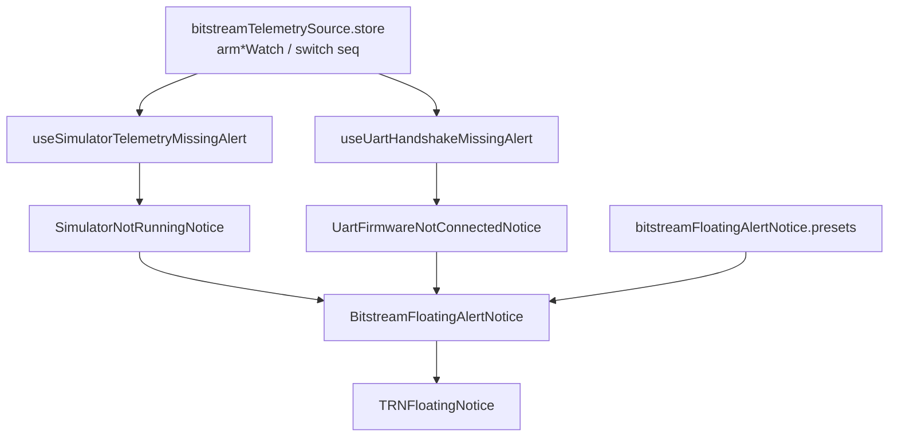

# Bitstream floating alert notices

**Date:** 2026-05-29

User-facing warnings when telemetry source is **Simulator** or **Bitstream** but the link is not ready within a grace window. Built on **`TRNFloatingNotice`** with a shared shell wrapper so icon and animation presets can change without touching hook logic.

## Behavior

| Source | Grace before show | Suppress when | Auto-dismiss |
|--------|-------------------|---------------|--------------|
| **Simulator** | **3 s** after explicit switch (or page load with persisted Simulator) | `EVT_SENSOR` ingested since switch | **10 s** (pauses on hover) |
| **Bitstream** | **10 s** after explicit switch (or page load with persisted Bitstream) | BS2 handshake satisfied (`isLinkHandshakeSatisfied`) | **10 s** (pauses on hover) |
| **Bitstream failed** | — | `handshakeState === "failed"` (red **`BitstreamHandshakeFailureOverlay`** handles hard failures) | — |

Notices use plain copy (Link, USB, Bitstream Simulator extension) — no “Serial Bridge” or “WebSocket broker” jargon.

## Architecture



## Key files

| File | Role |
|------|------|
| `ui/BitstreamFloatingAlertNotice.tsx` | Generic wrapper; presets + `pauseDismissOnHover` |
| `ui/TRN/TRNFloatingNotice.tsx` | Base notice; `pauseDismissOnHover` pauses timer + CSS progress |
| `ui/BitstreamFloatingAlertNotice.types.ts` | `iconAnimation`: `bob-glow` \| `pulse-glow` \| `none` |
| `ui/bitstreamFloatingAlertNotice.presets.ts` | Simulator (`FlaskConical`), UART (`Cpu`) |
| `utils/simulatorTelemetryMissingAlert.ts` | `SIMULATOR_MISSING_EVT_SENSOR_GRACE_MS` (3_000) |
| `utils/uartHandshakeMissingAlert.ts` | `UART_MISSING_HANDSHAKE_GRACE_MS` (10_000) |
| `hooks/useSimulatorTelemetryMissingAlert.ts` | Timer + EVT_SENSOR baseline |
| `hooks/useUartHandshakeMissingAlert.ts` | Timer + handshake watch |
| `BitstreamShellRoot.tsx` | Mounts both notices |

## Hover behavior

When `pauseDismissOnHover` is enabled (Bitstream alert presets default **on**):

- Pointer over the card **pauses** the auto-dismiss timer and **freezes** the progress bar animation in place.
- Timer **resumes** from the remaining time when the pointer leaves; the bar continues shrinking.
- User can **close anytime** with the X button.

## Changing icon or animation later

Edit **`bitstreamFloatingAlertNotice.presets.ts`** only, or pass props to **`BitstreamFloatingAlertNotice`**:

```typescript
export const BITSTREAM_ALERT_PRESET_UART = {
  Icon: Cpu,
  iconAnimation: "bob-glow", // or "pulse-glow" | "none"
  iconColorClass: "text-amber-400",
  autoDismissMs: 10_000,
};
```

## Dev test

1. `npm run start:bridge` in `extension/` (terminal 1).
2. `npm run dev:webview` (terminal 2).
3. **Simulator:** Source **Simulator**, Link on, **do not** start Bitstream Simulator extension → notice after **3 s**, visible **10 s** (hover pauses timer).
4. **Bitstream:** Source **Bitstream**, no board / no handshake → notice after **10 s**.
5. Hard-reload after webview changes.

## Tests

- `tests/bitstream-shell/simulator-telemetry-missing-alert.test.ts`
- `tests/bitstream-shell/uart-handshake-missing-alert.test.ts`
