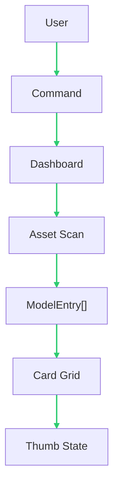
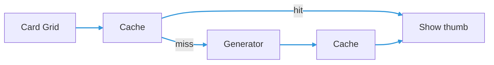
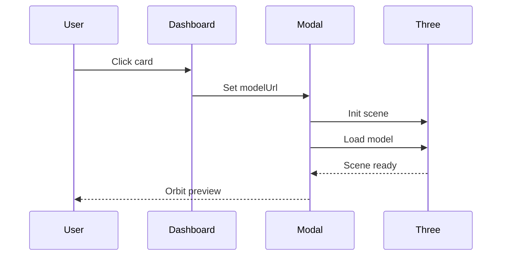
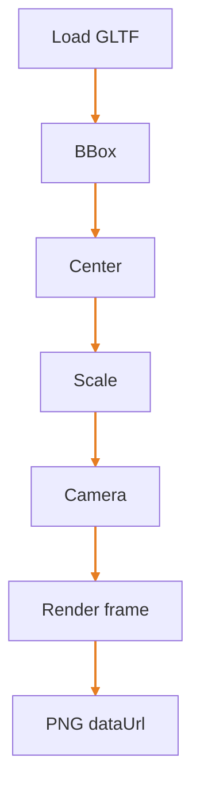

# Model Catalog Dashboard (a23d-like) - Implementation Notes

## Modules
- `modelCatalog-types.ts`
  - Defines `ModelEntry` (including `catalogCategory`: packaged vs downloaded, `dedupeKey`, optional `modelSource`).
- `modelCatalog-asset-scan.ts`
  - Uses Vite build-time `import.meta.glob` to enumerate bundled models under `src/assets/free/models/**` and `src/assets/tesaiot/models/**`.
  - Display **name** is the **folder containing the model file** (not only the first segment under `models/`), so `tesaiot/models/PDM-xxx/file.glb` shows as `PDM-xxx`, not `models`.
  - `catalogCategory` is `downloaded` for dynamic extension/bridge listings; static glob entries use `packaged`.
- `modelCatalogMerge.ts`
  - Merges static glob entries with **dynamic** downloaded listings; dynamic wins for the same **canonical** dedupe key (`tesaiot/models/...` and `free/models/...`).
  - **Browser dev URLs**: Vite root is `src/webview`, so `/assets/...` would point at `src/webview/assets`, not `t3d-extension/src/assets`. In dev, `vite.config.ts` serves `src/assets` at `/__extension_src_assets/...` for **`src/assets/...`** keys only. **Pack paths** (`tesaiot/models/`, `tesaiot/textures/`, `free/…`) resolve to **`/__ternion_user_*`** on the dev origin (same as production browser + `local-webapp-server.ts`); see **`projectRelativePathToDevUrl`**, **`bridgeWebPathToCatalogModelUrl`**, and **`resolveTesaiotTexturesToFetchableUrl`** in `src/webview/logical-asset-url.ts`.
- `ModelCatalogBridgeDownloaded.tsx` (browser only)
  - Calls the model-downloader WebSocket bridge `catalog-list-downloaded` to scan `src/assets/tesaiot/models` and monorepo `assets/tesaiot/models` on disk at refresh time.
- `thumbnail-generator.ts`
  - Loads a GLB/GLTF using `GLTFLoader`.
  - Renders a thumbnail and prefers an authored camera from the model when available.
  - Falls back to a deterministic camera/light setup when no camera exists.
  - Returns a `data:image/png;base64,...` thumbnail.
  - Disposes geometries/materials and the WebGL renderer to avoid leaks.
- `thumbnail-cache.ts`
  - Caches thumbnails in `localStorage` using a versioned key.
  - Current cache version: `v6` (bump it to force regeneration).
  - Includes `clearThumbnailCache()` to remove all Model Catalog thumbnail keys.
- `ModelCatalogDashboard.tsx`
  - Renders an overlay UI (search, category filter **All / Packaged / Downloads**, file-type filter, card grid).
  - **VS Code**: merges static scan with extension host `model-catalog-get-downloaded-models` (filesystem listing).
  - **Browser**: merges static scan with bridge `catalog-list-downloaded` (requires model-downloader bridge running for up-to-date downloads).
  - **Staying up to date**: While the catalog is open, the downloaded list is rescanned every 5s, when the extension posts `model-catalog-local-models-changed` (after a download writes to disk), and when the browser dispatches `model-catalog-refresh-downloaded` (e.g. after Model Loader completes a download). **Refresh list** still forces a full rescan (including static glob).
  - Generates thumbnails on-demand for the currently filtered list.
  - Uses a small worker loop (`workerCount = 1`) to avoid WebGL context contention in VS Code webview.
  - Includes dev controls to refresh list, clear cache, and re-render thumbnails.
  - On card click: opens the preview modal for the selected model.
- `ModelPreviewModal.tsx`
  - Creates an isolated Three.js scene + WebGL renderer.
  - Loads the selected model when the modal opens.
  - Enables `OrbitControls` so the user can inspect the model.
  - Sets an initial orbit pivot target using an auto-selected reference object.
  - Supports smooth pivot retargeting when clicking objects (raycast) or selecting a pivot.
  - Includes a settings popup (gear icon) for click target mode and retarget animation duration.
  - Includes preview-local environment controls: preset, intensity, HDRI toggle, PBR reflection toggle.
  - Persists preview settings in localStorage (FOV, click target mode, retarget duration, env controls).
  - Shows a camera debug overlay (target vs current pose + diffs).
  - Uses `ResizeObserver` to keep renderer + camera aspect in sync with layout size.
  - Cleans up scene objects, renderer, and animation frame on close/unmount.
- `src/webview/model-catalog/persisted-settings.ts`
  - Centralized settings keys, typed schemas, defaults, and safe load/save helpers.
  - Versioned keys for future schema migrations.

## Integration
The dashboard is opened via a Quick Action command registered in:
- `t3d-extension/src/webview/App.tsx`

Command id:
- `model-catalog-open`

It renders `ModelCatalogDashboard` as a fixed overlay when `modelCatalogOpen === true`.

Main webview (`App.tsx`) also exposes compact environment controls that apply directly to engine APIs:
- `engine.setCubeMapIndex(index)`
- `engine.setEnvironmentIntensity(value)`
- `engine.setEnableHDRI(enabled)`
- `engine.setEnablePBR(enabled)`
Main webview environment settings are persisted in localStorage as well.

## Data Flow

### Asset scan and UI rendering

### Thumbnail generation with cache

### Card click to preview modal

### Thumbnail generator framing (conceptual)

## Important Implementation Details

### Thumbnail caching behavior
- Key format (versioned):
  - `t3d-model-catalog-thumb:v5:<modelId>`
- `modelId` is the Vite asset URL produced by `import.meta.glob`.
- The cache stores a PNG data URL in `localStorage`.
- Notes:
  - If `localStorage` is full, cache writes may fail; the dashboard will still generate thumbnails.
  - To force regeneration after model content changes, bump `THUMBNAIL_CACHE_VERSION` in `thumbnail-cache.ts`.
  - For dev workflows, `ModelCatalogDashboard` exposes buttons to clear cache and re-render.

### Thumbnail generation lifecycle
- Thumbnail generation happens inside `ModelCatalogDashboard`'s `useEffect` when `open === true`.
- Cleanup:
  - A `cancelled` flag prevents state updates after unmount/close.
- Thumbnails are generated only for the currently filtered set (so changing search/filter reduces work).

### Preview modal lifecycle
- Preview runs as a self-contained viewer:
  - One scene, one renderer, one camera, one `OrbitControls` instance.
- Cleanup on unmount:
  - Disconnects `ResizeObserver`.
  - Cancels the animation frame.
  - Disposes renderer and traverses the loaded root to release geometry/material resources.

### Orbit pivot selection
The preview orbits around `OrbitControls.target`. The modal supports three pivot modes:
- `Auto`:
  - Finds the first scene object whose `name` matches the model file basename (from `modelUrl`, without extension).
  - If not found, falls back to matching `modelName`.
  - If still not found, uses `(0,0,0)`.
- `Origin`:
  - Uses `(0,0,0)`.
- `Object`:
  - Lets the user pick a named scene node from a dropdown.

On first load, the pivot is applied immediately (no fly-in). Changing the pivot or clicking an object smoothly animates the pivot and camera position to avoid visual jumps.

### Raycast click behavior (preview)
- A click gesture is detected via pointer down/up with movement and time thresholds (to avoid fighting OrbitControls drag).
- The raycaster intersects the loaded `gltf.scene`.
- On hit:
  - The overlay shows `Selected: <objectName>`.
  - The settings popup allows choosing target mode:
    - `Object origin` (clicked object's world origin)
    - `Hit point` (exact raycast contact point)
  - The orbit pivot animates to the selected target mode.
  - The camera offset relative to the previous pivot is preserved during the animation.
  - Clicking empty space while animation is in progress stops the animation at the current in-flight pose.

### Environment map and reflection controls
- Both main panel and preview support:
  - Environment preset selection (from T3D cube-map presets)
  - Environment intensity (`scene.environmentIntensity`)
  - HDRI background toggle (`scene.background`)
  - PBR reflection toggle (`scene.environment`)
- Defaults align with `T3DEngineConfig.environment`:
  - Preset index: `cubeMapIndex`
  - Intensity: `intensity`
  - HDRI: enabled
  - PBR reflection: enabled

### Settings persistence
- Settings are persisted via `src/webview/model-catalog/persisted-settings.ts`.
- localStorage keys:
  - `t3d:webview:main-environment:v1`
  - `t3d:webview:model-preview:v1`
- The persistence helper merges parsed values with typed defaults and falls back safely on invalid/missing storage data.
- Future settings should be added to typed schemas and defaults in the persistence module.

## Dev Notes
- If thumbnails look stale after adding new models or rebuilding bundles, bump `THUMBNAIL_CACHE_VERSION`.
- If preview fails to load a model:
  - Confirm the model was picked up by the Vite glob scan (rebuild the webview).
  - Check console errors for GLTF/GLB loading or missing asset paths.

