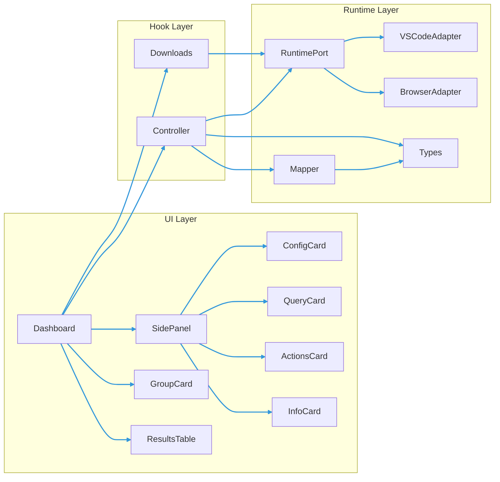
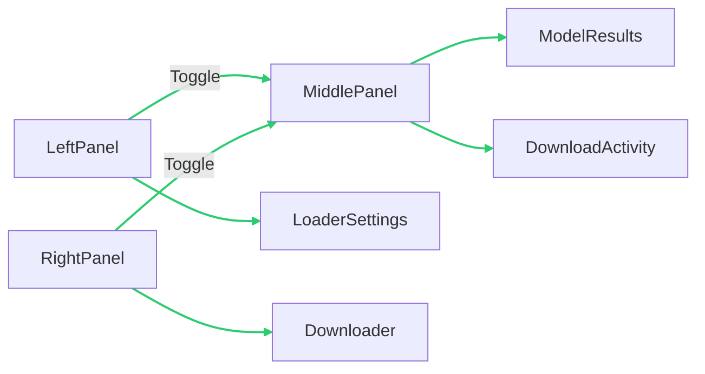
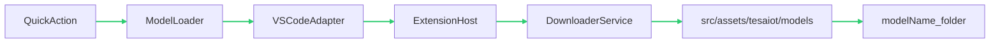
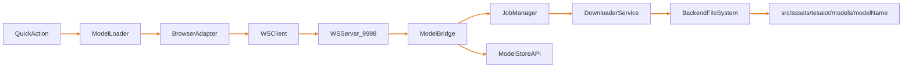

# Model Loader Implementation

## Overview

The new `Model Loader` is integrated into Quick Action (same pattern as `Model Catalog`) and supports both runtime targets:

- VS Code extension webview mode
- Standalone web browser mode

The UI follows the same visual style as `model-catalog` (cards, glass/dark theme, spacing, controls, and scrollbar style).

## Component Map

The Model Loader UI is now organized around a 3-panel shell and reusable grouped cards:

- `ModelLoaderDashboard.tsx`: shell layout + panel orchestration
- `ModelLoaderSidePanel.tsx`: left/right collapsible panel wrapper
- `ModelLoaderGroupCard.tsx`: reusable collapsible card for all content groups
- `ModelLoaderConfigCard.tsx`, `ModelLoaderQueryCard.tsx`, `ModelLoaderResultsTable.tsx`
- `ModelLoaderActionsCard.tsx`, `ModelLoaderInfoCard.tsx`
- `useModelLoaderController.ts`, `useModelLoaderDownloads.ts`
- runtime adapters: browser + VS Code + mappers + runtime port
- shared feature types and barrel exports

## 3-Panel UI Layout

The dashboard now uses a fixed center panel and two collapsible side panels, matching Model Catalog preview panel behavior:

- Left panel: `Loader Settings` (config, query, output target)
- Middle panel: always visible (`Model Results`, `Download Activity`)
- Right panel: `Downloader` (actions, selected info, last download, job history)

## Runtime Behavior

### VS Code extension mode

- Transport: extension host message channel (`vscode.postMessage`)
- Default save root (dev extension tree): `src/assets/tesaiot/models` (production: globalStorage `assets/tesaiot/models`)
- Final save pattern: `src/assets/tesaiot/models/<modelName>/...`
- Per-model folder is created automatically (sanitized folder name)
- Metadata file: `<productId>_metadata.json` saved in the same model folder (full raw `Get Info` payload)
- Progress source: extension job status polling (`model-loader-download-status-response.progress`)

### Web browser mode

- Transport: WebSocket model-downloader bridge
- Download behavior: backend-first job execution and backend file writing
- Default save pattern: `./src/assets/tesaiot/models/<modelName>/...`
- Metadata file: `<productId>_metadata.json` saved in the same model folder (full raw `Get Info` payload)
- Progress source: WS job events (`model-downloader/download-job-event` with `progress`)

### Extension packaging (no bundled models)

If you **do not** want to ship GLB/GLTF with the marketplace extension and rely on **user downloads** instead:

- **`.vsix` contents**: `t3d-extension/.vscodeignore` excludes `out/webview/assets/models/**` (and related asset dirs), so those built files are **not** included in the published package.
- **Runtime downloads**: In VS Code, the extension writes under globalStorage `.../assets/tesaiot/models/<modelName>/...`; the dev tree uses `<extensionPath>/src/assets/tesaiot/models/...`.
- **Source tree / dev samples**: The Model Catalog uses Vite `import.meta.glob` over `src/assets/free/models/**` and `src/assets/tesaiot/models/**` for **Packaged** entries. Omit large GLBs from the VSIX via `.vscodeignore` when publishing.

## Download Progress Bar

The Model Loader now renders a live progress bar in both runtime targets.

- Primary UI source: `currentJobState.progress.percent`
- Fallback source: runtime adapter `downloadProgressPercent`
- Label support: current file/phase text from `progress.label`

Progress payload shape:

| Field | Type | Description |
| --- | --- | --- |
| `phase` | `listing | downloading | writing | done` | Current pipeline phase |
| `percent` | `number` | Overall progress (0-100) |
| `label` | `string?` | Human-friendly active step/file label |
| `fileIndex` | `number?` | Current file index (if available) |
| `totalFiles` | `number?` | Total file count (if available) |

## WS Job Topics

The backend-first flow adds a job contract while keeping legacy topics for compatibility.

| Topic | Direction | Purpose |
| --- | --- | --- |
| `model-downloader/download-job-start` | UI -> Bridge | Start a download job |
| `model-downloader/download-job-start-response` | Bridge -> UI | Return `jobId` + initial state |
| `model-downloader/download-job-status` | UI -> Bridge | Query current job state |
| `model-downloader/download-job-status-response` | Bridge -> UI | Return state/progress/result/error |
| `model-downloader/download-job-cancel` | UI -> Bridge | Request cancel |
| `model-downloader/download-job-cancel-response` | Bridge -> UI | Confirm cancel request |
| `model-downloader/download-job-event` | Bridge -> UI | Push lifecycle events (`started`, `progress`, `completed`, `failed`, `cancelled`) |

## Model Catalog (browser) — local downloads list

Used by the Model Catalog in **standalone browser** mode to refresh `GLB`/`GLTF` under `src/assets/tesaiot/models` (and monorepo `assets/tesaiot/models` when the bridge scans it) without rebuilding the Vite bundle.

| Topic | Direction | Purpose |
| --- | --- | --- |
| `model-downloader/catalog-list-downloaded` | UI -> Bridge | Request filesystem scan (empty body except `requestId`) |
| `model-downloader/catalog-list-downloaded-response` | Bridge -> UI | `{ models: [{ id, name, fileType, webPath, dedupeKey }] }` or `error` |

The webview maps `webPath` to a dev-server URL so previews load the file from disk.

## Runtime Flows

### VS Code extension flow

### Browser flow

## Save Path Matrix

| Runtime | Default root | Final target |
| --- | --- | --- |
| VS Code extension (globalStorage) | `.../assets/tesaiot/models` | `.../tesaiot/models/<modelName>/...` |
| Standalone browser + bridge | `./src/assets/tesaiot/models` | `./src/assets/tesaiot/models/<modelName>/...` |

## Quick Action

The loader is available from Quick Action as:

- `Model Loader`

## Test Commands

For convenience, use one command to run browser + model bridge together:

- `npm run dev:model-loader-browser`

This script starts:

- `start:model-downloader-bridge`
- `dev:browser`

## Notes and Fixes

- Browser refresh may show transient WS/service-worker warnings during startup timing; this is expected if backend is not ready yet.
- Model Loader browser WS connection is now gated by dialog open state (connect only when `Model Loader` is open).
- Config loading is guarded to run once per open cycle to avoid render churn/freeze.
- Browser runtime now uses backend job APIs/events for download lifecycle instead of assembling file blobs in the UI.
- VS Code runtime status responses now include live `progress` so the same progress bar works in extension mode.
- Loader UI now uses collapsible left/right panels and grouped collapsible cards to match Model Catalog design language.
- In dev mode, newly downloaded files may require a catalog refresh (or dev-server restart) before `import.meta.glob` picks up new assets in the grid.

## Requirements

- Supports both VS Code extension and web browser
- Reuses existing model-downloader protocol/service logic where possible
- Keeps files organized and reusable (feature folder + hooks/runtime/components)
