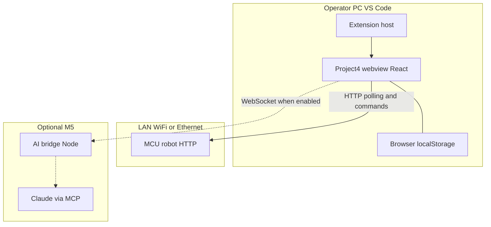
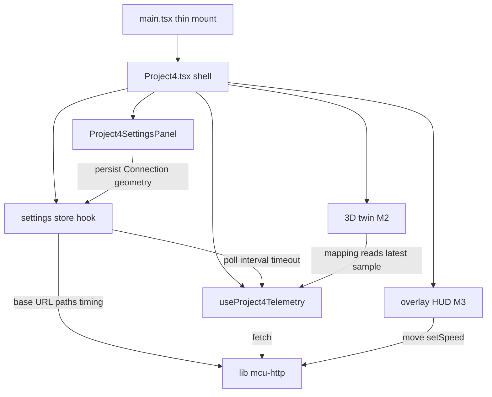
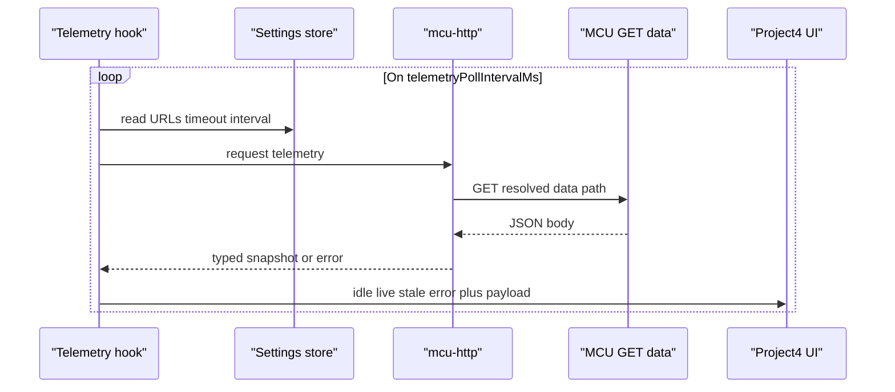
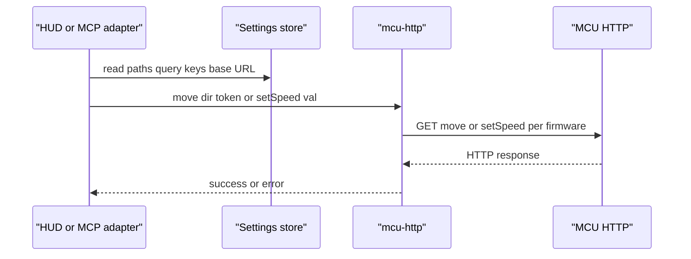
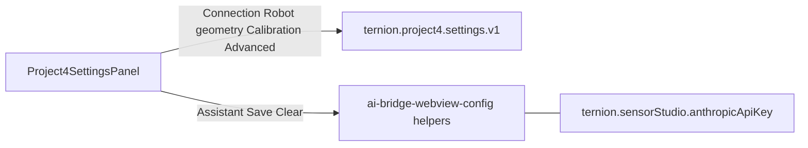
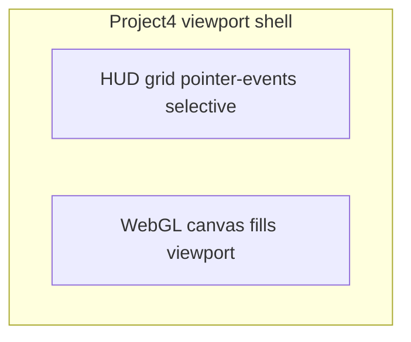

# Project 4 — Project information

Canonical description of the Project 4 sandbox (`src/webview/project4`).

## Overview

Project 4 is a **front-end digital twin** application: the primary experience is a **real-time 3D scene** that mirrors the physical robot. A **microcontroller** on the **same local network** exposes an **HTTP server**; this app reads telemetry and sends commands while keeping the **3D model behavior aligned with live hardware state**.

The authoritative robot silhouette comes from a **`*.glb` exported from Blender** (materials and hierarchy preserved at export time). Runtime code **maps microcontroller fields** (wheel speeds, scanner angle, distances, IMU, etc.) onto **named motors, joints, and helpers** in that scene graph.

The sample base URL below matches a typical AP / fixed-address setup; adjust per deployment if the device IP changes.

## Separation from Bitstream and Sensor Studio

Project 4 is a **separate product surface**: it is **not** Bitstream and **not** Sensor Studio. Treat it as its own app that happens to live in the same VS Code extension.

| Topic | Project 4 | Bitstream / Sensor Studio |
| ----- | --------- | --------------------------- |
| Hardware link | **HTTP client only** — microcontroller HTTP server on the LAN, or the **`project4:mock-mcu`** dev server (**`127.0.0.1:8787`**) | Serial port / broker **`HostSession`**, Bitstream framing |
| Required backend | None beyond reachable **`mcuBaseUrl`** (and optional **AI bridge** for Claude) | Serial attach, Bitstream toolchain assumptions |

**Hard rule — not Bitstream serial:** Project 4 is **not** a Bitstream-serial product slice. It **never** uses USB/serial ports, Bitstream **`HostSession`** framing, or Sensor Studio hardware stacks as the robot data/control path. Reusing Bitstream-area **UI**, **Zustand**, or **MCP registration patterns** is **reference-only**; **`/data`**, **`/move`**, and **`setSpeed`** stay **MCU HTTP** (LAN or **`project4:mock-mcu`**).

**AI bridge:** Project 4 Assistant reuses the **same WebSocket + Claude path** as other assistants for convenience. **`project4_*` MCP handlers** must interact **only** with MCU HTTP (payload from **`project4McuHttp`**). They **must not** require Bitstream serial attach or other serial-backed services. Shared **Anthropic API key storage** is **credential reuse**, not a runtime merge.

## System architecture (diagrams)

This section is a **logical** view of Project 4: major **components**, **storage**, and **data paths**. Implementation milestones land pieces progressively (**M1** settings + HTTP + telemetry readout through **M5** Claude + MCP); diagrams show the **target shape** so you can see how flows connect end to end.

**Rough component count (logical buckets):**

| Bucket | What it is | Milestone |
| ------ | ---------- | --------- |
| **Host shell** | VS Code opens the webview bundle; **`WEBVIEW_READY`** + **`TERNION_WEBVIEW_APP`** select the React root | **M4** |
| **App entry** | Thin **`main.tsx`** → **`resolveTernionWebviewEntry()`** — packaged **`Open 3D World`** → **`MyApp`**; **`Open Project 4 — Robot Twin`** → **`Project4`**; Vite dev defaults **`Project4`** unless **`?app=digitalTwin`** | **M4** |
| **Settings** | Persisted twin config + hook/store | **M1** |
| **MCU HTTP client** | Builds URLs from settings only | **M1** |
| **Telemetry hook** | Poll `/data`, parse, connection state | **M1** |
| **Settings UI** | `Project4SettingsPanel` | **M1** |
| **Live readout / HUD** | Minimal card (**M1**), full overlay (**M3**) | **M1**, **M3** |
| **3D twin** | GLB load + telemetry → scene | **M2** |
| **AI bridge path** | WebSocket + MCP tools → same HTTP client | **M5** |

### Runtime deployment context

Who talks to whom across the operator machine, LAN, and optional assistant stack.



### In-repo composition (`project4/` and entry)

How the React app is structured internally (names match **Implementation roadmap** and **Suggested folder layout**).



### Data flow: telemetry poll loop

Read path from settings-driven polling through to UI (and later the twin reads the same hook state).



### Data flow: motion and speed commands

Write path is **event-driven** (HUD buttons in **M3**, MCP tools in **M5**); both should delegate to the **same** settings-backed HTTP layer.



Note: The next successful **`/data`** poll (**telemetry loop**) remains the **source of truth** for sustained twin alignment after a command.

### Persistence boundaries

Twin-specific JSON vs shared Anthropic secret storage (no duplicate key blob for Project 4).



## Development rules (folder boundaries)

### Where Project 4 files live

- **All new artifacts created for this sandbox** — React components, hooks, styles, types, HTTP/Telemetry helpers, twin-only utilities, models, textures, scripts run only for Project 4 — **must be saved under** `src/webview/project4/` (add **subfolders as needed**: e.g. `components/`, `hooks/`, `lib/`, `api/`, `data/`, `scripts/`).
- **Stay organized:** Prefer small, focused modules and clear folders over one flat directory.

### Imports and reuse

- **Allowed:** Import from **`node_modules`**, **`@ternion/t3d`**, shared extension packages, or existing shared code elsewhere — **reuse** components and utilities when it avoids duplication.
- **Not allowed:** **Creating new Project 4–specific source files outside** `src/webview/project4/`. If code becomes genuinely generic, promoting it repo-wide is a **separate decision**; until then, keep implementations inside this folder.

### Bootstrap / entry wiring

- `src/webview/main.tsx` stays a thin bootstrap — **`resolveTernionWebviewEntry()`** picks **`Project4`** vs **`MyApp`** (see § **Distribution** — *Host integration*). **Do not place twin-specific UI or logic** in `main.tsx`; implement inside `project4/`.

### Reference implementations (parent folders — read as guidelines)

Use existing webview modules as **patterns**, not as places to add Project 4–specific files (still obey **folder boundaries** above).

**Robot I/O scope:** Follow parent-folder examples for **layout**, **persistence**, and **AI-bridge client** wiring only. Do **not** wire Project 4 twin traffic through Bitstream **serial**, **`HostSession`**, or Sensor Studio **device attach** — those paths stay irrelevant to **`mcu-http`** and **`project4_*`** tools.

| Area | Where to look | What to mirror |
| ---- | ------------- | ---------------- |
| **TRN shared UI components** | **`src/webview/ui/TRN/`** | Reusable **`TRN*`** primitives — floating windows (**`TRNWindow`**), side panels (**`TRNSidePanel`**), cards, sortable containers, highlighted JSON blocks, etc. **Prefer these** for Project 4 HUD, settings, and assistant shells so look-and-feel matches Sensor Studio / Bitstream. |
| **App shell / composition** | `src/webview/bitstream-app/` (`BitstreamAppMain.tsx`, `BitstreamAppWrapper.tsx`, `ui/shell/`) | How **`TRN*`** pieces compose into toolbars, menus, and docked panels. |
| **Persisted settings + Zustand** | `src/webview/bitstream-app/state/bitstreamConfig.store.ts` | `localStorage` key, merge defaults, save-on-change — adapt for **`ternion.project4.settings.v1`**. |
| **AI Dev Trace / bridge UX** | `src/webview/bitstream-app/components/ai-dev/` (`AiDevTracePanel.tsx`, `AiBridgeSettingsPanel.tsx`) | Timeline, bridge errors, pairing — conceptual parity for Project 4 assistant/debug surfaces. |
| **Anthropic API key UI** | `src/webview/ai-bridge/AnthropicApiKeySettingsPanel.tsx` + **`ai-bridge-webview-config.ts`** | Same storage Project 4 **`Assistant`** settings must use (**Application settings**). |
| **AI bridge client hook** | `src/webview/ai-bridge/useAiBridgeClient.ts` | WebSocket **`ai/request`**, **`enableMcpTools`**, outbound logging — align Claude + MCP with **AI / MCP integration**. |
| **Assistant chat (Sensor Studio)** | `src/webview/sensor-studio/features/assistant/` | Chat-first panel wiring with **`useAiBridgeClient`**. |
| **MCP / bridge runtime (Node)** | `src/ai/bridge/` | Where MCP-style tools register for the bridge; robot HTTP tools should attach here or via shared registry (**Architecture alignment** in **AI / MCP integration**). |

High-level map of **Bitstream Sensor Studio** architecture and MCP notes: `src/webview/bitstream-app/README.md`, `docs/DEVELOPMENT_TRACKER.md` (*MCP / sensor control — communication plan*).

## Implementation roadmap (phased)

Work proceeds in **milestones** so each slice is testable on hardware. **`DEV_TRACKER.md`** stays the live checklist; this section is the **product order**.

| Milestone | Goal | Key deliverables |
| --------- | ---- | ---------------- |
| **M1 — Foundation** | Persisted config + LAN HTTP + live **`/data`** in the UI | `settings/` (defaults, Zustand or equivalent, **`ternion.project4.settings.v1`**), **`lib/mcu-http.ts`**, **`useProject4Telemetry`**, **`Project4SettingsPanel`** with **Connection** + **Robot geometry** (and **Calibration** if time); minimal telemetry readout (**`TRN*`** card or strip) proving poll + stale state. Optional: **Assistant** API key section early (reuse **`ai-bridge-webview-config`**). |
| **M2 — 3D twin** | GLB + mapping | Canvas / **R3F + drei** (aligned with other webview previews), load **`robotModelUrl`** (see **`resolveProject4RobotModelUrl`**), **`components/twin/`** viewport, resolve rig nodes (**`project4-rig`**), **telemetry → scene** (`v*` → wheel roll about **X**, `a` → scanner yaw about **Y**; optional `df`/`db` visuals later). |
| **M3 — Overlay HUD** | Operator controls | **`Project4ViewportShell`**, drive deck, **`setSpeed`**, connection indicators — **Overlay UI & HUD** § Implementation modules. |
| **M4 — Extension ship** | Production webview | Host command, **`WEBVIEW_READY`** gates, **`npm run compile`** + **`.vsix`** smoke — **Distribution**. |
| **M5 — Claude + MCP** | NL control | Phased plan **`docs/LLM_MCP_DEVELOPMENT_PLAN.md`** — MCP tools on **AI bridge**, **`useAiBridgeClient`** Assistant UX in Project 4, shared **Anthropic** key — **AI / MCP integration** § below. |
| **Future — Physics sim** | Ground interaction + colliders | Design note **`docs/PHYSICS_IMPLEMENTATION.md`** — modes (**mock full physics** vs **telemetry + env physics**), **Jolt** alignment, phased plan; optional **`TRNWindow`** **Physics setup** for engine/material tuning; **Hardware setup** keeps **track**, **wheelbase**, **wheel radius** as **geometry truth** for colliders vs GLB — implementation order after **M4** unless reprioritized ahead of **M5**. |

### Milestone 1 (first step) — definition of done

1. Changing **`mcuBaseUrl`** / paths in settings persists across reload and drives all `fetch` URLs (**no literals** in callers).
2. **`GET /data`** runs on **`telemetryPollIntervalMs`**; parsed fields match **`PROJECT_INFO`** API table (typed).
3. UI shows **connection state** (idle / live / stale / error) and **last sample timestamp** or raw JSON fallback.
4. **`Project4SettingsPanel`** reachable from the running app (floating **`TRNWindow`**, header button, or interim collapsible panel).

### Milestone 2 — definition of done

1. **`robotModelUrl`** expands **`${ONLINE_ASSETS_BASE_URI}`**, **`${FREE_ASSETS_BASE_URI}`**, and **`${LOCAL_ASSETS_BASE_URI}`** via **`resolveProject4RobotModelUrl`** so the twin loads **`robot-4th-project.glb`** without hardcoded fetch paths in UI code.
2. Runtime resolves **`Wheel_*`**, **`Ultrasonic_*`**, **`Body`**, **`Ground`** by **name** (see **Robot GLB** §).
3. Live **`vFL`–`vRR`** drive wheel **roll** using **`wheelRadiusM`** from settings (**ω ≈ v / r** integration each frame).
4. **`a`** (degrees) drives **scanner assembly yaw** on **`Ultrasonic_F`** / **`Ultrasonic_R`** (same angle both until firmware splits).
5. Loaded GLB meshes participate in **shadow maps** when Graphics defaults apply — **`castShadow`/`receiveShadow`** plus **`Ground`** Basic→Standard upgrade (**§ Shadows (twin)**).

### Suggested folder layout (create as milestones land)

```
src/webview/project4/
  settings/           ← M1
  lib/                ← M1 (mcu-http, mcu-connection-url, mcu-connection-presets), M2 (rig + model URL resolve)
  hooks/              ← M1 (**telemetry**), M3 (**MCU commands**, **viewport keyboard**)
  components/
    settings/         ← M1 **`Project4ConnectionPresetCards.tsx`** (mock / real / custom MCU presets)
    hardware/         ← **Hardware setup** (**wrench**) — robot geometry + **MCU** telemetry sweep + firmware-linked HUD hints
    twin/             ← M2 (R3F viewport); **`Project4TwinViewerSetupPanel.tsx`** (**Boxes**) — on-model scanner yaw arc only (not MCU)
    overlay/          ← M3 (**viewport shell**, connection strip, telemetry, drive + speed)
  Project4.tsx        ← compose shell
```

## Digital twin: 3D asset and data mapping

### Role of the 3D application

- **Main UI:** Users interact with (and understand) the robot through the **3D view**, supplemented by light HUD / panels as needed.
- **Consistency:** When `/data` updates, the twin updates—wheel motion, scanner pan, and optional indicators (e.g. obstacle cues from `df` / `db`) should reflect the same quantities the firmware reports.
- **Commands:** User actions in the twin (e.g. drive commands) call the HTTP API (`/move`, `/setSpeed`); the twin may **predict** motion briefly, but **telemetry remains the source of truth** for sustained alignment unless you add a heavier physics sync model later.

### Blender / GLB workflow

- Export the robot as **glTF Binary (`.glb`)** from Blender.
- **Naming matters:** Use **stable object/bone names** in Blender for anything that must move or be referenced from code (four wheels, chassis, ultrasonic mount, radar sweep assembly, etc.). Those names become the hooks for mapping telemetry to transforms.
- **Primary repo copy (extension assets):** Keep the working **`robot-4th-project.glb`** under **`src/assets/models/robot-4th-project/`** — same tree Vite serves as **`/__extension_src_assets/...`** during browser dev (see **Canonical robot model**). Optional duplicate under `src/webview/project4/data/models/` is allowed but not required.
- **Inspect offline:** From the extension repo root run `npx tsx src/webview/project4/scripts/analyze-glb.ts` (optional path argument). Shortcut: `npm run project4:analyze-glb`. **Default** input is **`src/assets/models/robot-4th-project/robot-4th-project.glb`**. The script prints hierarchy, mesh counts, materials, animation clips, and checks names against this document.

### Canonical robot model (GLB)

| Item | Value |
| ---- | ----- |
| **File name** | `robot-4th-project.glb` |
| **This repo (filesystem)** | `src/assets/models/robot-4th-project/robot-4th-project.glb` |
| **Vite browser dev URL** | `/__extension_src_assets/models/robot-4th-project/robot-4th-project.glb` (served from `src/assets`; see `vite.config.ts` **serve-extension-local-assets**) |
| **Repository (browse)** | https://github.com/drsanti/ternion-3d-assets-free/blob/main/assets/models/robot-4th-project/robot-4th-project.glb |
| **Raw URL** (for `fetch` / loaders when not using local assets) | https://raw.githubusercontent.com/drsanti/ternion-3d-assets-free/main/assets/models/robot-4th-project/robot-4th-project.glb |

**Note:** The asset was formerly referenced as `car-v1.glb`; all project docs and tooling now use **`robot-4th-project.glb`**. Prefer the **`src/assets`** copy for development and for resolving **`robotModelUrl`** against **`LOCAL_ASSETS_BASE_URI`** in the webview; use **raw GitHub** when the extension bundle omits large models (see **Distribution** / `.vscodeignore`).

### Robot GLB: object names and rotation axes

These names are **verbatim from the Blender / `.glb` export** (including spelling). After loading the file into Three.js, the twin resolves **`Object3D` references by exact name string** — the runtime expects **only** the nodes below (no other names are assumed contractually unless you extend the asset later).

**Complete set — objects addressable by name from the GLB**

- `Body`
- `Ultrasonic_F`
- `Ultrasonic_R`
- `Wheel_FL`
- `Wheel_FR`
- `Wheel_RL`
- `Wheel_RR`
- `Ground`

| Object name | Role | Animation axis (model local space) |
| ----------- | ---- | ----------------------------------- |
| `Body` | Main chassis / car body | Typically parent for odometry; apply optional IMU tilt to this node or a child rig per your convention. |
| `Ultrasonic_F` | Front ultrasonic assembly | Rotate **about local Y** (pan / sweep). |
| `Ultrasonic_R` | Rear ultrasonic assembly | Rotate **about local Y** (pan / sweep). |
| `Wheel_FL` | Front-left wheel | Rotate **about local X** (rolling). |
| `Wheel_FR` | Front-right wheel | Rotate **about local X** (rolling). |
| `Wheel_RL` | Rear-left wheel | Rotate **about local X** (rolling). |
| `Wheel_RR` | Rear-right wheel | Rotate **about local X** (rolling). |
| `Ground` | Floor / ground reference (environment mesh) | Usually **static** — no MCU binding by default; use for shadows, alignment, or hiding if you split env vs robot at runtime. |

**Hierarchy (`robot-4th-project.glb` — verify after re-export):** The file loads under a root group **`Scene`**. **`Body`** is a **`Group`** that parents several high-poly meshes (`Body_1` … `Body_8`) — apply chassis / IMU motion to **`Body`**, not an individual `Body_*` mesh. **`Ultrasonic_F`** / **`Ultrasonic_R`** are **`Group`** nodes (meshes named `Ultrasonic_*_*`) — pan rotations should target the **group** so all parts move together. **`Wheel_*`** nodes are **`Object3D`** pivots with children **`Wheel_Mag_*`** and **`Wheel_Tire_*`** meshes — apply **roll about local X** on the `Wheel_*` pivot so rim and tire stay aligned.

**Blender export convention (recommended):** After modeling, **Apply** transforms so driven pivots **`Body`**, **`Wheel_*`**, **`Ultrasonic_*`** carry **rotation (0, 0, 0)** and **scale (1, 1, 1)** at export — avoids hidden π-flips that confuse runtime axes. Re-verify with **`npm run project4:analyze-glb`** (or **`npx tsx src/webview/project4/scripts/analyze-glb.ts`**) whenever the GLB changes.

**Naming:** `Wheel_*` matches the exported rig names; keep code references identical so lookups succeed.

**Axes vs Three.js:** glTF/Three.js use **Y-up**, **right-handed** transforms; “rotate along X/Y” here follows the **exported hierarchy**. After load, confirm spin direction with a signed speed test and flip quaternion/rotation sign if the wheel rolls backward.

### Robot geometry (for twin / kinematics)

| Quantity | Value | Notes |
| -------- | ----- | ----- |
| Track width (left–right between wheels) | **0.04 m** | **`PROJECT4_SETTINGS_DEFAULTS`** (**`trackWidthM`**); tune per chassis measurement / CAD. |
| Wheelbase (front–rear axle distance) | **0.23 m** | **`wheelbaseM`** default — confirm against CAD / tape measure (`0.0.23` in legacy notes meant **0.23 m**). |
| Wheel rolling radius | **0.07 m** | **`wheelRadiusM`** default — **`v*`** linear speed → angular velocity (**ω ≈ v / r**); measure tire OD÷2 or calibrate from encoder truth. |

Wheel **radius** for **`v*` → ω** is **not fixed in firmware** — **`wheelRadiusM`** lives in **Hardware setup** / settings (**defaults updated per measured robot**; legacy GLB tire mesh suggested ~**0.067 m** — ignore when defaults disagree).

Fixed numeric rows above mirror **`PROJECT4_SETTINGS_DEFAULTS`** and the **Parameter catalog** defaults unless overridden by persisted **`localStorage`**.


### Telemetry → scene mapping (intent)

The table binds `/data` to **driven nodes** (`Body`, wheels, ultrasonics). `Ground` is **not** telemetry-driven unless you add custom logic. Implement one thin **mapping layer** (telemetry → `Object3D`) so UI and networking stay separate from math.

| MCU field(s) | Scene target(s) | Notes |
| ------------ | ----------------- | ----- |
| `vFL` | `Wheel_FL` | Angular rate from linear speed ÷ **`wheelRadiusM`**; twin applies **`rotateOnAxis`** around pivot **local +X** (stable with exported Euler). |
| `vFR` | `Wheel_FR` | Same. |
| `vRL` | `Wheel_RL` | Same. |
| `vRR` | `Wheel_RR` | Same. |
| `aF` (aliases **`aFront`**) | `Ultrasonic_F` | Front scanner yaw (**degrees**). Reference firmware (**`/data`** JSON) reports servo radar **`a`** in **`45`…`135`°**; **Hardware → MCU sweep** defaults match that span. |
| `aR` (aliases **`aRear`**) | `Ultrasonic_R` | Rear scanner yaw; falls back to **`a`** if omitted (same sweep semantics unless firmware differs). |
| `a` | Both ultrasonics when **`aF`**/**`aR`** absent | Legacy single bearing; twin applies the **same** yaw to **F** and **R**. |
| `df`, `db` | Optional visuals parented to `Ultrasonic_F` / `Ultrasonic_R` or HUD | Distance **cm**—confirm which reading belongs to front vs rear hardware. |
| `ax`, `ay`, `az` | `Body` (optional) | Filtered acceleration: subtle chassis tilt or debug arrows; scale for readability. |

### 3D scene environment (tuning)

**Requirement:** The twin viewport should support a **visible background environment** (HDR / cube map or **`@react-three/drei`** **`Environment`** preset), not only a flat clear color. The same environment should drive **image-based lighting (IBL)** so **`scene.environment`** supplies **reflections and ambient contribution** on **PBR materials** (e.g. **`MeshStandardMaterial`** / **`MeshPhysicalMaterial`**) on the robot asset.

**Implementation (v1):**

- **JPEG cubemaps** — six faces **`posx.jpg`**, **`negx.jpg`**, **`posy.jpg`**, **`negy.jpg`**, **`posz.jpg`**, **`negz.jpg`** per folder under **`src/assets/textures/cubemap/<name>/`** (mirrors public **[ternion-3d-assets-free cubemap tree](https://github.com/drsanti/ternion-3d-assets-free/tree/main/assets/textures/cubemap)**). **`vite build`** copies **`src/assets/textures/cubemap/**/*`** → **`out/webview/assets/textures/cubemap/`** when the folder exists.
- **`Project4TwinSceneEnvironment`** — **`CubeTextureLoader`** assigns **`scene.background`** + **`scene.environment`**; **`scene.environmentIntensity`** comes from **`ternion.project4.graphics.v1`** (default matches **`PROJECT4_TWIN_ENVIRONMENT_INTENSITY`**); **`none`** restores flat **`PROJECT4_TWIN_SCENE_BACKGROUND_HEX`**.
- **URL resolution** — **`buildProject4TwinCubemapFaceUrls`** (`lib/project4-cubemap-urls.ts`): **Vite dev** prefers **`/__extension_src_assets/textures/cubemap/...`**; packaged webview uses **`LOCAL_ASSETS_BASE_URI`** + **`textures/cubemap/...`**; otherwise **`ONLINE_ASSETS_BASE_URI`** (**GitHub raw** fallback).
- **Quick picker** — top-center **`TRNSelect`** on **`Project4.tsx`** (“Env”); persists **`twinCubemapEnvironmentId`** in **`ternion.project4.settings.v1`**.

**Notes:**

- If team shorthand **“HID”** means **IBL** (environment lighting), this section applies. If it refers to a **specific mesh name** in the GLB, document that name in the rig contract (**`project4-rig`**) and tune materials on those nodes only.
- **`Environment`** (or an **`RGBELoader`** HDR) remains an alternative; JPEG cubes match the shared asset repo layout today.
- GLB exports that use **`MeshBasicMaterial`** will **not** show environment reflections until materials are **upgraded** (in Blender or via a small runtime patch — scope deliberately deferred until asset conventions are fixed).

### Shadows (twin)

**Goal:** Directional (and other casters) should produce **contact shadows** on the **`Ground`** mesh when renderer shadow maps are enabled.

**Implementation:**

- **`lib/project4-twin-robot-shadow-setup.ts`** — **`applyProject4TwinRobotShadowSetup(scene)`** runs after **`useGLTF`** attaches the scene (inside **`Project4RobotRoot`** **`useLayoutEffect`**):
  - Every **`Mesh`** (**`SkinnedMesh`** / **`InstancedMesh`** included) gets **`castShadow = true`** and **`receiveShadow = true`**.
  - All meshes **under imported node `Ground`** (whether **`Ground`** is a group or a mesh): each **`MeshBasicMaterial`** is replaced with **`MeshStandardMaterial`** using the same **color**, **`map`**, **opacity**, and **side**, then the Basic material is **`dispose()`**’d. **`MeshBasicMaterial`** does **not** receive directional shadow modulation in a useful way; this runtime upgrade is **scoped to the `Ground` hierarchy only** so the rest of the asset stays unchanged unless you edit the GLB.
- **`Project4TwinDynamicLights`** — When a directional entry has **`castShadow`**, the light’s shadow map is **2048²**, **`bias`** / **`normalBias`** are set, and the **orthographic shadow camera** is expanded (**±14** world units, near/far tuned) so the robot + floor stay inside the frustum.
- **Persisted defaults** (**`ternion.project4.graphics.v1`**): **`shadowsEnabled`** defaults to **`true`**; the key fill directional (**`default-dir-key`**) defaults **`castShadow`** **`true`**. Older saved blobs may still have shadows off — use **Graphics setup → Restore defaults** or enable **Shadow map** and **Cast shadows** on a directional light.

**Shared UI (`TRNSelect`):** Dropdown option panels render through **`createPortal(..., document.body)`** with **`position: fixed`** and a high **`z-index`** so lists appear **above** **`TRNSettingRow`** cards that use **`backdrop-blur`** (which would otherwise paint sibling rows on top of an in-flow absolutely positioned menu).

## Overlay UI & HUD (design)

The **3D canvas is primary**, but users need **always-visible telemetry**, **connection health**, and **drive controls** without leaving the scene. Implement a **non-blocking overlay** layer above the WebGL view (React + Tailwind), consistent with project UI rules — reuse **`TRN*`** components from **`src/webview/ui/TRN/`** (see **Reference implementations**) plus Tailwind + lucide patterns; **new** Project 4–specific wrappers stay under **`project4/`**.

### Layout model

- **Fullscreen twin:** **`Project4`** uses a **`fixed inset-0`** root so the **WebGL view fills the webview** (no side-by-side telemetry column). The **R3F canvas** (`Project4TwinViewport`) uses **`h-full w-full`** inside an **`absolute inset-0`** slot under **`Project4ViewportShell`**.
- **Scene environment (quick):** **`Project4.tsx`** top-right **`TRNSelect`** (globe trigger — twin cubemap preset) switches **`twinCubemapEnvironmentId`** (persisted); see **§ 3D scene environment (tuning)**. **IBL strength** for loaded cubemaps is adjusted from **Graphics setup** (**palette** toolbar icon).
- **Viewport shell:** One **`relative h-full w-full`** container: **`absolute inset-0`** canvas as the **bottom** layer; **`absolute inset-0`** HUD root **above** it (`z-index` stacking).
- **Pointer events:** HUD root uses **`pointer-events-none`** so **orbit / pick** on empty sky passes through; interactive widgets sit in **`pointer-events-auto`** islands (panels, buttons, sliders).
- **Draggable HUD tiles:** Each major overlay (**connection**, **telemetry strip**, **motion / speed**, **`Project4McuTelemetryCard`**) is wrapped in **`Project4DraggableOverlayPanel`** — drag **only from the grip header** so orbit controls stay usable; header **close** hides the tile (re-open via top-right **HUD panels** menu next to the cubemap **`TRNSelect`** and setup icons). Tile chrome uses **high-opacity zinc fills + blur + shadow** so text stays readable on **bright cubemap / light backgrounds**. Positions default to corners / bottom-center, clamp inside the shell, **persist after drag** under **`ternion.project4.hudLayout.v1`** (**`lib/project4-hud-layout.ts`**); window resize **re-clamps** saved coordinates.
- **MCU telemetry source (toolbar):** **`Project4McuTelemetrySourceToggle`** — top-right **`TRNIconButton`** next to the HUD panels menu — switches persisted **`mcuBaseUrl`** between the **mock** preset (**`http://127.0.0.1:8787`**) and **real** default (**`http://192.168.4.1`**). Same URLs as **Connection** preset cards (**`lib/mcu-connection-presets.ts`**). **`custom`** URLs go to **mock** on the first click; subsequent clicks alternate mock ↔ real.
- **Density:** Default **compact** readouts; optional **expand** for IMU / debug rows (collapsible section or secondary drawer).



### Regions (recommended)

| Region | Placement | Role |
| ------ | --------- | ---- |
| **Status strip** | Top edge | MCU **reachability** (connected / stale / error), **last `/data` time**, optional RTT or poll lag hint. |
| **Telemetry strip** | Left or right edge | Live **`/data`** fields: wheel speeds **`vFL`–`vRR`**, scanner **`a`**, distances **`df` / `db`** (with units). |
| **Indicators** | Near telemetry or status | **Stale data** badge if no successful poll within **2×** configured poll interval; **HTTP error** toast or inline message (respect **`httpRequestTimeoutMs`**). |
| **Drive deck** | Bottom center | **Motion** commands aligned with firmware **`dir`** tokens (**`W` `S` `A` `D` `WA` `WD` `SA` `SD` `STOP`**); large touch targets for tablets. |
| **Speed control** | Bottom rail or drive deck | **`setSpeed`** — slider **0–255** + numeric field + **Apply** (or debounced auto-apply with guardrails). |
| **MCU JSON card** | Overlay (user-placed) | Full **`Project4McuTelemetryCard`** (**`TRNInteractiveCard`**) — resolved URL, last sample, **`TRNHighlightedJsonBlock`** — same module as before, now **floating** over the canvas (not a sibling column). |
| **Settings entry** | Top corner icon buttons | **Wrench** → **Hardware setup** (**MCU / robot** — **`Project4HardwareSetupPanel`**); **Boxes** → **Digital twin setup** (**3D viewer scanner bearing** — **`Project4TwinViewerSetupPanel`**); **Palette** → **Graphics setup** (renderer, IBL intensity, lights — **`Project4GraphicsSetupPanel`**); **Gear** → **`Project4SettingsPanel`**. Fixed **`pointer-events-auto`** above draggable HUD (**no** draggable grip on these controls). |
| **MCU telemetry source** | Top-right toolbar | **`Project4McuTelemetrySourceToggle`** — toggles **`mcuBaseUrl`** between mock HTTP server and default real MCU (same presets as Connection cards); icon/tooltip reflect **`mock`** / **`real`** / **`custom`**. |

### Telemetry presentation (indicators)

- **Wheel speeds:** Four compact numeric readouts (m/s) or a **2×2 grid** matching **`FL / FR / RL / RR`** layout for spatial correlation with the twin.
- **Scanner bearings:** Telemetry **`aF`** / **`aR`** (optional JSON aliases **`aFront`** / **`aRear`**) supplies raw degrees; legacy **`a`** fills both when **`aF`**/**`aR`** are absent. Each **`Ultrasonic_*`** mesh keeps its **authored pose on load as 0°**; **`linear remap`** maps MCU **`scannerTelemetrySweep*`** (defaults **`45`…`135`°, **`lib/project4-mcu-documented-ranges.ts`**) into a **yaw offset** bounded by **Digital twin setup** **`scannerFrontAzimuth*`** / **`scannerRearAzimuth*`** (defaults **`−45`…`+45`**). Values outside the MCU sweep clamp to the twin arc endpoints. The HUD shows raw **`aF`**/**`aR`** plus **twin** vs **MCU** ranges for context.
- **Distances `df` / `db`:** **Horizontal bar meters** (normalized to a sensible max, e.g. **200 cm**) with numeric cm label; color shift optional when near safety threshold (**`reverseSafetyStopCmDisplay`** is informational).
- **IMU `ax`, `ay`, `az`:** **Collapsed by default** (expand row); optional mini sparkline later — not required for first slice.

### Drive controls (interaction)

- **Mapping:** Buttons send **`GET`** **`movePath`** with configured **`moveDirQueryKey`** — values exactly as firmware expects (**`W`**, **`WA`**, **`STOP`**, etc.).
- **UX safeguards:** **`STOP`** always visible and visually distinct; optional **“tap again to confirm”** only if users report mis-hits (start simple).
- **Keyboard:** Optional **`keydown`** handlers (**W A S D** + diagonals/chords for **`WA`**…) when focus is on viewport shell — **document shortcuts** in a HUD tooltip; **do not steal keys** when focus is in a text field or settings modal.
- **Repeat / hold:** Prefer **single fire per tap** unless firmware documents safe repeat; **avoid** accidental motor slam by debouncing rapid taps.

### Connection & trust cues

- **States:** **Idle** (no poll yet), **Live** (recent OK), **Stale** (timeout), **Error** (network / HTTP / parse).
- **Operator trust:** Show **raw timestamp** of last good sample and **configured base URL** (truncated) so lab debugging matches **Application settings**.

### Implementation modules (suggested, under `project4/`)

| Module | Responsibility |
| ------ | ---------------- |
| `components/overlay/Project4ViewportShell.tsx` | Stacks **`Project4TwinViewport`** + HUD sibling (`relative` + **`isolate`**). |
| `components/overlay/Project4HudRoot.tsx` | **`pointer-events-none`** shell; composes **`Project4DraggableOverlayPanel`** tiles (connection, telemetry, motion/speed, MCU card); **`useProject4HudPanelVisibility`** hides dismissed tiles; wires keyboard when enabled. |
| `components/overlay/Project4HudPanelMenu.tsx` | Top-right **Panels** icon menu — toggle visibility for each HUD tile (persisted **`hiddenPanelIds`** in **`ternion.project4.hudLayout.v1`**). |
| `components/overlay/Project4McuTelemetrySourceToggle.tsx` | Toolbar **`TRNIconButton`** — **`patchProject4Settings({ mcuBaseUrl })`** cycles mock ↔ real preset URLs (**`mcuBaseUrlFromPreset`**); **`normalizeProject4Settings`** keeps **`mcuConnectionPreset`** aligned. |
| `components/overlay/Project4DraggableOverlayPanel.tsx` | Grip header drag + optional header **dismiss**; initial **`Project4HudPlacement`** (NW / NE / SE / SW / south-center / manual); clamp inside **`Project4ViewportShell`**; optional **`hudPersistId`** restores/saves **`ternion.project4.hudLayout.v1`**. |
| `lib/project4-hud-layout.ts` | Load/save **`Project4HudPersistPanelId`** positions (**`schemaVersion`**: **1**). |
| `components/overlay/TelemetryStrip.tsx` | Compact **`vFL`–`vRR`**, **`a`**, **`df`/`db`** bar meters (**`PROJECT4_DISTANCE_BAR_MAX_CM`**), collapsible **IMU `ax`/`ay`/`az`**. |
| `components/overlay/DriveControlDeck.tsx` | **`/move`** buttons + **`STOP`**; **`sendProject4Move`**. |
| `components/overlay/SpeedControl.tsx` | **`setSpeed`** slider / numeric + Apply; **`sendProject4SetSpeed`**. |
| `components/overlay/ConnectionIndicator.tsx` | Poll status, truncated **`mcuBaseUrl`**, last sample time / HTTP error line. |
| `hooks/useProject4Telemetry.ts` | Poll loop driven by **settings** (`telemetryPollIntervalMs`, URLs). |
| `hooks/useProject4McuCommands.ts` | **`sendMove` / `sendSetSpeed`** with busy flags + shared **`lastFault`**. |
| `hooks/useProject4ViewportDriveKeyboard.ts` | **`WASD`**, **`QEZC`** → **`WA`/`WD`/`SA`/`SD`**, **Space** → **`STOP`** when focus is not in inputs. |
| `components/twin/Project4TwinViewport.tsx` | **`Canvas`**; **`Project4TwinGraphicsRuntime`**, **`Project4TwinSceneEnvironment`**, **`Project4TwinDynamicLights`**, **`Project4RobotRoot`** (telemetry-driven rig). |
| `components/twin/Project4GraphicsSetupPanel.tsx` | **`TRNWindow`** UI for **`ternion.project4.graphics.v1`**. |
| `settings/project4-graphics*.ts` | Defaults, normalization, Zustand store for twin renderer + lights. |
| `lib/project4-twin-robot-shadow-setup.ts` | After GLB load: **`castShadow`** / **`receiveShadow`** on meshes; **`Ground`** subtree **`MeshBasicMaterial`→`MeshStandardMaterial`** for visible floor shadows. |
| `components/twin/Project4TwinViewerSetupPanel.tsx` | **Digital twin setup** modal — **`scannerFrontAzimuth*`** / **`scannerRearAzimuth*`** (GLB scanner yaw arc); viewer-only copy vs MCU. |
| `components/twin/Project4TwinSceneEnvironment.tsx` | **`CubeTextureLoader`** → **`scene.background`** + **`scene.environment`** (IBL / reflections). |
| `lib/project4-twin-environments.ts`, `lib/project4-cubemap-urls.ts` | Cubemap id catalog + **`buildProject4TwinCubemapFaceUrls`**. |

### Non-goals (first slice)

- Full **screen-space labels** pinned to 3D meshes (nice later; requires projection helpers).
- **Custom gamepad** mapping before keyboard + touch work.

## Robot platform

The microcontroller drives a **small four-wheel robot**: **four wheels** (matching per-wheel speed telemetry `vFL`, `vFR`, `vRL`, `vRR` in `/data`).

**Ultrasonic “radar”:** The robot mounts an **ultrasonic rangefinder** on a **scanner** that pans **left and right**. **Two servos** act as the scanner drivers (pan mechanism). Together they sweep the sensor across bearings like a simple **radar**, while firmware reports the current aim as the angle field `a` (see **Status** below).

## Goals

- Provide a **3D digital twin** that **mirrors** the robot using live `/data` and reflects user commands.
- **Load** the Blender-exported **`*.glb`** and drive wheels, scanner, and other rig elements from telemetry.
- **Read** vehicle/sensor state over HTTP (JSON) and **send** motion/speed commands (`/move`, `/setSpeed`).
- **Configure** MCU endpoints, timing, robot geometry, related twin parameters, and **Anthropic API key** (Claude) via the **settings panel** — see **Application settings** (Assistant section uses shared **`ai-bridge-webview-config`**); avoid scattering literals in code.
- **Overlay** the 3D scene with **HUD telemetry**, **connection indicators**, and **drive / speed controls** — see **Overlay UI & HUD (design)**.
- **Ship** as part of the **TERNION Digital Twin VS Code extension**: users install the published extension on their machine and run the twin inside the **webview** (same delivery model as the rest of the product).
- **Assist with Claude + MCP:** Operators control and query the robot via **natural language**; **Anthropic Claude** calls **MCP tools** that read **`/data`** and invoke **`/move`** / **`setSpeed`**, grounded in **sensor semantics** and **safety constraints** — see **AI / MCP integration (Claude)**; mirror **`bitstream-app`** + **`ai-bridge`** **UI / persistence / bridge-client** patterns (**Reference implementations**) — **not** Bitstream serial or Sensor Studio device stacks for robot I/O.
- Follow **Development rules (folder boundaries)** above: **new** Project 4 files only under `src/webview/project4/`; cross-folder **imports** allowed.

## Scope

- **VS Code extension packaging** alignment — webview-safe detection, bundled webview build, and marketplace-ready UX — see **Distribution (VS Code extension)**.
- **AI / MCP (planned)** — MCP tool surface for robot telemetry + motion; **Claude** as the chat/model runtime wired through extension **AI bridge** patterns — see **AI / MCP integration (Claude)**.
- HTTP client toward the microcontroller endpoints documented below.
- **3D runtime integration** (e.g. Three.js through **`@ternion/t3d`** patterns used elsewhere in the extension)—scene setup, GLB loading, animation/update loop — implemented under **`project4/`**.
- **Explicit mapping** from JSON telemetry to scene nodes (wheels, scanner assembly, optional distance / IMU visuals).
- **Overlay HUD** (telemetry, connection state, motion + speed controls) over the canvas — **Implementation modules** listed under **Overlay UI & HUD (design)**.
- Components, hooks, stores, and styles **live under this folder** (see **Development rules**).

## Out of scope

- Firmware implementation on the microcontroller (behavior and field meanings are **as specified by the device**; verify against firmware if anything is ambiguous).
- Non-HTTP transports unless explicitly added later.
- High-fidelity **physics simulation** of the twin beyond simple kinematic/visual sync (unless promoted to an explicit goal later).

## Distribution (VS Code extension)

Project 4 is **not** only a Vite dev experiment: it must be **integrable into the shipping extension** so **end users** install from the **VS Code marketplace** (or a supplied **`.vsix`**) and open the twin on their PC.

### Product expectations

- **Single extension artifact:** Twin UI ships inside the same webview bundle / extension host as other TERNION features (`npm run compile` → packaged webview under `out/webview/`).
- **User journey:** User installs **TERNION Digital Twin** → runs a host command (e.g. **Open 3D World** or a **Project 4–specific command** once registered) → webview loads the React app with the digital twin — **no separate npm install** for operators.
- **Networking:** On the user’s machine, the webview still talks to the robot over **LAN HTTP** using **`mcuBaseUrl`** from settings (default **`http://192.168.4.1`**); document firewall / mixed-content caveats in user-facing help when publishing.

### Engineering constraints (align with repo VSIX rules)

- **Webview detection:** Do **not** rely on `getVsCodeApi()` / `isVsCodeMode()` alone for production paths — follow **`WEBVIEW_READY`** / **`window.__VSCODE_API__`** patterns used elsewhere (see `isVsCodeExtensionWebview()` and workspace **VSIX build** rules). Twin code that branches “browser vs extension” must behave correctly in an **installed `.vsix`**.
- **Bundled `@ternion/t3d`:** `npm run package` uses **`node_modules/@ternion/t3d` from npm**, not the linked `../T3D` tree — verify twin features against a **packaged** build, not only `npm run dev`.
- **Pre-publish checklist:** `npm run compile` clean; review **`.vscodeignore`**; confirm large assets (see below); install built **`.vsix`** locally and smoke-test the twin.

### Large assets (critical)

- The deployed **`robot-4th-project.glb`** may range from a **decimated** dev copy (~**8 MB** in-repo under **`src/assets`**) to a **high-poly** variant on GitHub. **`.vscodeignore`** may exclude **`out/webview/assets/models/**`** from the **`.vsix`** — confirm **`robotModelUrl`** (bundled path vs raw GitHub vs **`globalStorage`**) per release.

### Host integration

- **Commands:** **`ternion-digital-twin.open3DWorld`** — injects **`window.TERNION_WEBVIEW_APP = "digitalTwin"`** (default) before **`index.js`**; mounts **`MyApp`**. **`ternion-digital-twin.openProject4Twin`** — injects **`"project4"`**; mounts **`Project4`**. Implementation: **`src/panels/TernionDigitalTwin.ts`** inline preload script (alongside **`WEBVIEW_READY`**).
- **Same panel slot:** Only one **`TernionDigitalTwin`** panel is active; switching apps **disposes** the webview and recreates HTML when the requested entry differs from the open panel.
- **Vite dev:** **`main.tsx`** uses **`src/webview/ternion-webview-entry.ts`** — default **`project4`**; open **`?app=digitalTwin`** (or **`myApp`**) to exercise **`MyApp`** in the browser.

## AI / MCP integration (Claude)

**Implementation roadmap (phased engineering):** [`docs/LLM_MCP_DEVELOPMENT_PLAN.md`](docs/LLM_MCP_DEVELOPMENT_PLAN.md) — Claude via extension **AI bridge**, MCP tool registration on the **Node** runtime, **Anthropic API key** UX (**Assistant** settings / shared **`ai-bridge-webview-config`**), and alignment with **`mcu-http`** / HUD motion paths.

Operators should be able to **drive and supervise** the robot using **natural language**, backed by **live sensor data** and explicit **control affordances**. The assistant runtime is **Anthropic Claude**, using the **Model Context Protocol (MCP)** so the model calls **tools** instead of hallucinating hardware APIs.

### Intent (from product requirements)

- **Grounding:** At minimum, the model must **see current robot state** (wheel speeds, IMU, scanner angle, obstacle distances, etc.) and understand **what each field means** via tool/schema descriptions aligned with **Microcontroller HTTP API** and **Robot GLB / telemetry mapping**.
- **Control:** The model issues **real commands** — **`move`** (`dir` tokens) and **`setSpeed`** — through MCP tools that delegate to the same HTTP client as the HUD (**settings-backed URLs**, no duplicate literals).
- **Natural language:** Users phrase goals in ordinary language (“back up slowly if rear clearance is low”, “stop”, “what is the front distance?”); Claude selects tools and interprets results.
- **Decision support:** Expose structured telemetry so Claude can **reason** about safety (e.g. **`df` / `db`**, firmware **reverse safety stop**) before suggesting motion; optional **human confirmation** for higher-risk actions can mirror patterns used elsewhere in the extension (**`enableMcpTools`**, confirm flows).

### MCP tool surface (conceptual)

Concrete names and JSON schemas will be defined at implementation time; expected capabilities:

| Tool responsibility | Maps to |
| ------------------- | ------- |
| **Read telemetry** | `GET /data` — returns typed snapshot for the model + UI. |
| **Send motion** | `GET /move?dir=…` — validates `dir` against firmware vocabulary (**`W`**, **`STOP`**, …). |
| **Set speed preset** | `GET /setSpeed` / firmware-shaped request — **`val`** 0–255. |
| **Health / connection** | Optional meta-tool summarizing last poll success, stale flag (helps Claude explain “I cannot see the robot”). |

Tool **descriptions** (for Claude) must encode **units**, **ranges** (e.g. **`a`** / servo radar **`45`…`135`°** unless the operator changed Hardware sweep), and **safety notes** (e.g. reverse behaviour at **10 cm**) so the model respects firmware semantics.

### Architecture alignment (extension-wide)

- **API key:** Operators configure **Anthropic** via **`Project4SettingsPanel`** (Assistant section) using shared **`ai-bridge-webview-config`** storage — required before Claude-backed MCP flows can authenticate (same expectations as Sensor Studio Assistant).
- **Do not reinvent transport:** Prefer integrating with the existing **AI bridge** WebSocket + **`ai/request`** flow and MCP-style tool execution already used for other assistants (**Sensor Studio / Bitstream UIs**) — see repo **`docs/DEVELOPMENT_TRACKER.md`** (*MCP / sensor control — communication plan*) and `src/ai/bridge/` patterns. **`project4_*`** handlers remain **MCU HTTP–only**; they are **not** Bitstream-serial MCP tools.
- **Where code lives:** Robot-specific **tool descriptors and handlers** should remain **owned by Project 4** under `src/webview/project4/` **only where policy allows**; if registration must live in the Node AI bridge, add thin adapters there that call into shared **`lib/mcu-http`** (or equivalent) — avoid scattering HTTP URLs outside settings-backed modules.

### UX (later slice)

- Chat panel or reuse **Assistant**-style UI inside Project 4 viewport shell; show **tool calls** and **sanitized** payloads for traceability (similar to AI Dev Trace patterns).

### Non-goals (initial design pass)

- Running Claude **outside** the extension’s supported Anthropic path (no ad-hoc API keys in Project 4-only binaries beyond existing patterns).
- Replacing manual HUD controls — MCP is **additive**, not exclusive.

## Microcontroller HTTP API

**Base URL:** `http://192.168.4.1/`

Replace the host if your board uses another address on the LAN. **Do not hardcode** this URL (or paths below) in application logic — read **Application settings (configuration design)** and use persisted values merged with defaults.

### Mock MCU server (development)

When no hardware is available, run the repo script that exposes the **same HTTP paths and JSON shape** as the firmware surface above (**`/data`**, **`/move`**, **`/setSpeed`**), plus permissive **CORS** for browser dev.

| Item | Value |
| ---- | ----- |
| **Command** | **`npm run project4:mock-mcu`** alone, or **`npm run dev:with-mock-mcu`** to run the mock **and** the normal **`npm run dev`** stack (T3D watch + extension/webview) in one terminal |
| **Implementation** | **`src/webview/project4/scripts/mock-mcu-server.ts`** |
| **Default listen** | **`http://127.0.0.1:8787`** |
| **Port override** | Env **`MOCK_MCU_PORT`** (host **`MOCK_MCU_HOST`**, default `127.0.0.1`) |

**Project 4 Settings:** open **Settings → Connection** and choose **Mock HTTP server** (applies **`http://127.0.0.1:8787`**, aligned with this script’s defaults), or set **MCU HTTP (manual)** / **Custom connection** if you override host or port (e.g. **`MOCK_MCU_PORT`**). Paths **`/data`**, **`/move`**, **`/setSpeed`** match defaults — no change needed unless you customize them.

**Simulation notes:** Wheel speeds **`v*`** slew toward a simple differential-drive model from **`dir`** tokens; **`setSpeed`** scales the simulated max linear speed (0–255 → cap **`MAX_LINEAR_MS`** in the script). Scanner angles **`a`** / **`aF`** / **`aR`** oscillate across **`PROJECT4_DOCUMENTED_MCU_SCANNER_SWEEP_*`** (**`45`…`135`°, matching firmware **`a`** range); **`df`** / **`db`** vary deterministically for UI exercise (not firmware-identical physics).

### Status (JSON)

**URL:** `GET http://192.168.4.1/data`  
**Response:** JSON object.

| Key     | Type    | Description |
| ------- | ------- | ----------- |
| `vFL`   | Float   | Front-left wheel speed (m/s). |
| `vFR`   | Float   | Front-right wheel speed (m/s). |
| `vRL`   | Float   | Rear-left wheel speed (m/s). |
| `vRR`   | Float   | Rear-right wheel speed (m/s). |
| `ax`    | Float   | IMU acceleration X (filtered). |
| `ay`    | Float   | IMU acceleration Y (filtered). |
| `az`    | Float   | IMU acceleration Z (filtered). |
| `a`     | Integer | Servo radar current angle (**degrees**); reference firmware **`45`…`135`°**. Used for **both** ultrasonics when **`aF`** / **`aR`** are not sent. |
| `aF`    | Integer | Optional — front (**`Ultrasonic_F`**); aliases **`aFront`**. |
| `aR`    | Integer | Optional — rear (**`Ultrasonic_R`**); aliases **`aRear`**. |
| `df`    | Integer | Forward obstacle distance (cm). |
| `db`    | Integer | Obstacle distance (cm). Naming suggests **rear** vs `df` **front**; confirm in firmware if readings disagree. |

**Scanner sweep (authoritative):** Field **`a`** is an **Integer**, **current servo radar angle** **`45`°…`135`°** per robot **`/data`** JSON specification. **`scannerTelemetrySweep*`** defaults and the mock MCU use that span (**`lib/project4-mcu-documented-ranges.ts`**). Split **`aF`** / **`aR`** share the same semantics unless your firmware documents otherwise; adjust **Hardware setup** if your build differs. **Digital twin setup** maps this MCU span to **±viewer yaw** on the GLB (default **`−45`…`+45`**).

**`df` / `db` wording:** Some internal summaries describe **`db`** with the same “front obstacle” wording as **`df`**; in this project **`df`** is treated as **forward** ranging and **`db`** as **rear / backing** context — confirm against your firmware if readings disagree.

**Parser note:** The webview **`parseProject4TelemetryJson`** (**`lib/project4-telemetry-types.ts`**) accepts numeric fields encoded as **JSON strings** (e.g. `"vFL":"0.12"`) and coerces them to numbers. Prefer native JSON numbers from firmware when possible.

### Motion control

**URL:** `GET http://192.168.4.1/move?dir=<token>` (exact query shape as implemented on device; `dir` values below.)

| `dir` value | Action |
| ----------- | ------ |
| `W` | Drive forward, straight. |
| `S` | Drive backward, straight. **Safety stop** at **10 cm** (per device). |
| `A`, `D` | Spin in place, left / right. |
| `WA`, `WD` | Forward arc, left / right. |
| `SA`, `SD` | Rear arc, left / right. |
| `STOP` | Stop all motors. |

### Speed preset

**URL:** `http://192.168.4.1/setSpeed`  
**Parameter:** `val` in the range **0–255** (encoding as query or body depends on firmware—match the device implementation).

## Application settings (configuration design)

**Goal:** Every user- or deployment-specific value (**MCU host**, **HTTP paths**, **poll timing**, **robot geometry** for the twin, optional **calibration** bounds, **Anthropic API key** for Claude) is **configurable** and **persisted**. Defaults match this document and the current firmware; feature code reads settings via a single hook/store — **no magic literals** spread across components.

### Principles

- **Single source of truth:** One persisted JSON blob (see below) + typed defaults in code (`defaults.ts`). Components consume **`useProject4Settings()`** (or equivalent), never duplicate literals for URLs or wheel radius.
- **Normalize at use:** Build requests by resolving **`mcuBaseUrl`** (strip trailing slash) + relative **`telemetryPath`** / **`movePath`** / **`setSpeedPath`**; avoid storing redundant absolute URLs per endpoint unless UX demands it.
- **Derived preset flag:** **`mcuConnectionPreset`** (`mock`, `real`, or `custom`) is persisted for readability and UI badges but is always recomputed from **`mcuBaseUrl`** in **`normalizeProject4Settings`** via **`classifyMcuConnectionPreset`** (**`lib/mcu-connection-presets.ts`**); it must not drift from the composed URL.
- **Validate on edit:** Clamp / reject invalid numbers (negative wheel radius, empty base URL); show field errors in the settings panel.
- **Version the blob:** Include **`schemaVersion`** in persisted JSON so future migrations can adjust keys without silent corruption.

### Persistence

- **Storage:** `window.localStorage` under key **`ternion.project4.settings.v1`** (aligns with other webview panels such as Bitstream config).
- **HUD layout (separate key):** Draggable overlay **x/y** positions and optional **`hiddenPanelIds`** use **`ternion.project4.hudLayout.v1`** — **`schemaVersion`: 1** + **`panels`** map (**`connection`**, **`telemetry`**, **`motion`**, **`mcuCard`**). Implemented in **`lib/project4-hud-layout.ts`**; not merged into the main settings blob.
- **Graphics / twin rendering (separate key):** **`ternion.project4.graphics.v1`** — renderer tone mapping, exposure, output color space, shadow-map toggle, **`scene.environmentIntensity`**, and a bounded list of user lights (ambient / directional / point / spot / hemisphere) with optional Three.js helpers. Store under **`src/webview/project4/settings/project4-graphics*.ts`**; toolbar **palette** opens **`Project4GraphicsSetupPanel`**.
- **Merge rule:** On load, `deepMerge(defaultSettings, parsed)` so new keys added in a future release get sane defaults without wiping user data.
- **Anthropic API key (secret):** Do **not** duplicate a second key store for Project 4. **`Project4SettingsPanel`** must expose a **masked password field** + **Save** / **Clear** that read and write the **same** storage as the rest of the webview — helpers **`getStoredAnthropicApiKey`**, **`setStoredAnthropicApiKey`**, **`clearStoredAnthropicApiKey`** in **`src/webview/ai-bridge/ai-bridge-webview-config.ts`** (storage key **`ternion.sensorStudio.anthropicApiKey`**). That keeps Claude-capable surfaces (**Sensor Studio Assistant**, **AI Dev Trace**, Project 4 AI) aligned on one key until **`SecretStorage`** migration lands repo-wide (`docs/DEVELOPMENT_TRACKER.md` — *Secrets*).
- **Optional later:** Export / import JSON for lab setups (exclude API key from exports by default).

### Settings panel — UX grouping (recommended)

| Section | Purpose |
| ------- | ------- |
| **Connection** | **Preset cards** — **Mock HTTP server** (**`127.0.0.1:8787`**), **Real microcontroller** (default **`http://192.168.4.1`**), **Custom connection** (anything else; highlights when URL does not match those presets); **MCU HTTP (manual)** row (**`parseMcuConnection` / `composeMcuConnection`** → **`mcuBaseUrl`**); optional path overrides; poll interval; HTTP timeout. |
| **Assistant (Claude)** | **Anthropic API key** — masked input, Save / Clear; uses shared **`ai-bridge-webview-config`** storage (see **Persistence**). Optional later: default model id / bridge URL hints. |
| **Advanced (collapsed)** | Query parameter names (`dir`, `val`), `setSpeed` method toggle if firmware differs (query vs future body); **`robotModelUrl`** (twin asset path). |
| **Hardware setup** (`TRNWindow`) | **Toolbar wrench** — **MCU / physical robot**: geometry (**track**, **wheelbase**, **wheel radius**); **`scannerTelemetrySweep*`** (firmware **`aF`**/**`aR`**/**`a`** range); **reverse safety display (cm)** (HUD parity). **`Project4HardwareSetupPanel.tsx`**. Same **`ternion.project4.settings.v1`** blob. |
| **Digital twin setup** (`TRNWindow`) | **Toolbar Boxes icon** — **viewer-only**: **`scannerFrontAzimuth*`** / **`scannerRearAzimuth*`** (how far **`Ultrasonic_*`** pivots on the GLB after remap). Does **not** define MCU output. **`Project4TwinViewerSetupPanel.tsx`**. Same persisted blob. |
| **Graphics setup** (`TRNWindow`) | **Toolbar palette icon** — twin-only renderer (**tone mapping**, **exposure**, **output color space**, **shadow map**), **IBL intensity** (`scene.environmentIntensity`), editable lights + helpers. **`Project4GraphicsSetupPanel.tsx`**. Persisted under **`ternion.project4.graphics.v1`**. |

### Parameter catalog (v1)

**MCU / HTTP**

| Key | Type | Default | Validation / notes |
| --- | ---- | ------- | ------------------ |
| `schemaVersion` | integer | `1` | Bump only when breaking persisted shape. |
| `mcuBaseUrl` | string | `http://192.168.4.1` | Canonical stored URL (**scheme://host** or **scheme://host:port**). **Connection** UI edits **`parseMcuConnection` / `composeMcuConnection`** (**`mcu-connection-url.ts`**) so non-default ports (e.g. mock **`8787`**) do not require hand-editing a single URL field. Host may be IP, hostname, or mDNS name. |
| `mcuConnectionPreset` | string union | `real` (for default URL) | **`mock`**, **`real`**, or **`custom`** — classified from **`mcuBaseUrl`** vs built-in mock (**`http://127.0.0.1:8787`**) and real (**`http://192.168.4.1`** with empty port) presets in **`mcu-connection-presets.ts`**. Rewritten on every normalize; safe for exports/debug only — URL remains authoritative. |
| `telemetryPath` | string | `/data` | Leading slash; appended to base. |
| `movePath` | string | `/move` | Same. |
| `setSpeedPath` | string | `/setSpeed` | Same. |
| `moveDirQueryKey` | string | `dir` | Matches `…?dir=W`. |
| `setSpeedValueQueryKey` | string | `val` | Matches firmware; extend later if body-only API. |
| `telemetryPollIntervalMs` | number | `100` | Clamp e.g. **50–5000** to avoid hammering MCU. |
| `httpRequestTimeoutMs` | number | `3000` | Per fetch timeout; **≥ 500**. |

**Assistant / Claude (stored outside Project 4 JSON blob)**

The panel **surface** lives in **`Project4SettingsPanel`**; persistence uses **`ai-bridge-webview-config`** — **not** nested inside **`ternion.project4.settings.v1`** — to match **`AnthropicApiKeySettingsPanel`** and **`useAiBridgeClient`**.

| Concern | Implementation |
| ------- | ---------------- |
| **API key read/write** | **`getStoredAnthropicApiKey`**, **`setStoredAnthropicApiKey`**, **`clearStoredAnthropicApiKey`** |
| **UX** | `<input type="password">` (or equivalent), never echo full key in HUD traces; optional “key present” badge without revealing characters |
| **Sending to bridge** | Same pattern as Sensor Studio — per-request key or merged hello (**`useAiBridgeClient`**) per existing AI bridge protocol |

**Robot geometry (digital twin / kinematics)**

Aligned with **Robot geometry** elsewhere in this doc; these feed **`v*` → wheel ω** and optional chassis visualization — **not** sent to the MCU unless you add a future calibration protocol.

| Key | Type | Default | Validation / notes |
| --- | ---- | ------- | ------------------ |
| `trackWidthM` | number | `0.04` | **>** `0` (left–right wheel spacing). |
| `wheelbaseM` | number | `0.23` | **>** `0` (front–rear axle spacing). |
| `wheelRadiusM` | number | `0.07` | **>** `0`; **`v*`** → wheel ω (**measure tire OD÷2** or calibrate vs encoder). Legacy GLB tire mesh ~**0.134 m** OD (~**0.067 m** r) was only an asset-scale hint. |

**Calibration / UI semantics** (optional fields; firmware wins on hardware behavior)

| Key | Type | Default | Notes |
| --- | ---- | ------- | ----- |
| `scannerTelemetrySweepMinDeg` | number | `45` | MCU-reported sweep lower bound for **`a`** /**`aF`** /**`aR`** (**reference spec:** **`45`…`135`°**). Clamped **`−360`…`360`**; invalid **min ≥ max** resets pair. |
| `scannerTelemetrySweepMaxDeg` | number | `135` | Upper bound (**`PROJECT4_DOCUMENTED_MCU_SCANNER_SWEEP_MAX_DEG`**); mock **`/data`** oscillates within this span. |
| `scannerFrontAzimuthMinDeg` | number | `−45` | **Digital twin setup** UI — front **`Ultrasonic_F`** **viewer yaw offset** lower bound (signed **`−180`…`+180`**); **loaded GLB pose = 0°** + remap from **`scannerTelemetrySweep*`**. |
| `scannerFrontAzimuthMaxDeg` | number | `45` | Twin viewer upper bound; must be **>** min (invalid pair resets defaults). |
| `scannerRearAzimuthMinDeg` | number | `−45` | Same as front column for **`Ultrasonic_R`** / **`aR`** / **`a`**. |
| `scannerRearAzimuthMaxDeg` | number | `45` | Same validation as front max. |
| `reverseSafetyStopCmDisplay` | number | `10` | For HUD / docs parity with firmware rear obstacle stop — informative only. |

**Asset (optional v1)**

| Key | Type | Default | Notes |
| --- | ---- | ------- | ----- |
| `robotModelUrl` | string | **`${ONLINE_ASSETS_BASE_URI}/models/robot-4th-project/robot-4th-project.glb`** (constant **`PROJECT4_ROBOT_ONLINE_PLACEHOLDER`**) | Defaults load from **GitHub raw** via **`window.ONLINE_ASSETS_BASE_URI`**. Use **`${FREE_ASSETS_BASE_URI}/…`** after **Free Assets** subset sync into **`globalStorage`** (same **`asset-sync-free-pack-start`** pipeline as the main app). **`LOCAL_ASSETS_BASE_URI`** remains supported for bundled **`out/webview/assets`**. Loader failures show an in-viewport recovery panel (**Download robot GLB (Free pack)** vs **Use GitHub (online URL)**). Persisted **`/__extension_src_assets/...`** URLs are still rewritten when **`WEBVIEW_READY`** (avoids **403**). |
| `twinCubemapEnvironmentId` | string | **`none`** | **`none`** = flat backdrop + no **`scene.environment`** cubemap. Otherwise must match **`PROJECT4_TWIN_CUBEMAP_IDS`** (`lib/project4-twin-environments.ts`). |

### Implementation layout (under `project4/` only)

Suggested modules (names indicative):

- `settings/project4-settings.defaults.ts` — default object + `schemaVersion`.
- `settings/project4-settings.schema.ts` — Zod (or hand validation) for load/save.
- `settings/project4-settings.store.ts` — Zustand or thin React context: load → merge → subscribe → persist on change.
- `components/Project4SettingsPanel.tsx` — **Connection**, **Assistant**, **Advanced** (hardware fields moved to **`components/hardware/Project4HardwareSetupPanel.tsx`** — wrench **`TRNWindow`** from **`Project4.tsx`**).

HTTP client (`lib/mcu-http.ts`) reads **`mcuBaseUrl`** + paths from the store only — **no literals** in callers. **`lib/mcu-connection-url.ts`** parses/composes **`mcuBaseUrl`** for **Connection** scheme / host / port fields. **`lib/mcu-connection-presets.ts`** defines mock vs real preset hosts/ports and **`classifyMcuConnectionPreset`**. **`components/settings/Project4ConnectionPresetCards.tsx`** renders the three preset cards (includes **Go to manual fields** for the manual row). **`components/overlay/Project4McuTelemetrySourceToggle.tsx`** exposes the same mock ↔ real switch on the overlay toolbar (**`Project4.tsx`**).

### Related sections

- **Robot geometry (for twin / kinematics)** — physical meanings of **`trackWidthM`** / **`wheelbaseM`**.
- **Microcontroller HTTP API** — protocol defaults mirrored by **`telemetryPath`**, **`movePath`**, **`setSpeedPath`**.
- **Overlay UI & HUD (design)** — operator-facing telemetry and controls consume the same HTTP settings and live `/data` stream.
- **AI / MCP integration (Claude)** — MCP tools must reuse the same HTTP + settings layers so Claude and the HUD stay consistent.

## Technical notes

- **Entry:** `Project4.tsx` (mounted when **`TERNION_WEBVIEW_APP`** is **`project4`** or in Vite dev by default); **`MyApp`** for packaged **`Open 3D World`**.
- **Digital twin:** Prefer one module (or hook) responsible for **“telemetry → scene”** updates each frame or after each poll, reading resolved `Object3D` references from the loaded GLB.
- **HUD:** Overlay panels bind to shared telemetry state (see **Overlay UI & HUD (design)**); keep drive **`move`** / **`setSpeed`** calls in the MCU HTTP layer wired from settings.
- **VSIX:** Test packaged extension behavior — **Distribution (VS Code extension)** — including webview gates and GLB packaging strategy.
- **Robot GLB path:** Repository file **`src/assets/models/robot-4th-project/robot-4th-project.glb`**; Vite dev URL **`/__extension_src_assets/models/robot-4th-project/robot-4th-project.glb`**. Production-friendly defaults use **`${ONLINE_ASSETS_BASE_URI}`** / **`${FREE_ASSETS_BASE_URI}`** (see **`project4-robot-asset-constants.ts`**, **`resolveProject4RobotModelUrl`**, **`project4-sync-free-robot-model.ts`**).
- **Network:** Browser **mixed content** rules apply: serving this UI over `https` while calling an **`http://…`** MCU (see **`mcuBaseUrl`** in settings) may be blocked unless you use a secure-context exception, proxy, or serve the front end over `http` on localhost per your environment.
- **Configuration:** Twin + HTTP behavior reads **Application settings** — avoid literals for URLs, paths, wheel geometry, and poll intervals in feature code.
- **Claude + MCP:** Robot MCP tools should delegate to shared MCU HTTP helpers and rich **`/data`** field descriptions — see **AI / MCP integration (Claude)**; align with **`src/ai/bridge/`** when registering tools for **`enableMcpTools`** flows.
- **Anthropic API key:** Collected in **`Project4SettingsPanel`** § Assistant — **`ai-bridge-webview-config`** (`ternion.sensorStudio.anthropicApiKey`); never duplicate storage keys for Project 4-only clones.
- **CORS:** If the browser blocks responses, the microcontroller may need to allow the web app origin, or you may need a small local proxy—confirm when integrating.

## Related documents

- [`docs/LLM_MCP_DEVELOPMENT_PLAN.md`](docs/LLM_MCP_DEVELOPMENT_PLAN.md) — Claude + MCP via AI bridge, API key settings, phased delivery.
- [`docs/PHYSICS_IMPLEMENTATION.md`](docs/PHYSICS_IMPLEMENTATION.md) — Jolt physics modes (mock vs telemetry hybrid).
- [`DEV_TRACKER.md`](./DEV_TRACKER.md) — day-to-day status, requirements, done/next, and to-dos. **Whenever** you add a feature, change the plan, or finish a slice of work, update that tracker (and this file if the **spec** changes) in the **same development pass** — see **DEV_TRACKER** § *How to maintain* → *Whenever development moves forward*.
