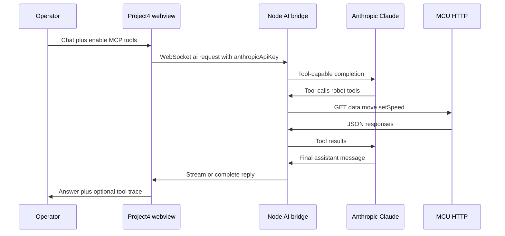

# Project 4 — LLM and MCP development plan (Claude)

This document is the **implementation roadmap** for **natural-language operation** of the robot twin via **Anthropic Claude** and **Model Context Protocol (MCP)**-style tools. It extends **[`PROJECT_INFO.md`](../PROJECT_INFO.md)** § **AI / MCP integration (Claude)** with phased engineering tasks, component boundaries, and alignment with the extension **AI bridge**.

Companion specs:

- **[`PHYSICS_IMPLEMENTATION.md`](./PHYSICS_IMPLEMENTATION.md)** — physics simulation (orthogonal to MCP; motion authority stays explicit).

---

## Objectives

1. **Operators** use **ordinary language** to **query telemetry** and **issue motion** aligned with firmware semantics (**`/data`**, **`/move`**, **`setSpeed`**).
2. **Claude** is the **model runtime**; the webview supplies **`anthropicApiKey`** through settings (**same storage as Sensor Studio** — no duplicate key stores).
3. **Tools** execute **server-side** in the **Node AI bridge** (existing architecture): the webview sends **`ai/request`** over WebSocket with **`enableMcpTools: true`** when the operator opts in; the bridge runs registered handlers that delegate to the **same HTTP surface** as the HUD (settings-derived **`mcuBaseUrl`** and paths — ideally shared **`sendProject4*`** / **`mcu-http`** patterns).
4. **Safety:** Risky tools follow repo **confirm** flows where applicable; descriptions encode **units**, **ranges**, and **firmware caveats** (e.g. **`a`** sweep, reverse stop hints).

### Boundary: Project 4 vs Bitstream / Sensor Studio

Project 4 is **standalone**: robot I/O is **HTTP to the MCU** (or **mock-mcu**). It does **not** use serial ports, Bitstream **`HostSession`**, or Sensor Studio device stacks.

The Node AI bridge is **shared transport** for Claude only. **`project4_*`** tool execution must remain **HTTP-only** toward the microcontroller and **must not** block on Bitstream serial attach — see **`toolRequiresBitstreamHostSessionAttach`** in **`src/ai/bridge/anthropic-tool-loop.ts`**.

**Classification:** Project 4 is **not** part of Bitstream serial tooling. Mentioning **`bitstream-mcp-tool-registry.ts`**, **`bitstream-mcp-tool-policy.ts`**, or Sensor Studio assistant flows describes **shared bridge/registry patterns** — **not** serial-backed robot I/O for Project 4.

---

## User-facing configuration (Anthropic API key)

| Requirement | Approach |
| ----------- | -------- |
| **Where users enter the key** | **`Project4SettingsPanel`** → **Assistant (Claude)** section — masked input, **Save** / **Clear**. |
| **Persistence** | **`src/webview/ai-bridge/ai-bridge-webview-config.ts`** — **`getStoredAnthropicApiKey`**, **`setStoredAnthropicApiKey`**, **`clearStoredAnthropicApiKey`** — storage key **`ternion.sensorStudio.anthropicApiKey`**. |
| **Why not in `ternion.project4.settings.v1`** | Keeps **one secret** across **Sensor Studio Assistant**, **AI Dev Trace**, and **Project 4** until a repo-wide **`SecretStorage`** migration exists (**[`docs/DEVELOPMENT_TRACKER.md`](../../../../docs/DEVELOPMENT_TRACKER.md)** — *Secrets*). |
| **Sending to Claude** | **`useAiBridgeClient`** merges key into bridge **`hello`** / per-**`ai/request`** payload per existing protocol — do not embed raw keys in HUD traces; reuse **sanitized outbound** logging patterns where available. |

Optional later fields (same Assistant panel or Advanced): default **model id**, **bridge WebSocket URL** hints — only if product needs overrides beyond global extension config.

---

## Architecture (high level)

The webview **does not** run MCP stdio locally. **Flow:**

**Registration:** Robot MCP tools are registered on the bridge when **`enableMcpTools`** is enabled for that session — mirror **`src/ai/bridge/bitstream-mcp-tool-registry.ts`** / **`collectBitstreamMcpTools`** patterns. Handlers should call **shared helpers** built on **`lib/mcu-http.ts`** (Project 4) or a thin bridge-side adapter that duplicates **no** URL literals.

---

## Command and capability taxonomy

Before locking MCP schemas, agree **what classes of behavior** exist and **how many MCP tools** expose them. The robot firmware today centers on **one telemetry read** and **two command families** (**motion** + **speed preset**); MCP should mirror that surface unless new HTTP endpoints are added on the device.

### Design principles

1. **One MCP tool per HTTP resource family**, not per natural-language phrase — parameters carry **`dir`**, **`val`**, optional filters.
2. **Do not** create one tool per **`move`** direction (**`W`**, **`WA`**, …) — use a **single** **`project4_move`** tool with an **enum** or validated string (matches **`PROJECT_INFO.md`** motion table).
3. **Sensor reads:** While **`GET /data`** returns **one JSON object** (wheels, IMU, scanners, distances), expose **one read tool** that returns the **full snapshot** (or a documented subset). Split into multiple MCP tools **only** when the firmware exposes **separate URLs** or stable sub-resources.
4. **Configuration / calibration writes** are **out of scope for v1** unless the MCU documents safe endpoints; avoid letting the model guess undocumented URLs.
5. **Extension-wide Bitstream MCP** (Sensor Studio) stays separate — Project 4 tools are **MCU HTTP–scoped** unless product explicitly merges inventories.

### Capability families (conceptual)

| Family | Operator intent (examples) | Maps to today’s HTTP | MCP exposure (v1) |
| ------ | ------------------------- | --------------------- | ----------------- |
| **Telemetry / sensors** | “What is **`df`**?”, “Wheel speeds?”, “Scanner angle?” | **`GET /data`** | **One tool** — structured JSON + rich tool description (field meanings, units, ranges). |
| **Motion control** | “Forward”, “Spin left”, “Arc”, “Stop” | **`GET /move?dir=…`** | **One tool** — **`dir`** parameter (full token set from **`PROJECT_INFO.md`**). |
| **Drive preset** | “Set speed to half”, “Max speed” | **`GET /setSpeed`** (**`val`** 0–255) | **One tool** — **`val`** parameter. |
| **Session / health** | “Are we connected?”, “Why no data?” | Webview poll state + last HTTP error (not necessarily MCU) | **Optional tool** — summaries for Claude (no duplicate **`/data`** if telemetry tool suffices). |
| **Configuration read** | “What is the MCU sweep range?” | Persisted **Hardware setup** / **`PROJECT_INFO`** — **not on MCU** | **Do not** fake as MCU reads — Claude states **UI-configured** truth or a future **`project4_settings_summary`** tool (**later**) using config forwarded to the bridge. |
| **Configuration write** | “Change wheel radius over the air” | Not in current firmware contract | **Defer** until protocol exists. |

### How many commands / tools (recommended counts)

| Phase | MCP tools (approx.) | Rationale |
| ----- | ------------------- | --------- |
| **v1 (ship first)** | **3** (required) + **1** (optional) | **`telemetry_get`**, **`move`**, **`set_speed`**; optional **`connection_status`**. |
| **v2** | **+1…2** | Only if new MCU endpoints land (e.g. **`GET /status`**) or **`settings_summary`** for NL answers about **stored** sweep bounds without hitting MCU. |
| **Avoid early** | Many fine-grained tools | **`read_vFL`**, **`read_df`** as separate tools duplicates **`/data`** and confuses the model. |

### Relation to HUD and “commands”

- **HUD buttons** issue the **same** **`dir`** tokens and **`setSpeed`** values MCP tools will call — **one behavioral matrix**, two surfaces (touch vs NL).
- **`/data`** fields (**`v*`**, **`a`**, **`df`**, **`db`**, IMU, …) are **not** separate MCP “commands”; they are **keys** inside the telemetry tool result, documented for Claude in the tool schema/description.

---

## MCP tool set (target inventory)

Concrete names and JSON Schema should be finalized in code review; **minimum viable** set aligns with **§ Command and capability taxonomy** (**v1 ≈ 3–4 tools**):

| Tool | Purpose | Delegates to |
| ---- | ------- | ------------ |
| **`project4_telemetry_get`** (name TBD) | Latest **`/data`** snapshot with **field descriptions** in tool metadata | **`GET`** telemetry path from settings |
| **`project4_move`** | **`dir`** token **`W`/`S`/…/`STOP`** validation | **`GET`** **`movePath`** |
| **`project4_set_speed`** | **`val`** 0–255 | **`GET`** or POST-shaped **`setSpeed`** per settings |
| **`project4_connection_status`** (optional) | Stale / last error / base URL summary | Poll state or telemetry hook |

**Tool descriptions** (for the model) must reference **`PROJECT_INFO.md`** semantics: **`v*`** units, **`a`** **`45`…`135`°** baseline, **`df`/`db`**, **`reverseSafetyStopCmDisplay`** as informational, etc.

**Policy:** Reuse **`bitstream-mcp-tool-policy.ts`** categories (**risky** tools → **`ai/tool_confirm_required`**) where **`move`** / **`setSpeed`** warrant confirmation.

---

## Phased implementation plan

### Phase 0 — Prerequisites and audit

- Confirm **`useAiBridgeClient`** can be mounted in **Project 4** without breaking **`WEBVIEW_READY`** / **`getVsCodeApi()`** VSIX gates (**[`PROJECT_INFO.md`](../PROJECT_INFO.md)** § Distribution).
- Read **`docs/DEVELOPMENT_TRACKER.md`** → **MCP / sensor control — communication plan**; identify minimal bridge API for Project 4 registration (new registry module vs extending existing collector).

### Phase 1 — Bridge tool handlers (Node)

- Implement **robot tool handlers** in **`src/ai/bridge/`** (or subfolder) that:
  - Resolve **MCU base URL + paths** from a **bridge-supplied or forwarded config** snapshot (avoid webview-only globals on Node — prefer explicit **`hello`** config extension or per-request **`project4McuConfig`** field agreed in protocol).
  - Call **`fetch`** (or shared HTTP util) with timeouts matching **`httpRequestTimeoutMs`** semantics.
- Register tools only when **`enableMcpTools`** and **Project 4 session flag** (if needed) are true — avoid exposing robot tools to unrelated Assistant sessions unless intentional.

**Open design point:** Today **`mcu-http`** lives in the **webview**. Bridge needs either **(a)** duplicated composition logic (parse URL + paths) kept in sync, or **(b)** shared **`ternion-digital-twin`** package export for URL building — **prefer (b)** or a minimal **`shared/mcu-request-build.ts`** if duplication becomes risky.

### Phase 2 — Webview: Assistant UX slice

- Embed **`useAiBridgeClient`** (or a thin **`useProject4AiAssistant`** wrapper) in **`Project4`** overlay: **`TRNWindow`** **Assistant** with prompt, **Enable MCP tools** toggle (**persist** e.g. **`ternion.project4.enableMcpTools`** or reuse **`ternion.sensorStudio.enableMcpTools`** — product decision: separate vs global).
- Wire **Anthropic key** section in **`Project4SettingsPanel`** if not already complete (**reuse **`AnthropicApiKeySettingsPanel`**** fragment).
- Surface **`bridgeErrors`** and **`ai/tool_confirm_required`** using patterns from **Sensor Studio Assistant** / **AI Dev Trace**.

### Phase 3 — Telemetry grounding and tests

- Ensure tool results return **typed JSON** aligned with **`parseProject4TelemetryJson`** / **`project4-telemetry-types.ts`**.
- **Manual QA:** Mock MCU (**`npm run project4:mock-mcu`**) + Claude request: “What is **`df`**?” and “Send **STOP**”.
- **Hardware QA:** LAN MCU with **`http://192.168.4.1`**; verify CORS / mixed-content caveats documented in **`PROJECT_INFO.md`**.

### Phase 4 — Polish and operator trust

- Optional **tool trace** panel (collapse JSON, sanitized outbound).
- Short **in-app quickstart** copy: key setup → bridge running → mock vs real MCU.

---

## Security and privacy

- **API key:** **`localStorage`** today — operators should treat profiles as shared-risk; prefer **`SecretStorage`** when the extension adopts it repo-wide.
- **Logs:** Never persist full prompts or keys in Project 4-only storage; follow **`useAiBridgeClient`** sanitization.
- **Confirmation:** Do not auto-run **`move`** on ambiguous NL without policy; align with **`enableMcpTools`** and **`tool_confirm`** UX.

---

## Success criteria (M5 “definition of done” suggestion)

- [ ] Operator can save **Anthropic API key** from **Project 4 settings** (shared storage).
- [ ] With **AI bridge** connected and **MCP enabled**, Claude can **read **`/data`** and issue **`STOP`** / **`setSpeed`** via tools against **mock** MCU.
- [ ] **HUD** and **MCP** use the **same** motion/telemetry HTTP contract (**settings-backed**).
- [ ] **`.vsix`** smoke: Assistant path works with **`WEBVIEW_READY`** / injected API patterns (**no false “browser mode”**).

---

## Related source locations (living list)

| Concern | Location |
| ------- | -------- |
| Bridge protocol | `src/webview/ai-bridge/` protocol types; **`useAiBridgeClient.ts`** |
| Anthropic key UI | `src/webview/ai-bridge/AnthropicApiKeySettingsPanel.tsx`, **`ai-bridge-webview-config.ts`** |
| MCU HTTP (webview) | `src/webview/project4/lib/mcu-http.ts`, **`useProject4McuCommands.ts`** |
| Bitstream MCP reference | `src/ai/bridge/bitstream-mcp-tool-registry.ts`, **`bitstream-mcp-tool-policy.ts`** |
| Product narrative | **[`PROJECT_INFO.md`](../PROJECT_INFO.md)** § **AI / MCP integration (Claude)** |
| Extension backlog | **[`docs/DEVELOPMENT_TRACKER.md`](../../../../docs/DEVELOPMENT_TRACKER.md)** — **Planned / next**, **MCP / sensor control** |

---

## Revision history

| Date | Change |
| ---- | ------ |
| **2026-05-10** | **Command taxonomy:** capability families (telemetry vs motion vs preset vs health), v1 tool count (**3 + 1 optional**), avoid per-field MCP tools for **`/data`**. |
| **2026-05-10** | Initial plan: Claude + MCP via AI bridge, shared API key storage, phased delivery, tool inventory, open design point on **`mcu-http`** sharing with Node bridge. |
