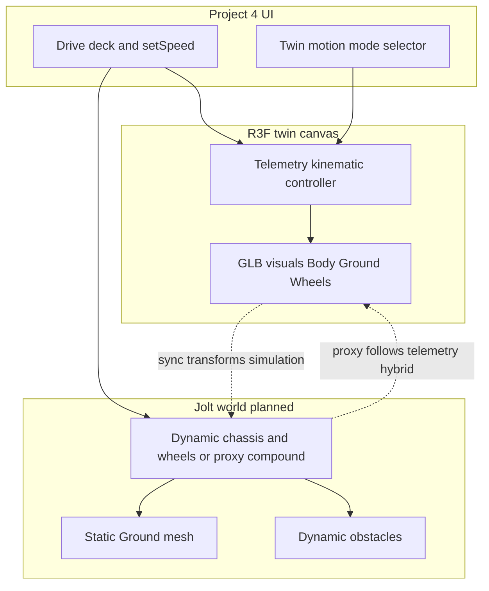

# Project 4 — Physics implementation (design)

This document is the **canonical design note** for adding a **Jolt Physics**–based layer to the Project 4 digital twin. It complements **[`PROJECT_INFO.md`](../PROJECT_INFO.md)** (product scope, MCU contract, settings). **Code may not exist yet** for all sections; treat this file as the implementation north star.

**Companion:** **[`LLM_MCP_DEVELOPMENT_PLAN.md`](./LLM_MCP_DEVELOPMENT_PLAN.md)** — Claude + MCP control path (orthogonal to physics motion authority).

---

## Goals

1. **Simulation (mock MCU):** Use **full physics** so **`/move`** and **`setSpeed`** drive **motors / constraints** and the GLB follows **simulated** rigid bodies — suitable when telemetry is **mock** or intentionally disconnected from motion authority.
2. **Live telemetry:** Keep **wheel and chassis motion** aligned with **`v*`** (and existing scanner mapping). Optionally enable **environment physics** so **props** respond when the robot **contacts** them (kinematic follower collider).
3. **Single engine:** Prefer **Jolt** via the same **WASM / import map** path already used by the Digital Twin webview (see extension **`TernionDigitalTwin`** HTML and **`vite`** externals), aligned with **`@ternion/t3d`** Jolt loading patterns where practical.

Non-goals for early phases: firmware-identical motor curves, high-fidelity tire slip models, and **replacing** MCU **`/data`** as the operator truth source in live mode.

---

## Physical parameters (existing settings)

Authoritative **measurable geometry** stays in **`ternion.project4.settings.v1`** (**Hardware setup**):

| Field | Role in physics |
| ----- | ---------------- |
| **`trackWidthM`** | Lateral spacing of left/right wheel contacts (wheel pair placement). |
| **`wheelbaseM`** | Front/rear axle spacing along forward axis. |
| **`wheelRadiusM`** | Wheel collider radius; relates linear speed to angular velocity for rolling constraints or motor targets. |

**Validation:** Reconcile documented chassis dimensions in **`PROJECT_INFO.md`** (robot GLB section) with persisted defaults before relying on collider placement.

**Ground:** Imported GLB node **`Ground`** remains the **visual floor**. Collision uses a **static** triangle mesh (or simplified proxy if triangle count is excessive).

---

## Twin motion modes

| Mode | Telemetry role | Robot authority | Physics scope |
| ---- | ---------------- | --------------- | ------------- |
| **Simulation physics** | Mock optional; motion **not** tied to MCU truth | **Dynamic chassis + wheels**; **`move`** / **`setSpeed`** → motor torques or hinge targets | Full vehicle + static **`Ground`** + optional dynamic props |
| **Telemetry kinematic** (today) | **`v*`** drives wheel integration; scanners from **`a*`** | **Kinematic** mesh animation only | None or inactive |
| **Telemetry + environment physics** | Same as kinematic for **robot pose** | **Kinematic follower collider** synced each frame to **`Body` / wheels** | **Dynamic props** receive impulses from robot proxy |

**Product rule:** **Simulation physics** should be **easy to enable only in mock context** (e.g. **`mcuConnectionPreset === mock`**) or behind an explicit **“Simulation”** toggle with a warning if the preset is **real** hardware.

Persisted enum (planned): e.g. **`ternion.project4.physics.v1`** **`twinMotionMode`** — exact schema lands with the first shipped slice.

---

## Architecture overview

**Simulation path:** Jolt **owns** transforms → apply to **`Body` / `Wheel_*`** each frame (replacing or overriding pure **`v*`** integration while mode active).

**Hybrid path:** Telemetry **owns** transforms → update **kinematic** rigid body(ies) in Jolt to match **`Body`** world matrix → **dynamic props** react; visuals unchanged except secondary meshes parented to physics props.

---

## Implementation phases

### Phase A — Spike

- Initialize **Jolt** inside the **Project 4** **`Canvas`** lifecycle (lazy dynamic **`import()``), matching **single-threaded** webview constraints documented in the extension host.
- **Static floor** (plane or minimal mesh) + **one dynamic box** falling — confirms WASM URL, timestep, and VSIX packaging parity.

### Phase B — Simulation vehicle (mock-first)

- **Static collider** from **`Ground`** geometry (with decimation if needed).
- **Compound chassis** from **`trackWidthM`**, **`wheelbaseM`**, estimated height and mass defaults in code.
- **Four wheel colliders** positioned using rig names **`Wheel_FL` … Wheel_RR`** (or offsets derived from **`collectProject4Rig`**).
- Map **`move`** tokens and **`setSpeed`** scale to **motor / hinge** targets (skid-steer grouping: left vs right).

### Phase C — Telemetry + environment physics

- Build **kinematic follower** compound aligned to **`Body`** (and optionally wheel proxies); sync **every physics step** from Three.js world matrices derived from current telemetry integration.
- Introduce **dynamic props** (primitive or tagged scene nodes).
- Tune **friction**, **restitution**, **sub-steps**, optional **CCD** on proxy to reduce tunneling.

### Phase D — UX and persistence

- **`Physics setup`** **`TRNWindow`**: friction defaults, motor gains, proxy margins, debug draw, substeps — separate from **Hardware setup** (geometry truth vs engine tuning), per **[`PROJECT_INFO.md`](../PROJECT_INFO.md)** roadmap.
- Document **`ternion.project4.physics.v1`** schema alongside code.

### Phase E — Hardware validation

- Compare proxy footprint to real robot; refine **`trackWidthM`** / **`wheelbaseM`** from measurements.

---

## Command and HTTP behaviour

| Mode | HTTP **`/move`** / **`setSpeed`** | Notes |
| ---- | ---------------------------------- | ----- |
| **Simulation physics** | May still call **mock** server for **HUD parity**; motion authority is **local Jolt** | Avoid implying MCU drives pose |
| **Telemetry + env physics** | **Always** send to **real MCU** when connected | Physics affects **props only**, not overriding **`v*`** |

---

## Risks and mitigations

| Risk | Mitigation |
| ---- | ---------- |
| **Double authority** on the same body | Never apply **both** raw **`v*`** integration **and** motor torques to **one** dynamic chassis in live mode. |
| **Tunneling** at mock **`setSpeed`** spikes | Sub-steps, CCD on proxy or chassis, sensible **`maxTorque`**. |
| **VSIX asset path** for Jolt WASM | Reuse proven **`LOCAL_ASSETS_BASE_URI`** / **`/jolt/`** layout; follow **`npm run package`** smoke checklist. |
| **Heavy **`Ground`** mesh** | Convex decomposition optional; simplify collision mesh offline if runtime cost is high. |

---

## Related files (living list)

| Area | Location |
| ---- | -------- |
| Rig contract (**`Ground`**, **`Wheel_*`**) | [`../lib/project4-rig.ts`](../lib/project4-rig.ts) |
| Geometry settings | [`../settings/project4-settings*.ts`](../settings/) |
| Twin canvas | [`../components/twin/Project4TwinViewport.tsx`](../components/twin/Project4TwinViewport.tsx) |
| Extension Jolt import map | `src/panels/TernionDigitalTwin.ts` |
| Vite Jolt externals | `vite.config.ts` |

---

## Revision history

| Date | Change |
| ---- | ------ |
| **2026-05-10** | Initial design: modes, Jolt alignment, phased plan, hybrid kinematic proxy. |
