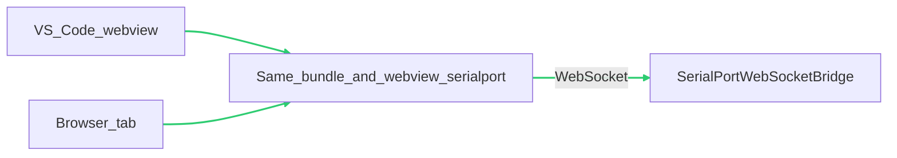
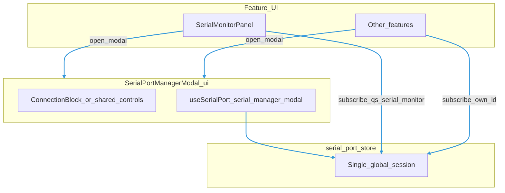
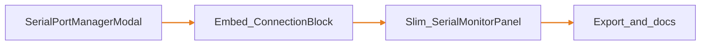
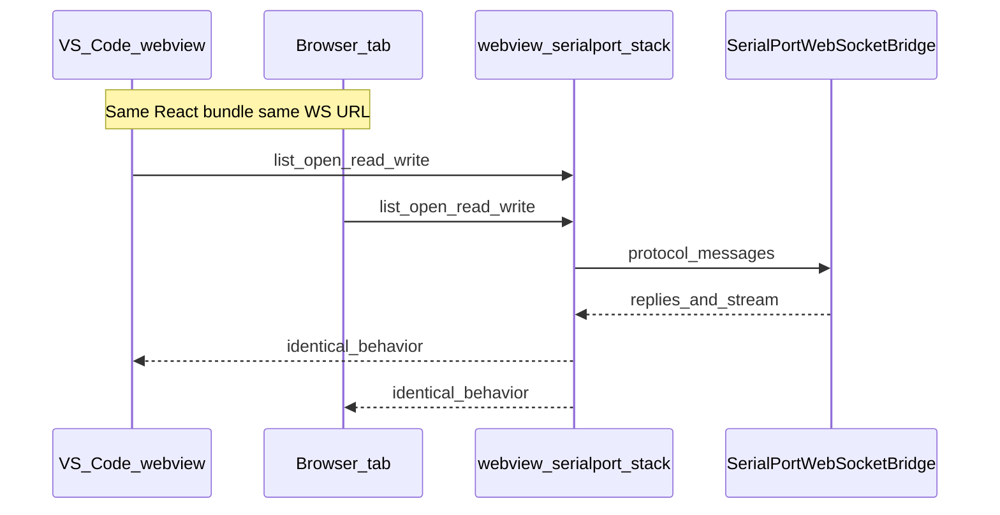

# Serial Monitor quick scene — development plan

## Principles

1. **No Web Serial** — Do not use `navigator.serial`, T3D `useWebSerial`, or any browser-only USB serial path for this feature.
2. **Backend owns hardware** — Serial devices are opened only in **Node** via [`T3DSerialPort`](../../../serialport/T3DSerialPort.ts) and exposed to the UI through [`SerialPortWebSocketBridge`](../../../serialport-bridge/SerialPortWebSocketBridge.ts).
3. **One client stack** — UI uses only [`webview/serialport`](../../serialport/) (`useSerialPort`, `serial-port-store`, WS client). **Browser** and **VS Code webview** use the **same code paths**; difference is only **configuration** (WS URL, how the bridge is started), not different transports.
4. **Parity** — Any feature (list ports, open, read, write, status) must work identically whether the bundle runs in Electron/Chromium webview or in a standalone browser tab, as long as the bridge is reachable.
5. **Serial Port Manager (modal)** — **Full** control of serial session **parameters** (WS URL, list ports, select port, baud, connect/disconnect WS, open/close port) lives in a **single reusable modal component**, not duplicated in every consumer. Any screen (e.g. [**`SerialMonitorPanel`**](./ui/SerialMonitorPanel.tsx), Edge AI, future tools) opens the same modal when the user needs to configure or connect.

### Canonical module path

All manager code lives under:

**[`t3d-extension/src/webview/serialport/serial-port-manager/`](../../serialport/serial-port-manager/)**

Use these subfolders (do **not** keep a flat pile of unrelated files at the module root):

| Folder | Purpose |
|--------|---------|
| **[`ui/`](../../serialport/serial-port-manager/ui/)** | React components only (e.g. modal shell, small presentational pieces used only by the manager). |
| **[`hook/`](../../serialport/serial-port-manager/hook/)** | Hooks and thin orchestration (e.g. `useSerialPortManager`, optional `startSession` / `stopSession` helpers that wrap the global store — **no second serial stack**). |
| **[`store/`](../../serialport/serial-port-manager/store/)** | Manager-scoped state only (e.g. modal defaults, last panel id). **[`serial-port-store`](../../serialport/serial-port-store.ts)** remains the **single** global session / ports / stream source of truth — do not duplicate that here. |

At the **module root**, keep only **`index.ts`** as the public barrel that re-exports from `ui/`, `hook/`, and `store/` as needed.

Suggested files (names are indicative):

| Path | Role |
|------|------|
| `ui/SerialPortManagerModal.tsx` | Controlled modal (`open` / `onOpenChange`), `DraggableGlassModal` + `ConnectionBlock` body |
| `hook/useSerialPortManager.ts` | Optional: expose `start`/`stop`, derived flags, or coordinate modal + subscriber id — **subscribe** via existing `useSerialPort` / store APIs |
| `store/serial-port-manager-store.ts` | Optional Zustand (or similar) for **UI-only** manager prefs; persist to localStorage only if product needs it |
| `index.ts` | Barrel: export modal, hooks, store selectors as needed |

Optional in **`hook/`**: `session-facade.ts` (or inline in `useSerialPortManager`) for one-click **Start/Stop** on consumer toolbars without opening the modal.

## Runtime parity (webview vs browser)

## Architecture: manager modal vs consumers

- **[`serial-port-store`](../../serialport/serial-port-store.ts)** remains the **single source of truth** for connection state, ports, and `write` / `open` / `close`.
- **Modal** uses `useSerialPort("serial-manager-modal", noop)` (or equivalent stable subscriber id) so it participates in the same store without stealing stream subscribers from feature consumers.
- **Serial Monitor** keeps **`useSerialMonitor`** (`useSerialPort("qs-serial-monitor", onData)`) for **log data only**; toolbar becomes: **read-only status**, **Configure…** (opens modal), **optional** lightweight **Start/Stop** if you add a tiny facade (e.g. `startSession`/`stopSession` = open/close using current store fields) so users can toggle without opening the modal every time.

## Implementation order (revised)

| Step | Work |
|------|------|
| **Modal shell** | Add [`serial-port-manager/ui/SerialPortManagerModal.tsx`](../../serialport/serial-port-manager/ui/SerialPortManagerModal.tsx): controlled **`open` / `onOpenChange`**, title, optional `panelId` for [`DraggableGlassModal`](../../ui/components/draggable-glass-modal/DraggableGlassModal.tsx) (align with glass UX) **or** a fixed centered dialog if you prefer non-draggable settings — product choice; default plan: **reuse `DraggableGlassModal`** for consistency with Serial Monitor shell. |
| **Controls** | Inside modal, **reuse [`ConnectionBlock`](../../ui/components/mcu-cli/ConnectionBlock.tsx)** (as in Settings in [`TestWebSocketAndSerialBridge`](../../TestWebSocketAndSerialBridge.tsx)) wired with `useSerialPort("serial-manager-modal", noop)` plus `useWsClientStore` byte counts as needed — **do not reimplement** list/open/WS logic. |
| **Serial Monitor** | Remove inline Connect/List/Open/Close/port/baud from [`SerialMonitorPanel.tsx`](./ui/SerialMonitorPanel.tsx). Add **Configure serial** button → `useState`/`open` drives `SerialPortManagerModal` (import from [`serial-port-manager`](../../serialport/serial-port-manager/index.ts)). Keep status strip (read-only) + [`SerialDataViewer`](./ui/serial-data-viewer.tsx) + Send + Clear log. |
| **Optional facade** | If needed under [`hook/`](../../serialport/serial-port-manager/hook/): e.g. `session-facade.ts` with `startSession` / `stopSession` (wrap `connect` + `listPorts` + `openPort` / `closePort`) for one-click **Start/Stop** on the monitor toolbar **without** opening the modal; otherwise **Open/Close inside the modal** is enough for v1. Optional hook: [`hook/useSerialPortManager.ts`](../../serialport/serial-port-manager/hook/useSerialPortManager.ts). |
| **Manager store** | If needed under [`store/`](../../serialport/serial-port-manager/store/): e.g. `serial-port-manager-store.ts` for modal/UI prefs only — **not** a second serial session store. |
| **Exports** | Root barrel [`serial-port-manager/index.ts`](../../serialport/serial-port-manager/index.ts) re-exports `ui/`, `hook/`, `store/`; consumers import from `../serialport/serial-port-manager` (add parent barrel only if you introduce [`webview/serialport/index.ts`](../../serialport/index.ts)). |
| **Docs** | Update [`README.md`](./README.md): manager modal is the control surface; monitor is primarily a **view + send**. |

## Testing

- **Webview**: Digital Twin with bridge started; open Serial Monitor → **Configure** → set WS/port/baud → open port → close modal → stream still flows in monitor.
- **Browser**: Same with Vite + bridge URL.
- Open modal from two entry points (if wired) — same global state, no double-subscribe bugs.

### Parity check (sequence)

Same **procedure** in both hosts; only **where** the bundle is hosted changes.

## Out of scope (for this quick scene)

- Web Serial fallback.
- Changing the bridge protocol (see [`serialport-bridge/protocol.ts`](../../../serialport-bridge/protocol.ts) if protocol work is needed elsewhere).
